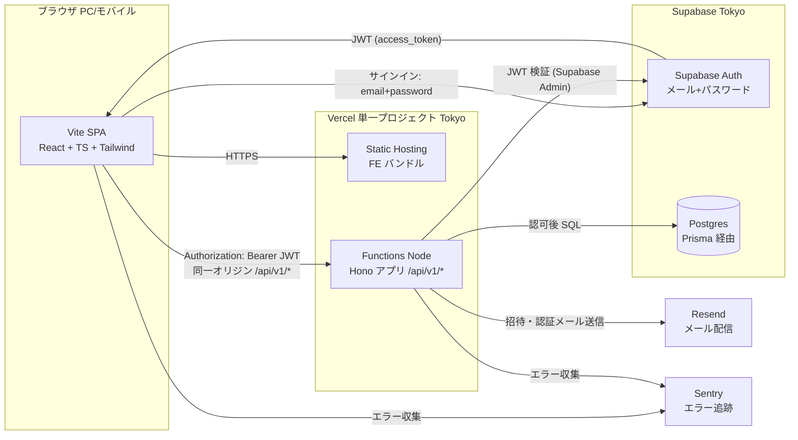
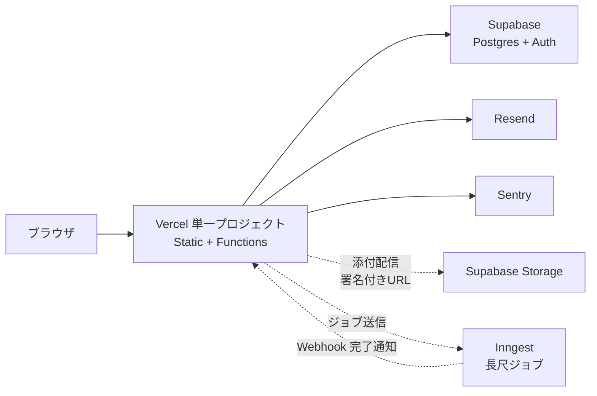
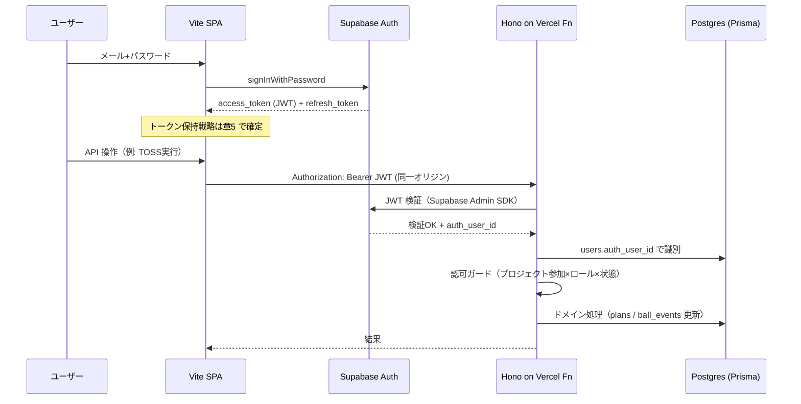

# 第1章 アーキテクチャ・技術スタック

| 項目 | 内容 |
|---|---|
| 章番号 | 01 |
| ステータス | **v1.0 確定** |
| 確定日 | 2026-05-09 |
| 上位ドキュメント | [TRAKON PRD v1.2](../prd/trakon-prd.md) |
| 主参照 PRD 節 | §2.6（3層構造）、§4.2（NFR）、§9.1（基本方針）、§10（フェーズ） |

---

## 1.1. 設計判断の前提

本章の判断は以下を制約条件とする。

| 制約 | 内容 | 根拠 |
|---|---|---|
| **機密第一** | クライアント機密保護を機能追加・速度に優先する | PRD §9.1 |
| **長期一貫** | 短期最適より長期一貫を優先する。Phase 1〜2 で破綻しない設計 | 基本原則 第十二条／PRD §1.1 |
| **MVP制約** | 2〜3週間／50万円／本人または社内実装 | PRD §10.2 |
| **「管理を目的化しない」** | 設計も同様。実装速度と保守性のバランスを「進行を前に進める」観点で判断 | 基本原則 第二条 |
| **MVPでもセキュリティは妥協しない** | TLS・暗号化・監査ログを Phase 0 から実装 | PRD §10.2 成功基準 7., 8. |

---

## 1.2. 技術スタック（確定）

| 層 | 採用 | バージョン目安 | 役割・補足 |
|---|---|---|---|
| **FE 言語・FW** | React + TypeScript + Vite | React 18 / Vite 5 / TS 5 | SEO 不要のログイン必須BtoB SaaS のため SPA で十分。Vite は薄く・速く・メジャー版乗り換えコストが小さい |
| **FE ルーティング** | React Router | v6 | SPA 標準、コード分割と親和的 |
| **FE スタイリング** | Tailwind CSS + shadcn/ui | Tailwind 3 / shadcn 最新 | コピー導入＋自前カスタムでブランド統制（NFR-UX-01）、Radix UI ベースで A11Y 素地（NFR-A11Y-01） |
| **FE データ取得（サーバ状態）** | TanStack Query | v5 | サーバ状態キャッシュ・楽観更新・refetch 制御。Ball Holder の即時反映に有効 |
| **FE クライアント状態** | Zustand | v4 | モーダル開閉・選択中ID・UI状態など軽量に |
| **FE デプロイ** | Vercel（Static Hosting） | — | プレビュー環境・CDN 配信・東京リージョン（hnd1） |
| **BE 言語** | Node.js + TypeScript | Node 20 LTS | 長期サポート、Vercel Functions Node Runtime と整合 |
| **BE FW** | Hono | v4 | 軽量・型安全・移植性◎。Cloud Run 等への将来移行も容易 |
| **BE 実行基盤** | Vercel Functions（Node Runtime） | — | リージョン: hnd1（東京）。**Vercel 単一プロジェクトで FE と同居**（§1.4） |
| **API スタイル** | REST + OpenAPI 3.1 + Zod | — | Phase 3 公開API（FR-API-01）を見据える。`@hono/zod-openapi` で Zod から OpenAPI 生成、FE は `openapi-typescript` で型生成 |
| **DB** | Supabase Postgres（Tokyo） | Postgres 15+ | RLS 不使用・BE のみが Postgres へ接続。標準 Postgres なので将来 Cloud SQL / Neon へ pg_dump で可搬 |
| **ORM** | Prisma | v5 | スキーマ駆動・マイグレーション・型生成成熟 |
| **認証 (IdP)** | Supabase Auth | — | メール+パスワード／メール認証／パスワード再発行／MFA（Phase 2）。BE 側で JWT 検証 |
| **認可** | BE 完全実装（Hono ミドルウェア＋サービス層） | — | プロジェクト参加 × ロール × ボール状態の複合認可。**Supabase RLS には依存しない** |
| **招待トークン** | 自前テーブル `invitations` | — | ワンタイム・短時間期限・プロジェクト固有メタ。Supabase Auth の `inviteUserByEmail` ではなく自前送信（FR-AUTH-02） |
| **ストレージ（Phase 1）** | Supabase Storage + V4 署名付きURL | — | SR-DATA-03 の短時間署名URL要件。Phase 0 では未使用 |
| **メール送信** | Resend | — | DX 良好、招待・通知。React Email で TS テンプレート |
| **長尺ジョブ（Phase 1）** | Inngest | — | TS ネイティブ、ステップファンクション・リトライ・並行制御。PDF出力／一括メール／遅延判定集計を Vercel Functions の実行時間制約から逃がす |
| **監視・エラー追跡** | Sentry + Vercel Logs + Supabase Logs | Sentry: Free→Team | Phase 0 は Free（1 user・月5,000 errors・データ保持30日）、Phase 1 で Team 約 $26/月へ昇格 |
| **シークレット管理** | Vercel Environment Variables + Supabase Vault | — | SR-OPS-03（リポジトリ混入禁止） |
| **CI/CD** | GitHub Actions + Vercel Git Integration | — | PR ごとにプレビュー環境（Vercel）、Phase 1 から Supabase Branching でプレビューDB |
| **モノレポ管理** | pnpm workspaces | pnpm 9 | 軽量・標準。Turborepo は Phase 1 以降にCI高速化が必要になれば検討 |
| **Supabase プラン** | Free（Phase 0）→ Pro（商用リリース前） | — | Pro 昇格でバックアップ7日・PITR・カスタムドメインメール・サポート確保 |

---

## 1.3. 全体構成図

### 1.3.1. Phase 0 構成



### 1.3.2. Phase 1 で追加されるコンポーネント



> **長尺処理対策**：Vercel Functions の実行時間制約は Hobby 60秒・Pro 300秒。FR-EXPORT-01（PDF出力）・FR-NOTIF-01（一括メール通知）・FR-DASH-05（遅延判定の一括計算）等の長尺処理は **Inngest** で外出しする。Phase 0 から `JobQueue` インターフェースを抽象化しておく（§1.6.2）。

---

## 1.4. リポジトリ構成（Vercel 単一プロジェクト方式）

> **構成方針**：Vercel 単一プロジェクトに FE と Functions を同居させる。Vercel Root Directory として `apps/web` を指定し、`apps/web/api/` ディレクトリを Functions として認識させる。FE と API は同一オリジンで配信されるため **CORS 不要**。

```
trakon/
├─ apps/
│  └─ web/                          # ← Vercel Root Directory に指定
│     ├─ public/                    # 静的アセット
│     ├─ src/                       # FE コード（Vite ビルド対象）
│     │  ├─ app/                    # React Router v6 ルート定義・レイアウト
│     │  ├─ features/               # 機能別（auth / projects / items / plans / balls / dashboard）
│     │  ├─ components/             # 共有UIコンポーネント（shadcn/ui を取り込み）
│     │  ├─ lib/                    # APIクライアント、Supabase Auth ラッパー、TanStack Query 設定
│     │  ├─ hooks/                  # カスタムフック（useCurrentUser, useBallHolder 等）
│     │  ├─ stores/                 # Zustand ストア（モーダル開閉・UI状態）
│     │  └─ styles/                 # Tailwind 設定・グローバルCSS
│     ├─ server/                    # BE コード（Hono アプリ本体、Vite ビルド対象外）
│     │  ├─ routes/v1/              # REST エンドポイント（/api/v1/...）
│     │  ├─ middleware/             # 認証（Supabase JWT 検証）/ 認可 / ロギング / エラー
│     │  ├─ services/               # ドメインサービス（PlanService, BallService, ProjectService 等）
│     │  ├─ repositories/           # Prisma 経由のデータアクセス（Ball Holder 導出を含む）
│     │  ├─ lib/                    # Supabase Admin SDK、Resend、Sentry 初期化、JobQueue/FileService 抽象
│     │  ├─ schemas/                # Zod スキーマ（OpenAPI 生成元）
│     │  └─ app.ts                  # Hono app の組み立て（routes 登録）
│     ├─ api/                       # Vercel Functions エントリ（薄いラッパー）
│     │  └─ [[...slug]].ts          # server/app.ts の Hono app を Web Standard handler として export
│     ├─ index.html
│     ├─ vite.config.ts
│     ├─ tailwind.config.ts
│     ├─ components.json            # shadcn/ui 設定
│     ├─ vercel.json                # functions.runtime / regions: ["hnd1"] / rewrites
│     └─ tsconfig.json
├─ packages/
│  ├─ db/                          # Prisma 一元管理（Supabase Postgres を Prisma で操作）
│  │  ├─ prisma/
│  │  │  ├─ schema.prisma
│  │  │  └─ migrations/
│  │  ├─ src/                      # PrismaClient エクスポート
│  │  └─ seed.ts
│  └─ shared/                      # FE/BE 共有型・定数・Zodスキーマ
│     ├─ types/                    # ドメイン型（Plan, Ball, BallEvent, Project 等）
│     ├─ schemas/                  # Zod スキーマ（apps/web の src と server から参照）
│     └─ constants/                # ロール・ボール状態・予定種別の列挙、表示ラベル
├─ openapi/                        # OpenAPI 3.1 仕様書（apps/web/server の Zod から生成）
│  ├─ openapi.yaml
│  └─ scripts/
│     └─ generate-fe-types.ts      # openapi-typescript で FE 型生成
├─ supabase/                       # Supabase CLI 設定（ローカル開発・Branching 用）
│  ├─ config.toml                  # Tokyo リージョン指定など
│  └─ .gitignore
├─ infra/                          # IaC（Terraform、Phase 1 以降本格化）
│  └─ README.md
├─ docs/                           # 設計書置き場（既存 prd・design をここへ移管検討）
├─ .github/
│  └─ workflows/
│     ├─ ci.yml                    # lint + type-check + unit test（PR 時）
│     ├─ preview-db.yml            # PR ごとに Supabase Branch DB 作成 + Prisma migrate（Phase 1〜）
│     └─ openapi-check.yml         # OpenAPI スキーマ差分検知（Phase 1〜）
├─ .env.example                    # 必須環境変数のテンプレート
├─ package.json                    # ルート（dev / build / lint / type-check スクリプト）
├─ pnpm-workspace.yaml             # apps/* と packages/* を workspace 化
├─ tsconfig.base.json              # 共通 TypeScript 設定
├─ .nvmrc                          # Node バージョン固定
└─ README.md
```

### 1.4.1. 構成上の補足

- **モノレポ管理**：`pnpm workspaces` を採用。Turborepo は Phase 1 以降にCI高速化が必要になった時点で検討
- **Vercel プロジェクト構成**：**単一プロジェクト**で `apps/web` を Root Directory に指定。`apps/web/api/[[...slug]].ts` が Hono アプリ全体を catch-all で受ける。FE/BE 同一オリジンのため **CORS 不要**、デプロイ・課金・プレビューURLが1セットで完結
- **FE と BE のコード分離**：`apps/web/src/`（FE）と `apps/web/server/`（BE）はディレクトリで明確に分離。`vite.config.ts` の `build.rollupOptions.input` で `src/` のみをビルド対象に、`tsconfig.json` の `references` で BE 側を別コンパイル単位に
- **DBマイグレーション一元化**：Supabase Studio 上での手動スキーマ変更は禁止。**Prisma migrate を唯一の信頼源** とする（Supabase CLI は Branching とローカル Postgres 起動の用途のみに使用）
- **OpenAPI 型生成パイプライン**：`apps/web/server/schemas/` の Zod スキーマから OpenAPI 3.1 を生成（`@hono/zod-openapi`）→ `openapi/openapi.yaml` に出力 → `apps/web/src/` 側で `openapi-typescript` により FE 型を生成
- **環境変数**：`.env.example` でテンプレート管理。実値はローカルが `.env.local`（gitignore）、本番/プレビューは Vercel Environment Variables、Supabase 接続キーは Supabase Vault に格納
- **将来 BE を独立サービスへ切り出す場合**：`apps/web/server/` を `apps/api/` に移し、Vercel プロジェクトを2つに分割するか、Cloud Run へ切り出す。`server/` ディレクトリが Vercel Functions 非依存に書かれているため移植容易（§1.6.3 A 移行視野）

---

## 1.5. 認証・認可フロー（概略）

> 詳細は [05-security.md](05-security.md) で扱う。本章では構成上の責務分担のみ示す。



**責務分担**：

| 責務 | 担い手 | 補足 |
|---|---|---|
| サインアップ・ログイン UI | FE（Supabase Auth クライアントSDK） | shadcn/ui で構築 |
| パスワード保管・ハッシュ化 | Supabase Auth | 自前実装しない |
| メール認証・パスワード再発行 | Supabase Auth + メールテンプレート（必要に応じ Resend で上書き） | ブランド統制が必要なら Resend |
| ID トークン発行・検証 | Supabase Auth | BE は Admin SDK で検証のみ |
| **招待トークン管理** | **BE 自前**（`invitations` テーブル） | プロジェクト固有メタを持たせるため Supabase Auth の招待機能は使わない |
| **認可（プロジェクト参加・ロール）** | **BE 自前**（Hono ミドルウェア） | RLS には依存しない |
| **監査ログ** | **BE 自前**（`audit_logs` テーブル + DB トリガーで append-only 強制） | SR-AUDIT-01〜04 |

---

## 1.6. Phase 0 → Phase 1 → Phase 2 の境界設計

### 1.6.1. Phase 0 でやらないが**型・列・URLは先に確保しておく**もの

| 項目 | Phase 0 の状態 | Phase 1 で実装 | 拡張時の互換性確保 |
|---|---|---|---|
| `plans.plan_type` | `'toss'` 固定 | `'toss' / 'shared' / 'solo'` の3値 | チェック制約は最初から3値で定義 |
| `plans.deleted_at` | 物理削除（MVP §6.3）で未使用 | 論理削除に切替 | 列は最初から定義、Phase 0 のコードは無視 |
| `ball_events.event_type` | `tossed / completed` のみ | `+ canceled / returned / retossed` | 型として最初から enum 定義 |
| `audit_logs.action` | `login / toss / complete` のみ | 全アクション記録 | 列構造は Phase 1 仕様で先に確定 |
| `organization_id`（全主要テーブル） | NULL 許容 | NOT NULL 化（移行スクリプト） | Phase 0 から列存在 |
| `share_links.organization_off_revoked` | 列定義あり・常に false | Phase 2 で組織OFF反映時に参照開始 | 列は最初から定義（章2 §2.4 share_links）。`share_links` テーブル本体は v1.3 で Phase 0 物理化 |
| `comments` / `attachments` テーブル | 作らない | 新規作成 | 同上 |
| ダッシュボード `/dashboard` | 空状態（カウンタゼロ表示） | SC-09 を実装 | URL は Phase 0 から確保 |
| API バージョン | `/api/v1/` プレフィックス | 同上 | Phase 3 公開API（FR-API-01）で v2 を切れる構造 |

### 1.6.2. Phase 1 で対応する設計上の事前抽象

| 抽象 | 実装ファイル候補 | Phase 0 の存在意義 |
|---|---|---|
| `JobQueue` インターフェース | `apps/web/server/lib/job-queue.ts` | Phase 0 では使わなくても定義・空実装を置く。Phase 1 で **Inngest** に差し替え |
| `FileService` インターフェース | `apps/web/server/lib/file-service.ts` | Phase 0 で未使用。Phase 1 で Supabase Storage 実装、Phase 2 で GCS/S3 実装に差し替え |
| `MailService` インターフェース | `apps/web/server/lib/mail-service.ts` | Phase 0 から **Resend** 実装を入れる（招待・パスワード再発行）。Phase 1 で通知種別を拡張 |
| `AuditLogger` インターフェース | `apps/web/server/lib/audit-logger.ts` | Phase 0 から最低限のアクション（login / toss / complete）を記録 |

### 1.6.3. Phase 2 を見据えた A（GCP）移行視野

> **構成B確定**だが、Phase 2 で組織導入・監査強化が現実化したら GCP（Cloud Run + Cloud SQL）移行を選択肢として残す。そのため以下の依存最小化を Phase 0 から徹底する。

| 領域 | 移行容易性確保のための設計方針 |
|---|---|
| DB | Prisma スキーマは Supabase 固有機能（auth スキーマへの直接 FK 等）に依存しない。Supabase Auth の `auth.users.id`（UUID）はアプリ DB の `users.auth_user_id` にミラー保持し、JOIN 等はアプリ DB 内で完結 |
| BE | Hono アプリは Vercel Functions の薄いラッパー（`apps/web/api/[[...slug]].ts` 1ファイルのみ Vercel 依存）で動かし、本体ロジックは `apps/web/server/` に閉じる。Cloud Run へほぼそのまま移植可能 |
| 認可・監査ログ | BE 完全実装で RLS への依存ゼロ → DBレイヤーをそのまま運べる |
| Storage | `FileService` インターフェースで Supabase Storage を実装。Phase 2 で GCS/S3 を別実装に差し替え |
| Auth | Supabase Auth の bcrypt ハッシュは pgcrypto 経由で取り出せ、他IdPへの移行手段あり。詳細は章5で記載 |
| 長尺ジョブ | Inngest は GCP 上の Cloud Run BE からも同じ SDK で利用可能、移行不要 |

---

## 1.7. 議論ポイントの確定結果

| # | 論点 | 確定内容 | 判断理由 |
|---|---|---|---|
| 1 | BE フレームワーク | **Hono** | 軽量・型安全・@hono/zod-openapi で OpenAPI 生成も容易、Cloud Run 等への移植性◎ |
| 2 | ORM | **Prisma** | スキーマ駆動・マイグレーション完成度・Studio による参照性、学習コスト低 |
| 3 | メール送信 | **Resend** | DX 良好、React Email で TS テンプレ、PRD「煽らず濁さず逃げない」言葉づかいと相性◎ |
| 4 | FE 状態管理 | **TanStack Query + Zustand** | 責務分離明確、軽量（合計約14KB）、shadcn/ui 標準サンプルと相性◎、Phase 0〜1 のボリュームに最適 |
| 5 | Vercel プロジェクト構成 | **単一プロジェクト**（apps/web に api/ 同居） | デプロイ・設定・課金がシンプル、CORS 不要、MVP速度優位 |
| 6 | Supabase プラン | **Phase 0 は Free、商用リリース前に Pro 昇格** | Phase 0 は社内検証中心で Free 十分、Pro 昇格でバックアップ7日・PITR・カスタムメール・サポートを獲得 |
| 7 | Phase 1 長尺処理対応 | **Inngest** | TS ネイティブ、ステップファンクション・リトライ・並行制御が充実、Vercel と公式統合、Free 枠も実用的 |

---

## 1.8. PRD 整合チェック

| 該当 PRD 項 | 本章での扱い |
|---|---|
| §2.6 3層構造 | §1.3 全体構成図で表現。3層は画面側の概念で、サーバ構成は単一サービス |
| §4.2 NFR-PERF-01 (2秒以内) | §1.2 Vite SPA + Vercel CDN で素地。実測は章6で計画 |
| §4.2 NFR-AVAIL-01 (99.5%) | §1.2 Vercel/Supabase の SLA で素地（章6で詳細） |
| §4.2 NFR-MOBILE-01 | §1.2 Tailwind + shadcn/ui のレスポンシブで対応（章4で詳細） |
| §9.1 機密第一 | §1.5 BE 経由認可、Supabase RLS 不採用。詳細は章5 |
| §9.2 非会員URL共有 | Phase 0 機能（v1.3 で前倒し）。本章は構成全体への影響を確認するに留め、DB 列・URL 設計・認可・トークンは章2／章3／章5 で扱う |
| §10.2 Phase 0 成功基準 7., 8. | §1.5 で TLS・認証・監査ログを Phase 0 から実装することを明記 |

### Phase 1+ 持ち越し（本章では扱わない）

- Inngest 上の具体ジョブ実装（§1.7-7 で方針確定、実装は章6）
- PDF 生成エンジン選定（候補：Puppeteer/Playwright on Inngest、章6で確定）
- Slack/Chatwork/Teams 連携（PRD §4.1.10、Phase 2+）
- 組織テナンシー境界の物理分離（PRD §4.1.12、Phase 2）

### PRD 整合メモ（PRD 改訂提案）

- 特になし（本章スコープ内では PRD と整合）

---

## 1.9. 章ステータス

| 日付 | 状態 | 備考 |
|---|---|---|
| 2026-05-09 | Draft（たたき台） | §1.7 議論ポイントを未確定で起稿 |
| 2026-05-09 | **v1.0 確定** | §1.7 全7論点を AskUserQuestion で確定、リポジトリ構成を Vercel 単一プロジェクト方式に更新 |
| 2026-05-09 | **v1.1 確定** | PRD v1.3 改訂（非会員URL共有 Phase 0 化）に追従。§1.6.1 事前確保表から `share_links` テーブルを除外し、`organization_off_revoked` 列の Phase 2 参照ノートに置換。§1.8 PRD 整合チェックで §9.2 を Phase 0 機能に再分類。 |
