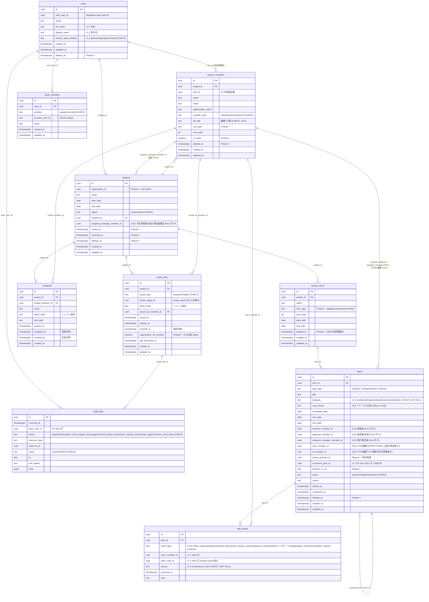

# 第2章 DB物理設計

| 項目 | 内容 |
|---|---|
| 章番号 | 02 |
| ステータス | **v1.2 確定**（v1.0: 2026-05-09 / v1.1: 2026-05-24 プロトタイプ反映 / v1.2: 2026-08-30 課金・組織・ロール） |
| 確定日 | 2026-08-30 |
| 上位ドキュメント | [TRAKON PRD v1.4](../prd/trakon-prd.md) ／ [01-architecture.md](01-architecture.md) ／ [07-billing.md](07-billing.md) |
| 主参照 PRD 節 | §8（データモデル概要）、§4.1.1（FR-AUTH-10〜13）、§4.1.4（FR-SCH-17, 18）、§4.1.5（FR-BALL-13）、§4.1.12〜12c（FR-ORG / FR-BILL / FR-ROLE）、§9.5（データ保護）、§9.6（監査ログ） |

---

## 2.1. 本章の範囲

PRD §8 で示された**論理データモデル**を、Postgres（Supabase 上）の**物理スキーマ**に落とす。本章は次を扱う：

- 共通設計方針（命名・ID・タイムスタンプ・論理削除・ENUM・タイムゾーン）
- ER図（Phase 0 範囲・Phase 1 拡張）
- 各テーブルの物理定義（型・制約・FK・コメント）
- Supabase Auth `auth.users` との紐付け
- Ball Holder 導出戦略
- 監査ログ append-only 強制
- インデックス戦略
- Prisma マイグレーション運用と Phase 0 → 1 移行

本章で**扱わない**もの：
- 個別のクエリ最適化（章3 API設計でクエリ単位に検討）
- 行レベルセキュリティ（採用しない方針：[01章 §1.5](01-architecture.md#15-認証認可フロー概略)）
- バックアップ・PITR（章6 インフラで扱う）

---

## 2.2. 共通設計方針

### 2.2.1. 命名規約

| 対象 | 規約 | 例 |
|---|---|---|
| テーブル名 | **snake_case 複数形** | `projects`, `project_members`, `ball_events` |
| カラム名 | **snake_case 単数** | `created_at`, `from_member_id` |
| FK カラム | **`<参照テーブル単数>_id`** | `project_id`, `from_member_id`, `to_member_id` |
| 主キー | **`id`**（全テーブル統一） | `id` |
| 監査タイムスタンプ | `created_at` / `updated_at` / `deleted_at`（論理削除） | 〃 |
| ENUM 型名 | snake_case 単数 | `plan_type`, `event_type`, `member_type` |
| インデックス名 | `idx_<table>_<columns>` | `idx_plans_item_id_scheduled_date` |
| ユニーク制約名 | `uq_<table>_<columns>` | `uq_users_email` |
| FK 制約名 | `fk_<table>_<column>` | `fk_plans_item_id` |
| チェック制約名 | `ck_<table>_<column>` | `ck_plans_plan_type` |

### 2.2.2. 主キー戦略

| 観点 | 方針 |
|---|---|
| 型 | **UUID v7**（`uuid` 型）を全テーブルで統一 |
| 生成元 | アプリ側（`uuidv7` パッケージ）で生成。Prisma の `@default(uuid(7))` または独自生成関数 |
| 理由 | ① 時系列ソート可能で B-tree インデックスとの親和性が高い、② 推測困難で外部 ID 露出時のリスク軽減（IDOR 対策の素地）、③ 分散環境・将来 Cloud SQL 移行でも問題なし |
| 不採用 | bigserial（連番が業務 ID と誤認されるリスク・推測可能）／UUID v4（ランダム挿入で B-tree 断片化）／cuid2（Postgres ネイティブ uuid 型を活かせない） |

> **議論ポイント §2.10-1**：UUID v7 を主キーにする方針。Prisma の `uuid()` デフォルトは v4 のため、アプリ側で `uuidv7()` を呼ぶか DB 関数化するかは実装時に決定。

### 2.2.3. タイムスタンプ・論理削除

| カラム | 型 | デフォルト | 用途 |
|---|---|---|---|
| `created_at` | `TIMESTAMPTZ` | `now()` | レコード作成日時 |
| `updated_at` | `TIMESTAMPTZ` | `now()`（トリガで更新） | 最終更新日時。Prisma の `@updatedAt` ではなく、DB トリガで自動更新（Prisma 経由でない更新でも追従するため） |
| `deleted_at` | `TIMESTAMPTZ` NULL | `NULL` | 論理削除（Phase 1〜）。NULL = 有効、非NULL = 削除済み |

- 全主要テーブルに `created_at` / `updated_at` を必須付与
- `deleted_at` は **Phase 0 から列を持つが、MVP ではアプリ側で参照しない**（PRD §10.2 の「ボール削除は即時物理削除」例外を除き、それ以外のテーブルは Phase 0 では削除操作自体を実装しない）
- アプリ側のクエリは `WHERE deleted_at IS NULL` を **Prisma middleware で自動付与**（明示的に履歴参照する箇所のみ raw SQL で取得）
- 「日付」のみで時刻不要のカラム（例：`plans.scheduled_date`）は `DATE` 型を使う

### 2.2.4. ENUM 戦略

**Prisma `enum` を採用**し、Postgres 上では `CHECK 制約付き text 型` として実体化する。

| 観点 | 方針 |
|---|---|
| 採用 | Prisma `enum` + Postgres `text` + `CHECK` 制約 |
| 理由 | ① Prisma スキーマで一元管理、② Postgres ENUM 型は値追加は容易だが**値の名前変更・削除が極めて困難**で、Phase 1 拡張時の柔軟性を損なう、③ `text + CHECK` なら ALTER で値の追加・変更が容易 |
| Phase 0 → 1 拡張例 | `plans.plan_type` を Phase 0 で `'toss'` のみ許可、Phase 1 で CHECK 制約を `'toss', 'shared', 'solo'` に ALTER で拡張 |
| 不採用 | Postgres ENUM 型（拡張時の運用負荷）／プレーン text（型安全性なし） |

### 2.2.5. タイムゾーン方針

| 対象 | 方針 |
|---|---|
| DB 保存 | **すべて UTC**（`TIMESTAMPTZ`） |
| アプリ表示 | ユーザータイムゾーン（既定 `Asia/Tokyo`）に FE で変換 |
| 「暦日」のカラム（予定日・期限日など） | `DATE` 型（タイムゾーン非依存） |
| ダッシュボードの「本日」「3日以内」判定 | サーバ側で `Asia/Tokyo` の暦日を計算して比較（章3で詳細） |

### 2.2.6. マルチテナント前提（organization_id）

**v1.2 改訂**：課金の契約主体を組織と確定したことに伴い、`organizations` を Phase 2 から前倒しで実体化した。

| 観点 | 方針 |
|---|---|
| Phase 0（〜v1.1） | `organizations` テーブルは作らず、`projects.organization_id` 列を **NULL 許容で先付け**していた |
| **Phase 0.5（v1.2）** | **`organizations` / `organization_members` を作成**。全ユーザーに個人組織を backfill し、`projects.organization_id` を埋めて **NOT NULL 化**。以降すべてのプロジェクトはいずれかの組織に属する |
| Phase 2 | `organization_settings`（組織レベル統制）を追加 |
| インデックス | `projects(organization_id)` は Phase 0 から存在。v1.2 で `(organization_id) WHERE deleted_at IS NULL AND archived_at IS NULL` の部分インデックスを追加（プロジェクト数上限の判定に使う） |

> **`users.organization_id` は作らない。** 1 ユーザーが複数組織に所属しうるため、所属は `organization_members` で表現する（PRD §8.1 v1.4 改訂）。

---

## 2.3. ER図

### 2.3.1. Phase 0 範囲



### 2.3.2. Phase 1 で追加されるテーブル（参考）

| テーブル | 用途 | 関連 PRD |
|---|---|---|
| `comments` | 予定コメント | PRD §8.2、FR-COMM-01 |
| `attachments` | 添付ファイル | PRD §8.2、FR-COMM-02 |
| `notifications` | メール通知 | PRD §8.2、FR-NOTIF-01〜02 |

> v1.1 改訂注：v1.0 まで本表に含まれていた `share_links`（非会員URL共有）は **PRD v1.3 で Phase 0 へ前倒しされたため、§2.3.1 / §2.4 に移動**した。

### 2.3.2b. Phase 0.5 で追加されるテーブル（v1.2 新規）

| テーブル | 用途 | 関連 PRD |
|---|---|---|
| `organizations` | 組織テナント（課金の契約主体） | PRD §8.2、FR-ORG-01 |
| `organization_members` | 会員アカウント（＝座席）の所属 | PRD §8.2、FR-ORG-02、FR-BILL-02 |
| `billing_subscriptions` | 契約・課金状態（組織と 1:1） | PRD §8.2、FR-BILL-01, 05, 06 |
| `stripe_events` | Webhook 受信台帳（冪等性・順序逆転対策） | PRD §8.2、SR-BILL-06 |
| `billing_trial_claims` | トライアル利用履歴（重複防止） | PRD §8.2、FR-BILL-13 |

> 設計の背景と判断理由は **章7（07-billing.md）** を参照。

### 2.3.3. Phase 2 で追加されるテーブル（参考）

| テーブル | 用途 |
|---|---|
| `organization_settings` | 組織レベル統制（非会員URL共有の On/OFF 等） |

> v1.2 改訂注：`organizations` は **Phase 2 → Phase 0.5 へ前倒し**したため §2.3.2b / §2.4 へ移動した。

---

## 2.4. テーブル定義（Phase 0 必須）

> 各テーブルは「**司る機能**（PRD 紐付け）」「**カラム定義**」「**制約・インデックス**」「**Phase 1 拡張時の差分**」の4節構成で記す。Prisma スキーマ表記は確定版で、CREATE TABLE は理解補助。

### 2.4.1. users — アプリ側のユーザー本体

**司る機能**：UC-01 アカウント作成・ログイン／UC-24 OAuth ログイン／FR-AUTH-01〜05, 10〜12／SR-AUTH-01〜04, 10。**Supabase Auth `auth.users`（UUID）と 1:1 で紐付くアプリ DB の本体テーブル**。プロジェクトの永続参加・編集を行う全ロールが必ず1行を持つ。非会員URL閲覧者（Phase 0、§2.4 share_links）は本テーブルに行を持たない。

| カラム | 型 | NULL | 既定 | 説明 |
|---|---|:---:|---|---|
| id | uuid | × | uuidv7 | アプリ内 PK |
| auth_user_id | uuid | × | — | Supabase `auth.users.id`。**ユニーク制約必須** |
| email | text | × | — | ログインID。Supabase Auth と同期（`auth.users.email` のキャッシュ）。ユニーク |
| **full_name** | text | × | — | **本名**（招待・請求書類用、v1.1 追加、FR-AUTH-11）|
| **display_name** | text | × | — | **表示名・ハンドル**（画面表示・チップ、v1.1 で本名と分離）|
| **primary_auth_method** | text | × | 'password' | **'password' / 'google' / 'microsoft'**（CHECK、同一メール1認証手段制約、v1.1 追加、FR-AUTH-12）|
| created_at | timestamptz | × | now() | |
| updated_at | timestamptz | × | now() | DBトリガで更新 |
| deleted_at | timestamptz | ○ | NULL | 論理削除（Phase 1〜） |

**制約**：
- `uq_users_auth_user_id`（auth_user_id ユニーク）
- `uq_users_email`（email ユニーク、deleted_at IS NULL のみ → 部分インデックス）
- `ck_users_primary_auth_method` CHECK (primary_auth_method IN ('password','google','microsoft'))
- `ck_users_full_name_length` CHECK (char_length(full_name) BETWEEN 1 AND 100)
- `ck_users_display_name_length` CHECK (char_length(display_name) BETWEEN 1 AND 50)
- インデックス：`idx_users_auth_user_id`（JWT 検証時の高速参照）

**Phase 1 拡張**：
- `email_verified_at`、`mfa_enabled` などの認証メタを Supabase Auth 由来でキャッシュ可能
- `organization_id`（Phase 2）

**Phase 0 留意**：
- パスワードハッシュは Supabase Auth が `auth.users.encrypted_password` に保持、本テーブルには持たせない
- 招待受諾フロー（FR-AUTH-02）：`invitations.token_hash` 検証 → Supabase Auth でユーザー作成 → アプリ DB の `users` 行作成 → `project_members.user_id` を埋める、の順
- **OAuth サインアップフロー（v1.1、UC-24）**：FE が Supabase Auth `signInWithOAuth` → コールバック → BE `/auth/me/sync` で users 行 INSERT（primary_auth_method = 'google' or 'microsoft'）、oauth_identities INSERT
- **Magic-link サインアップフロー（v1.1、UC-01 改訂）**：FE がメール入力 → Supabase Auth Magic-link 送信 → リンク押下後に詳細入力（full_name / display_name / password）→ `/auth/me/complete-signup` で users 行 INSERT + Supabase Auth `updateUser({ password })` で恒久パスワード設定

---

### 2.4.X. oauth_identities — OAuth 連携（v1.1 新規、✅ Phase 0）

**司る機能**：FR-AUTH-10, 12／UC-24 OAuth サインアップ／SR-AUTH-10。Supabase Auth が管理する `auth.identities` の補完情報をアプリ DB 側にミラー。**Phase 0 では 1 user = 1 identity 制約**（同一メール 1 認証手段、FR-AUTH-12）。

| カラム | 型 | NULL | 既定 | 説明 |
|---|---|:---:|---|---|
| id | uuid | × | uuidv7 | PK |
| user_id | uuid | × | — | FK → users.id |
| provider | text | × | — | 'google' / 'microsoft'（CHECK）|
| provider_user_id | text | × | — | OAuth プロバイダの subject（プロバイダ内一意）|
| email | text | × | — | OAuth から取得したメール（users.email と一致）|
| created_at | timestamptz | × | now() | |
| updated_at | timestamptz | × | now() | DBトリガで更新 |

**制約**：
- `ck_oauth_identities_provider` CHECK (provider IN ('google','microsoft'))
- `uq_oauth_identities_provider_provider_user_id`（provider, provider_user_id）UNIQUE
- `uq_oauth_identities_user_id_provider`（user_id, provider）UNIQUE — Phase 0 の1ユーザー1プロバイダ制約に追加で、Phase 1+ でも「同一ユーザーが同じプロバイダ identity を二重登録不可」
- `fk_oauth_identities_user_id` FK → users(id) ON DELETE CASCADE

**インデックス**：
- `idx_oauth_identities_provider_provider_user_id`（OAuth コールバック時の identity 検索用、UNIQUE と兼用）
- `idx_oauth_identities_user_id`（ユーザー詳細画面用）

**Phase 1+ 拡張**：
- 1 ユーザーが複数プロバイダ連携可能になった場合、`uq_oauth_identities_user_id_provider` を維持しつつアプリ側 `users.primary_auth_method` の意味を再定義（複数 identity リンク UI 提供時）

---

### 2.4.2. projects — プロジェクト本体

**司る機能**：FR-PRJ-01〜09／UC-02 プロジェクト作成。期間（start_date〜end_date）はスケジュール（縦型カレンダー）の縦軸の根拠。状態は業務状態 `status`（active/closed）と表示状態 `archived_at` を分離管理。

| カラム | 型 | NULL | 既定 | 説明 |
|---|---|:---:|---|---|
| id | uuid | × | uuidv7 | |
| organization_id | uuid | **×** | — | **v1.2 で NOT NULL 化**。FK → organizations.id。プロジェクト数上限の判定単位 |
| name | text | × | — | 1〜255 文字（CHECK） |
| **client_name** | text | ○ | NULL | **クライアント名（#147 追加）。表示専用で organizations とは紐づかない** |
| start_date | date | × | — | |
| end_date | date | × | — | start_date 以降（CHECK） |
| status | text | × | 'active' | 'active' / 'closed'（CHECK） |
| created_by | uuid | × | — | FK → users.id |
| **progress_manager_member_id** | uuid | ○ | NULL | **予定作成時の進行責任者の既定値（#131 追加）。FK → project_members.id** |
| closed_at | timestamptz | ○ | NULL | Phase 1〜（status='closed' に同期） |
| archived_at | timestamptz | ○ | NULL | Phase 1〜（表示状態） |
| deleted_at | timestamptz | ○ | NULL | Phase 1〜 |
| **retained_at** | timestamptz | ○ | NULL | **上限超過時に「維持する」と選択された日時（v1.2 追加、FR-BILL-11）。未選択なら作成が古い順に維持される** |
| created_at | timestamptz | × | now() | |
| updated_at | timestamptz | × | now() | |

**制約**：
- `ck_projects_status` CHECK (status IN ('active','closed'))
- `ck_projects_date_range` CHECK (end_date >= start_date)
- `ck_projects_name_length` CHECK (char_length(name) BETWEEN 1 AND 255)
- `fk_projects_created_by` FK → users(id) ON DELETE RESTRICT
- **`fk_projects_progress_manager_member_id` FK → project_members(id) ON DELETE RESTRICT（#131 追加）**
- **`fk_projects_organization_id` FK → organizations(id) ON DELETE RESTRICT（v1.2 追加）** — RESTRICT とすることで、組織の削除でプロジェクトが道連れに消えないことを DB レベルで保証する（FR-BILL-09「解約時にプロジェクトを削除しない」の裏付け）

**インデックス**：
- `idx_projects_organization_id`（v1.2 で本格利用）
- **`idx_projects_org_active` 部分: `(organization_id)` WHERE deleted_at IS NULL AND archived_at IS NULL（v1.2 追加、プロジェクト数上限の判定用）**
- `idx_projects_created_by_status`（プロジェクト一覧クエリ用）

---

### 2.4.3. project_members — プロジェクト参加者

**司る機能**：FR-AUTH-07〜09／FR-SCH-02／UC-03 参加者招待・受諾／SC-11 参加者管理。プロジェクトに参加する個人。**ログインユーザー紐付け前（招待中・名刺記載のみ）の行が存在しうる**ため `user_id` は NULL 許容。

| カラム | 型 | NULL | 既定 | 説明 |
|---|---|:---:|---|---|
| id | uuid | × | uuidv7 | |
| project_id | uuid | × | — | FK → projects.id |
| user_id | uuid | ○ | NULL | FK → users.id（招待受諾後にセット） |
| name | text | × | — | 表示名 |
| email | text | × | — | 招待・連絡先 |
| organization_name | text | × | — | 所属名（カレンダー横軸グルーピング） |
| member_type | text | × | — | 'client' / 'production' / **'partner'**（CHECK、#147 で partner 追加） |
| **job_title** | text | ○ | NULL | **職種（#147 追加）。18 値の CHECK。表示専用で権限には影響しない** |
| role_type | text | **×** | 'editor' | **権限ロール：'admin' / 'editor' / 'viewer'（v1.2 で実体化・NOT NULL 化、FR-ROLE-01）。操作権限の唯一の根拠**（SR-AUTHZ-05）。`member_type`・`job_title` は権限に影響しない |
| sort_order | int | × | 0 | カレンダー横軸の表示順 |
| is_active | boolean | × | true | Phase 1〜（一時非表示） |
| deleted_at | timestamptz | ○ | NULL | Phase 1〜 |
| created_at | timestamptz | × | now() | |
| updated_at | timestamptz | × | now() | |

**制約**：
- `ck_pm_member_type` CHECK (member_type IN ('client','production','partner'))
- **`ck_pm_role_type` CHECK (role_type IN ('admin','editor','viewer'))（v1.2 追加）** — 値の定義は `packages/shared/src/domain/projectRole.ts` の `PROJECT_ROLES`
- `ck_pm_job_title` CHECK (job_title IS NULL OR job_title IN (18 値)) — 値の定義は `packages/shared/src/constants` の `JOB_TITLES`
- `fk_pm_project_id` FK → projects(id) ON DELETE CASCADE
- `fk_pm_user_id` FK → users(id) ON DELETE SET NULL
- `uq_pm_project_email`（project_id, email）UNIQUE — 同一プロジェクトに同一メールが重複しないように

**インデックス**：
- `idx_pm_project_id_sort_order`（カレンダー横軸の取得用）
- `idx_pm_user_id`（自分の参加プロジェクト一覧の取得用）

**v1.2 の backfill 方針**（`role_type` の NOT NULL 化）：

```sql
-- 作成者「および進行責任者」を管理者にする
UPDATE project_members pm SET role_type = 'admin'
  FROM projects p
 WHERE pm.project_id = p.id
   AND (pm.user_id = p.created_by OR pm.id = p.progress_manager_member_id);
UPDATE project_members SET role_type = 'editor' WHERE role_type IS NULL;
```

進行責任者も管理者に昇格させるのは、**作成者だけを管理者にすると「作成者以外が進行責任者」のプロジェクトで TOSS を実行できる人が誰もいなくなる**ため（TOSS は管理者限定、章7 §7.12.2）。
`member_type='client'` を自動的に閲覧者へ降格させることは**しない**（既存データでクライアントが承認者になっている場合に承認不能になるため。降格は UI から明示的に行う）。

---

### 2.4.4. project_items — 制作物

**司る機能**：FR-ITEM-01〜05／UC-04 制作物の登録・編集・削除。各制作物が独立した縦型スケジュール画面（SC-06）を持つ。**status は持たず、状態は配下 plans の集計で表現**。

| カラム | 型 | NULL | 既定 | 説明 |
|---|---|:---:|---|---|
| id | uuid | × | uuidv7 | |
| project_id | uuid | × | — | FK → projects.id |
| name | text | × | — | 1〜255 文字 |
| item_type | text | ○ | NULL | Phase 1〜（'page' / 'document' / 'banner' / 'other'） |
| sort_order | int | × | 0 | |
| start_date | date | ○ | NULL | 制作物固有の期間（NULL ならプロジェクト期間に従う） |
| end_date | date | ○ | NULL | 同上 |
| deleted_at | timestamptz | ○ | NULL | Phase 1〜（MVP は物理削除） |
| created_at | timestamptz | × | now() | |
| updated_at | timestamptz | × | now() | |

**制約**：
- `fk_pi_project_id` FK → projects(id) ON DELETE CASCADE
- `ck_pi_date_range` CHECK (end_date IS NULL OR start_date IS NULL OR end_date >= start_date)

**インデックス**：
- `idx_pi_project_id_sort_order`

---

### 2.4.5. plans — 予定（TOSS／共同／単独 を単一テーブルで管理）

**司る機能**：FR-SCH-01〜16／FR-BALL-01, 02, 03, 08, 11／UC-05〜08, 12／SC-06 各制作物画面／SC-07 予定作成モーダル。**Phase 0 では `plan_type='toss'` のみ**、Phase 1 で `'shared'` `'solo'` を追加。

> **#131 改訂**：予定に 3 つの役割 — **実施者 executor**（作業/確認を行う。実質必須）／**承認者 approver**（実施者の成果を承認する。任意）／**進行責任者 progress_manager**（承認済みの予定を後続へ TOSS する）— を持たせ、ボール状態機械を「実施中 → 確認待ち → 承認済み → TOSS済み」に拡張した（詳細は 03-api.md §3.8、状態一覧は本節下の補足）。これに伴い `from_member_id` / `to_member_id` は列自体は残るが**意味が「予定の固定属性」から「TOSS 実行時の履歴スナップショット（FROM=TOSSした進行責任者 / TO=後続予定の実施者）」へ変化**した。作成時は NULL で、TOSS 実行時にのみ書き込む。1 人が複数役割を兼任できる。

| カラム | 型 | NULL | 既定 | 説明 |
|---|---|:---:|---|---|
| id | uuid | × | uuidv7 | |
| item_id | uuid | × | — | FK → project_items.id |
| plan_type | text | × | 'toss' | 'toss'（P0）／+'shared','solo'（P1）（CHECK） |
| title | text | × | — | 予定名 |
| **category** | text | × | — | **'wireframe' / 'design' / 'coding' / 'review' / 'meeting' / 'other'**（CHECK、NOT NULL、v1.1 追加、FR-SCH-18） |
| **color_theme** | text | ○ | NULL | **カラーテーマ（#149 追加）。10 値の CHECK。NULL はカテゴリ由来の既定色にフォールバック。色は状態ではなくユーザーの視覚整理用（§4.9.2）** |
| scheduled_date | date | × | — | 予定日（TOSS／共同）／開始予定日（単独） |
| due_date | date | ○ | NULL | 期日（TOSS 用、任意） |
| end_date | date | ○ | NULL | 終了予定日（共同／単独 用、任意） |
| **executor_member_id** | uuid | ○ | NULL | **実施者（#131 追加、実質必須）。FK → project_members.id** |
| **approver_member_id** | uuid | ○ | NULL | **承認者（#131 追加、任意）。FK → project_members.id** |
| **progress_manager_member_id** | uuid | ○ | NULL | **進行責任者（#131 追加）。FK → project_members.id** |
| from_member_id | uuid | ○ | NULL | **#131 改訂：TOSS 履歴スナップショット FROM=TOSS した進行責任者。作成時 NULL、TOSS 実行時に書き込む** |
| to_member_id | uuid | ○ | NULL | **#131 改訂：TOSS 履歴スナップショット TO=後続予定の実施者。同上** |
| owner_member_id | uuid | ○ | NULL | Phase 1〜（共同／単独 の主担当者） |
| **successor_plan_id** | uuid | ○ | NULL | **後続予定の FK (self、UNIQUE、v1.1 追加、FR-SCH-17)**。Phase 0 では同一プロジェクト内に限定 |
| location_or_url | text | ○ | NULL | Phase 1〜（共同予定用） |
| status | text | × | 'active' | 'active' / 'completed' / 'canceled'（CHECK） |
| memo | text | ○ | NULL | |
| started_at | timestamptz | ○ | NULL | |
| completed_at | timestamptz | ○ | NULL | |
| deleted_at | timestamptz | ○ | NULL | Phase 1〜（MVP は物理削除：FR-BALL-12） |
| created_at | timestamptz | × | now() | |
| updated_at | timestamptz | × | now() | |

**制約**：
- `ck_plans_plan_type` CHECK (plan_type IN ('toss'))  ← **Phase 0 のチェック式。Phase 1 で `('toss','shared','solo')` に ALTER**
- `ck_plans_status` CHECK (status IN ('active','completed','canceled'))
- `ck_plans_category` CHECK (category IN ('wireframe','design','coding','review','meeting','other')) ← **v1.1、enum 拡張は ALTER で対応**
- `ck_plans_color_theme` CHECK (color_theme IS NULL OR color_theme IN (10 値)) ← **#149。値の定義は `packages/shared/src/constants` の `SCHEDULE_THEMES`**
- ~~`ck_plans_toss_members`~~ **（#131 で撤去）**。旧制約は from/to を「実施者/確認者」とみなし `from <> to` を強制していたが、#131 で from/to は TOSS 履歴スナップショット（進行責任者→後続実施者）へ意味が変わり、かつ **1 人が複数役割を兼任できる**（from = to もありうる）ため、役割相違制約は課さない。
- `uq_plans_successor_plan_id` UNIQUE (successor_plan_id) — **後続は1つの先行からのみ指される（v1.1）**
- `ck_plans_no_self_successor` CHECK (successor_plan_id IS NULL OR successor_plan_id <> id) ← 自己参照防止（深い循環はアプリ層で）
- `fk_plans_item_id` FK → project_items(id) ON DELETE CASCADE
- **`fk_plans_executor_member_id` FK → project_members(id) ON DELETE RESTRICT（#131 追加）**
- **`fk_plans_approver_member_id` FK → project_members(id) ON DELETE RESTRICT（#131 追加）**
- **`fk_plans_progress_manager_member_id` FK → project_members(id) ON DELETE RESTRICT（#131 追加）**
- `fk_plans_from_member_id` FK → project_members(id) ON DELETE RESTRICT
- `fk_plans_to_member_id` FK → project_members(id) ON DELETE RESTRICT
- `fk_plans_successor_plan_id` FK → plans(id) ON DELETE SET NULL — 後続が削除された場合は紐付け解除のみ
- Phase 1 で `ck_plans_owner_required` を追加（共同／単独 では owner_member_id NOT NULL）

**循環参照防止**：
- 単純な自己参照（A → A）は `ck_plans_no_self_successor` で DB 拒否
- 長い循環（A → B → … → A）はアプリ層（サービス層）で **後続紐付け／更新時に再帰検出して 409 を返す**（議論ポイント §2.10-11 で確定）

**インデックス**：
- `idx_plans_item_id_scheduled_date`（縦型カレンダー描画クエリ用）
- `idx_plans_from_member_id`、`idx_plans_to_member_id`、`idx_plans_owner_member_id`（参加者列ごとの取得用）
- **`idx_plans_executor_member`、`idx_plans_progress_manager_member`（#131 追加、役割ごとの取得用）**
- `idx_plans_status_scheduled_date`（ダッシュボード用）
- `idx_plans_successor_plan_id`（**v1.1、後続紐付けの SELECT FOR UPDATE 用**。~~後続自動 TOSS~~ は #117 で廃止済み）
- `idx_plans_category`（**v1.1、カテゴリでのフィルタ・色分け用**）
- 部分インデックス：`idx_plans_active` ON plans(scheduled_date) WHERE status = 'active' AND deleted_at IS NULL

---

### 2.4.6. ball_events — ボール責任移動履歴

**司る機能**：FR-BALL-04〜10, 13／UC-08 TOSS実行／UC-09 TOSS取消／UC-10 差し戻し／UC-11 再TOSS／UC-12 予定完了／~~UC-25 後続自動 TOSS 連鎖~~（**#117 で廃止済み**）。**追記専用、物理削除しない**。Ball Holder 導出のソース・オブ・トゥルース。**v1.1 で `source` 列を追加（human / auto_chain）、`actor_user_id` を NULL 許容化**（system actor 対応、FR-BALL-13）。

> **#131 改訂**：状態機械の拡張に伴い、会員操作イベント `review_requested` / `approved` / `sent_back` / `review_request_undone` / `approval_undone` を追加した。既存の `tossed`（意味は「進行責任者→後続実施者」へ変化）は残存。`completed` / `toss_undone` / `completion_undone` は**レガシー**（旧モデルの既存データ解釈のためだけに残す。新コードは発行しない）。`source='auto_chain'`（system actor）は自動連鎖 TOSS 廃止後は新規生成されないが、**共有リンク（非会員）の操作を匿名 actor として記録する用途で再利用**する（誰が操作したかは `audit_logs.share_link_id` で辿る）。

| カラム | 型 | NULL | 既定 | 説明 |
|---|---|:---:|---|---|
| id | uuid | × | uuidv7 | |
| plan_id | uuid | × | — | FK → plans.id |
| event_type | text | × | — | **#131：`review_requested` / `approved` / `sent_back` / `review_request_undone` / `approval_undone` / `tossed` ＋レガシー `completed` / `toss_undone` / `completion_undone`（CHECK）** |
| actor_member_id | uuid | ○ | NULL | 実行者（FK → project_members.id）。**v1.1 で NULL 許容化**（system actor 時は NULL）|
| **actor_user_id** | uuid | ○ | NULL | **実行ユーザー（FK → users.id、v1.1 追加、system actor 時は NULL）** |
| **source** | text | × | 'human' | **'human' / 'auto_chain'**（CHECK、NOT NULL、v1.1 追加、FR-BALL-13）|
| occurred_at | timestamptz | × | now() | 実行日時 |
| note | text | ○ | NULL | 差し戻し理由など |

**制約**：
- `ck_be_event_type` CHECK (event_type IN ('tossed','completed','toss_undone','completion_undone','review_requested','approved','sent_back','review_request_undone','approval_undone'))  ← **#131 で新イベント 5 種を追加（許可値の追加＝スーパーセット。マイグレーション 20260724000001）**
- `ck_be_source` CHECK (source IN ('human','auto_chain'))
- `ck_be_actor_consistency` CHECK (
    (source = 'human' AND actor_member_id IS NOT NULL AND actor_user_id IS NOT NULL)
    OR
    (source = 'auto_chain' AND actor_member_id IS NULL AND actor_user_id IS NULL)
  ) ← **v1.1：human なら actor 必須、auto_chain なら actor NULL（system actor）**
- `fk_be_plan_id` FK → plans(id) ON DELETE RESTRICT（plans の物理削除時にこちらを残すため、plans の MVP 物理削除はアプリ側で関連 ball_events 削除を伴う）
- `fk_be_actor_member_id` FK → project_members(id) ON DELETE RESTRICT
- `fk_be_actor_user_id` FK → users(id) ON DELETE SET NULL
- **Append-only 強制**（§2.7 で詳述）

**インデックス**：
- `idx_be_plan_id_occurred_at_desc`（最新イベント取得・Ball Holder 導出用）
- `idx_be_source`（**v1.1：自動連鎖イベントの分析・監査用。#131 以降は共有リンク由来の匿名イベント抽出にも使う**）

---

### 2.4.7. audit_logs — 監査ログ

**司る機能**：SR-AUDIT-01〜04／FR-SHARE-04（非会員URLアクセス記録）。**追記専用・改ざん防止**。Phase 0 では `login` / `toss` / `complete` / `share_access` / `share_create` / `share_revoke` / `share_toss` / `share_complete` を記録、Phase 1 で全アクションに拡張。

> **#131 改訂**：新状態機械の会員操作 `request_review` / `undo_request_review` / `approve` / `undo_approve` / `send_back`、および共有リンク（非会員）操作 `share_request_review` / `share_approve` / `share_send_back` を追加（マイグレーション 20260724000001 / 20260724000002）。旧 `share_toss` / `share_complete` は CHECK に残す（既存行の互換のため）が、対応する共有ルートは廃止済み。`auto_toss` は #117 の自動連鎖 TOSS 廃止に伴い**新規記録されない**（許可値としては残す）。

| カラム | 型 | NULL | 既定 | 説明 |
|---|---|:---:|---|---|
| id | uuid | × | uuidv7 | |
| occurred_at | timestamptz | × | now() | 発生日時 |
| actor_user_id | uuid | ○ | NULL | FK → users.id（非会員URL経由は NULL） |
| share_link_id | uuid | ○ | NULL | FK → share_links.id（非会員URL経由のアクセス時のみ／Phase 0 から有効） |
| action | text | × | — | 'login','logout','toss','untoss','complete','undo_complete','auto_toss'(#117廃止), **#131: 'request_review','undo_request_review','approve','undo_approve','send_back'**, 'share_access','share_create','share_revoke','share_toss'(廃止),'share_complete'(廃止), **#131: 'share_request_review','share_approve','share_send_back'**, **v1.2 課金系: 'checkout_started','trial_started','trial_blocked','trial_released','subscription_created','subscription_updated','subscription_canceled','plan_changed','payment_failed','payment_recovered'**, **v1.2 組織・ロール系: 'org_member_added','org_member_removed','org_role_changed','invitation_created','invitation_revoked','project_role_changed','retained_projects_changed'** …（CHECK） |
| resource_type | text | × | — | 'project','plan','ball_event' 等 |
| resource_id | uuid | ○ | NULL | 対象リソース ID |
| result | text | × | — | 'success' / 'failure'（CHECK） |
| ip | inet | ○ | NULL | アクセス元 IP |
| user_agent | text | ○ | NULL | UA |
| extra | jsonb | × | '{}' | 補助メタ（差し戻し理由・出力範囲など） |

**制約**：
- `ck_al_result` CHECK (result IN ('success','failure'))
- `fk_al_actor_user_id` FK → users(id) ON DELETE SET NULL
- **Append-only 強制**（§2.6）

> **v1.2 の運用上の注意（重要）**
>
> - `action` の許可値は CHECK 制約 `ck_al_action` で列挙している。**値を追加するには CHECK を DROP → 再作成するマイグレーションが必須**。追加を忘れると `audit_logs` への INSERT が制約違反で失敗し、**同一トランザクション内の業務処理ごと巻き戻る**。Webhook 経由なら Stripe に 500 を返して再送ループになる
> - 検出手段として、許可値を `packages/shared/src/constants/audit.ts` に一元化し、**`pg_get_constraintdef` で取得した実際の CHECK 定義と突き合わせる統合テスト**を用意する
> - `resource_id` は uuid 型なので、Stripe の顧客 ID・契約 ID は入らない。課金系は `resource_type='subscription'` / `resource_id=organization_id` とし、Stripe 側の ID は `extra` に入れる
> - Webhook 起点の記録は `actor_user_id = NULL` とし、`extra.source='stripe_webhook'` を必ず付ける

**インデックス**：
- `idx_al_occurred_at_desc`（時系列参照用）
- `idx_al_actor_user_id_occurred_at`（ユーザー別履歴）
- `idx_al_resource`（resource_type, resource_id）
- BRIN: `brin_al_occurred_at`（長期間レンジクエリ向け、保管期間13ヶ月＋を見据え）

---

### 2.4.8. invitations — プロジェクト招待トークン

**司る機能**：FR-AUTH-02, 07, 13 招待リンク／FR-ROLE-03／FR-BILL-02／UC-03, UC-31 参加者招待・受諾／SR-AUTH-02。**Supabase Auth の標準招待機能ではなく自前管理**（プロジェクト固有メタを持たせるため）。

> **v1.2 重要**：**未受諾かつ有効期限内の招待は組織の座席を 1 つ消費する**（章7 §7.3.2）。これを座席カウントに含めないと、招待を大量に送ってから一斉に受諾させることで上限を超えられてしまう。

| カラム | 型 | NULL | 既定 | 説明 |
|---|---|:---:|---|---|
| id | uuid | × | uuidv7 | |
| project_id | uuid | × | — | FK → projects.id |
| invited_member_id | uuid | × | — | FK → project_members.id（仮作成行） |
| email | text | × | — | 招待先メール |
| token_hash | text | × | — | トークン本体は SHA-256 等でハッシュ化保存。**生トークンは保存しない** |
| role_type | text | **×** | 'editor' | **受諾時に付与する権限ロール（v1.2 で実体化、FR-ROLE-03）**。'admin' / 'editor' / 'viewer' |
| **organization_id** | uuid | × | — | **座席カウントの単位（v1.2 追加）。FK → organizations.id** |
| **invited_by_user_id** | uuid | ○ | NULL | **招待者（監査用、v1.2 追加）。FK → users.id ON DELETE SET NULL** |
| expires_at | timestamptz | × | — | 有効期限（既定 72 時間、PRD §9.3 SR-AUTH-02） |
| accepted_at | timestamptz | ○ | NULL | 受諾日時。NOT NULL になったらワンタイム消費済み |
| revoked_at | timestamptz | ○ | NULL | 個別失効日時 |
| created_at | timestamptz | × | now() | |

**制約**：
- `fk_inv_project_id` FK → projects(id) ON DELETE CASCADE
- `fk_inv_invited_member_id` FK → project_members(id) ON DELETE CASCADE
- `uq_inv_token_hash`（token_hash UNIQUE）
- **`ck_inv_role_type` CHECK (role_type IN ('admin','editor','viewer'))（v1.2 追加）**
- **`fk_inv_organization_id` FK → organizations(id) ON DELETE CASCADE（v1.2 追加）**

**インデックス**：
- `idx_inv_project_id`
- **`idx_inv_org_pending` 部分: `(organization_id)` WHERE accepted_at IS NULL AND revoked_at IS NULL（v1.2 追加、座席カウント用）**
- `idx_inv_email_active` 部分: `(email)` WHERE accepted_at IS NULL AND revoked_at IS NULL AND expires_at > now()

**Phase 1 拡張**：
- `accepted_user_id` FK → users.id（受諾後に紐付け、監査用）
- 招待メールテンプレートのバージョン管理列

---

### 2.4.9. share_links — 非会員URL共有

**司る機能**：FR-SHARE-01〜06（Phase 0）／FR-SHARE-07（Phase 2）／SR-AUTH-08（Phase 0）／SR-AUTH-09（Phase 2）／UC-23 非会員URLでの確認・差し戻し／SC-16 非会員URL 発行・管理。**1行＝1発行URL**。短時間有効期限・個別失効・全アクセスの監査ログ記録（`audit_logs.share_link_id`）を Phase 0 から実装。組織OFFによる強制失効は Phase 2 で参照開始。トークン本体は SHA-256 等でハッシュ保存し、生トークンは保存しない（招待トークンと同方針）。

| カラム | 型 | NULL | 既定 | 説明 |
|---|---|:---:|---|---|
| id | uuid | × | uuidv7 | |
| project_id | uuid | × | — | FK → projects.id |
| scope_type | text | × | — | 'project' / 'item' / 'plan'（CHECK）。共有スコープ |
| scope_target_id | uuid | ○ | NULL | scope_type='item' なら project_items.id、'plan' なら plans.id、'project' なら NULL |
| token_hash | text | × | — | トークン本体（≥256bit、暗号学的乱数、URL-safe Base64）の SHA-256 等ハッシュ。**生トークンは保存しない** |
| issued_by_member_id | uuid | × | — | FK → project_members.id（発行者） |
| issued_at | timestamptz | × | now() | 発行日時 |
| expires_at | timestamptz | × | — | 有効期限（FR-SHARE-02、SR-AUTH-08） |
| revoked_at | timestamptz | ○ | NULL | 個別失効日時（FR-SHARE-03、未失効は NULL） |
| organization_off_revoked | boolean | × | false | 組織OFFによる強制失効フラグ（FR-SHARE-07／**Phase 2 で組織OFF反映時に true 化、Phase 0〜1 は常に false**） |
| last_accessed_at | timestamptz | ○ | NULL | 最終アクセス日時（運用情報） |
| created_at | timestamptz | × | now() | |
| updated_at | timestamptz | × | now() | DBトリガで更新 |

**制約**：
- `ck_sl_scope_type` CHECK (scope_type IN ('project','item','plan'))
- `ck_sl_scope_target_consistency` CHECK ((scope_type='project' AND scope_target_id IS NULL) OR (scope_type IN ('item','plan') AND scope_target_id IS NOT NULL))
- `fk_sl_project_id` FK → projects(id) ON DELETE CASCADE
- `fk_sl_issued_by_member_id` FK → project_members(id) ON DELETE RESTRICT（監査用、発行者は残す）
- `uq_sl_token_hash`（token_hash UNIQUE）

**インデックス**：
- `idx_sl_project_id`（プロジェクト単位での一覧／SC-16）
- `idx_sl_token_hash_active` 部分: `(token_hash)` WHERE revoked_at IS NULL AND organization_off_revoked = false AND expires_at > now()（トークン検証の高速化）
- `idx_sl_expires_at`（期限切れバッチクリーンアップ／監視用）

**Phase 1 拡張**：
- アクセスログ詳細は本テーブルでなく `audit_logs.share_link_id` 経由で参照（既に Phase 0 で実装）。本テーブル自体の Phase 1 拡張は予定なし

**Phase 0 留意**：
- 削除（DELETE）は行わない。失効は `revoked_at` セットで論理失効（監査用に履歴保持、PRD §8.4 share_links 条項に準拠）
- レート制限・総当り検知は Phase 0 では Vercel 既定のみ。Phase 1 で Upstash Redis ベースに強化（章3 §3.2.9）
- `last_accessed_at` 更新は監査ログ記録と同一トランザクションで実施

---

### 2.4.10. organizations — 組織（課金の契約主体）※v1.2 新規

**司る機能**：FR-ORG-01, 02／FR-BILL-01〜13／UC-22, 27〜31。プロジェクトと会員アカウントを束ねるテナント。**ユーザー登録（プロフィール作成）時に本人をオーナーとする個人組織を自動作成する。**

| カラム | 型 | NULL | 既定 | 説明 |
|---|---|:---:|---|---|
| id | uuid | × | uuidv7 | |
| name | text | × | — | 組織名。既定は「〇〇 の組織」。1〜255 文字（CHECK） |
| owner_user_id | uuid | × | — | FK → users.id |
| created_at | timestamptz | × | now() | |
| updated_at | timestamptz | × | now() | |
| deleted_at | timestamptz | ○ | NULL | 論理削除 |

**制約**：
- `ck_orgs_name_length` CHECK (char_length(name) BETWEEN 1 AND 255)
- `fk_orgs_owner_user_id` FK → users(id) ON DELETE RESTRICT
- `uq_orgs_owner_user_id`（owner_user_id UNIQUE）— 1 ユーザーにつきオーナー組織は 1 つ

> **プランは本テーブルに持たせない。** 契約情報の唯一の正は `billing_subscriptions`（§2.4.12）。組織側にもプラン列を置くと必ず不整合を起こす（章7 §7.13 論点 2）。

---

### 2.4.11. organization_members — 会員アカウント（＝座席）※v1.2 新規

**司る機能**：FR-ORG-02／FR-BILL-02／UC-31。**課金の人数カウント対象**。

`project_members` との違い（混同しやすいので明記する）：

| | `organization_members` | `project_members` |
|---|---|---|
| 意味 | 課金対象の会員アカウント | プロジェクト上の担当者行 |
| `user_id` | **NOT NULL**（実在のログインユーザーのみ） | **NULL 許容**（招待前・メール未登録の担当者） |
| 座席消費 | する | しない |
| 権限 | 組織ロール（課金操作の可否） | プロジェクトロール（業務操作の可否） |

| カラム | 型 | NULL | 既定 | 説明 |
|---|---|:---:|---|---|
| id | uuid | × | uuidv7 | |
| organization_id | uuid | × | — | FK → organizations.id |
| user_id | uuid | × | — | FK → users.id |
| org_role | text | × | 'member' | 'owner' / 'admin' / 'member'（CHECK） |
| is_primary | boolean | × | false | 既定の所属組織か（プロジェクト作成先の決定に使う） |
| joined_at | timestamptz | × | now() | |
| created_at / updated_at | timestamptz | × | now() | |
| deleted_at | timestamptz | ○ | NULL | 論理削除 |

**制約**：
- `ck_om_org_role` CHECK (org_role IN ('owner','admin','member'))
- `fk_om_organization_id` FK → organizations(id) ON DELETE CASCADE
- `fk_om_user_id` FK → users(id) ON DELETE CASCADE
- `uq_om_org_user`（organization_id, user_id）UNIQUE — 論理削除を含むフル UNIQUE。再招待時は既存行を復活させる（`uq_pm_project_email` と同じ流儀）
- `uq_om_user_primary` 部分 UNIQUE: `(user_id)` WHERE is_primary AND deleted_at IS NULL

**インデックス**：
- `idx_om_user`（user_id）
- `idx_om_org_active` 部分: `(organization_id)` WHERE deleted_at IS NULL（座席カウント用）

**座席カウント**：`有効な organization_members の件数 + 未受諾かつ有効期限内の invitations の件数`（章7 §7.3.2）

---

### 2.4.12. billing_subscriptions — 契約・課金状態 ※v1.2 新規

**司る機能**：FR-BILL-01, 03, 05〜10／UC-27〜30。組織と 1:1。**Stripe Webhook を正として更新し、これを唯一の権限判定材料とする**。

| カラム | 型 | NULL | 既定 | 説明 |
|---|---|:---:|---|---|
| id | uuid | × | uuidv7 | |
| organization_id | uuid | × | — | FK → organizations.id、UNIQUE |
| plan_code | text | × | 'free' | 'free' / 'personal' / 'team' / 'enterprise'（CHECK） |
| status | text | × | 'none' | 'none','trialing','active','past_due','unpaid','canceled','incomplete','incomplete_expired','paused'（CHECK） |
| stripe_customer_id | text | ○ | NULL | UNIQUE。初回 Checkout まで NULL |
| stripe_subscription_id | text | ○ | NULL | UNIQUE |
| stripe_price_id | text | ○ | NULL | 現在契約中の Price |
| current_period_start / current_period_end | timestamptz | ○ | NULL | 現在の請求期間 |
| cancel_at_period_end | boolean | × | false | 期間終了時解約フラグ |
| canceled_at | timestamptz | ○ | NULL | 解約操作日時 |
| trial_start / trial_end | timestamptz | ○ | NULL | トライアル期間 |
| trial_used_at | timestamptz | ○ | NULL | トライアル消費日時 |
| latest_invoice_id | text | ○ | NULL | 直近の請求書 |
| last_payment_failed_at | timestamptz | ○ | NULL | 直近の支払い失敗日時 |
| grace_period_ends_at | timestamptz | ○ | NULL | 支払猶予期限（初回失敗 + 7 日）。**再試行のたびに延ばさない** |
| pending_plan_code | text | ○ | NULL | 保留中のプラン変更（CHECK は plan_code と同値域） |
| pending_plan_effective_at | timestamptz | ○ | NULL | 保留中変更の適用予定日時 |
| default_payment_method_brand / _last4 | text | ○ | NULL | **表示専用。カード番号・識別子は保持しない**（SR-BILL-02） |
| last_stripe_event_id / last_stripe_event_at | text / timestamptz | ○ | NULL | 反映済みイベントの記録（順序逆転対策） |
| created_at / updated_at | timestamptz | × | now() | |

**制約**：
- `ck_bs_plan_code` / `ck_bs_pending_plan_code` CHECK (… IN ('free','personal','team','enterprise'))
- `ck_bs_status` CHECK (status IN (上記 9 値))
- `fk_bs_organization_id` FK → organizations(id) ON DELETE CASCADE
- `uq_bs_organization_id` / `uq_bs_stripe_customer_id` / `uq_bs_stripe_subscription_id`

**インデックス**：
- `idx_bs_status`（status）
- `idx_bs_grace` 部分: `(grace_period_ends_at)` WHERE grace_period_ends_at IS NOT NULL

> Enterprise は `plan_code` の値としてのみ定義する。**契約管理カラム（契約状態・契約期間・会員上限）は Phase 0.5 では作らない**（章7 §7.13 論点 7）。

---

### 2.4.13. stripe_events — Webhook 受信台帳 ※v1.2 新規

**司る機能**：SR-BILL-01, 06。**冪等性の担保**（重複配信・再送・順序逆転への耐性）。

| カラム | 型 | NULL | 既定 | 説明 |
|---|---|:---:|---|---|
| id | uuid | × | uuidv7 | |
| stripe_event_id | text | × | — | **UNIQUE**。冪等キー |
| event_type | text | × | — | イベント種別 |
| event_created_at | timestamptz | × | — | Stripe 側の発生時刻（**秒精度**） |
| received_at | timestamptz | × | now() | |
| processed_at | timestamptz | ○ | NULL | 処理完了時刻 |
| status | text | × | 'received' | 'received','processed','skipped','failed'（CHECK） |
| organization_id | uuid | ○ | NULL | FK → organizations.id ON DELETE SET NULL |
| error | text | ○ | NULL | 失敗理由 |
| payload | jsonb | × | '{}' | 受信内容。**決済情報・シークレットは含めない**（SR-BILL-05） |

**制約**：`uq_se_event_id`（stripe_event_id UNIQUE）／`ck_se_status`

**インデックス**：`idx_se_type_created`（event_type, event_created_at DESC）

> **`audit_logs` と違い append-only トリガは付けない。** `processed_at` / `status` を後から更新するため。

---

### 2.4.14. billing_trial_claims — トライアル利用履歴 ※v1.2 新規

**司る機能**：FR-BILL-03, 13。トライアルの重複利用防止。

| カラム | 型 | NULL | 既定 | 説明 |
|---|---|:---:|---|---|
| id | uuid | × | uuidv7 | |
| organization_id | uuid | ○ | NULL | FK → organizations.id ON DELETE SET NULL |
| user_id | uuid | ○ | NULL | FK → users.id ON DELETE SET NULL |
| email_normalized | text | × | — | 小文字化・前後空白除去済みメール |
| email_domain | text | × | — | **ドメイン一致は記録のみで自動拒否には使わない** |
| stripe_customer_id / stripe_subscription_id | text | ○ | NULL | 過去の契約 |
| claimed_at | timestamptz | × | now() | 付与日時 |
| released_at | timestamptz | ○ | NULL | 手動解除日時 |
| released_reason | text | ○ | NULL | 解除理由 |
| released_by | text | ○ | NULL | 解除実施者（運用者識別子） |
| created_at | timestamptz | × | now() | |

**制約**：
- `uq_btc_email_active` 部分 UNIQUE: `(email_normalized)` WHERE released_at IS NULL
- `uq_btc_user_active` 部分 UNIQUE: `(user_id)` WHERE released_at IS NULL AND user_id IS NOT NULL

**インデックス**：`idx_btc_domain`（email_domain）／`idx_btc_customer`（stripe_customer_id）

> **カードの識別子（fingerprint）は保存しない。** 法人カードの共有による誤判定があり得るため、識別子のみを根拠に自動拒否してはならないという【確定】要件があり、そもそも保存しないことで担保する（章7 §7.9.2）。
> **解除は行を削除せず `released_*` を埋める**。手順は `docs/operations.md` の Runbook を参照。

---

## 2.5. Supabase Auth との紐付け方針

### 2.5.1. アプリ DB を「真」とする

| 観点 | 方針 |
|---|---|
| 識別子 | アプリ DB の `users.id`（UUID v7）を **唯一の業務識別子** とし、全 FK はこの id を参照 |
| Supabase 連携 | `users.auth_user_id` に Supabase `auth.users.id` を保持（ユニーク制約） |
| `auth` スキーマへの直接 FK | **禁止**。`auth.users` は Supabase 管理対象で、将来 IdP 移行時に消える可能性。アプリ DB は完全に独立して動くこと |
| ユーザー作成順 | ① Supabase Auth で `auth.users` 作成 → ② Webhook または同期処理で `users` 行作成 → ③ 既存 `project_members.user_id` に紐付け |
| ユーザー削除 | Supabase Auth 側削除をトリガに、`users.deleted_at` を設定（Phase 1〜）。`project_members.user_id` は ON DELETE SET NULL |
| メール変更 | Supabase Auth の `email` 更新 → `users.email` を同期（バックグラウンドジョブ） |

### 2.5.2. JWT 検証

| 観点 | 方針 |
|---|---|
| トークン形式 | Supabase Auth が発行する RS256 署名 JWT（access_token） |
| BE 検証 | `apps/web/server/middleware/auth.ts` で **Supabase 公開鍵で署名検証**（`@supabase/supabase-js` または直接 `jose` を使用） |
| クレーム → 識別 | `sub` クレーム（auth_user_id）で `users` 検索 → リクエストコンテキストに `currentUser` を載せる |
| 失敗時 | 401 を即返、`audit_logs.action='login_failed'` を記録（Phase 1〜） |
| Refresh | Supabase Auth クライアントSDK が自動 refresh、BE は無関心 |

> 詳細は章5「セキュリティ実装設計」で扱う。

### 2.5.3. OAuth（Google / Microsoft）の紐付け（v1.1 追加、Phase 0 から）

| 観点 | 方針 |
|---|---|
| Supabase Auth 設定 | プロバイダ（Google / Microsoft）を Supabase ダッシュボードで有効化、Client ID/Secret 登録（章6 §6.6.1）。**PKCE フロー必須**（章5 §5.3 OAuth セクション） |
| `auth.identities` テーブル | Supabase Auth が `auth.users` と `auth.identities` を自動管理。アプリ DB の `oauth_identities` テーブル（§2.4.X）はその**ミラー**として保持 |
| ユーザー作成順（OAuth 初回） | ① FE が `signInWithOAuth({ provider })` → ② プロバイダ同意・コールバック → ③ Supabase Auth が `auth.users` + `auth.identities` 作成 → ④ FE が BE `POST /auth/me/sync` → ⑤ BE が users 行作成（`primary_auth_method='google' or 'microsoft'`、`full_name` は OAuth `user_metadata.full_name` から取得、`display_name` は full_name で初期化）+ oauth_identities INSERT |
| **同一メール 1 認証手段制約**（FR-AUTH-12） | BE `/auth/me/sync` で `users` 検索時、既存 `users.email` がある場合に `primary_auth_method` を比較。不一致なら **409 SAME_EMAIL_DIFFERENT_PROVIDER** を返す（詳細は章5 §5.3）|
| OAuth メール変更時 | Supabase Auth の `auth.users.email` 更新 → Webhook 経由で `users.email` と `oauth_identities.email` を同期（v1.1 議論ポイント §2.10-13） |
| ユーザー削除時 | Supabase Auth 側削除 → `users.deleted_at` 設定、`oauth_identities` は CASCADE で削除 |
| Phase 1+ 複数プロバイダ連携 | `users.primary_auth_method` の制約を緩和し、`oauth_identities` を複数行許容に拡張。初回作成時のプロバイダを記録する別カラム（`signup_provider`）の追加を検討 |

> 詳細な OAuth セキュリティ仕様（PKCE、state、コールバック検証、ブランド統制メール）は章5 §5.3 を参照。

---

## 2.6. Ball Holder 導出戦略

PRD §8.2 plans 注釈：「Ball Holder は本テーブルから導出する」。**#131 で役割 3 種と状態機械を導入したため、導出は「最新イベント種別 → (状態, 保持者ロール)」のマッピングに刷新された。**

### 2.6.1. #131 モデル：6 状態の算出

`plans` の役割列（executor / approver / progress_manager）＋ TOSS 履歴 to_member と、最新の `ball_events.event_type` 1 件から、状態 (`ballState`) と保持者を導出する。実装の正は共有純関数 **`packages/shared/src/domain/ballHolder.ts` の `deriveBallHolder(plan, latestEvent)`**（FE/BE 共通）。「各イベントは遷移後の状態を表す」不変条件を保つため、最新イベント 1 件で現状態が決まる。

| 最新イベント種別 | 状態 `ballState` | Ball Holder |
|---|---|---|
| （イベント無し）／`review_request_undone` | `in_progress`（実施中） | executor_member_id |
| `sent_back` | `sent_back`（差し戻し） | executor_member_id |
| `review_requested` | `review_pending`（確認待ち） | approver_member_id |
| `approval_undone` | 承認者あり: `review_pending` ／ なし: `in_progress` | approver_member_id ／ executor_member_id |
| `approved` | `approved`（承認済み・TOSS待ち） | progress_manager_member_id |
| `tossed` | `tossed`（TOSS済み） | to_member_id（後続実施者の履歴） |
| `completed`（レガシー） | `completed`（完了） | to_member_id |
| `toss_undone`（レガシー） | `in_progress`（実施中） | executor_member_id |
| `completion_undone`（レガシー） | `tossed` | to_member_id |

- **承認とTOSSは分離**：承認だけでは後続は自動開始せず、進行責任者だけが TOSS できる。承認者なしの予定は「確認待ち」を経ず実施者が直接 approve する。
- **TOSS の取り消し**は「`approved` を再追記」して承認済みへ戻す（新モデルは `toss_undone` を新規発行しない）。これによりレガシー `toss_undone` の解釈と衝突しない。
- ライン（後続チェーン）単位の保持者導出は同ファイルの `deriveLineBallHolders()` が担う（`status='completed'` の予定は後続へ辿り、未完了に到達した予定の `ballState` で保持者を決める）。

アプリ層で計算するため DB 側にビューやデノーマライズ列は持たない。

### 2.6.2. Phase 1〜：拡張ロジック

> **#131 追記**：かつて Phase 1 拡張として想定していた `'returned'` / `'retossed'` イベントは実装されず、差し戻しは #131 の `sent_back`（→ 実施者）に置き換わった（§2.6.1 の表が正）。下記は共同／単独予定など未実装の将来拡張の残りメモ。

- `'canceled'` → 直前の状態にロールバック（直前の event 解釈）
- 共同／単独：`plans.owner_member_id`

ロジックは Repository 層に集約し、ユニットテストで全状態網羅を担保する（章3 API設計／章5 で詳細）。

### 2.6.3. パフォーマンス対策（必要時）

> Phase 0 は予定数が少なく問題にならない見込み。Phase 1 でダッシュボード集計が遅い場合に検討：

- **マテリアライズドビュー** `plans_with_ball_holder` を別途作成
- または `plans.current_holder_member_id` をデノーマライズ列として持たせ、`ball_events` INSERT のトリガで更新
- → どちらも採用は計測ベースで判断（Phase 1 末で）

---

## 2.7. 監査ログ append-only 強制（多層防御）

PRD §9.6 SR-AUDIT-02：「監査ログは追記専用、改ざん防止」。`ball_events` も同様の扱い。

### 2.7.1. Layer 1 — DB 権限による REVOKE

Supabase の DB ロールに対して、`audit_logs` と `ball_events` の **UPDATE/DELETE 権限を REVOKE** する。

```sql
-- アプリ用ロール（Prisma 接続用）
CREATE ROLE app_user LOGIN PASSWORD '...';
GRANT SELECT, INSERT ON audit_logs, ball_events TO app_user;
-- UPDATE/DELETE は付与しない（PG は GRANT がなければ拒否）
```

- Prisma が UPDATE/DELETE を発行しても DB 側で拒否される
- 例外的に保管期間超過のパージは別ロール（`app_archiver`）で実施

### 2.7.2. Layer 2 — DB トリガによる拒否

万が一スーパーユーザーで接続された場合の保険として、トリガで UPDATE/DELETE を拒否：

```sql
CREATE FUNCTION reject_modification() RETURNS trigger AS $$
BEGIN
  RAISE EXCEPTION 'append-only table: % cannot be modified', TG_TABLE_NAME;
END; $$ LANGUAGE plpgsql;

CREATE TRIGGER trg_audit_logs_no_update BEFORE UPDATE OR DELETE ON audit_logs
  FOR EACH ROW EXECUTE FUNCTION reject_modification();

CREATE TRIGGER trg_ball_events_no_update BEFORE UPDATE OR DELETE ON ball_events
  FOR EACH ROW EXECUTE FUNCTION reject_modification();
```

### 2.7.3. Layer 3 — 改ざん検知（Phase 2 以降）

将来的に SOC2 等を視野に入れる場合、`audit_logs` の各行にハッシュチェーン（前行の hash + 自行内容で次の hash を算出）を持たせる方式を検討。**Phase 0/1 では未実装**。

---

## 2.8. インデックス戦略（Phase 0、v1.1 追加分含む）

クエリパターンを起点に必要最小限を定義。Phase 1 でクエリ追加時に追従。

| クエリパターン | 該当画面／API | インデックス |
|---|---|---|
| 自分が参加するプロジェクト一覧 | SC-03 / GET /api/v1/projects | `idx_pm_user_id` |
| プロジェクトの参加者一覧（横軸順） | SC-06 / GET /api/v1/projects/:id/members | `idx_pm_project_id_sort_order` |
| 制作物の予定一覧（縦型カレンダー） | SC-06 / GET /api/v1/items/:id/plans | `idx_plans_item_id_scheduled_date` |
| 特定参加者列の予定取得 | SC-06 描画 | `idx_plans_from_member_id`, `idx_plans_to_member_id` |
| ボール詳細の最新イベント | SC-08 | `idx_be_plan_id_occurred_at_desc` |
| ユーザー認証時の `users` 取得 | 全API ミドルウェア | `idx_users_auth_user_id` |
| **OAuth コールバックの identity 検索（v1.1）** | **POST /auth/oauth/:provider/callback** | `idx_oauth_identities_provider_provider_user_id` |
| **ダッシュボード（自分／全員の今日のタスク、v1.1 Phase 0 へ繰り上げ）** | **GET /users/me/dashboard** | `idx_plans_status_scheduled_date` + 部分インデックス `idx_plans_active` |
| ~~後続自動 TOSS の連鎖元検索~~ → **TOSS 時の後続予定参照（#131 / 自動連鎖は #117 廃止）** | **POST .../plans/:id/toss 内部処理** | `idx_plans_successor_plan_id` |
| **役割ごとの予定取得（#131）** | **SC-06 描画・ダッシュボード** | `idx_plans_executor_member`, `idx_plans_progress_manager_member` |
| **カテゴリでのフィルタ・色分け（v1.1）** | **GET /items/:id/plans レスポンス描画** | `idx_plans_category` |
| 監査ログの時系列参照 | （Phase 1〜） | `idx_al_occurred_at_desc`, `brin_al_occurred_at` |

> Phase 0 で**作らない**もの：複合プロジェクト集計用マテリアライズドビュー（Phase 1 末で計測ベース判断）、全文検索インデックス（FR 対象外）。

---

## 2.9. マイグレーション戦略

### 2.9.1. 信頼源は Prisma migrate

| 観点 | 方針 |
|---|---|
| ツール | Prisma Migrate |
| スキーマ管理 | `packages/db/prisma/schema.prisma` を唯一の真実 |
| Supabase Studio での手動変更 | **禁止**（運用ルールとして README に明示） |
| 環境別マイグレーション | dev / preview / prod の3環境。本番は `prisma migrate deploy`、開発は `prisma migrate dev` |
| ローカル | Supabase CLI で Postgres コンテナ起動 → Prisma migrate dev |

### 2.9.2. Supabase Branching との統合（Phase 1〜）

PR ごとに Supabase Branch DB を作成し、Prisma migrate を流す：

1. PR open → GitHub Actions が Supabase API でブランチDB作成
2. ブランチDB の接続文字列を Vercel Preview Environment に渡す
3. `prisma migrate deploy` をブランチDBに対して実行
4. Vercel プレビュー環境でブランチDB に接続して動作確認
5. PR merge → 本番DB に migrate deploy

> Phase 0 は単一 dev/prod の2環境で運用、Phase 1 着手時にブランチング導入。

### 2.9.3. Phase 0 → Phase 1 マイグレーション計画

| マイグレーション | 内容 | リスク |
|---|---|---|
| M001 | 全 Phase 0 テーブル作成（`share_links` を含む。v1.1 改訂で Phase 1 → Phase 0 へ移動） | 初回 |
| M002 (Phase 1) | `plans.plan_type` CHECK 制約を `('toss','shared','solo')` に拡張 | 低（既存データは toss のみ） |
| M003 (Phase 1) | `ball_events.event_type` CHECK 制約を拡張 | 低 |
| M004 (Phase 1) | `audit_logs.action` の許容値を拡張 | 低 |
| M005 (Phase 1) | `comments` / `attachments` / `notifications` テーブル追加 | 中（FK 設計検証必要） |
| M006 (Phase 1) | `plans.owner_member_id` 用 CHECK 制約追加（plan_type='shared'/'solo' で NOT NULL 相当） | 中 |
| M007 (Phase 1) | 論理削除へ移行（`plans.deleted_at` をアプリで参照開始）、Prisma middleware 適用 | 中（既存物理削除コードの撤去） |
| ~~M008 (Phase 2)~~ | ~~`organizations` テーブル追加 + `projects.organization_id` 既存データの組織割当 + NOT NULL 化~~ → **v1.2 で Phase 0.5 へ前倒し実施済み（下記 M101 / M102）** | — |

**v1.1（2026-05-24）プロトタイプ反映マイグレーション（Phase 0 範囲、M001 と同時に初回投入）**：

| マイグレーション | 内容 | リスク |
|---|---|---|
| M001a | `users.full_name`（NOT NULL）/ `display_name`（NOT NULL）に分離、`primary_auth_method`（CHECK）追加 | 低（初回投入） |
| M001b | `oauth_identities` テーブル新規作成 | 低 |
| M001c | `plans.category`（NOT NULL, CHECK 6値）追加 | 低 |
| M001d | `plans.successor_plan_id`（FK self, UNIQUE）追加、`ck_plans_no_self_successor` | 低 |
| M001e | `ball_events.source`（NOT NULL, CHECK）追加、`actor_user_id`（NULL可）追加、`actor_member_id` を NULL 許容化、`ck_be_actor_consistency` | 低 |
| M001f | 追加インデックス：`idx_oauth_identities_provider_provider_user_id`, `idx_plans_successor_plan_id`, `idx_plans_category`, `idx_plans_status_scheduled_date`, `idx_plans_active`, `idx_be_source` | 低 |

**#131（issue #131「確認者付き予定と進行責任者」）マイグレーション（Phase 0 範囲・追加投入）**：

| マイグレーション | 内容 | リスク |
|---|---|---|
| `20260724000001_add_plan_roles` | `plans` に 3 役割列（executor / approver / progress_manager）＋ `projects.progress_manager_member_id` を追加（すべて nullable UUID）、対応 FK（ON DELETE RESTRICT）と index（`idx_plans_executor_member` / `idx_plans_progress_manager_member`）を追加、`ck_be_event_type` / `ck_al_action` を新値追加で拡張、**`ck_plans_toss_members` を撤去**。バックフィル（executor ← from_member、progress_manager ← 作成者 created_by の該当メンバー）は updated_at 保持のため set_updated_at トリガを一時 DISABLE して実行。 | 低（追加列は nullable・CHECK はスーパーセット・破壊的操作なし） |
| `20260724000002_add_share_action_events` | `audit_logs.action` に `share_request_review` / `share_approve` / `share_send_back` を追加（許可値の追加のみ）。旧 `share_toss` / `share_complete` は残す。 | 低 |

**v1.2（有料プラン・組織・権限ロール）マイグレーション（Phase 0.5 範囲）**：

| # | マイグレーション | 内容 | 破壊性・リスク |
|---|---|---|---|
| M101 | `add_organizations` | `organizations` / `organization_members` を作成し、トリガを設定。**全 `users` に対して個人組織を backfill**（論理削除済みユーザーも含め、NULL を残さない） | **非破壊**（追加のみ） |
| M102 | `projects_organization_not_null` | `projects.organization_id` を作成者の組織で backfill → FK 追加 → `SET NOT NULL`。`retained_at` と部分インデックスを追加 | **破壊的**。`SET NOT NULL` は ACCESS EXCLUSIVE ロック＋全表スキャン。backfill 漏れが 1 行でもあれば失敗する（＝安全側）。**M101 の先行が必須** |
| M103 | `add_project_role_type` | `project_members.role_type` を backfill（§2.4.3）→ CHECK → DEFAULT → `SET NOT NULL`。`invitations.role_type` / `organization_id` / `invited_by_user_id` も同様 | **破壊的**（NOT NULL 化）。**M101 の先行が必須**（`invitations.organization_id` のため） |
| M104 | `add_billing_tables` | `billing_subscriptions` / `stripe_events` / `billing_trial_claims` を作成。**全組織に free の `billing_subscriptions` 行を backfill** | **非破壊** |
| M105 | `extend_audit_actions_billing` | `ck_al_action` を DROP → 課金系 10 値・組織/ロール系 7 値を加えた全許可値で再作成 | **非破壊**（許可値のスーパーセット） |

**適用上の注意**：

- M101 → M102 / M103 の順序は必須。M104 は M101 の後であれば任意の位置に置ける
- M102 / M103 は NOT NULL 化を含むため、**先に `apps/web/server/test/factories.ts` を更新しないと既存の統合テストが全滅する**（`createProject` が組織を自動生成するようにし、`setupProjectWithDirector` が `role_type='admin'` を設定する）
- 統合テストの TRUNCATE 対象テーブル一覧（`server/test/integration.setup.ts`）に新テーブル 5 件を FK 順で追加する
- M101 と M102 を別リリースに分け、本番で組織 backfill の結果を目視確認してから NOT NULL 化する二段階運用も可能


---

## 2.10. 議論ポイントの確定結果

| # | 論点 | 確定内容 | 判断理由 |
|---|---|---|---|
| 1 | 主キー型 | **UUID v7** | 時系列ソート可能で B-tree と相性◎、外部 ID 露出時の推測リスク低、Cloud SQL 移行も問題なし。アプリ層で `uuidv7` パッケージを使用 |
| 2 | ENUM 実装 | **text + CHECK + Prisma enum** | Phase 1 での値追加 ALTER が容易、Prisma スキーマで一元管理 |
| 3 | 論理削除フィルタ | **Prisma middleware で自動付与** | 漏れリスクゼロ、履歴参照は raw SQL/明示 hook で例外的に外す |
| 4 | append-only 強制 | **REVOKE + Trigger 両方併用** | 多層防御。スーパーユーザー接続時のミスも防ぐ |
| 5 | Ball Holder 導出 | **アプリ層（Repository）で計算** | テスト容易・状態遷移をコードで追える。Phase 1 末で必要なら デノーマライズに移行 |
| 6 | プロジェクト期間外の予定 | **アプリ層の警告のみ（DB CHECK なし）** | PRD FR-PRJ-04 と整合、終了日変更時の柔軟性確保 |
| 7 | invitations テーブル | **§2.4.8 の定義で確定** | プロジェクト固有メタ・ハッシュ保存・ワンタイム消費を自前管理。Supabase Auth の招待機能は使わない |
| 8 | タイムゾーン | **DB は UTC、アプリで JST 変換** | サーバ・クライアント双方で JST 表示、サーバ側「本日」「3日以内」も JST 暦日で判定 |
| 9 | users.email 同期 | **Supabase Auth → アプリの片方向（Supabase が真）** | Supabase の email 変更を webhook/定期ジョブで反映、双方向同期は採用しない |
| 10 | project_members.user_id NULL | **NULL 許容（招待中行を同テーブル保持）** | 名刺記載のみ・招待中・受諾済みを一元管理、横軸表示と受諾フローがシンプル |
| 11 | 後続紐付け（successor_plan_id）の循環参照防止（v1.1） | **DB CHECK で自己参照のみ拒否、長い循環はアプリ層（サービス層）で再帰検出して 409** | DB の CHECK で深い循環は判定不可。アプリ層で `INSERT/PATCH successor` 時にトポロジカルチェック |
| 12 | 後続紐付けの範囲（v1.1） | **Phase 0 は同一プロジェクト内に限定**（アプリ層で validation） | プロトタイプ UI は同制作物配下から選択。異プロジェクト跨ぎは Phase 1+ の議論 |
| 13 | OAuth プロバイダのメール変更ハンドリング（v1.1） | **Webhook 経由で users.email / oauth_identities.email を片方向同期**（Supabase Auth が真） | 章9 §2.5.3 と整合、プロバイダ変更を能動検知 |
| 14 | ball_events 'auto_chain' での actor 整合性（v1.1） | **`ck_be_actor_consistency` CHECK で human ⇒ actor 必須、auto_chain ⇒ actor NULL** | 監査上「人間 actor」と「system actor」を明確分離、改ざんミスを DB 層で防ぐ |

---

## 2.11. PRD 整合チェック

| 該当 PRD 項 | 本章での扱い |
|---|---|
| §8.1 ER図 | §2.3 で物理 ER 化（カラム型・NULL・FK 明示）。`share_links` は v1.1 改訂で Phase 0 範囲に移動 |
| §8.2 全テーブル | §2.4 Phase 0 必須分を物理化（`share_links` 含む）、Phase 1+ は §2.3.2 で予告 |
| §8.2 share_links | §2.4.9 で物理化（v1.1 改訂で Phase 0 へ前倒し） |
| FR-SHARE-01〜06 | §2.4.9 share_links + §2.4.7 audit_logs.share_link_id で対応（Phase 0 から有効） |
| §8.3 ボール状態遷移 | `plans.status` + `ball_events.event_type` で表現、Phase 0 は遷移を最小実装 |
| §8.4 プロジェクト状態遷移 | `projects.status` + `closed_at` / `archived_at` / `deleted_at` で表現 |
| §8.5 論理削除・履歴保持 | §2.2.3、§2.7 で実装方針確定 |
| §9.5 SR-DATA-01〜02 | TLS と保管時暗号化は Supabase 標準（章6で確認）、本章では暗号化対象列の指定なし |
| §9.6 SR-AUDIT-01〜02 | `audit_logs` テーブル定義 + §2.7 append-only 強制 |
| FR-AUTH-02 招待 | §2.4.8 invitations テーブルで対応（PRD §8 では未明記の追加テーブル） |
| FR-BALL-12 MVPボール物理削除 | §2.4.5 で `deleted_at` 列を持つが Phase 0 アプリ側で物理削除する旨明記 |
| FR-ORG-01, 02 | §2.4.10 organizations／§2.4.11 organization_members で物理化（v1.2） |
| FR-BILL-01, 05, 06 | §2.4.12 billing_subscriptions（v1.2） |
| FR-BILL-11 | §2.4.2 `projects.retained_at` ＋ 部分インデックス（v1.2）。凍結状態そのものは保存しない（章7 §7.11.3） |
| FR-BILL-13 | §2.4.14 billing_trial_claims（v1.2） |
| FR-ROLE-01〜04 | §2.4.3 `project_members.role_type` の実体化・NOT NULL 化（v1.2） |
| FR-AUTH-13 / UC-31 | §2.4.8 invitations の `role_type` / `organization_id` / `invited_by_user_id`（v1.2） |
| SR-BILL-01, 05, 06 | §2.4.13 stripe_events（冪等性）／§2.4.7 audit_logs の運用注意（v1.2） |

### Phase 1+ 持ち越し

- `comments`、`attachments`、`notifications` の物理定義（§2.3.2 で予告のみ）
- `organization_settings`（組織レベル統制、Phase 2 維持）
- Enterprise 契約管理カラム（契約状態・契約期間・会員上限、Phase 1）
- 論理削除アプリ実装の Prisma middleware 化
- ハッシュチェーンによる監査ログ改ざん検知（Phase 2 以降）

### PRD 整合メモ（PRD 改訂提案）

- ~~**新規追加候補**：PRD §8.2 に **`invitations` テーブル**を明示すべき~~ → **PRD v1.4 で解消**（§8.2 に `invitations` を追記済み）
- **v1.1 反映**：PRD v1.3 で `oauth_identities` テーブル定義 / `users.full_name` `users.display_name` `users.primary_auth_method` / `plans.successor_plan_id` `plans.category` / `ball_events.source` `ball_events.actor_user_id` を §8.2 に追記済み（同期完了）

---

## 2.12. 章ステータス

| 日付 | 状態 | 備考 |
|---|---|---|
| 2026-05-09 | Draft（たたき台） | §2.10 議論ポイント10項目を未確定で起稿 |
| 2026-05-09 | **v1.0 確定** | §2.10 全10論点を AskUserQuestion で確定（全て推奨案＝たたき台どおり） |
| 2026-05-09 | **v1.1 確定**（非会員URL前倒し） | PRD v1.3 改訂（非会員URL共有 Phase 0 化）に追従。§2.3.1 ER 図に `share_links` を追加、§2.4.9 share_links テーブル定義を新設、§2.4.7 audit_logs に `share_link_id`／`share_*` アクションを Phase 0 から有効化、§2.9.3 マイグレーション計画から `share_links` を M001 に統合、§2.11 Phase 1+ 持ち越しから `share_links` を除外。 |
| 2026-05-24 | **v1.1 確定**（プロトタイプ反映） | users 拡張（full_name/display_name 分離、primary_auth_method）／oauth_identities 新規／plans 拡張（successor_plan_id, category）／ball_events 拡張（source, actor_user_id NULL化、ck_be_actor_consistency）／インデックス追加（OAuth/successor/category/ダッシュボード）／§2.5.3 OAuth 紐付け方針新設／§2.10 に論点 11〜14 追加／M001a〜f マイグレーション。 |
| 2026-07-24 | **#131 反映**（確認者付き予定・進行責任者） | plans に 3 役割列（executor/approver/progress_manager）＋ projects に既定進行責任者列を追加、from/to を TOSS 履歴スナップショットへ意味変更、`ck_plans_toss_members` 撤去、ball_events.event_type / audit_logs.action を新値で拡張、§2.6 Ball Holder 導出を 6 状態モデルへ刷新、§2.9.3 に 20260724000001 / 20260724000002 を追記。自動連鎖 TOSS は #117 廃止を明記。 |
| 2026-08-30 | **v1.2 確定**（課金・組織・ロール） | §2.2.6 マルチテナント前提を organizations 実体化へ改訂／§2.3.2b に Phase 0.5 追加テーブル 5 件／§2.4.2 projects に `organization_id` NOT NULL 化・`retained_at`・部分インデックス／§2.4.3 project_members の `role_type` 実体化と backfill 方針／§2.4.7 audit_logs の許可 action 拡張と CHECK 再作成の運用注意／§2.4.8 invitations に `role_type`・`organization_id`・`invited_by_user_id`／§2.4.10〜2.4.14 に organizations・organization_members・billing_subscriptions・stripe_events・billing_trial_claims を新規定義／§2.9.3 に M101〜M105 を追加し M008 を解消。 |
