# 第2章 DB物理設計

| 項目 | 内容 |
|---|---|
| 章番号 | 02 |
| ステータス | **v1.0 確定** |
| 確定日 | 2026-05-09 |
| 上位ドキュメント | [TRAKON PRD v1.2](../prd/trakon-prd.md) ／ [01-architecture.md](01-architecture.md) |
| 主参照 PRD 節 | §8（データモデル概要）、§4.1.4〜4.1.6（予定／ボール要件）、§9.5（データ保護）、§9.6（監査ログ） |

---

## 2.1. 本章の範囲

PRD §8 で示された**論理データモデル**を、Postgres（Supabase 上）の**物理スキーマ**に落とす。本章は次を扱う：

- 共通設計方針（命名・ID・タイムスタンプ・論理削除・ENUM・タイムゾーン）
- ER図（Phase 0 範囲・Phase 1 拡張）
- 各テーブルの物理定義（型・制約・FK・コメント）
- Supabase Auth `auth.users` との紐付け
- Ball Holder 導出戦略
- 監査ログ append-only 強制
- インデックス戦略
- Prisma マイグレーション運用と Phase 0 → 1 移行

本章で**扱わない**もの：
- 個別のクエリ最適化（章3 API設計でクエリ単位に検討）
- 行レベルセキュリティ（採用しない方針：[01章 §1.5](01-architecture.md#15-認証認可フロー概略)）
- バックアップ・PITR（章6 インフラで扱う）

---

## 2.2. 共通設計方針

### 2.2.1. 命名規約

| 対象 | 規約 | 例 |
|---|---|---|
| テーブル名 | **snake_case 複数形** | `projects`, `project_members`, `ball_events` |
| カラム名 | **snake_case 単数** | `created_at`, `from_member_id` |
| FK カラム | **`<参照テーブル単数>_id`** | `project_id`, `from_member_id`, `to_member_id` |
| 主キー | **`id`**（全テーブル統一） | `id` |
| 監査タイムスタンプ | `created_at` / `updated_at` / `deleted_at`（論理削除） | 〃 |
| ENUM 型名 | snake_case 単数 | `plan_type`, `event_type`, `member_type` |
| インデックス名 | `idx_<table>_<columns>` | `idx_plans_item_id_scheduled_date` |
| ユニーク制約名 | `uq_<table>_<columns>` | `uq_users_email` |
| FK 制約名 | `fk_<table>_<column>` | `fk_plans_item_id` |
| チェック制約名 | `ck_<table>_<column>` | `ck_plans_plan_type` |

### 2.2.2. 主キー戦略

| 観点 | 方針 |
|---|---|
| 型 | **UUID v7**（`uuid` 型）を全テーブルで統一 |
| 生成元 | アプリ側（`uuidv7` パッケージ）で生成。Prisma の `@default(uuid(7))` または独自生成関数 |
| 理由 | ① 時系列ソート可能で B-tree インデックスとの親和性が高い、② 推測困難で外部 ID 露出時のリスク軽減（IDOR 対策の素地）、③ 分散環境・将来 Cloud SQL 移行でも問題なし |
| 不採用 | bigserial（連番が業務 ID と誤認されるリスク・推測可能）／UUID v4（ランダム挿入で B-tree 断片化）／cuid2（Postgres ネイティブ uuid 型を活かせない） |

> **議論ポイント §2.10-1**：UUID v7 を主キーにする方針。Prisma の `uuid()` デフォルトは v4 のため、アプリ側で `uuidv7()` を呼ぶか DB 関数化するかは実装時に決定。

### 2.2.3. タイムスタンプ・論理削除

| カラム | 型 | デフォルト | 用途 |
|---|---|---|---|
| `created_at` | `TIMESTAMPTZ` | `now()` | レコード作成日時 |
| `updated_at` | `TIMESTAMPTZ` | `now()`（トリガで更新） | 最終更新日時。Prisma の `@updatedAt` ではなく、DB トリガで自動更新（Prisma 経由でない更新でも追従するため） |
| `deleted_at` | `TIMESTAMPTZ` NULL | `NULL` | 論理削除（Phase 1〜）。NULL = 有効、非NULL = 削除済み |

- 全主要テーブルに `created_at` / `updated_at` を必須付与
- `deleted_at` は **Phase 0 から列を持つが、MVP ではアプリ側で参照しない**（PRD §10.2 の「ボール削除は即時物理削除」例外を除き、それ以外のテーブルは Phase 0 では削除操作自体を実装しない）
- アプリ側のクエリは `WHERE deleted_at IS NULL` を **Prisma middleware で自動付与**（明示的に履歴参照する箇所のみ raw SQL で取得）
- 「日付」のみで時刻不要のカラム（例：`plans.scheduled_date`）は `DATE` 型を使う

### 2.2.4. ENUM 戦略

**Prisma `enum` を採用**し、Postgres 上では `CHECK 制約付き text 型` として実体化する。

| 観点 | 方針 |
|---|---|
| 採用 | Prisma `enum` + Postgres `text` + `CHECK` 制約 |
| 理由 | ① Prisma スキーマで一元管理、② Postgres ENUM 型は値追加は容易だが**値の名前変更・削除が極めて困難**で、Phase 1 拡張時の柔軟性を損なう、③ `text + CHECK` なら ALTER で値の追加・変更が容易 |
| Phase 0 → 1 拡張例 | `plans.plan_type` を Phase 0 で `'toss'` のみ許可、Phase 1 で CHECK 制約を `'toss', 'shared', 'solo'` に ALTER で拡張 |
| 不採用 | Postgres ENUM 型（拡張時の運用負荷）／プレーン text（型安全性なし） |

### 2.2.5. タイムゾーン方針

| 対象 | 方針 |
|---|---|
| DB 保存 | **すべて UTC**（`TIMESTAMPTZ`） |
| アプリ表示 | ユーザータイムゾーン（既定 `Asia/Tokyo`）に FE で変換 |
| 「暦日」のカラム（予定日・期限日など） | `DATE` 型（タイムゾーン非依存） |
| ダッシュボードの「本日」「3日以内」判定 | サーバ側で `Asia/Tokyo` の暦日を計算して比較（章3で詳細） |

### 2.2.6. マルチテナント前提（organization_id）

| 観点 | 方針 |
|---|---|
| Phase 0 | `organizations` テーブルは作らないが、`projects.organization_id` 列は **NULL 許容で先付け** |
| Phase 1〜2 | `organizations` テーブル作成 → 既存 `projects` に組織割当 → NOT NULL 化 |
| インデックス | Phase 0 から `(organization_id, ...)` の複合インデックスを意識、Phase 1 で実体化 |

---

## 2.3. ER図

### 2.3.1. Phase 0 範囲

```mermaid
erDiagram
    users ||--o{ project_members : "user_id (招待受諾後)"
    users ||--o{ projects : "created_by"
    users ||--o{ audit_logs : "actor_user_id"
    projects ||--o{ project_members : "project_id"
    projects ||--o{ project_items : "project_id"
    projects ||--o{ invitations : "project_id"
    projects ||--o{ share_links : "project_id"
    project_items ||--o{ plans : "item_id"
    plans ||--o{ ball_events : "plan_id"
    project_members ||--o{ plans : "from_member_id / to_member_id"
    project_members ||--o{ ball_events : "actor_member_id"
    project_members ||--o{ invitations : "invited_member_id"
    project_members ||--o{ share_links : "issued_by_member_id"
    share_links ||--o{ audit_logs : "share_link_id"

    users {
        uuid id PK
        uuid auth_user_id "Supabase auth.users.id"
        text email
        text display_name
        timestamptz created_at
        timestamptz updated_at
        timestamptz deleted_at "Phase1〜"
    }
    projects {
        uuid id PK
        uuid organization_id "Phase1〜 NOT NULL"
        text name
        date start_date
        date end_date
        text status "active/closed (CHECK)"
        uuid created_by FK
        timestamptz closed_at "Phase1〜"
        timestamptz archived_at "Phase1〜"
        timestamptz deleted_at "Phase1〜"
        timestamptz created_at
        timestamptz updated_at
    }
    project_members {
        uuid id PK
        uuid project_id FK
        uuid user_id "FK 招待受諾後"
        text name
        text email
        text organization_name
        text member_type "client/production (CHECK)"
        text role_type "Phase1〜"
        int sort_order
        boolean is_active "Phase1〜"
        timestamptz deleted_at "Phase1〜"
        timestamptz created_at
        timestamptz updated_at
    }
    project_items {
        uuid id PK
        uuid project_id FK
        text name
        text item_type "Phase1〜 page/document/banner/other"
        int sort_order
        date start_date
        date end_date
        timestamptz deleted_at "Phase1〜 (MVPは物理削除)"
        timestamptz created_at
        timestamptz updated_at
    }
    plans {
        uuid id PK
        uuid item_id FK
        text plan_type "toss(P0) / shared/solo(P1) (CHECK)"
        text title
        date scheduled_date
        date due_date
        date end_date
        uuid from_member_id FK
        uuid to_member_id FK
        uuid owner_member_id "Phase1〜 共同/単独"
        text location_or_url "Phase1〜"
        text status "active/completed/canceled (CHECK)"
        text memo
        timestamptz started_at
        timestamptz completed_at
        timestamptz deleted_at "Phase1〜"
        timestamptz created_at
        timestamptz updated_at
    }
    ball_events {
        uuid id PK
        uuid plan_id FK
        text event_type "tossed/completed(P0) +canceled/returned/retossed(P1)"
        uuid actor_member_id FK
        timestamptz occurred_at
        text note
    }
    audit_logs {
        uuid id PK
        timestamptz occurred_at
        uuid actor_user_id "FK NULL可"
        text action "login/toss/complete(P0) +他(P1)"
        text resource_type
        uuid resource_id
        text result "success/failure (CHECK)"
        inet ip
        text user_agent
        jsonb extra
    }
    invitations {
        uuid id PK
        uuid project_id FK
        uuid invited_member_id FK
        text email
        text token_hash "ハッシュ保存"
        text role_type
        timestamptz expires_at
        timestamptz accepted_at "受諾日時"
        timestamptz revoked_at "失効日時"
        timestamptz created_at
    }
    share_links {
        uuid id PK
        uuid project_id FK
        text scope_type "project/item/plan (CHECK)"
        uuid scope_target_id "scope_typeに応じた対象ID"
        text token_hash "ハッシュ保存"
        uuid issued_by_member_id FK
        timestamptz issued_at
        timestamptz expires_at
        timestamptz revoked_at "個別失効"
        boolean organization_off_revoked "Phase2〜 (P0は常にfalse)"
        timestamptz last_accessed_at
        timestamptz created_at
        timestamptz updated_at
    }
```



### 2.3.2. Phase 1 で追加されるテーブル（参考）

| テーブル | 用途 | 関連 PRD |
|---|---|---|
| `comments` | 予定コメント | PRD §8.2、FR-COMM-01 |
| `attachments` | 添付ファイル | PRD §8.2、FR-COMM-02 |
| `notifications` | メール通知 | PRD §8.2、FR-NOTIF-01〜02 |

> v1.1 改訂注：v1.0 まで本表に含まれていた `share_links`（非会員URL共有）は **PRD v1.3 で Phase 0 へ前倒しされたため、§2.3.1 / §2.4 に移動**した。

### 2.3.3. Phase 2 で追加されるテーブル（参考）

| テーブル | 用途 |
|---|---|
| `organizations` | 組織テナント |
| `organization_settings` | 組織レベル統制（非会員URL共有の On/OFF 等） |

---

## 2.4. テーブル定義（Phase 0 必須）

> 各テーブルは「**司る機能**（PRD 紐付け）」「**カラム定義**」「**制約・インデックス**」「**Phase 1 拡張時の差分**」の4節構成で記す。Prisma スキーマ表記は確定版で、CREATE TABLE は理解補助。

### 2.4.1. users — アプリ側のユーザー本体

**司る機能**：UC-01 アカウント作成・ログイン／FR-AUTH-01〜05／SR-AUTH-01〜04。**Supabase Auth `auth.users`（UUID）と 1:1 で紐付くアプリ DB の本体テーブル**。プロジェクトの永続参加・編集を行う全ロールが必ず1行を持つ。非会員URL閲覧者（Phase 0、§2.4 share_links）は本テーブルに行を持たない。

| カラム | 型 | NULL | 既定 | 説明 |
|---|---|:---:|---|---|
| id | uuid | × | uuidv7 | アプリ内 PK |
| auth_user_id | uuid | × | — | Supabase `auth.users.id`。**ユニーク制約必須** |
| email | text | × | — | ログインID。Supabase Auth と同期（`auth.users.email` のキャッシュ）。ユニーク |
| display_name | text | × | — | 表示名 |
| created_at | timestamptz | × | now() | |
| updated_at | timestamptz | × | now() | DBトリガで更新 |
| deleted_at | timestamptz | ○ | NULL | 論理削除（Phase 1〜） |

**制約**：
- `uq_users_auth_user_id`（auth_user_id ユニーク）
- `uq_users_email`（email ユニーク、deleted_at IS NULL のみ → 部分インデックス）
- インデックス：`idx_users_auth_user_id`（JWT 検証時の高速参照）

**Phase 1 拡張**：
- `email_verified_at`、`mfa_enabled` などの認証メタを Supabase Auth 由来でキャッシュ可能
- `organization_id`（Phase 2）

**Phase 0 留意**：
- パスワードハッシュは Supabase Auth が `auth.users.encrypted_password` に保持、本テーブルには持たせない
- 招待受諾フロー（FR-AUTH-02）：`invitations.token_hash` 検証 → Supabase Auth でユーザー作成 → アプリ DB の `users` 行作成 → `project_members.user_id` を埋める、の順

---

### 2.4.2. projects — プロジェクト本体

**司る機能**：FR-PRJ-01〜09／UC-02 プロジェクト作成。期間（start_date〜end_date）はスケジュール（縦型カレンダー）の縦軸の根拠。状態は業務状態 `status`（active/closed）と表示状態 `archived_at` を分離管理。

| カラム | 型 | NULL | 既定 | 説明 |
|---|---|:---:|---|---|
| id | uuid | × | uuidv7 | |
| organization_id | uuid | ○ | NULL | Phase 2 で NOT NULL 化 |
| name | text | × | — | 1〜255 文字（CHECK） |
| start_date | date | × | — | |
| end_date | date | × | — | start_date 以降（CHECK） |
| status | text | × | 'active' | 'active' / 'closed'（CHECK） |
| created_by | uuid | × | — | FK → users.id |
| closed_at | timestamptz | ○ | NULL | Phase 1〜（status='closed' に同期） |
| archived_at | timestamptz | ○ | NULL | Phase 1〜（表示状態） |
| deleted_at | timestamptz | ○ | NULL | Phase 1〜 |
| created_at | timestamptz | × | now() | |
| updated_at | timestamptz | × | now() | |

**制約**：
- `ck_projects_status` CHECK (status IN ('active','closed'))
- `ck_projects_date_range` CHECK (end_date >= start_date)
- `ck_projects_name_length` CHECK (char_length(name) BETWEEN 1 AND 255)
- `fk_projects_created_by` FK → users(id) ON DELETE RESTRICT

**インデックス**：
- `idx_projects_organization_id`（Phase 2 で活用、Phase 0 から付ける）
- `idx_projects_created_by_status`（プロジェクト一覧クエリ用）

---

### 2.4.3. project_members — プロジェクト参加者

**司る機能**：FR-AUTH-07〜09／FR-SCH-02／UC-03 参加者招待・受諾／SC-11 参加者管理。プロジェクトに参加する個人。**ログインユーザー紐付け前（招待中・名刺記載のみ）の行が存在しうる**ため `user_id` は NULL 許容。

| カラム | 型 | NULL | 既定 | 説明 |
|---|---|:---:|---|---|
| id | uuid | × | uuidv7 | |
| project_id | uuid | × | — | FK → projects.id |
| user_id | uuid | ○ | NULL | FK → users.id（招待受諾後にセット） |
| name | text | × | — | 表示名 |
| email | text | × | — | 招待・連絡先 |
| organization_name | text | × | — | 所属名（カレンダー横軸グルーピング） |
| member_type | text | × | — | 'client' / 'production'（CHECK） |
| role_type | text | ○ | NULL | Phase 1〜（director / designer / engineer / client 等） |
| sort_order | int | × | 0 | カレンダー横軸の表示順 |
| is_active | boolean | × | true | Phase 1〜（一時非表示） |
| deleted_at | timestamptz | ○ | NULL | Phase 1〜 |
| created_at | timestamptz | × | now() | |
| updated_at | timestamptz | × | now() | |

**制約**：
- `ck_pm_member_type` CHECK (member_type IN ('client','production'))
- `fk_pm_project_id` FK → projects(id) ON DELETE CASCADE
- `fk_pm_user_id` FK → users(id) ON DELETE SET NULL
- `uq_pm_project_email`（project_id, email）UNIQUE — 同一プロジェクトに同一メールが重複しないように

**インデックス**：
- `idx_pm_project_id_sort_order`（カレンダー横軸の取得用）
- `idx_pm_user_id`（自分の参加プロジェクト一覧の取得用）

---

### 2.4.4. project_items — 制作物

**司る機能**：FR-ITEM-01〜05／UC-04 制作物の登録・編集・削除。各制作物が独立した縦型スケジュール画面（SC-06）を持つ。**status は持たず、状態は配下 plans の集計で表現**。

| カラム | 型 | NULL | 既定 | 説明 |
|---|---|:---:|---|---|
| id | uuid | × | uuidv7 | |
| project_id | uuid | × | — | FK → projects.id |
| name | text | × | — | 1〜255 文字 |
| item_type | text | ○ | NULL | Phase 1〜（'page' / 'document' / 'banner' / 'other'） |
| sort_order | int | × | 0 | |
| start_date | date | ○ | NULL | 制作物固有の期間（NULL ならプロジェクト期間に従う） |
| end_date | date | ○ | NULL | 同上 |
| deleted_at | timestamptz | ○ | NULL | Phase 1〜（MVP は物理削除） |
| created_at | timestamptz | × | now() | |
| updated_at | timestamptz | × | now() | |

**制約**：
- `fk_pi_project_id` FK → projects(id) ON DELETE CASCADE
- `ck_pi_date_range` CHECK (end_date IS NULL OR start_date IS NULL OR end_date >= start_date)

**インデックス**：
- `idx_pi_project_id_sort_order`

---

### 2.4.5. plans — 予定（TOSS／共同／単独 を単一テーブルで管理）

**司る機能**：FR-SCH-01〜16／FR-BALL-01, 02, 03, 08, 11／UC-05〜08, 12／SC-06 各制作物画面／SC-07 予定作成モーダル。**Phase 0 では `plan_type='toss'` のみ**、Phase 1 で `'shared'` `'solo'` を追加。

| カラム | 型 | NULL | 既定 | 説明 |
|---|---|:---:|---|---|
| id | uuid | × | uuidv7 | |
| item_id | uuid | × | — | FK → project_items.id |
| plan_type | text | × | 'toss' | 'toss'（P0）／+'shared','solo'（P1）（CHECK） |
| title | text | × | — | 予定名 |
| scheduled_date | date | × | — | 予定日（TOSS／共同）／開始予定日（単独） |
| due_date | date | ○ | NULL | 期日（TOSS 用、任意） |
| end_date | date | ○ | NULL | 終了予定日（共同／単独 用、任意） |
| from_member_id | uuid | ○ | NULL | TOSS の FROM。Phase 1 で plan_type='toss' のとき NOT NULL 相当 |
| to_member_id | uuid | ○ | NULL | TOSS の TO。同上 |
| owner_member_id | uuid | ○ | NULL | Phase 1〜（共同／単独 の主担当者） |
| location_or_url | text | ○ | NULL | Phase 1〜（共同予定用） |
| status | text | × | 'active' | 'active' / 'completed' / 'canceled'（CHECK） |
| memo | text | ○ | NULL | |
| started_at | timestamptz | ○ | NULL | |
| completed_at | timestamptz | ○ | NULL | |
| deleted_at | timestamptz | ○ | NULL | Phase 1〜（MVP は物理削除：FR-BALL-12） |
| created_at | timestamptz | × | now() | |
| updated_at | timestamptz | × | now() | |

**制約**：
- `ck_plans_plan_type` CHECK (plan_type IN ('toss'))  ← **Phase 0 のチェック式。Phase 1 で `('toss','shared','solo')` に ALTER**
- `ck_plans_status` CHECK (status IN ('active','completed','canceled'))
- `ck_plans_toss_members` CHECK (
    plan_type <> 'toss' OR
    (from_member_id IS NOT NULL AND to_member_id IS NOT NULL AND from_member_id <> to_member_id)
  ) ← TOSS は FROM/TO 必須かつ別人
- `fk_plans_item_id` FK → project_items(id) ON DELETE CASCADE
- `fk_plans_from_member_id` FK → project_members(id) ON DELETE RESTRICT
- `fk_plans_to_member_id` FK → project_members(id) ON DELETE RESTRICT
- Phase 1 で `ck_plans_owner_required` を追加（共同／単独 では owner_member_id NOT NULL）

**インデックス**：
- `idx_plans_item_id_scheduled_date`（縦型カレンダー描画クエリ用）
- `idx_plans_from_member_id`、`idx_plans_to_member_id`、`idx_plans_owner_member_id`（参加者列ごとの取得用）
- `idx_plans_status_scheduled_date`（ダッシュボード用、Phase 1 で活用）
- 部分インデックス：`idx_plans_active` ON plans(scheduled_date) WHERE status = 'active' AND deleted_at IS NULL

---

### 2.4.6. ball_events — ボール責任移動履歴

**司る機能**：FR-BALL-04〜10／UC-08 TOSS実行／UC-09 TOSS取消／UC-10 差し戻し／UC-11 再TOSS／UC-12 予定完了。**追記専用、物理削除しない**。Ball Holder 導出のソース・オブ・トゥルース。

| カラム | 型 | NULL | 既定 | 説明 |
|---|---|:---:|---|---|
| id | uuid | × | uuidv7 | |
| plan_id | uuid | × | — | FK → plans.id |
| event_type | text | × | — | 'tossed' / 'completed'（P0）／+'canceled' / 'returned' / 'retossed'（P1）（CHECK） |
| actor_member_id | uuid | × | — | 実行者（FK → project_members.id） |
| occurred_at | timestamptz | × | now() | 実行日時 |
| note | text | ○ | NULL | 差し戻し理由など |

**制約**：
- `ck_be_event_type` CHECK (event_type IN ('tossed','completed'))  ← **Phase 0、Phase 1 で拡張**
- `fk_be_plan_id` FK → plans(id) ON DELETE RESTRICT（plans の物理削除時にこちらを残すため、plans の MVP 物理削除はアプリ側で関連 ball_events 削除を伴う）
- `fk_be_actor_member_id` FK → project_members(id) ON DELETE RESTRICT
- **Append-only 強制**（§2.6 で詳述）

**インデックス**：
- `idx_be_plan_id_occurred_at_desc`（最新イベント取得・Ball Holder 導出用）

---

### 2.4.7. audit_logs — 監査ログ

**司る機能**：SR-AUDIT-01〜04／FR-SHARE-04（非会員URLアクセス記録）。**追記専用・改ざん防止**。Phase 0 では `login` / `toss` / `complete` / `share_access` / `share_create` / `share_revoke` / `share_toss` / `share_complete` を記録、Phase 1 で全アクションに拡張。

| カラム | 型 | NULL | 既定 | 説明 |
|---|---|:---:|---|---|
| id | uuid | × | uuidv7 | |
| occurred_at | timestamptz | × | now() | 発生日時 |
| actor_user_id | uuid | ○ | NULL | FK → users.id（非会員URL経由は NULL） |
| share_link_id | uuid | ○ | NULL | FK → share_links.id（非会員URL経由のアクセス時のみ／Phase 0 から有効） |
| action | text | × | — | 'login','logout','toss','complete','share_access','share_create','share_revoke','share_toss','share_complete' …（CHECK） |
| resource_type | text | × | — | 'project','plan','ball_event' 等 |
| resource_id | uuid | ○ | NULL | 対象リソース ID |
| result | text | × | — | 'success' / 'failure'（CHECK） |
| ip | inet | ○ | NULL | アクセス元 IP |
| user_agent | text | ○ | NULL | UA |
| extra | jsonb | × | '{}' | 補助メタ（差し戻し理由・出力範囲など） |

**制約**：
- `ck_al_result` CHECK (result IN ('success','failure'))
- `fk_al_actor_user_id` FK → users(id) ON DELETE SET NULL
- **Append-only 強制**（§2.6）

**インデックス**：
- `idx_al_occurred_at_desc`（時系列参照用）
- `idx_al_actor_user_id_occurred_at`（ユーザー別履歴）
- `idx_al_resource`（resource_type, resource_id）
- BRIN: `brin_al_occurred_at`（長期間レンジクエリ向け、保管期間13ヶ月＋を見据え）

---

### 2.4.8. invitations — プロジェクト招待トークン

**司る機能**：FR-AUTH-02 招待リンク／UC-03 参加者招待・受諾／SR-AUTH-02。**Supabase Auth の標準招待機能ではなく自前管理**（プロジェクト固有メタを持たせるため）。

| カラム | 型 | NULL | 既定 | 説明 |
|---|---|:---:|---|---|
| id | uuid | × | uuidv7 | |
| project_id | uuid | × | — | FK → projects.id |
| invited_member_id | uuid | × | — | FK → project_members.id（仮作成行） |
| email | text | × | — | 招待先メール |
| token_hash | text | × | — | トークン本体は SHA-256 等でハッシュ化保存。**生トークンは保存しない** |
| role_type | text | ○ | NULL | Phase 1〜 |
| expires_at | timestamptz | × | — | 有効期限（既定 72 時間、PRD §9.3 SR-AUTH-02） |
| accepted_at | timestamptz | ○ | NULL | 受諾日時。NOT NULL になったらワンタイム消費済み |
| revoked_at | timestamptz | ○ | NULL | 個別失効日時 |
| created_at | timestamptz | × | now() | |

**制約**：
- `fk_inv_project_id` FK → projects(id) ON DELETE CASCADE
- `fk_inv_invited_member_id` FK → project_members(id) ON DELETE CASCADE
- `uq_inv_token_hash`（token_hash UNIQUE）

**インデックス**：
- `idx_inv_project_id`
- `idx_inv_email_active` 部分: `(email)` WHERE accepted_at IS NULL AND revoked_at IS NULL AND expires_at > now()

**Phase 1 拡張**：
- `accepted_user_id` FK → users.id（受諾後に紐付け、監査用）
- 招待メールテンプレートのバージョン管理列

---

### 2.4.9. share_links — 非会員URL共有

**司る機能**：FR-SHARE-01〜06（Phase 0）／FR-SHARE-07（Phase 2）／SR-AUTH-08（Phase 0）／SR-AUTH-09（Phase 2）／UC-23 非会員URLでの確認・差し戻し／SC-16 非会員URL 発行・管理。**1行＝1発行URL**。短時間有効期限・個別失効・全アクセスの監査ログ記録（`audit_logs.share_link_id`）を Phase 0 から実装。組織OFFによる強制失効は Phase 2 で参照開始。トークン本体は SHA-256 等でハッシュ保存し、生トークンは保存しない（招待トークンと同方針）。

| カラム | 型 | NULL | 既定 | 説明 |
|---|---|:---:|---|---|
| id | uuid | × | uuidv7 | |
| project_id | uuid | × | — | FK → projects.id |
| scope_type | text | × | — | 'project' / 'item' / 'plan'（CHECK）。共有スコープ |
| scope_target_id | uuid | ○ | NULL | scope_type='item' なら project_items.id、'plan' なら plans.id、'project' なら NULL |
| token_hash | text | × | — | トークン本体（≥256bit、暗号学的乱数、URL-safe Base64）の SHA-256 等ハッシュ。**生トークンは保存しない** |
| issued_by_member_id | uuid | × | — | FK → project_members.id（発行者） |
| issued_at | timestamptz | × | now() | 発行日時 |
| expires_at | timestamptz | × | — | 有効期限（FR-SHARE-02、SR-AUTH-08） |
| revoked_at | timestamptz | ○ | NULL | 個別失効日時（FR-SHARE-03、未失効は NULL） |
| organization_off_revoked | boolean | × | false | 組織OFFによる強制失効フラグ（FR-SHARE-07／**Phase 2 で組織OFF反映時に true 化、Phase 0〜1 は常に false**） |
| last_accessed_at | timestamptz | ○ | NULL | 最終アクセス日時（運用情報） |
| created_at | timestamptz | × | now() | |
| updated_at | timestamptz | × | now() | DBトリガで更新 |

**制約**：
- `ck_sl_scope_type` CHECK (scope_type IN ('project','item','plan'))
- `ck_sl_scope_target_consistency` CHECK ((scope_type='project' AND scope_target_id IS NULL) OR (scope_type IN ('item','plan') AND scope_target_id IS NOT NULL))
- `fk_sl_project_id` FK → projects(id) ON DELETE CASCADE
- `fk_sl_issued_by_member_id` FK → project_members(id) ON DELETE RESTRICT（監査用、発行者は残す）
- `uq_sl_token_hash`（token_hash UNIQUE）

**インデックス**：
- `idx_sl_project_id`（プロジェクト単位での一覧／SC-16）
- `idx_sl_token_hash_active` 部分: `(token_hash)` WHERE revoked_at IS NULL AND organization_off_revoked = false AND expires_at > now()（トークン検証の高速化）
- `idx_sl_expires_at`（期限切れバッチクリーンアップ／監視用）

**Phase 1 拡張**：
- アクセスログ詳細は本テーブルでなく `audit_logs.share_link_id` 経由で参照（既に Phase 0 で実装）。本テーブル自体の Phase 1 拡張は予定なし

**Phase 0 留意**：
- 削除（DELETE）は行わない。失効は `revoked_at` セットで論理失効（監査用に履歴保持、PRD §8.4 share_links 条項に準拠）
- レート制限・総当り検知は Phase 0 では Vercel 既定のみ。Phase 1 で Upstash Redis ベースに強化（章3 §3.2.9）
- `last_accessed_at` 更新は監査ログ記録と同一トランザクションで実施

---

## 2.5. Supabase Auth との紐付け方針

### 2.5.1. アプリ DB を「真」とする

| 観点 | 方針 |
|---|---|
| 識別子 | アプリ DB の `users.id`（UUID v7）を **唯一の業務識別子** とし、全 FK はこの id を参照 |
| Supabase 連携 | `users.auth_user_id` に Supabase `auth.users.id` を保持（ユニーク制約） |
| `auth` スキーマへの直接 FK | **禁止**。`auth.users` は Supabase 管理対象で、将来 IdP 移行時に消える可能性。アプリ DB は完全に独立して動くこと |
| ユーザー作成順 | ① Supabase Auth で `auth.users` 作成 → ② Webhook または同期処理で `users` 行作成 → ③ 既存 `project_members.user_id` に紐付け |
| ユーザー削除 | Supabase Auth 側削除をトリガに、`users.deleted_at` を設定（Phase 1〜）。`project_members.user_id` は ON DELETE SET NULL |
| メール変更 | Supabase Auth の `email` 更新 → `users.email` を同期（バックグラウンドジョブ） |

### 2.5.2. JWT 検証

| 観点 | 方針 |
|---|---|
| トークン形式 | Supabase Auth が発行する RS256 署名 JWT（access_token） |
| BE 検証 | `apps/web/server/middleware/auth.ts` で **Supabase 公開鍵で署名検証**（`@supabase/supabase-js` または直接 `jose` を使用） |
| クレーム → 識別 | `sub` クレーム（auth_user_id）で `users` 検索 → リクエストコンテキストに `currentUser` を載せる |
| 失敗時 | 401 を即返、`audit_logs.action='login_failed'` を記録（Phase 1〜） |
| Refresh | Supabase Auth クライアントSDK が自動 refresh、BE は無関心 |

> 詳細は章5「セキュリティ実装設計」で扱う。

---

## 2.6. Ball Holder 導出戦略

PRD §8.2 plans 注釈：「Ball Holder は本テーブルから導出する（TOSS：最新の to_member、TOSS前は from_member／共同・単独：owner_member）」。

### 2.6.1. Phase 0：シンプル算出

`plans.plan_type='toss'` のみのため、以下のロジックで導出：

```
最新の ball_events.event_type を取得：
  - 't未存在'（TOSS未実行）→ Ball Holder = plans.from_member_id
  - 'tossed' → Ball Holder = plans.to_member_id
  - 'completed' → Ball Holder = plans.to_member_id（完了者）
```

実装は **Repository 層の純関数**として書く（`apps/web/server/repositories/plans.ts` の `deriveBallHolder(plan, latestEvent)`）。アプリ層で計算するため DB 側にビューやデノーマライズ列は持たない。

### 2.6.2. Phase 1〜：拡張ロジック

- `'returned'` → Ball Holder = from_member_id（差し戻し）
- `'retossed'` → Ball Holder = to_member_id
- `'canceled'` → 直前の状態にロールバック（直前の event 解釈）
- 共同／単独：`plans.owner_member_id`

ロジックは Repository 層に集約し、ユニットテストで全状態網羅を担保する（章3 API設計／章5 で詳細）。

### 2.6.3. パフォーマンス対策（必要時）

> Phase 0 は予定数が少なく問題にならない見込み。Phase 1 でダッシュボード集計が遅い場合に検討：

- **マテリアライズドビュー** `plans_with_ball_holder` を別途作成
- または `plans.current_holder_member_id` をデノーマライズ列として持たせ、`ball_events` INSERT のトリガで更新
- → どちらも採用は計測ベースで判断（Phase 1 末で）

---

## 2.7. 監査ログ append-only 強制（多層防御）

PRD §9.6 SR-AUDIT-02：「監査ログは追記専用、改ざん防止」。`ball_events` も同様の扱い。

### 2.7.1. Layer 1 — DB 権限による REVOKE

Supabase の DB ロールに対して、`audit_logs` と `ball_events` の **UPDATE/DELETE 権限を REVOKE** する。

```sql
-- アプリ用ロール（Prisma 接続用）
CREATE ROLE app_user LOGIN PASSWORD '...';
GRANT SELECT, INSERT ON audit_logs, ball_events TO app_user;
-- UPDATE/DELETE は付与しない（PG は GRANT がなければ拒否）
```

- Prisma が UPDATE/DELETE を発行しても DB 側で拒否される
- 例外的に保管期間超過のパージは別ロール（`app_archiver`）で実施

### 2.7.2. Layer 2 — DB トリガによる拒否

万が一スーパーユーザーで接続された場合の保険として、トリガで UPDATE/DELETE を拒否：

```sql
CREATE FUNCTION reject_modification() RETURNS trigger AS $$
BEGIN
  RAISE EXCEPTION 'append-only table: % cannot be modified', TG_TABLE_NAME;
END; $$ LANGUAGE plpgsql;

CREATE TRIGGER trg_audit_logs_no_update BEFORE UPDATE OR DELETE ON audit_logs
  FOR EACH ROW EXECUTE FUNCTION reject_modification();

CREATE TRIGGER trg_ball_events_no_update BEFORE UPDATE OR DELETE ON ball_events
  FOR EACH ROW EXECUTE FUNCTION reject_modification();
```

### 2.7.3. Layer 3 — 改ざん検知（Phase 2 以降）

将来的に SOC2 等を視野に入れる場合、`audit_logs` の各行にハッシュチェーン（前行の hash + 自行内容で次の hash を算出）を持たせる方式を検討。**Phase 0/1 では未実装**。

---

## 2.8. インデックス戦略（Phase 0）

クエリパターンを起点に必要最小限を定義。Phase 1 でクエリ追加時に追従。

| クエリパターン | 該当画面／API | インデックス |
|---|---|---|
| 自分が参加するプロジェクト一覧 | SC-03 / GET /api/v1/projects | `idx_pm_user_id` |
| プロジェクトの参加者一覧（横軸順） | SC-06 / GET /api/v1/projects/:id/members | `idx_pm_project_id_sort_order` |
| 制作物の予定一覧（縦型カレンダー） | SC-06 / GET /api/v1/items/:id/plans | `idx_plans_item_id_scheduled_date` |
| 特定参加者列の予定取得 | SC-06 描画 | `idx_plans_from_member_id`, `idx_plans_to_member_id` |
| ボール詳細の最新イベント | SC-08 | `idx_be_plan_id_occurred_at_desc` |
| ユーザー認証時の `users` 取得 | 全API ミドルウェア | `idx_users_auth_user_id` |
| 監査ログの時系列参照 | （Phase 1〜） | `idx_al_occurred_at_desc`, `brin_al_occurred_at` |

> Phase 0 で**作らない**もの：ダッシュボード集計用インデックス（Phase 1 で SC-09 実装時に追加）、全文検索インデックス（FR 対象外）。

---

## 2.9. マイグレーション戦略

### 2.9.1. 信頼源は Prisma migrate

| 観点 | 方針 |
|---|---|
| ツール | Prisma Migrate |
| スキーマ管理 | `packages/db/prisma/schema.prisma` を唯一の真実 |
| Supabase Studio での手動変更 | **禁止**（運用ルールとして README に明示） |
| 環境別マイグレーション | dev / preview / prod の3環境。本番は `prisma migrate deploy`、開発は `prisma migrate dev` |
| ローカル | Supabase CLI で Postgres コンテナ起動 → Prisma migrate dev |

### 2.9.2. Supabase Branching との統合（Phase 1〜）

PR ごとに Supabase Branch DB を作成し、Prisma migrate を流す：

1. PR open → GitHub Actions が Supabase API でブランチDB作成
2. ブランチDB の接続文字列を Vercel Preview Environment に渡す
3. `prisma migrate deploy` をブランチDBに対して実行
4. Vercel プレビュー環境でブランチDB に接続して動作確認
5. PR merge → 本番DB に migrate deploy

> Phase 0 は単一 dev/prod の2環境で運用、Phase 1 着手時にブランチング導入。

### 2.9.3. Phase 0 → Phase 1 マイグレーション計画

| マイグレーション | 内容 | リスク |
|---|---|---|
| M001 | 全 Phase 0 テーブル作成（`share_links` を含む。v1.1 改訂で Phase 1 → Phase 0 へ移動） | 初回 |
| M002 (Phase 1) | `plans.plan_type` CHECK 制約を `('toss','shared','solo')` に拡張 | 低（既存データは toss のみ） |
| M003 (Phase 1) | `ball_events.event_type` CHECK 制約を拡張 | 低 |
| M004 (Phase 1) | `audit_logs.action` の許容値を拡張 | 低 |
| M005 (Phase 1) | `comments` / `attachments` / `notifications` テーブル追加 | 中（FK 設計検証必要） |
| M006 (Phase 1) | `plans.owner_member_id` 用 CHECK 制約追加（plan_type='shared'/'solo' で NOT NULL 相当） | 中 |
| M007 (Phase 1) | 論理削除へ移行（`plans.deleted_at` をアプリで参照開始）、Prisma middleware 適用 | 中（既存物理削除コードの撤去） |
| M008 (Phase 2) | `organizations` テーブル追加 + `projects.organization_id` 既存データの組織割当 + NOT NULL 化 | 高（データ移行スクリプト必要） |

---

## 2.10. 議論ポイントの確定結果

| # | 論点 | 確定内容 | 判断理由 |
|---|---|---|---|
| 1 | 主キー型 | **UUID v7** | 時系列ソート可能で B-tree と相性◎、外部 ID 露出時の推測リスク低、Cloud SQL 移行も問題なし。アプリ層で `uuidv7` パッケージを使用 |
| 2 | ENUM 実装 | **text + CHECK + Prisma enum** | Phase 1 での値追加 ALTER が容易、Prisma スキーマで一元管理 |
| 3 | 論理削除フィルタ | **Prisma middleware で自動付与** | 漏れリスクゼロ、履歴参照は raw SQL/明示 hook で例外的に外す |
| 4 | append-only 強制 | **REVOKE + Trigger 両方併用** | 多層防御。スーパーユーザー接続時のミスも防ぐ |
| 5 | Ball Holder 導出 | **アプリ層（Repository）で計算** | テスト容易・状態遷移をコードで追える。Phase 1 末で必要なら デノーマライズに移行 |
| 6 | プロジェクト期間外の予定 | **アプリ層の警告のみ（DB CHECK なし）** | PRD FR-PRJ-04 と整合、終了日変更時の柔軟性確保 |
| 7 | invitations テーブル | **§2.4.8 の定義で確定** | プロジェクト固有メタ・ハッシュ保存・ワンタイム消費を自前管理。Supabase Auth の招待機能は使わない |
| 8 | タイムゾーン | **DB は UTC、アプリで JST 変換** | サーバ・クライアント双方で JST 表示、サーバ側「本日」「3日以内」も JST 暦日で判定 |
| 9 | users.email 同期 | **Supabase Auth → アプリの片方向（Supabase が真）** | Supabase の email 変更を webhook/定期ジョブで反映、双方向同期は採用しない |
| 10 | project_members.user_id NULL | **NULL 許容（招待中行を同テーブル保持）** | 名刺記載のみ・招待中・受諾済みを一元管理、横軸表示と受諾フローがシンプル |

---

## 2.11. PRD 整合チェック

| 該当 PRD 項 | 本章での扱い |
|---|---|
| §8.1 ER図 | §2.3 で物理 ER 化（カラム型・NULL・FK 明示）。`share_links` は v1.1 改訂で Phase 0 範囲に移動 |
| §8.2 全テーブル | §2.4 Phase 0 必須分を物理化（`share_links` 含む）、Phase 1+ は §2.3.2 で予告 |
| §8.2 share_links | §2.4.9 で物理化（v1.1 改訂で Phase 0 へ前倒し） |
| FR-SHARE-01〜06 | §2.4.9 share_links + §2.4.7 audit_logs.share_link_id で対応（Phase 0 から有効） |
| §8.3 ボール状態遷移 | `plans.status` + `ball_events.event_type` で表現、Phase 0 は遷移を最小実装 |
| §8.4 プロジェクト状態遷移 | `projects.status` + `closed_at` / `archived_at` / `deleted_at` で表現 |
| §8.5 論理削除・履歴保持 | §2.2.3、§2.7 で実装方針確定 |
| §9.5 SR-DATA-01〜02 | TLS と保管時暗号化は Supabase 標準（章6で確認）、本章では暗号化対象列の指定なし |
| §9.6 SR-AUDIT-01〜02 | `audit_logs` テーブル定義 + §2.7 append-only 強制 |
| FR-AUTH-02 招待 | §2.4.8 invitations テーブルで対応（PRD §8 では未明記の追加テーブル） |
| FR-BALL-12 MVPボール物理削除 | §2.4.5 で `deleted_at` 列を持つが Phase 0 アプリ側で物理削除する旨明記 |

### Phase 1+ 持ち越し

- `comments`、`attachments`、`notifications` の物理定義（§2.3.2 で予告のみ）
- 論理削除アプリ実装の Prisma middleware 化
- ハッシュチェーンによる監査ログ改ざん検知（Phase 2 以降）

### PRD 整合メモ（PRD 改訂提案）

- **新規追加候補**：PRD §8.2 に **`invitations` テーブル**を明示すべき。FR-AUTH-02 の物理化として PRD への追記を提案（本基本設計書の章末リストとして起票）

---

## 2.12. 章ステータス

| 日付 | 状態 | 備考 |
|---|---|---|
| 2026-05-09 | Draft（たたき台） | §2.10 議論ポイント10項目を未確定で起稿 |
| 2026-05-09 | **v1.0 確定** | §2.10 全10論点を AskUserQuestion で確定（全て推奨案＝たたき台どおり） |
| 2026-05-09 | **v1.1 確定** | PRD v1.3 改訂（非会員URL共有 Phase 0 化）に追従。§2.3.1 ER 図に `share_links` を追加、§2.4.9 share_links テーブル定義を新設、§2.4.7 audit_logs に `share_link_id`／`share_*` アクションを Phase 0 から有効化、§2.9.3 マイグレーション計画から `share_links` を M001 に統合、§2.11 Phase 1+ 持ち越しから `share_links` を除外。 |
