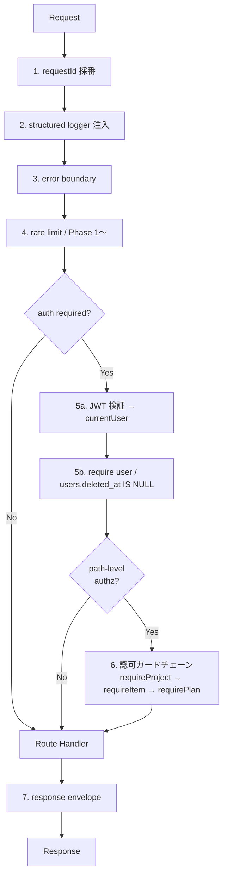

# 第3章 API 設計

| 項目 | 内容 |
|---|---|
| 章番号 | 03 |
| ステータス | **v1.0.1 確定** |
| 確定日 | 2026-05-09 |
| 上位ドキュメント | [TRAKON PRD v1.2](../prd/trakon-prd.md) ／ [01-architecture.md](01-architecture.md) ／ [02-database.md](02-database.md) |
| 主参照 PRD 節 | §4.1（FR）／§6 UC-01〜08, 12, 15, 16／§7 SC-01〜04, 06〜08, 10, 11／§9.4（ロール別マトリクス） |

---

## 3.1. 本章の範囲

Phase 0 で必要な REST API（Hono on Vercel Functions）の設計を行う。スコープ：

- API 全体の設計方針（URL 規約・命名・エラーモデル・認証認可・バージョニング）
- ミドルウェアアーキテクチャ（認証／認可／ロギング／エラー）
- 認可マトリクス（PRD §9.4 の物理化）
- Phase 0 必須エンドポイント一覧と詳細定義
- OpenAPI 3.1 スキーマ生成パイプライン
- Ball Holder 導出ロジックの責務配置
- Phase 1 で追加されるエンドポイント

本章で**扱わない**もの：
- 個別の SQL チューニング（章2 の §2.8 で骨子、必要に応じ実装時に追加）
- 通知ジョブ・メール本文（章5 セキュリティ・章6 インフラで）
- FE のクライアント実装（章4 で扱う）

---

## 3.2. API 設計方針（共通規約）

### 3.2.1. URL / HTTP メソッド規約

| 方針 | 内容 |
|---|---|
| **ベースパス** | `/api/v1/` 固定（章1 §1.6.1。Phase 3 公開API（FR-API-01）で v2 を切れる構造） |
| **リソース命名** | snake_case 複数形（テーブル名と統一）。例：`/projects`、`/project_members` |
| **リソース階層の表現** | **データ上の所有関係を URL に正しく反映する**。例：plans は project → item に所属するため `/projects/:projectId/items/:itemId/plans/:planId` と記述。深さの上限は設けない |
| **CRUD メソッド** | GET（取得）／POST（作成）／PATCH（部分更新）／DELETE（削除）。PUT は使わない |
| **アクションエンドポイント** | 状態遷移（TOSS／完了 等）は対象リソース末端のサブパス。例：`POST /projects/:projectId/items/:itemId/plans/:planId/toss` |
| **クエリパラメータ** | フィルタ・ページング・ソート用。例：`?from=2026-05-01&to=2026-05-31` |
| **同一オリジン** | FE/BE 同居（章1 §1.4 単一プロジェクト）のため **CORS 設定不要** |

> リソース階層を完全に表現する利点：① ID 単独では持てない所属コンテキストが URL から読み取れる、② 認可ミドルウェアを階層的に重ねやすい（`requireProject → requireItem → requirePlan`）、③ Phase 1+ で追加される `comments` / `attachments` 等も同階層下に素直に配置できる、④ OpenAPI のグルーピングが自然。

### 3.2.2. 命名規約（リクエスト・レスポンス）

| 観点 | 方針 |
|---|---|
| **JSON プロパティ** | **camelCase**（FE 側 TypeScript の慣習に合わせる） |
| **DB カラム ↔ JSON** | DB は snake_case、API は camelCase。Prisma のクライアント生成側で自動変換、または Zod schema で明示マッピング |
| **日付** | ISO 8601 文字列（`2026-05-09`、`2026-05-09T10:00:00Z`）。クライアント側でローカル変換 |
| **ID** | UUID v7 を文字列でそのまま使用（短縮 ID 採用しない） |
| **null vs undefined** | 「値なし」は JSON `null`、Zod では `nullable()`。リクエストで省略は `optional()` |

### 3.2.3. 認証方式

| 観点 | 方針 |
|---|---|
| **トークン形式** | Supabase Auth が発行する **JWT**（access_token、RS256） |
| **送信方法** | `Authorization: Bearer <JWT>` ヘッダ |
| **検証** | BE ミドルウェアで Supabase 公開鍵により署名・有効期限・iss/aud 検証 |
| **失敗時** | 401 Unauthorized + `{ error: { code: 'AUTH_INVALID', ... } }` |
| **リフレッシュ** | FE 側 Supabase Auth クライアント SDK が自動 refresh、BE は無関心 |
| **未認証許容エンドポイント** | `GET /invitations/:token`（招待内容確認）、`POST /invitations/:token/accept`（招待受諾）、`GET /share/:token`（非会員URL閲覧／FR-SHARE-01〜05、Phase 0）、`POST /share/:token/plans/:planId/*`（非会員URL経由のボール操作／FR-SHARE-05、Phase 0）、`GET /healthz`（ヘルスチェック） |

> 詳細・XSS 対策（FE 側のトークン保持戦略）は章5 で扱う。

### 3.2.4. 認可方式

| 観点 | 方針 |
|---|---|
| **基本方針** | BE 完全実装（Supabase RLS 不使用）。Hono ミドルウェアとサービス層の2層 |
| **粒度** | プロジェクト参加 × ロール × 対象リソース状態 の複合判定 |
| **失敗時** | 403 Forbidden + `{ error: { code: 'FORBIDDEN', ... } }`。**自分が参加していないプロジェクトは 404 に集約**（§3.10-3） |
| **ガード階層** | URL 階層に沿ってミドルウェアをチェーン（§3.3.2） |

### 3.2.5. リクエスト・レスポンス形式

**リクエスト**：JSON ボディは Zod スキーマで検証。クエリパラメータも Zod で検証。

**レスポンスの統一形式**：

```typescript
// 成功（単一リソース）
{
  "data": { ... }
}

// 成功（一覧）
{
  "data": [ ... ],
  "meta": {
    "total": 42,
    "limit": 50,
    "offset": 0
  }
}

// 警告つき成功
{
  "data": { ... },
  "warnings": [
    { "code": "PLANS_OUT_OF_RANGE", "message": "...", "details": { "planIds": [...] } }
  ]
}

// エラー（§3.2.6）
{
  "error": {
    "code": "PROJECT_NOT_FOUND",
    "message": "Project not found",
    "details": { ... },
    "requestId": "01J..."
  }
}
```

> `data` ラッパは将来のフィールド追加（`meta` / `links` 等）を妨げない。FE 側 TanStack Query の `select` で `.data` を剥がす。

### 3.2.6. エラーモデル

**形式**：RFC 7807 Problem Details ではなく **カスタム JSON**（FE TS との型整合性とシンプルさを優先）。

| HTTP ステータス | アプリエラーコード（例） | 用途 |
|---|---|---|
| 400 | `VALIDATION_ERROR` | Zod 検証失敗、ビジネスルール違反（例：FROM=TO） |
| 401 | `AUTH_INVALID` / `AUTH_EXPIRED` | JWT 無効・期限切れ |
| 403 | `FORBIDDEN` | 認可失敗（プロジェクト参加はあるがロール不足・状態遷移不可） |
| 404 | `NOT_FOUND` | リソース存在せず（**自分が参加していないプロジェクトは 404 で漏らす**：§3.10-3） |
| 409 | `CONFLICT` / `STATE_INVALID` | 競合・状態不整合（既に TOSS 済みなど） |
| 422 | `BUSINESS_RULE_VIOLATION` | ドメインルール違反（例：プロジェクト Closed 中の編集） |
| 429 | `RATE_LIMITED` | レート制限超過（Phase 1〜） |
| 500 | `INTERNAL_ERROR` | 想定外。Sentry に送信、レスポンスにスタックトレースは含めない |
| 503 | `SERVICE_UNAVAILABLE` | DB 接続失敗等 |

**全エラー共通**：
- `requestId`（UUID）を必ず含める。Sentry イベントとログ追跡のキーに
- `message` は英語（システム文言）。FE 側で `code` を見て日本語表示（PRD §4.4 UXR-05「煽らず濁さず逃げない」言葉づかい）
- `details` は機微情報を含めない（SR-DATA-06）

### 3.2.7. ページング・ソート・フィルタ

| 観点 | 方針 |
|---|---|
| **ページング方式** | **オフセットページング**（`?limit=50&offset=0`）。Phase 0 のデータ量では十分 |
| **デフォルト/上限** | `limit` 既定 50、最大 200 |
| **ソート** | `?sort=created_at:desc` 形式。複数指定は `?sort=created_at:desc,id:asc` |
| **フィルタ** | エンドポイント固有（例：`?status=active&from=2026-05-01`） |
| **将来拡張** | ダッシュボード等でカーソルページングが必要になれば Phase 1 で追加検討 |

### 3.2.8. バージョニング

| 観点 | 方針 |
|---|---|
| 形式 | URL パスに `/api/v1/` |
| 互換性 | v1 内の破壊的変更は禁止（フィールド追加・任意化は OK） |
| Phase 3 公開API | v2 を切る際は v1 と並行運用（最低 6ヶ月） |

### 3.2.9. レート制限

| Phase | 方針 |
|---|---|
| Phase 0 | **Vercel 標準のレート制限のみ**（特別実装なし）。社内検証段階で問題化しない見込み |
| Phase 1〜 | Upstash Redis + sliding window で IP/ユーザー単位（招待エンドポイント・パスワード再発行は厳しめ） |
| Phase 2〜 | 組織単位プラン別の制限を追加 |

### 3.2.10. リクエスト ID と相関

| 観点 | 方針 |
|---|---|
| 受信 | `X-Request-Id` ヘッダがあればそれを使う。なければ uuidv7 で生成 |
| 伝播 | `c.set('requestId', ...)` で Hono コンテキストに保持、レスポンスヘッダ `X-Request-Id` に返す |
| ログ | 全アクセスログ・エラーログ・監査ログに含める（Sentry の tag にも） |

---

## 3.3. ミドルウェアアーキテクチャ

### 3.3.1. ミドルウェア階層（Hono）



### 3.3.2. 認可ガードの責務分担

| 層 | 責務 | 例 |
|---|---|---|
| **ミドルウェア層**（path-level、URL 階層に沿ってチェーン） | URL から取得できるリソース ID で「存在＋アクセス可否＋ロール最低要件」を判定 | `requireProjectMember(:projectId)` → `requireItemInProject(:itemId)` → `requirePlanInItem(:planId)` |
| **サービス層**（domain-level） | ビジネスルール（状態遷移可否・対象ボールの所有者・期限等）を判定 | `assertCanToss(plan, currentMember)`、`assertProjectActive(project)` |
| **Repository 層** | データアクセスのみ。認可判定はしない | — |

> ミドルウェアで `currentUser` / `currentMember` / `currentProject` / `currentItem` / `currentPlan` を Hono context に積み上げ、サービス層・ハンドラが利用する。階層的にチェーンすることで「親リソースに参加していれば子リソースに自動的に到達できる」「親が見えなければ子も 404 に統一」が一貫して実現する。

### 3.3.3. 主要ミドルウェアと責務

| ミドルウェア | ファイル | 責務 |
|---|---|---|
| `requestId` | `apps/web/server/middleware/request-id.ts` | X-Request-Id 採番・伝播 |
| `logger` | `apps/web/server/middleware/logger.ts` | 構造化アクセスログ（pino 等） |
| `errorBoundary` | `apps/web/server/middleware/error-boundary.ts` | 例外を §3.2.6 のエラー形式に変換、Sentry に送信 |
| `auth` | `apps/web/server/middleware/auth.ts` | JWT 検証、`currentUser` を context に載せる |
| `requireProjectMember` | `apps/web/server/middleware/authz.ts` | URL の `:projectId` から参加判定、`currentProject` / `currentMember` を context に。未参加は 404 |
| `requireProjectDirector` | 〃 | 上記＋ロール `director` 必須。不足は 403 |
| `requireItemInProject` | 〃 | `:itemId` が `:projectId` 配下に存在することを検証、`currentItem` を context に |
| `requirePlanInItem` | 〃 | `:planId` が `:itemId` 配下に存在することを検証、`currentPlan` を context に |
| `auditLog` | `apps/web/server/middleware/audit.ts` | Phase 0 は `login` / `toss` / `complete` のみ自動記録 |

> **Hono ルート定義例**：
> ```typescript
> app.use('/projects/:projectId/*', requireProjectMember);
> app.use('/projects/:projectId/items/:itemId/*', requireItemInProject);
> app.use('/projects/:projectId/items/:itemId/plans/:planId/*', requirePlanInItem);
> app.post('/projects/:projectId/items/:itemId/plans/:planId/toss', tossHandler);
> ```

---

## 3.4. 認可マトリクス（PRD §9.4 の物理化）

エンドポイントごとに必要な認可。Phase 0 範囲のみ。

| エンドポイント | 未認証 | 認証済み一般 | プロジェクト参加 | ディレクター | 備考 |
|---|:---:|:---:|:---:|:---:|---|
| `GET /healthz` | ✅ | ✅ | ✅ | ✅ | |
| `GET /invitations/:token` | ✅ | ✅ | — | — | トークンが認可代わり |
| `POST /invitations/:token/accept` | ✅ | ✅ | — | — | 同上＋JWT で users 紐付け |
| `POST /auth/me/sync`（初回ユーザー作成） | ❌ | ✅ | — | — | JWT は要、users 行は未存在 |
| `GET /auth/me` | ❌ | ✅ | — | — | |
| `GET /projects` | ❌ | ✅ | — | — | 自分が参加するもののみ |
| `POST /projects` | ❌ | ✅ | — | — | Phase 2 で組織制限（PRD §9.4 注記 ※1） |
| `GET /projects/:projectId` | ❌ | ❌ | ✅ | ✅ | |
| `PATCH /projects/:projectId` | ❌ | ❌ | ❌ | ✅ | |
| `GET /projects/:projectId/members` | ❌ | ❌ | ✅ | ✅ | |
| `POST /projects/:projectId/members` | ❌ | ❌ | ❌ | ✅ | |
| `PATCH /projects/:projectId/members/:memberId` | ❌ | ❌ | ❌ | ✅ | |
| `DELETE /projects/:projectId/members/:memberId` | ❌ | ❌ | ❌ | ✅ | |
| `GET /projects/:projectId/items` | ❌ | ❌ | ✅ | ✅ | |
| `POST /projects/:projectId/items` | ❌ | ❌ | ❌ | ✅ | |
| `GET /projects/:projectId/items/:itemId` | ❌ | ❌ | ✅ | ✅ | |
| `PATCH /projects/:projectId/items/:itemId` | ❌ | ❌ | ❌ | ✅ | |
| `DELETE /projects/:projectId/items/:itemId` | ❌ | ❌ | ❌ | ✅ | |
| `GET /projects/:projectId/items/:itemId/plans` | ❌ | ❌ | ✅ | ✅ | |
| `POST /projects/:projectId/items/:itemId/plans` | ❌ | ❌ | ✅ | ✅ | 参加者なら作成可（メンバー含む） |
| `GET /projects/:projectId/items/:itemId/plans/:planId` | ❌ | ❌ | ✅ | ✅ | |
| `PATCH /projects/:projectId/items/:itemId/plans/:planId` | ❌ | ❌ | ✅※own | ✅ | own = from/to のいずれか or owner |
| `DELETE /projects/:projectId/items/:itemId/plans/:planId` | ❌ | ❌ | ✅※own | ✅ | Phase 0 物理削除 |
| `POST /projects/:projectId/items/:itemId/plans/:planId/toss` | ❌ | ❌ | ✅※holder | ✅※override | 現 Ball Holder のみ実行可（ディレクターは override 可） |
| `POST /projects/:projectId/items/:itemId/plans/:planId/complete` | ❌ | ❌ | ✅※holder | ✅※override | 同上 |
| `GET /projects/:projectId/share-links` | ❌ | ❌ | ❌ | ✅ | FR-SHARE-01／SC-16 一覧 |
| `POST /projects/:projectId/share-links` | ❌ | ❌ | ❌ | ✅ | FR-SHARE-01, 02／SC-16 発行 |
| `DELETE /projects/:projectId/share-links/:shareLinkId` | ❌ | ❌ | ❌ | ✅ | FR-SHARE-03／SC-16 個別失効 |
| `GET /share/:token` | ✅ | ✅ | — | — | トークンが認可代わり／FR-SHARE-01, 04, 05／UC-23 |
| `POST /share/:token/plans/:planId/toss` | ✅ | ✅ | — | — | 非会員URL経由のボール操作（スコープ判定）／FR-SHARE-05／UC-23 |
| `POST /share/:token/plans/:planId/complete` | ✅ | ✅ | — | — | 同上 |

> 凡例：✅ 許可／❌ 拒否（401 or 403／親リソース未参加なら 404）／✅※own（自分が当事者）／✅※holder（現 Ball Holder）／✅※override（ディレクターは追加権限あり）／`/share/:token` 系はトークン自体が認可、有効期限・個別失効・スコープ・対象 plan が share_link.scope に整合することを `requireShareToken` ミドルウェアが検証（章5 §5.x）

---

## 3.5. Phase 0 必須エンドポイント一覧

| カテゴリ | メソッド | パス | 関連 UC | 関連 SC |
|---|---|---|---|---|
| Health | GET | `/healthz` | — | — |
| Auth | POST | `/auth/me/sync` | UC-01 | SC-01 |
| Auth | GET | `/auth/me` | UC-01 | SC-01, 全画面ヘッダ |
| Invitations | GET | `/invitations/:token` | UC-03 | SC-02 |
| Invitations | POST | `/invitations/:token/accept` | UC-03 | SC-02 |
| Projects | GET | `/projects` | — | SC-03 |
| Projects | POST | `/projects` | UC-02 | SC-04 |
| Projects | GET | `/projects/:projectId` | — | SC-06 ヘッダ |
| Projects | PATCH | `/projects/:projectId` | — | SC-10 |
| Members | GET | `/projects/:projectId/members` | UC-02, 03 | SC-06 横軸, SC-11 |
| Members | POST | `/projects/:projectId/members` | UC-02, 03 | SC-04, SC-10 |
| Members | PATCH | `/projects/:projectId/members/:memberId` | — | SC-11 |
| Members | DELETE | `/projects/:projectId/members/:memberId` | — | SC-11 |
| Items | GET | `/projects/:projectId/items` | — | SC-06 ヘッダ／一覧 |
| Items | POST | `/projects/:projectId/items` | UC-04 | SC-04, SC-10 |
| Items | GET | `/projects/:projectId/items/:itemId` | — | SC-06 ヘッダ |
| Items | PATCH | `/projects/:projectId/items/:itemId` | UC-04 | SC-10 |
| Items | DELETE | `/projects/:projectId/items/:itemId` | UC-04 | SC-10 |
| Plans | GET | `/projects/:projectId/items/:itemId/plans` | UC-15 | SC-06 縦型カレンダー |
| Plans | POST | `/projects/:projectId/items/:itemId/plans` | UC-05 | SC-07 |
| Plans | GET | `/projects/:projectId/items/:itemId/plans/:planId` | UC-08 | SC-08 ボール詳細 |
| Plans | PATCH | `/projects/:projectId/items/:itemId/plans/:planId` | UC-05 | SC-07, SC-08 |
| Plans | DELETE | `/projects/:projectId/items/:itemId/plans/:planId` | — | SC-08（MVP物理削除：FR-BALL-12） |
| Ball Actions | POST | `/projects/:projectId/items/:itemId/plans/:planId/toss` | UC-08 | SC-08 |
| Ball Actions | POST | `/projects/:projectId/items/:itemId/plans/:planId/complete` | UC-12 | SC-08 |
| Share Links | GET | `/projects/:projectId/share-links` | UC-23 | SC-16 |
| Share Links | POST | `/projects/:projectId/share-links` | UC-23 | SC-16 |
| Share Links | DELETE | `/projects/:projectId/share-links/:shareLinkId` | UC-23 | SC-16 |
| Share Access | GET | `/share/:token` | UC-23 | （非会員URL閲覧画面） |
| Share Access | POST | `/share/:token/plans/:planId/toss` | UC-23 | （非会員URL閲覧画面） |
| Share Access | POST | `/share/:token/plans/:planId/complete` | UC-23 | （非会員URL閲覧画面） |

> v1.1 改訂注：`Share Links` / `Share Access` 6本は v1.0 まで §3.9 Phase 1 で予告していたが、PRD v1.3 で Phase 0 へ前倒しされたため Phase 0 必須として正式採番。詳細仕様は §3.6.9 を参照。

---

## 3.6. エンドポイント詳細定義

### 3.6.1. Health

#### `GET /api/v1/healthz`

ヘルスチェック。DB 疎通も確認。

**認可**：未認証可。

**レスポンス**：
```json
{ "data": { "status": "ok", "db": "ok", "version": "0.1.0" } }
```

---

### 3.6.2. Auth

#### `POST /api/v1/auth/me/sync`

Supabase Auth で signUp / signIn 完了後、FE が **初回呼び出し**するエンドポイント。
アプリ DB の `users` 行を作成（または存在確認）し、`audit_logs` に `login` を記録。

**認可**：JWT 必須（users 行は未存在の場合あり）。

**リクエスト**：（ボディ無し）

**レスポンス（200）**：
```typescript
{
  data: {
    id: string,           // users.id
    authUserId: string,
    email: string,
    displayName: string,
    createdAt: string,
  }
}
```

**処理**：
1. JWT から `auth_user_id` 抽出
2. `users WHERE auth_user_id = ?` で検索
3. 存在しない場合：`auth.users` から `email` / `raw_user_meta_data.display_name` を取り、`users` INSERT
4. `audit_logs` に `action='login'` を記録（result='success'）
5. ユーザー情報を返す

**エラー**：401 (`AUTH_INVALID`)。

---

#### `GET /api/v1/auth/me`

現在のユーザーの基本情報＋参加プロジェクト件数。

**認可**：JWT + users 行存在必須。

**レスポンス（200）**：
```typescript
{
  data: {
    id: string,
    email: string,
    displayName: string,
    projectCount: number,
  }
}
```

---

### 3.6.3. Invitations

> 招待トークンは未認証でアクセスされる必要がある（招待先がまだ未登録の可能性）。プロジェクト ID を URL に出すと未参加者へのリーク（プロジェクト存在の漏洩）が起こりうるため、**招待は独立リソースとして `/invitations/:token` のトップレベルに配置**する。

#### `GET /api/v1/invitations/:token`

招待トークンの有効性確認＆内容取得。SC-02（招待受諾画面）の表示用。

**認可**：未認証可（トークン自体が認可）。

**パスパラメータ**：`token`（招待 URL に埋め込まれた生トークン）

**処理**：
1. `token` を SHA-256 ハッシュ化
2. `invitations WHERE token_hash = ? AND accepted_at IS NULL AND revoked_at IS NULL AND expires_at > now()` で検索
3. 紐付く `projects.name`、`invited_member.name`、`invited_member.organization_name`、`role_type` を返す

**レスポンス（200）**：
```typescript
{
  data: {
    project: { id: string, name: string },
    invitedMember: { name: string, email: string, organizationName: string },
    roleType: string | null,
    expiresAt: string,
  }
}
```

**エラー**：404 (`INVITATION_NOT_FOUND_OR_EXPIRED`)。**有効期限切れ／受諾済／失効済はすべて 404 に集約**（漏れ防止）。

---

#### `POST /api/v1/invitations/:token/accept`

招待受諾。FE は事前に Supabase Auth で signUp / signIn 済みの想定（JWT 必須）。

**認可**：JWT 必須。

**リクエスト**：（ボディ不要、`:token` で識別）

**処理**：
1. `:token` ハッシュ化 → `invitations` 検索（同上の有効性確認）
2. JWT の `auth_user_id` から `users` 取得（無ければ作成 — `auth/me/sync` 同等）
3. **同一トランザクション**で：
   - `project_members.user_id = users.id` を設定
   - `invitations.accepted_at = now()` を設定
4. `audit_logs` に `action='invitation_accepted'`（Phase 0 では記録、Phase 1 で UI 化）

**レスポンス（200）**：
```typescript
{
  data: {
    project: { id: string, name: string },
    member: { id: string, roleType: string | null },
  }
}
```

**エラー**：404 (`INVITATION_NOT_FOUND_OR_EXPIRED`)、401 (`AUTH_INVALID`)、409 (`ALREADY_ACCEPTED`)。

---

### 3.6.4. Projects

#### `GET /api/v1/projects`

自分が参加するプロジェクト一覧。

**認可**：JWT 必須。

**クエリ**：`?limit=50&offset=0&sort=updated_at:desc&status=active|closed`

**レスポンス（200）**：
```typescript
{
  data: Array<{
    id: string,
    name: string,
    startDate: string,    // YYYY-MM-DD
    endDate: string,
    status: 'active' | 'closed',
    role: 'director' | 'member' | 'client',  // 自分のロール
    updatedAt: string,
  }>,
  meta: { total: number, limit: number, offset: number }
}
```

**処理**：
1. `users.id` を起点に `project_members JOIN projects` で `deleted_at IS NULL` のものを取得
2. 自分の `member_type` / `role_type` をマップして `role` を返す（Phase 0 は `member_type` から `client` / `member` を導出、`director` は Phase 1 で `role_type` 導入後）

> Phase 0 は全員 `director` 相当（プロジェクト作成者）として扱う簡易実装。Phase 1 で `role_type` 導入後に正規化。

---

#### `POST /api/v1/projects`

プロジェクト新規作成。SC-04 の保存に対応。

**認可**：JWT 必須（Phase 2 で組織制限）。

**リクエスト**：
```typescript
{
  name: string,                    // 1〜255
  startDate: string,               // YYYY-MM-DD
  endDate: string,                 // startDate 以降
  items: Array<{                   // 1件以上
    name: string,
    sortOrder?: number,
  }>,
  members: Array<{                 // 最大10名
    name: string,
    email: string,
    organizationName: string,
    memberType: 'client' | 'production',
    sortOrder?: number,
  }>,
}
```

**処理**（同一トランザクション）：
1. Zod 検証（必須・期間・件数）
2. `projects` INSERT（`created_by = currentUser.id`、`status='active'`）
3. `project_items` を bulk INSERT
4. `project_members` を bulk INSERT（**作成者本人を `production` / director として自動追加**）
5. 各 `members` のうち `email` が既存 `users.email` と一致しないものに対し、`invitations` 行を作成 → Resend で招待メール送信

**レスポンス（201）**：
```typescript
{
  data: {
    id: string,
    name: string,
    // ...（GET /projects/:projectId と同形式）
  }
}
```

**エラー**：400（バリデーション）、422（同一メール重複等）、500（メール送信失敗 → ロールバック）。

> **確定方針（§3.10-7）**：**同期送信＋失敗時はトランザクションロールバック**。Resend 側障害時はプロジェクト作成自体が失敗する点を許容し、招待不達の手戻りを防ぐ。Phase 1 で Inngest 導入後、必要に応じ非同期化を再検討。

---

#### `GET /api/v1/projects/:projectId`

プロジェクト詳細。SC-06 ヘッダや SC-10 編集画面で使用。

**認可**：プロジェクト参加者。

**レスポンス（200）**：
```typescript
{
  data: {
    id: string,
    name: string,
    startDate: string,
    endDate: string,
    status: 'active' | 'closed',
    createdBy: { id: string, displayName: string },
    createdAt: string,
    updatedAt: string,
    counts: {
      itemCount: number,
      memberCount: number,
      activePlanCount: number,
    },
  }
}
```

---

#### `PATCH /api/v1/projects/:projectId`

プロジェクト編集。

**認可**：プロジェクトディレクター。

**リクエスト**：
```typescript
{
  name?: string,
  startDate?: string,
  endDate?: string,
}
```

**処理**：
- 期間変更で範囲外に予定がある場合、警告のみ（PRD FR-PRJ-04／本設計章2 §2.10-6）
- **レスポンスボディの `warnings` 配列**で件数・該当 plan ID を返す（FE 側でモーダル表示）

**レスポンス（200）**：
```typescript
{
  data: { /* 更新後の project */ },
  warnings?: Array<{
    code: 'PLANS_OUT_OF_RANGE' | string,
    message: string,
    details: { planIds: string[] },
  }>,
}
```

---

### 3.6.5. Project Members

#### `GET /api/v1/projects/:projectId/members`

参加者一覧。SC-06 横軸描画・SC-11 参加者管理で使用。

**認可**：プロジェクト参加者。

**レスポンス（200）**：
```typescript
{
  data: Array<{
    id: string,                    // project_members.id
    userId: string | null,         // 招待中は null
    name: string,
    email: string,
    organizationName: string,
    memberType: 'client' | 'production',
    roleType: string | null,
    sortOrder: number,
    isActive: boolean,             // Phase 0 では常に true
    inviteStatus: 'accepted' | 'pending' | 'expired',  // 派生フィールド
    createdAt: string,
  }>
}
```

---

#### `POST /api/v1/projects/:projectId/members`

参加者追加。

**認可**：プロジェクトディレクター。

**リクエスト**：
```typescript
{
  members: Array<{
    name: string,
    email: string,
    organizationName: string,
    memberType: 'client' | 'production',
    sortOrder?: number,
  }>,
}
```

**処理**：
- `project_members` INSERT
- 既存 `users` に紐付かないメールには `invitations` + 招待メール送信（POST /projects と同方式）

---

#### `PATCH /api/v1/projects/:projectId/members/:memberId`

参加者編集（名前・所属名・sortOrder・memberType）。

**認可**：プロジェクトディレクター。

---

#### `DELETE /api/v1/projects/:projectId/members/:memberId`

参加者削除。Phase 0 では物理削除（参照整合性のため、進行中ボールがある場合は 409）。

**認可**：プロジェクトディレクター。

**エラー**：409 (`MEMBER_HAS_ACTIVE_PLANS`)、403、404。

---

### 3.6.6. Project Items

#### `GET /api/v1/projects/:projectId/items`

制作物一覧。

**認可**：プロジェクト参加者。

**レスポンス**：
```typescript
{
  data: Array<{
    id: string,
    name: string,
    sortOrder: number,
    startDate: string | null,
    endDate: string | null,
    itemType: string | null,        // Phase 0 は常に null
    counts: {
      activePlanCount: number,
      completedPlanCount: number,
    },
  }>
}
```

---

#### `POST /api/v1/projects/:projectId/items`

制作物追加。

**認可**：プロジェクトディレクター。

**リクエスト**：`{ name, sortOrder?, startDate?, endDate? }`

---

#### `GET /api/v1/projects/:projectId/items/:itemId`

制作物詳細。SC-06 のヘッダ表示などで使用。

**認可**：プロジェクト参加者。

**レスポンス**：
```typescript
{
  data: {
    id: string,
    projectId: string,
    name: string,
    sortOrder: number,
    startDate: string | null,
    endDate: string | null,
    itemType: string | null,
    counts: {
      activePlanCount: number,
      completedPlanCount: number,
    },
    createdAt: string,
    updatedAt: string,
  }
}
```

---

#### `PATCH /api/v1/projects/:projectId/items/:itemId`

制作物編集。

**認可**：プロジェクトディレクター。

---

#### `DELETE /api/v1/projects/:projectId/items/:itemId`

制作物削除。Phase 0 では物理削除＋配下の plans / ball_events も連鎖削除（CASCADE）。

**認可**：プロジェクトディレクター。

**エラー**：409 (`ITEM_HAS_ACTIVE_PLANS`：確認モーダルが必要なケース、FE 側で確認後に `?force=true` で再送信)。

---

### 3.6.7. Plans

#### `GET /api/v1/projects/:projectId/items/:itemId/plans`

縦型カレンダー描画用。期間内の予定を全件取得。

**認可**：プロジェクト参加者。

**クエリ**：`?from=YYYY-MM-DD&to=YYYY-MM-DD`（任意。省略時はプロジェクト期間全体）

**レスポンス**：
```typescript
{
  data: Array<{
    id: string,
    planType: 'toss',                // Phase 0
    title: string,
    scheduledDate: string,
    dueDate: string | null,
    fromMember: { id: string, name: string, organizationName: string },
    toMember: { id: string, name: string, organizationName: string },
    status: 'active' | 'completed' | 'canceled',
    ballHolder: { id: string, name: string, organizationName: string },  // 導出値
    ballState: 'ready' | 'tossed' | 'completed',                         // 導出値
    latestEvent: { eventType: string, occurredAt: string } | null,
    memo: string | null,
    createdAt: string,
    updatedAt: string,
  }>
}
```

**処理**：
- Repository 層で `plans + 最新の ball_events` を取得
- `deriveBallHolder()` で Ball Holder と ballState を計算（章2 §2.6.1）
- N+1 回避：plans 一覧取得時に LATERAL JOIN または `DISTINCT ON` で各 plan の最新 event を1クエリで取得

---

#### `POST /api/v1/projects/:projectId/items/:itemId/plans`

予定作成（Phase 0 は TOSS 予定のみ）。SC-07 から呼ばれる。

**認可**：プロジェクト参加者。

**リクエスト**：
```typescript
{
  planType: 'toss',                 // Phase 0 は固定
  title: string,
  scheduledDate: string,            // YYYY-MM-DD
  dueDate?: string,
  fromMemberId: string,
  toMemberId: string,               // fromMemberId と異なる必須
  memo?: string,
}
```

**処理**：
- バリデーション（章2 `ck_plans_toss_members` 同等の事前チェック）
- `plans` INSERT（`status='active'`、Ball Holder = `fromMemberId`、`ball_events` はまだ作成しない）

**レスポンス（201）**：作成された plan（GET と同形式）

---

#### `GET /api/v1/projects/:projectId/items/:itemId/plans/:planId`

予定詳細＋ボール履歴。SC-08 ボール詳細モーダルで使用。

**認可**：プロジェクト参加者。

**レスポンス**：
```typescript
{
  data: {
    plan: { /* GET 一覧 1件と同 */ },
    events: Array<{
      id: string,
      eventType: 'tossed' | 'completed',
      actor: { id: string, name: string, organizationName: string },
      occurredAt: string,
      note: string | null,
    }>,
  }
}
```

---

#### `PATCH /api/v1/projects/:projectId/items/:itemId/plans/:planId`

予定編集。

**認可**：プロジェクト参加者で、当該 plan の from/to のいずれか（or ディレクター）。

**リクエスト**：`{ title?, scheduledDate?, dueDate?, memo? }`（Phase 0）

**ビジネスルール**：
- `status === 'completed'` の予定は編集不可（422 `STATE_INVALID`）
- TOSS 後（`ball_events.event_type='tossed'` 存在）に from/to の変更は不可（422）

---

#### `DELETE /api/v1/projects/:projectId/items/:itemId/plans/:planId`

予定削除。Phase 0 は物理削除（FR-BALL-12）。配下の `ball_events` も CASCADE で物理削除。

**認可**：プロジェクト参加者で、当該 plan の from/to のいずれか（or ディレクター）。

**ビジネスルール**：
- TOSS 後の plan の削除は警告のみ（FE 確認モーダル）

---

### 3.6.8. Ball Actions（状態遷移）

#### `POST /api/v1/projects/:projectId/items/:itemId/plans/:planId/toss`

TOSS 実行。

**認可**：現 Ball Holder ＝ `plans.from_member_id`（TOSS 未実行）かつ JWT ユーザーが当該 member。
あるいはプロジェクトディレクター（override）。

**リクエスト**：（ボディなし）

**処理**（同一トランザクション）：
1. `plans` を SELECT FOR UPDATE
2. 状態確認：
   - `status === 'active'` であること
   - 既に `event_type='tossed'` の `ball_events` が存在しないこと（多重 TOSS 防止）
3. `ball_events` INSERT (`event_type='tossed'`, `actor_member_id=currentMember.id`, `occurred_at=now()`)
4. `audit_logs` に `action='toss'` を記録

**レスポンス（200）**：
```typescript
{
  data: {
    plan: { /* 更新後の plan、ballHolder は to_member に切替 */ },
    event: { /* 作成された ball_events */ },
  }
}
```

**エラー**：
- 403 `FORBIDDEN`（権限なし）
- 409 `ALREADY_TOSSED`（既に TOSS 済み）
- 422 `PLAN_NOT_ACTIVE`（completed/canceled 状態）

---

#### `POST /api/v1/projects/:projectId/items/:itemId/plans/:planId/complete`

予定完了。

**認可**：現 Ball Holder（or ディレクター）。

**処理**：
1. `plans` を SELECT FOR UPDATE
2. 状態確認：`status === 'active'` であること
3. `ball_events` INSERT (`event_type='completed'`)
4. `plans.status = 'completed'`、`completed_at = now()` に更新
5. `audit_logs` に `action='complete'` を記録

**レスポンス（200）**：plan + event

**エラー**：403、409 `ALREADY_COMPLETED`、422。

---

### 3.6.9. Share Links（非会員URL共有・管理側）

> **PRD 紐付け**：FR-SHARE-01（発行）／FR-SHARE-02（有効期限）／FR-SHARE-03（個別失効）／FR-SHARE-04（監査ログ）／SR-AUTH-08（短時間有効期限・個別失効・監査ログ）／UC-23／SC-16。
> Phase 0 から提供。組織レベル On/OFF（FR-SHARE-07、Phase 2）は本節では未実装。

#### `GET /api/v1/projects/:projectId/share-links`

プロジェクト配下の非会員URL一覧を取得（SC-16 の発行済URL一覧）。

**認可**：プロジェクトディレクターのみ（`requireProjectDirector`）。

**クエリ**：`?status=active|revoked|expired|all`（既定 `all`）、`?limit=50&offset=0`。

**レスポンス（200）**：
```typescript
{
  data: Array<{
    id: string,
    scopeType: 'project' | 'item' | 'plan',
    scopeTargetId: string | null,
    issuedByMemberId: string,
    issuedAt: string,         // ISO8601
    expiresAt: string,
    revokedAt: string | null,
    organizationOffRevoked: boolean,    // Phase 0 は常に false
    lastAccessedAt: string | null,
    status: 'active' | 'revoked' | 'expired'  // サーバ側で算出
  }>,
  meta: { total: number, limit: number, offset: number }
}
```

> **生トークンは返さない**。発行直後の POST レスポンスでのみ平文を返す（後述）。

#### `POST /api/v1/projects/:projectId/share-links`

非会員URLを発行する。

**認可**：プロジェクトディレクターのみ。

**リクエスト**：
```typescript
{
  scopeType: 'project' | 'item' | 'plan',
  scopeTargetId?: string,        // scopeType='item' なら itemId、'plan' なら planId
  expiresInSeconds: number       // 既定値・上限はサーバ側で検証（章5 §5.x）
}
```

**処理**（同一トランザクション）：
1. scope 整合性検証（`scopeType='item'/'plan'` なら `scopeTargetId` がプロジェクト配下に存在することを確認）
2. 期限上限チェック（既定 7日、上限 30日。最終確定値は章5 §5.x）
3. トークン生成：暗号学的乱数 32バイト → URL-safe Base64
4. SHA-256 で `token_hash` を算出して `share_links` に INSERT
5. `audit_logs` に `action='share_create'` を記録
6. 平文トークンを含む URL をレスポンス

**レスポンス（201）**：
```typescript
{
  data: {
    id: string,
    url: string,                 // 例：https://app.example.com/share/<token>
    token: string,               // **このレスポンスでのみ返す。再表示不可**
    scopeType, scopeTargetId,
    issuedByMemberId, issuedAt, expiresAt,
    revokedAt: null,
    organizationOffRevoked: false,
    lastAccessedAt: null
  }
}
```

**エラー**：400 `VALIDATION_ERROR`（scope 不整合・期限超過）、403、404（scopeTarget が見つからない）。

#### `DELETE /api/v1/projects/:projectId/share-links/:shareLinkId`

非会員URLを個別失効する（FR-SHARE-03）。

**認可**：プロジェクトディレクターのみ。

**処理**：
1. `share_links.revoked_at = now()` を UPDATE（既に revoked なら 200 冪等）
2. `audit_logs` に `action='share_revoke'` を記録

**レスポンス（200）**：失効後の share_link

**注**：物理削除は行わない（章2 §2.4.9 留意点）。

---

### 3.6.10. Share Access（非会員URL閲覧・操作）

> **PRD 紐付け**：FR-SHARE-01〜06／SR-AUTH-08／SR-AUTHZ-02／UC-23。
> 未認証で利用可能（トークン自体が認可）。Phase 0 から提供。

#### 共通ミドルウェア `requireShareToken`（章5 §5.x）

`/share/:token/*` 配下のすべてのリクエストに適用：

1. リクエストパスから `:token` を取得
2. SHA-256 でハッシュ化し `share_links` を検索（`token_hash` ＋ `revoked_at IS NULL` ＋ `organization_off_revoked = false` ＋ `expires_at > now()`）
3. ヒットしなければ 404 `NOT_FOUND`（存在を漏らさない）
4. `currentShareLink` を context にセット、`audit_logs` に `action='share_access'`（IP・UA・参照リソース・share_link_id）を記録
5. `share_links.last_accessed_at = now()` を更新（同一トランザクション）

#### `GET /api/v1/share/:token`

非会員URL閲覧者が、共有スコープに応じた最小限のプロジェクト情報を取得する。

**認可**：未認証可（`requireShareToken`）。

**レスポンス（200）**：
```typescript
{
  data: {
    project: { id, name, startDate, endDate /* 表示に必要な最小限 */ },
    scope: {
      type: 'project' | 'item' | 'plan',
      targetId: string | null,
      // scope に応じた items / plans のサブセット（クライアントロール相当：SR-AUTHZ-02）
      items?: Array<{ id, name, sortOrder, ... }>,
      plans?: Array<{ id, title, scheduledDate, status, ballHolderMemberId, ... }>
    },
    expiresAt: string
  }
}
```

#### `POST /api/v1/share/:token/plans/:planId/toss`

非会員URL経由で TOSS を実行（FR-SHARE-05）。閲覧者が現 Ball Holder の場合のみ可。

**認可**：`requireShareToken` ＋ `assertPlanInScope(planId, share_link.scope)` ＋ `assertCallerIsBallHolderViaShare(plan, share_link)`。

**リクエスト**（FR-SHARE-06、任意）：
```typescript
{
  displayName?: string,         // 表示名（ハンドル）
  acknowledgedEmail?: string    // 受領メールアドレスの確認入力
}
```

**処理**：通常の TOSS と同様の状態遷移＋ `ball_events.actor_member_id` は share_link.scope に紐づくクライアント member を充てる。
`audit_logs` に `action='share_toss'`（`share_link_id` セット、`actor_user_id` は NULL）を記録。

**レスポンス（200）**：plan + event。

#### `POST /api/v1/share/:token/plans/:planId/complete`

非会員URL経由で完了（差し戻し相当）。仕様は上記 toss と同様、`audit_logs.action='share_complete'`。

> **エラー方針**：トークン期限切れ・失効・存在せずは **すべて 404 に集約**（PRD §9.1 機密第一）。クライアント側は専用の「失効ページ」を表示（基本設計書 第4章 §4.4.x）。

---

## 3.7. OpenAPI スキーマ生成パイプライン

### 3.7.1. 生成方式

| 方式 | 採用 | 理由 |
|---|---|---|
| **`@hono/zod-openapi` で Zod から OpenAPI 自動生成** | ✅ | Zod 定義が単一の真実、ルートハンドラと OpenAPI が乖離しない |
| 手書き YAML | ❌ | ハンドラと乖離する典型 |
| TypeSpec | ❌ | Phase 0 には過剰、将来 Phase 3 公開API で再評価 |

### 3.7.2. パイプライン

```mermaid
flowchart LR
    Z[apps/web/server/schemas/*.ts<br/>Zod スキーマ] --> H[apps/web/server/routes/v1/*.ts<br/>@hono/zod-openapi 定義]
    H --> Y[openapi/openapi.yaml<br/>静的出力]
    Y --> T[apps/web/src/lib/api-types.ts<br/>openapi-typescript で生成]
    T --> FE[FE コード]
```

### 3.7.3. CI チェック

- `openapi-check.yml` で PR ごとに `openapi.yaml` を再生成し、コミット済みファイルとの差分を検知（差分があれば fail）
- これにより「ハンドラ変更したのに型が更新されていない」事故を防ぐ

---

## 3.8. Ball Holder 導出ロジックの責務配置

章2 §2.6 で「アプリ層（Repository）で計算」と確定済み。本章では具体的な配置を確定：

| ファイル | 責務 |
|---|---|
| `apps/web/server/repositories/plans.ts` | `findPlansWithLatestEvents(itemId, range)` — `plans + LATERAL JOIN ball_events` で取得 |
| `packages/shared/domain/ball-holder.ts` | `deriveBallHolder(plan, latestEvent): { memberId, state }` — 純関数。FE/BE 共通で使う |
| `apps/web/server/services/plans.ts` | Repository から取得 → `deriveBallHolder` を適用 → API レスポンス形式に整形 |

> `packages/shared` に純関数として置くことで、将来 FE 側で楽観更新時に同じロジックを使える（TOSS 直後に refetch を待たず Ball Holder 表示を即時切替）。

### 3.8.1. 関数仕様（packages/shared/domain/ball-holder.ts）

```typescript
type Plan = {
  planType: 'toss' | 'shared' | 'solo';
  fromMemberId?: string;
  toMemberId?: string;
  ownerMemberId?: string;
  status: 'active' | 'completed' | 'canceled';
};

type BallEvent = {
  eventType: 'tossed' | 'completed' | 'canceled' | 'returned' | 'retossed';
  actorMemberId: string;
};

type BallHolderResult = {
  memberId: string;
  state: 'ready' | 'tossed' | 'returned' | 'completed' | 'canceled';
};

export function deriveBallHolder(plan: Plan, latestEvent: BallEvent | null): BallHolderResult;
```

**Phase 0 の挙動（plan_type='toss' のみ）**：
| latestEvent | 返り値 |
|---|---|
| null | { memberId: plan.fromMemberId, state: 'ready' } |
| 'tossed' | { memberId: plan.toMemberId, state: 'tossed' } |
| 'completed' | { memberId: plan.toMemberId, state: 'completed' } |

**Phase 1 で拡張**：'returned' / 'retossed' / 'canceled' / shared / solo 対応。テストは状態遷移網羅。

---

## 3.9. Phase 1 で追加されるエンドポイント（参考）

| カテゴリ | メソッド | パス | 関連 UC |
|---|---|---|---|
| Auth | POST | `/auth/password/reset` | UC-01 |
| Auth | POST | `/auth/password/reset/confirm` | UC-01 |
| Plans | POST | `/projects/:projectId/items/:itemId/plans` (planType 拡張) | UC-06, UC-07 |
| Ball Actions | POST | `/projects/:projectId/items/:itemId/plans/:planId/cancel-toss` | UC-09 |
| Ball Actions | POST | `/projects/:projectId/items/:itemId/plans/:planId/return` | UC-10 |
| Ball Actions | POST | `/projects/:projectId/items/:itemId/plans/:planId/retoss` | UC-11 |
| Projects | POST | `/projects/:projectId/close` | UC-17 |
| Projects | POST | `/projects/:projectId/archive` | UC-18 |
| Projects | DELETE | `/projects/:projectId` | UC-18 |
| Comments | GET | `/projects/:projectId/items/:itemId/plans/:planId/comments` | UC-19 |
| Comments | POST | `/projects/:projectId/items/:itemId/plans/:planId/comments` | UC-19 |
| Attachments | GET | `/projects/:projectId/items/:itemId/plans/:planId/attachments` | UC-19 |
| Attachments | POST | `/projects/:projectId/items/:itemId/plans/:planId/attachments` | UC-19 |
| Attachments | DELETE | `/projects/:projectId/items/:itemId/plans/:planId/attachments/:attachmentId` | UC-19 |
| Attachments | POST | `/projects/:projectId/items/:itemId/plans/:planId/attachments/:attachmentId/signed-url` | SR-DATA-03 |
| Notifications | GET | `/users/me/notifications` | UC-20 |
| Notifications | PATCH | `/users/me/notification-settings` | SC-14 |
| Dashboard | GET | `/users/me/dashboard` | UC-13, 14 |
| Export | POST | `/projects/:projectId/export.pdf` | FR-EXPORT-01 |
| Audit | GET | `/audit/logs` | （Phase 2 組織管理者）|

---

## 3.10. 議論ポイントの確定結果

| # | 論点 | 確定内容 | 判断理由 |
|---|---|---|---|
| 1 | JSON プロパティ命名 | **camelCase** | FE TypeScript 規約に揃える、変換レイヤを1点（API ↔ Prisma）に集約 |
| 2 | レスポンスエンベロープ | **`{ data, meta?, warnings?, error? }`** | 将来の meta/warnings 拡張・エラー形式統一・ケーシング一元化に有利 |
| 3 | 未参加リソースへの応答 | **404 に集約** | PRD §9.1「機密第一」に準拠、他テナントの ID 存在を漏らさない |
| 4 | エラー形式 | **カスタム JSON** `{ error: { code, message, details, requestId } }` | FE TS 型整合性とシンプルさ優先。RFC 7807 は Phase 3 公開API で再評価 |
| 5 | アクションエンドポイント方式 | **末端リソースのサブパス** `POST .../plans/:planId/toss` | ドメイン操作を URL で明示、認可・状態遷移・OpenAPI が読みやすい |
| 6 | ページング | **オフセット** | Phase 0 のデータ量で十分、total を返せる、Phase 1 でカーソル併用検討 |
| 7 | 一覧最大 limit | **200** | 縦型スケジュール最大100予定×2倍マージン、ダッシュボードもカバー |
| 8 | 招待メール送信失敗 | **同期送信＋トランザクションロールバック** | 招待不達の手戻りを防ぐ。Phase 1 で Inngest 導入後に非同期化再評価 |
| 9 | 警告の返し方 | **レスポンスボディの `warnings` 配列** | 多件警告・構造化データを乗せやすい、FE 型生成と相性◎ |
| 10 | 楽観的ロック | **Phase 0 では実装しない（最後勝ち）** | 同一ボール多人数同時編集ケースが少ない。Phase 1 でコメント・差し戻し追加時に再検討 |
| 11 | URL 階層の表現方針 | **データ上の所有関係を完全に URL に反映**（深さ上限なし） | 認可ミドルウェアの階層チェーン化、未参加リソースの 404 集約、子リソース追加時の素直な配置に有利 |

---

## 3.11. PRD 整合チェック

| 該当 PRD 項 | 本章での扱い |
|---|---|
| §6 UC-01〜08, 12, 15, 16 | §3.5〜3.6 で全て対応エンドポイント定義 |
| §7 SC-01〜04, 06〜08, 10, 11 | 各画面が必要とする API を §3.5 に列挙 |
| §9.4 ロール別操作マトリクス | §3.4 で API レベルに物理化 |
| §9.6 SR-AUDIT-01 | §3.6.2 / §3.6.8 / §3.6.9〜10 で Phase 0 範囲（login/toss/complete/share_access/share_create/share_revoke/share_toss/share_complete）を実装 |
| §10.2 Phase 0 成功基準 | §3.5 の Phase 0 必須エンドポイントが満たすことを確認（FR-SHARE-01〜06／UC-23／SC-16 を含む） |
| §10.2 FR-SHARE-01〜06／SR-AUTH-08 | §3.6.9 share-link 管理エンドポイント＋§3.6.10 share access エンドポイントで物理化（v1.1 改訂で Phase 0 化） |
| FR-BALL-12 MVP 物理削除 | §3.6.7 DELETE 系で物理削除を実装、Phase 1 で論理削除へ |

### Phase 1+ 持ち越し

- §3.9 のエンドポイント群（差し戻し・通知・ダッシュボード・PDF出力）
- レート制限（Upstash Redis）
- 楽観的ロック（必要性が出てから）
- WebSocket / SSE（Phase 2+ リアルタイム要件が出れば）

### PRD 整合メモ（PRD 改訂提案）

- 特になし（章2 で起票した `invitations` テーブル提案は引き続き有効）

---

## 3.12. 章ステータス

| 日付 | 状態 | 備考 |
|---|---|---|
| 2026-05-09 | Draft（たたき台） | §3.10 議論ポイント10項目を未確定で起稿 |
| 2026-05-09 | **v1.0 確定** | §3.10 全10論点を AskUserQuestion で確定（全て推奨案＝たたき台どおり） |
| 2026-05-09 | **v1.0.1 確定** | URL 階層の表現方針を改訂：「ネスト深さ最大2階層」の縛りを撤回し、データ所有関係を完全に URL に反映する方針へ更新（plans 系・items 詳細・ball actions・Phase 1 系のパスを完全階層化）。§3.10 に論点11として記録。 |
| 2026-05-09 | **v1.1 確定** | PRD v1.3 改訂（非会員URL共有 Phase 0 化）に追従。§3.5 Phase 0 必須エンドポイントに Share Links（GET/POST/DELETE）と Share Access（GET /share/:token、POST /share/:token/plans/:planId/{toss,complete}）を追加、§3.6.9〜10 に詳細仕様を新設、§3.4 認可マトリクスに share-link 行を追加、§3.2.3 未認証許容エンドポイントに `/share/:token` を追加、§3.9 から share 関連 4行を削除、§3.11 PRD 整合チェックと Phase 1+ 持ち越しを更新。 |
