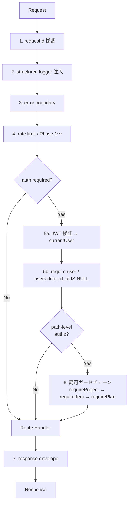

# 第3章 API 設計

| 項目 | 内容 |
|---|---|
| 章番号 | 03 |
| ステータス | **v1.2 確定**（v1.0.1: 2026-05-09 / v1.1: 2026-05-24 プロトタイプ反映 / v1.2: 2026-08-30 課金・組織・ロール） |
| 確定日 | 2026-08-30 |
| 上位ドキュメント | [TRAKON PRD v1.4](../prd/trakon-prd.md) ／ [01-architecture.md](01-architecture.md) ／ [02-database.md](02-database.md) ／ [07-billing.md](07-billing.md) |
| 主参照 PRD 節 | §4.1（FR、v1.3 で追加された FR-AUTH-10〜12, FR-SCH-17〜18, FR-BALL-13, FR-DASH 改訂）／§6 UC-01〜08, 12, 15, 16, 24, 25, 26／§7 SC-01, 03〜04, 06〜11, 17／§4.1.12〜12c（FR-ORG / FR-BILL / FR-ROLE）／§6 UC-27〜31／§9.4（ロール別マトリクス）／§9.12（決済セキュリティ） |

---

## 3.1. 本章の範囲

Phase 0 で必要な REST API（Hono on Vercel Functions）の設計を行う。スコープ：

- API 全体の設計方針（URL 規約・命名・エラーモデル・認証認可・バージョニング）
- ミドルウェアアーキテクチャ（認証／認可／ロギング／エラー）
- 認可マトリクス（PRD §9.4 の物理化）
- Phase 0 必須エンドポイント一覧と詳細定義
- OpenAPI 3.1 スキーマ生成パイプライン
- Ball Holder 導出ロジックの責務配置
- Phase 1 で追加されるエンドポイント

本章で**扱わない**もの：
- 個別の SQL チューニング（章2 の §2.8 で骨子、必要に応じ実装時に追加）
- 通知ジョブ・メール本文（章5 セキュリティ・章6 インフラで）
- FE のクライアント実装（章4 で扱う）

---

## 3.2. API 設計方針（共通規約）

### 3.2.1. URL / HTTP メソッド規約

| 方針 | 内容 |
|---|---|
| **ベースパス** | `/api/v1/` 固定（章1 §1.6.1。Phase 3 公開API（FR-API-01）で v2 を切れる構造） |
| **リソース命名** | snake_case 複数形（テーブル名と統一）。例：`/projects`、`/project_members` |
| **リソース階層の表現** | **データ上の所有関係を URL に正しく反映する**。例：plans は project → item に所属するため `/projects/:projectId/items/:itemId/plans/:planId` と記述。深さの上限は設けない |
| **CRUD メソッド** | GET（取得）／POST（作成）／PATCH（部分更新）／DELETE（削除）。PUT は使わない |
| **アクションエンドポイント** | 状態遷移（TOSS／完了 等）は対象リソース末端のサブパス。例：`POST /projects/:projectId/items/:itemId/plans/:planId/toss` |
| **クエリパラメータ** | フィルタ・ページング・ソート用。例：`?from=2026-05-01&to=2026-05-31` |
| **同一オリジン** | FE/BE 同居（章1 §1.4 単一プロジェクト）のため **CORS 設定不要** |

> リソース階層を完全に表現する利点：① ID 単独では持てない所属コンテキストが URL から読み取れる、② 認可ミドルウェアを階層的に重ねやすい（`requireProject → requireItem → requirePlan`）、③ Phase 1+ で追加される `comments` / `attachments` 等も同階層下に素直に配置できる、④ OpenAPI のグルーピングが自然。

### 3.2.2. 命名規約（リクエスト・レスポンス）

| 観点 | 方針 |
|---|---|
| **JSON プロパティ** | **camelCase**（FE 側 TypeScript の慣習に合わせる） |
| **DB カラム ↔ JSON** | DB は snake_case、API は camelCase。Prisma のクライアント生成側で自動変換、または Zod schema で明示マッピング |
| **日付** | ISO 8601 文字列（`2026-05-09`、`2026-05-09T10:00:00Z`）。クライアント側でローカル変換 |
| **ID** | UUID v7 を文字列でそのまま使用（短縮 ID 採用しない） |
| **null vs undefined** | 「値なし」は JSON `null`、Zod では `nullable()`。リクエストで省略は `optional()` |

### 3.2.3. 認証方式

| 観点 | 方針 |
|---|---|
| **トークン形式** | Supabase Auth が発行する **JWT**（access_token、RS256） |
| **送信方法** | `Authorization: Bearer <JWT>` ヘッダ |
| **検証** | BE ミドルウェアで Supabase 公開鍵により署名・有効期限・iss/aud 検証 |
| **失敗時** | 401 Unauthorized + `{ error: { code: 'AUTH_INVALID', ... } }` |
| **リフレッシュ** | FE 側 Supabase Auth クライアント SDK が自動 refresh、BE は無関心 |
| **未認証許容エンドポイント** | `GET /invitations/:token`（招待内容確認）、`POST /invitations/:token/accept`（招待受諾）、`GET /share/:token`（非会員URL閲覧／FR-SHARE-01〜05、Phase 0）、`POST /share/:token/plans/:planId/{request-review,approve,send-back}`（非会員URL経由のボール操作／**#131**。旧 `/toss`・`/complete` は廃止）、`GET /healthz`（ヘルスチェック） |

> 詳細・XSS 対策（FE 側のトークン保持戦略）は章5 で扱う。

### 3.2.4. 認可方式

| 観点 | 方針 |
|---|---|
| **基本方針** | BE 完全実装（Supabase RLS 不使用）。Hono ミドルウェアとサービス層の2層 |
| **粒度** | プロジェクト参加 × **ロール（admin / editor / viewer）** × 契約状態 × 対象リソース状態 の複合判定 |
| **ロールの根拠** | **`project_members.role_type` のみ**（v1.2）。`member_type`・`job_title`・作成者かどうかから権限を導出しない。唯一の例外は「作成者は常に admin」（FR-ROLE-04） |
| **失敗時** | 403 Forbidden + `{ error: { code: 'FORBIDDEN', ... } }`。**自分が参加していないプロジェクトは 404 に集約**（§3.10-3） |
| **課金・上限・凍結の失敗時** | **404 に集約しない**（v1.2）。409 / 403 + 専用コードで返す（§3.2.4b） |
| **ガード階層** | URL 階層に沿ってミドルウェアをチェーン（§3.3.2） |

#### 3.2.4b. 課金・上限・凍結のエラー方針（v1.2 追加）

認可失敗を 404 に集約するのは「そのプロジェクトの存在を秘匿する」ためである。**課金・上限・凍結は自分の組織の状態であり秘匿する必要がない**うえ、404 で返すとフロントエンドが「存在しません」と表示してしまい、ユーザーが復旧手段にたどり着けない。

| 事象 | ステータス | コード |
|---|---|---|
| プロジェクトに参加していない | 404 | `NOT_FOUND`（既存方針を維持） |
| プロジェクト数上限に到達 | 409 | `PROJECT_LIMIT_REACHED` |
| 座席（会員アカウント）上限に到達 | 409 | `SEAT_LIMIT_REACHED` |
| ダウングレード条件を満たさない | 409 | `PLAN_DOWNGRADE_BLOCKED`（超過分を `details` で返す） |
| 契約が閲覧のみ状態（未払い等） | 403 | `SUBSCRIPTION_READ_ONLY` |
| プロジェクトが凍結中 | 403 | `PROJECT_FROZEN` |
| 最後の管理者を降格・削除しようとした | 409 | `LAST_ADMIN` |
| Stripe 未設定（環境変数不足） | 503 | `BILLING_NOT_CONFIGURED` |

**ミドルウェアの順序を「参加確認 → 書き込み可否（課金・凍結）→ ロール」に固定する。** これにより課金エラーはプロジェクト参加者にしか見えない。

> 402 Payment Required は採用しない。既存のエラーモデル（§3.2.6）の status→code マップに存在せず、一部プロキシでの扱いも不安定なため。

#### 3.2.4c. 認可モデルの例外：Stripe Webhook（v1.2 追加）

`POST /api/v1/stripe/webhook` は **TRAKON の 3 層認可（認証 → プロジェクト参加 → ロール）に当てはまらない唯一の例外**である。

- 認証ミドルウェアを通さない（Stripe からのサーバー間リクエストであり JWT を持たない）
- 認可は **Webhook 署名の検証**によって行う
- 署名検証には**フレームワークが JSON パースする前の生のリクエストボディ**を使う（このルートでは JSON パースを先に行ってはならない）
- 詳細は章7 §7.5

### 3.2.5. リクエスト・レスポンス形式

**リクエスト**：JSON ボディは Zod スキーマで検証。クエリパラメータも Zod で検証。

**レスポンスの統一形式**：

```typescript
// 成功（単一リソース）
{
  "data": { ... }
}

// 成功（一覧）
{
  "data": [ ... ],
  "meta": {
    "total": 42,
    "limit": 50,
    "offset": 0
  }
}

// 警告つき成功
{
  "data": { ... },
  "warnings": [
    { "code": "PLANS_OUT_OF_RANGE", "message": "...", "details": { "planIds": [...] } }
  ]
}

// エラー（§3.2.6）
{
  "error": {
    "code": "PROJECT_NOT_FOUND",
    "message": "Project not found",
    "details": { ... },
    "requestId": "01J..."
  }
}
```

> `data` ラッパは将来のフィールド追加（`meta` / `links` 等）を妨げない。FE 側 TanStack Query の `select` で `.data` を剥がす。

### 3.2.6. エラーモデル

**形式**：RFC 7807 Problem Details ではなく **カスタム JSON**（FE TS との型整合性とシンプルさを優先）。

| HTTP ステータス | アプリエラーコード（例） | 用途 |
|---|---|---|
| 400 | `VALIDATION_ERROR` | Zod 検証失敗、ビジネスルール違反（例：必須フィールド欠落。**#131 で FROM≠TO 制約は撤廃**） |
| 401 | `AUTH_INVALID` / `AUTH_EXPIRED` | JWT 無効・期限切れ |
| 403 | `FORBIDDEN` | 認可失敗（プロジェクト参加はあるがロール不足・状態遷移不可） |
| 404 | `NOT_FOUND` | リソース存在せず（**自分が参加していないプロジェクトは 404 で漏らす**：§3.10-3） |
| 409 | `CONFLICT` / `STATE_INVALID` | 競合・状態不整合（既に TOSS 済みなど） |
| 422 | `BUSINESS_RULE_VIOLATION` | ドメインルール違反（例：プロジェクト Closed 中の編集） |
| 429 | `RATE_LIMITED` | レート制限超過（Phase 1〜） |
| 500 | `INTERNAL_ERROR` | 想定外。Sentry に送信、レスポンスにスタックトレースは含めない |
| 503 | `SERVICE_UNAVAILABLE` | DB 接続失敗等 |

**全エラー共通**：
- `requestId`（UUID）を必ず含める。Sentry イベントとログ追跡のキーに
- `message` は英語（システム文言）。FE 側で `code` を見て日本語表示（PRD §4.4 UXR-05「煽らず濁さず逃げない」言葉づかい）
- `details` は機微情報を含めない（SR-DATA-06）

### 3.2.7. ページング・ソート・フィルタ

| 観点 | 方針 |
|---|---|
| **ページング方式** | **オフセットページング**（`?limit=50&offset=0`）。Phase 0 のデータ量では十分 |
| **デフォルト/上限** | `limit` 既定 50、最大 200 |
| **ソート** | `?sort=created_at:desc` 形式。複数指定は `?sort=created_at:desc,id:asc` |
| **フィルタ** | エンドポイント固有（例：`?status=active&from=2026-05-01`） |
| **将来拡張** | ダッシュボード等でカーソルページングが必要になれば Phase 1 で追加検討 |

### 3.2.8. バージョニング

| 観点 | 方針 |
|---|---|
| 形式 | URL パスに `/api/v1/` |
| 互換性 | v1 内の破壊的変更は禁止（フィールド追加・任意化は OK） |
| Phase 3 公開API | v2 を切る際は v1 と並行運用（最低 6ヶ月） |

### 3.2.9. レート制限

| Phase | 方針 |
|---|---|
| Phase 0 | **Vercel 標準のレート制限のみ**（特別実装なし）。社内検証段階で問題化しない見込み |
| Phase 1〜 | Upstash Redis + sliding window で IP/ユーザー単位（招待エンドポイント・パスワード再発行は厳しめ） |
| Phase 2〜 | 組織単位プラン別の制限を追加 |

### 3.2.10. リクエスト ID と相関

| 観点 | 方針 |
|---|---|
| 受信 | `X-Request-Id` ヘッダがあればそれを使う。なければ uuidv7 で生成 |
| 伝播 | `c.set('requestId', ...)` で Hono コンテキストに保持、レスポンスヘッダ `X-Request-Id` に返す |
| ログ | 全アクセスログ・エラーログ・監査ログに含める（Sentry の tag にも） |

---

## 3.3. ミドルウェアアーキテクチャ

### 3.3.1. ミドルウェア階層（Hono）



### 3.3.2. 認可ガードの責務分担

| 層 | 責務 | 例 |
|---|---|---|
| **ミドルウェア層**（path-level、URL 階層に沿ってチェーン） | URL から取得できるリソース ID で「存在＋アクセス可否＋ロール最低要件」を判定 | `requireProjectMember(:projectId)` → `requireItemInProject(:itemId)` → `requirePlanInItem(:planId)` |
| **サービス層**（domain-level） | ビジネスルール（状態遷移可否・対象ボールの所有者・期限等）を判定 | `assertCanToss(plan, currentMember)`、`assertProjectActive(project)` |
| **Repository 層** | データアクセスのみ。認可判定はしない | — |

> ミドルウェアで `currentUser` / `currentMember` / `currentProject` / `currentItem` / `currentPlan` を Hono context に積み上げ、サービス層・ハンドラが利用する。階層的にチェーンすることで「親リソースに参加していれば子リソースに自動的に到達できる」「親が見えなければ子も 404 に統一」が一貫して実現する。

### 3.3.3. 主要ミドルウェアと責務

| ミドルウェア | ファイル | 責務 |
|---|---|---|
| `requestId` | `apps/web/server/middleware/request-id.ts` | X-Request-Id 採番・伝播 |
| `logger` | `apps/web/server/middleware/logger.ts` | 構造化アクセスログ（pino 等） |
| `errorBoundary` | `apps/web/server/middleware/error-boundary.ts` | 例外を §3.2.6 のエラー形式に変換、Sentry に送信 |
| `auth` | `apps/web/server/middleware/auth.ts` | JWT 検証、`currentUser` を context に載せる |
| `requireProjectMember` | `apps/web/server/middleware/projectAuth.ts` | URL の `:projectId` から参加判定。`{ projectId, organizationId, memberId, role, memberType }` を context に。未参加は 404。**v1.2：`role` は `project_members.role_type` から解決する（作成者は常に `admin`）** |
| ~~`requireProjectDirector`~~ | 〃 | **v1.2 で廃止**。`requireProjectAction()` に置換 |
| **`requireProjectAction(action)`** | 〃 | **v1.2 新設**。`packages/shared` のロール別操作マトリクス（章7 §7.12.2）を参照し、ロールが操作を許可していなければ **404 に集約**（既存方針を維持） |
| **`requireProjectWritable()`** | 〃 | **v1.2 新設**。契約の利用権限レベルとプロジェクトの凍結状態を判定。`SUBSCRIPTION_READ_ONLY` / `PROJECT_FROZEN` を 403 で返す。**`requireProjectMember` の直後、`requireProjectAction` の直前**に置く |
| **`requireOrgMember()`** | `apps/web/server/middleware/orgAuth.ts` | **v1.2 新設**。`currentUserId` から既定の所属組織を解決し `{ organizationId, orgRole }` を context に |
| **`requireOrgRole(...roles)`** | 〃 | **v1.2 新設**。組織ロール（owner / admin / member）を検証。課金操作を owner / admin に限定する |
| `requireItemInProject` | 〃 | `:itemId` が `:projectId` 配下に存在することを検証、`currentItem` を context に |
| `requirePlanInItem` | 〃 | `:planId` が `:itemId` 配下に存在することを検証、`currentPlan` を context に |
| `auditLog` | `apps/web/server/middleware/audit.ts` | `login` / `toss` / `untoss` / `complete` / `undo_complete` に加え、**#131 の `request_review` / `undo_request_review` / `approve` / `undo_approve` / `send_back`、共有 `share_request_review` / `share_approve` / `share_send_back` を記録**。**v1.2：課金系 10 値・組織/ロール系 7 値を追加（章2 §2.4.7）** |

> **Hono ルート定義例（v1.2）**：
> ```typescript
> app.use('/projects/:projectId/*', requireProjectMember());
> app.use('/projects/:projectId/items/:itemId/*', requireItemInProject());
> // 書き込み系は「参加 → 書き込み可否（課金・凍結）→ ロール」の順で重ねる
> app.post(
>   '/projects/:projectId/items/:itemId/plans',
>   requireProjectWritable(),
>   requireProjectAction('plan.create'),
>   createPlanHandler,
> );
> app.post(
>   '/projects/:projectId/items/:itemId/plans/:planId/toss',
>   requireProjectWritable(),
>   requireProjectAction('plan.toss'),   // 管理者のみ
>   tossHandler,
> );
> ```
>
> **v1.2 の移行上の注意**：`requireProjectDirector` の export と `ProjectMembership.isDirector` フィールドを**削除する**ことで、残存する呼び出し箇所をすべて型エラーとして検出する（grep に頼らない）。
> ただし **Phase 0 時点で「参加者なら誰でも」だった予定の作成・更新・複製・後続紐付けには、新規にガードを追加する必要がある**（型エラーにならないため最も漏れやすい）。

---

## 3.4. 認可マトリクス（PRD §9.4 の物理化）

エンドポイントごとに必要な認可。

**v1.2 改訂**：「ディレクター」列を**プロジェクトロール（管理者 / 編集者 / 閲覧者）**に置き換えた。ロールは `project_members.role_type` から解決する。列の意味は「そのロールで実行できるか」。

| エンドポイント | 未認証 | 認証済み一般 | 閲覧者 | 編集者 | 管理者 | 備考 |
|---|:---:|:---:|:---:|:---:|:---:|---|
| `GET /healthz` | ✅ | ✅ | ✅ | ✅ | ✅ | |
| `POST /auth/oauth/:provider/start` **(v1.1)** | ✅ | ✅ | — | — | — | PKCE state 生成、redirect URL 返却 |
| `POST /auth/oauth/:provider/callback` **(v1.1)** | ✅ | ✅ | — | — | — | code+state 検証、Supabase Auth セッション確立 |
| `POST /auth/me/complete-signup` **(v1.1)** | ❌ | ✅ | — | — | — | Magic-link 後の詳細入力（full_name/display_name/password） |
| `GET /invitations/:token` | ✅ | ✅ | — | — | — | トークンが認可代わり |
| `POST /invitations/:token/accept` | ✅ | ✅ | — | — | — | 同上＋JWT で users 紐付け |
| `POST /auth/me/sync`（初回ユーザー作成） | ❌ | ✅ | — | — | — | JWT は要、users 行は未存在。**v1.1 で OAuth プロバイダの初回登録も同 EP 経由** |
| `GET /auth/me` | ❌ | ✅ | — | — | — | |
| `GET /users/me/dashboard` **(v1.1)** | ❌ | ✅ | — | — | — | 自分が見える全プロジェクトの「今日のタスク」階層ビュー |
| `GET /projects` | ❌ | ✅ | — | — | — | 自分が参加するもののみ |
| `POST /projects` | ❌ | ✅※limit | — | — | — | プロジェクト横断のため役割列は対象外。**v1.2：組織の会員なら作成可。プラン上限に達している場合は 409 `PROJECT_LIMIT_REACHED`**。作成者はそのプロジェクトの管理者になる（FR-ROLE-04） |
| `GET /projects/:projectId` | ❌ | ❌ | ✅ | ✅ | ✅ | |
| `PATCH /projects/:projectId` | ❌ | ❌ | ❌ | ❌ | ✅ | |
| `GET /projects/:projectId/members` | ❌ | ❌ | ✅ | ✅ | ✅ | |
| `POST /projects/:projectId/members` | ❌ | ❌ | ❌ | ❌ | ✅ | |
| `PATCH /projects/:projectId/members/:memberId` | ❌ | ❌ | ❌ | ❌ | ✅ | |
| `DELETE /projects/:projectId/members/:memberId` | ❌ | ❌ | ❌ | ❌ | ✅ | |
| `GET /projects/:projectId/items` | ❌ | ❌ | ✅ | ✅ | ✅ | |
| `POST /projects/:projectId/items` | ❌ | ❌ | ❌ | ❌ | ✅ | |
| `GET /projects/:projectId/items/:itemId` | ❌ | ❌ | ✅ | ✅ | ✅ | |
| `PATCH /projects/:projectId/items/:itemId` | ❌ | ❌ | ❌ | ❌ | ✅ | |
| `DELETE /projects/:projectId/items/:itemId` | ❌ | ❌ | ❌ | ❌ | ✅ | |
| `GET /projects/:projectId/items/:itemId/plans` | ❌ | ❌ | ✅ | ✅ | ✅ | |
| `POST /projects/:projectId/items/:itemId/plans` | ❌ | ❌ | ❌ | ✅ | ✅ | **v1.2：閲覧者は不可（Phase 0 は参加者なら誰でも可だった）** |
| `GET /projects/:projectId/items/:itemId/plans/:planId` | ❌ | ❌ | ✅ | ✅ | ✅ | |
| `PATCH /projects/:projectId/items/:itemId/plans/:planId` | ❌ | ❌ | ❌ | ✅ | ✅ | **v1.2：閲覧者は不可**。#131 の役割ロック（実施者/承認者は実施中・差し戻し中のみ変更可、進行責任者は TOSS 前なら可）は不変 |
| `DELETE /projects/:projectId/items/:itemId/plans/:planId` | ❌ | ❌ | ❌ | ✅ | ✅ | **v1.2：編集者も削除可（権限メモ「スケジュール追加/変更/削除」）** |
| `POST /projects/:projectId/items/:itemId/plans/:planId/request-review` **(#131)** | ❌ | ❌ | ✅※holder | ✅※holder | ✅※override | 実施中/差し戻し → 確認待ち。実施者が承認者へ確認依頼。承認者あり必須 |
| `POST /projects/:projectId/items/:itemId/plans/:planId/request-review-undo` **(#131)** | ❌ | ❌ | ✅※involved | ✅※involved | ✅※override | 確認待ち → 実施中。実施者/承認者が取り消し |
| `POST /projects/:projectId/items/:itemId/plans/:planId/approve` **(#131)** | ❌ | ❌ | ✅※holder | ✅※holder | ✅※override | 確認待ち → 承認済み（承認者なしは実施中 → 承認済み）。後続なしは承認=完了 |
| `POST /projects/:projectId/items/:itemId/plans/:planId/approve-undo` **(#131)** | ❌ | ❌ | ✅※involved | ✅※involved | ✅※override | 承認済み → 確認待ち/実施中。承認者/進行責任者が取り消し |
| `POST /projects/:projectId/items/:itemId/plans/:planId/send-back` **(#131)** | ❌ | ❌ | ✅※holder | ✅※holder | ✅※override | 確認待ち → 差し戻し。承認者が実施者へ戻す |
| `POST /projects/:projectId/items/:itemId/plans/:planId/toss` | ❌ | ❌ | ❌ | ❌ | ✅ | **v1.2：TOSS は管理者のみ（章7 §7.12.2）**。承認済み・後続必須は #131 のまま |
| `POST /projects/:projectId/items/:itemId/plans/:planId/toss-undo` | ❌ | ❌ | ❌ | ❌ | ✅ | **v1.2：TOSS の裏返しなので管理者のみ（Phase 0 はノーチェックだった）** |
| `POST /projects/:projectId/items/:itemId/plans/:planId/complete` | ❌ | ❌ | ✅※holder | ✅※holder | ✅※override | **#131：`approve` のエイリアス（後方互換）。~~自動 TOSS 連鎖~~ は #117 廃止**。v1.2：完了フローは全ロール可（権限メモ「タスク完了」） |
| `PATCH /projects/:projectId/items/:itemId/plans/:planId/successor` **(v1.1 プロトタイプ反映)** | ❌ | ❌ | ❌ | ✅ | ✅ | 後続予定の紐付け設定／解除（FR-SCH-17）。**v1.2：閲覧者は不可** |
| `GET /projects/:projectId/share-links` **(v1.1 非会員URL前倒し)** | ❌ | ❌ | ❌ | ❌ | ✅ | FR-SHARE-01／SC-16 一覧 |
| `POST /projects/:projectId/share-links` **(v1.1)** | ❌ | ❌ | ❌ | ❌ | ✅ | FR-SHARE-01, 02／SC-16 発行 |
| `DELETE /projects/:projectId/share-links/:shareLinkId` **(v1.1)** | ❌ | ❌ | ❌ | ❌ | ✅ | FR-SHARE-03／SC-16 個別失効 |
| `GET /share/:token` **(v1.1)** | ✅ | ✅ | — | — | — | トークンが認可代わり／FR-SHARE-01, 04, 05／UC-23 |
| `POST /share/:token/plans/:planId/request-review` **(#131)** | ✅ | ✅ | — | — | — | 非会員（クライアント）による確認依頼／FR-SHARE-05／UC-23。scope 内かつ状態機械が許す限り可 |
| `POST /share/:token/plans/:planId/approve` **(#131)** | ✅ | ✅ | — | — | — | 非会員による承認／同上 |
| `POST /share/:token/plans/:planId/send-back` **(#131)** | ✅ | ✅ | — | — | — | 非会員による差し戻し／同上 |

> 凡例：✅ 許可／❌ 拒否（401 or 403／親リソース未参加なら 404／ロール不足は **404 に集約**）／✅※holder（現 Ball Holder 本人のみ）／✅※involved（当該予定の実施者/承認者/進行責任者のいずれか）／✅※override（**管理者は Ball Holder でなくても実行可**）／✅※limit（プランの上限内でのみ可）／`/share/:token` 系はトークン自体が認可、有効期限・個別失効・スコープ・対象 plan が share_link.scope に整合することを `requireShareToken` ミドルウェアが検証（章5 §5.x）。
> **#131 改訂**：共有リンクからの操作は「保持者の種別を問わず、scope 内かつ状態機械が許す限り可」。ただし TOSS（進行責任者の次工程操作）は共有リンクからは提供しない。旧 `/share/:token/plans/:planId/{toss,complete}` は廃止（**#59 の「共有＝閲覧専用」方針は撤回**）。

---

### 3.4b. v1.2 で追加されるエンドポイントの認可（課金・組織・招待）

| エンドポイント | 未認証 | 組織メンバー | 組織管理者・オーナー | 備考 |
|---|:---:|:---:|:---:|---|
| `POST /api/v1/stripe/webhook` | ✅ | — | — | **署名検証が認可**（§3.2.4c）。認証ミドルウェアを通さない |
| `GET /api/v1/billing/subscription` | ❌ | ✅ | ✅ | 契約状態・利用権限・上限・利用状況を返す |
| `POST /api/v1/billing/checkout-session` | ❌ | ❌ | ✅ | Checkout Session を作成し URL を返す |
| `POST /api/v1/billing/portal-session` | ❌ | ❌ | ✅ | Customer Portal Session を都度生成。**URL は保存しない** |
| `POST /api/v1/billing/plan` | ❌ | ❌ | ✅ | プラン変更（Personal ⇄ Team） |
| `POST /api/v1/billing/cancel` / `resume` | ❌ | ❌ | ✅ | 解約予約 / 取り消し |
| `GET /api/v1/organizations/me/members` | ❌ | ✅ | ✅ | 組織の会員アカウント一覧（座席の内訳） |
| `PATCH /api/v1/organizations/me/members/:userId` | ❌ | ❌ | ✅ | 組織ロールの変更 |
| `DELETE /api/v1/organizations/me/members/:userId` | ❌ | ❌ | ✅ | 組織からの除外（座席の解放） |
| `POST /api/v1/organizations/me/retained-projects` | ❌ | ❌ | ✅ | 上限超過時に維持するプロジェクトを選択（FR-BILL-11） |

招待系はプロジェクト配下に置く（プロジェクトロールで判定する）：

| エンドポイント | 閲覧者 | 編集者 | 管理者 | 備考 |
|---|:---:|:---:|:---:|---|
| `GET /projects/:projectId/invitations` | ❌ | ❌ | ✅ | 未受諾の招待一覧 |
| `POST /projects/:projectId/invitations` | ❌ | ❌ | ✅ | ロールを指定して招待。**座席上限に達していれば 409 `SEAT_LIMIT_REACHED`** |
| `DELETE /projects/:projectId/invitations/:invitationId` | ❌ | ❌ | ✅ | 招待の取り消し（座席を解放） |
| `PATCH /projects/:projectId/members/:memberId`（ロール変更を含む） | ❌ | ❌ | ✅ | **最後の管理者は降格不可（409 `LAST_ADMIN`）** |

---

## 3.5. Phase 0 / Phase 0.5 必須エンドポイント一覧

| カテゴリ | メソッド | パス | 関連 UC | 関連 SC |
|---|---|---|---|---|
| Health | GET | `/healthz` | — | — |
| Auth | POST | `/auth/oauth/:provider/start` **(v1.1)** | UC-24 | SC-01 |
| Auth | POST | `/auth/oauth/:provider/callback` **(v1.1)** | UC-24 | SC-01 |
| Auth | POST | `/auth/me/sync` | UC-01, 24 | SC-01 |
| Auth | POST | `/auth/me/complete-signup` **(v1.1)** | UC-01 | SC-01 |
| Auth | GET | `/auth/me` | UC-01 | SC-01, 全画面ヘッダ |
| Dashboard | GET | `/users/me/dashboard` **(v1.1)** | UC-13 相当 | SC-09 |
| Invitations | GET | `/invitations/:token` | UC-03 | SC-02 |
| Invitations | POST | `/invitations/:token/accept` | UC-03 | SC-02 |
| Projects | GET | `/projects` | — | SC-03 |
| Projects | POST | `/projects` | UC-02 | SC-04 |
| Projects | GET | `/projects/:projectId` | — | SC-06 ヘッダ |
| Projects | PATCH | `/projects/:projectId` | — | SC-10 |
| Members | GET | `/projects/:projectId/members` | UC-02, 03 | SC-06 横軸, SC-11 |
| Members | POST | `/projects/:projectId/members` | UC-02, 03 | SC-04, SC-10 |
| Members | PATCH | `/projects/:projectId/members/:memberId` | — | SC-11 |
| Members | DELETE | `/projects/:projectId/members/:memberId` | — | SC-11 |
| Items | GET | `/projects/:projectId/items` | — | SC-06 ヘッダ／一覧 |
| Items | POST | `/projects/:projectId/items` | UC-04 | SC-04, SC-10 |
| Items | GET | `/projects/:projectId/items/:itemId` | — | SC-06 ヘッダ |
| Items | PATCH | `/projects/:projectId/items/:itemId` | UC-04 | SC-10 |
| Items | DELETE | `/projects/:projectId/items/:itemId` | UC-04 | SC-10 |
| Plans | GET | `/projects/:projectId/items/:itemId/plans` | UC-15 | SC-06 縦型カレンダー |
| Plans | POST | `/projects/:projectId/items/:itemId/plans` | UC-05 | SC-07 |
| Plans | GET | `/projects/:projectId/items/:itemId/plans/:planId` | UC-08 | SC-08 ボール詳細 |
| Plans | PATCH | `/projects/:projectId/items/:itemId/plans/:planId` | UC-05 | SC-07, SC-08 |
| Plans | DELETE | `/projects/:projectId/items/:itemId/plans/:planId` | — | SC-08（MVP物理削除：FR-BALL-12） |
| Ball Actions | POST | `/projects/:projectId/items/:itemId/plans/:planId/request-review(-undo)` **(#131)** | UC-08 系 | SC-08 |
| Ball Actions | POST | `/projects/:projectId/items/:itemId/plans/:planId/approve(-undo)` **(#131)** | UC-12 | SC-08 |
| Ball Actions | POST | `/projects/:projectId/items/:itemId/plans/:planId/send-back` **(#131)** | UC-10 | SC-08 |
| Ball Actions | POST | `/projects/:projectId/items/:itemId/plans/:planId/toss` | UC-08, UC-26 | SC-08, SC-17 |
| Ball Actions | POST | `/projects/:projectId/items/:itemId/plans/:planId/toss-undo` | UC-09 | SC-08 |
| Ball Actions | POST | `/projects/:projectId/items/:itemId/plans/:planId/complete(-undo)` | UC-12 | SC-08（`approve(-undo)` エイリアス、後方互換） |
| Plans | PATCH | `/projects/:projectId/items/:itemId/plans/:planId/successor` **(v1.1 プロトタイプ反映)** | UC-25（紐付け管理） | SC-07 |
| Share Links | GET | `/projects/:projectId/share-links` **(v1.1 非会員URL前倒し)** | UC-23 | SC-16 |
| Share Links | POST | `/projects/:projectId/share-links` **(v1.1)** | UC-23 | SC-16 |
| Share Links | DELETE | `/projects/:projectId/share-links/:shareLinkId` **(v1.1)** | UC-23 | SC-16 |
| Share Access | GET | `/share/:token` **(v1.1)** | UC-23 | （非会員URL閲覧画面） |
| Share Access | POST | `/share/:token/plans/:planId/request-review` **(#131)** | UC-23 | （非会員URL画面） |
| Share Access | POST | `/share/:token/plans/:planId/approve` **(#131)** | UC-23 | （非会員URL画面） |
| Share Access | POST | `/share/:token/plans/:planId/send-back` **(#131)** | UC-23 | （非会員URL画面） |

> **v1.1 改訂注**：`Share Links` / `Share Access` 6本は v1.0 まで §3.9 Phase 1 で予告していたが、PRD v1.3 で Phase 0 へ前倒しされたため Phase 0 必須として正式採番。詳細仕様は §3.6.9（非会員URL前倒し改訂）を参照。

---

**v1.2（Phase 0.5：課金・組織・招待）で追加**：

| カテゴリ | メソッド | パス | 関連 UC | 関連 SC |
|---|---|---|---|---|
| Stripe | POST | `/stripe/webhook` | UC-27〜30 | — |
| Billing | GET | `/billing/subscription` | UC-27〜30 | SC-18 |
| Billing | POST | `/billing/checkout-session` | UC-27 | SC-18 |
| Billing | POST | `/billing/portal-session` | UC-29, UC-30 | SC-18 |
| Billing | POST | `/billing/plan` | UC-28 | SC-18 |
| Billing | POST | `/billing/cancel` | UC-29 | SC-18 |
| Billing | POST | `/billing/resume` | UC-29 | SC-18 |
| Organizations | GET | `/organizations/me/members` | UC-22 | SC-15 |
| Organizations | PATCH | `/organizations/me/members/:userId` | UC-22 | SC-15 |
| Organizations | DELETE | `/organizations/me/members/:userId` | UC-22 | SC-15 |
| Organizations | POST | `/organizations/me/retained-projects` | UC-29 | SC-18 |
| Invitations | GET | `/projects/:projectId/invitations` | UC-31 | SC-11 |
| Invitations | POST | `/projects/:projectId/invitations` | UC-31 | SC-11 |
| Invitations | DELETE | `/projects/:projectId/invitations/:invitationId` | UC-31 | SC-11 |

> **`POST /projects/:projectId/invitations` は Phase 0 で未実装だった**（受諾側の `GET/POST /invitations/:token` のみ実装済み）。v1.2 で招待の作成・送信を完成させる（章7 §7.12.5）。


## 3.6. エンドポイント詳細定義

### 3.6.1. Health

#### `GET /api/v1/healthz`

ヘルスチェック。DB 疎通も確認。

**認可**：未認証可。

**レスポンス**：
```json
{ "data": { "status": "ok", "db": "ok", "version": "0.1.0" } }
```

---

### 3.6.2. Auth

#### `POST /api/v1/auth/oauth/:provider/start` （v1.1 新規、UC-24）

OAuth フロー開始：BE が PKCE `code_verifier` 生成 → `code_challenge` を返し、FE は Supabase Auth `signInWithOAuth` をその challenge 付きで呼ぶ。

**認可**：未認証可。

**パスパラメータ**：`provider`（'google' / 'microsoft'）

**リクエスト**：
```typescript
{ redirectTo: string }   // FE が処理後に戻るアプリ内 URL（同一オリジン必須）
```

**レスポンス（200）**：
```typescript
{
  data: {
    authorizeUrl: string,  // FE が遷移する Supabase Auth の URL
    state: string,         // CSRF 対策、callback で検証
  }
}
```

**処理**：
1. PKCE `code_verifier` / `code_challenge` をサーバ側で生成
2. `state` を uuidv7 で生成、短期 KV/メモリに保管（5分 TTL）
3. Supabase Auth の authorize URL を組み立てて返す

**エラー**：400 (`INVALID_REDIRECT`：同一オリジン外)、400 (`UNSUPPORTED_PROVIDER`)。

> 詳細な OAuth セキュリティ仕様は章5 §5.3 を参照。

---

#### `POST /api/v1/auth/oauth/:provider/callback` （v1.1 新規、UC-24）

OAuth コールバック：Supabase Auth から戻ってきた `code` + `state` を検証し、セッション確立。

**認可**：未認証可。

**リクエスト**：
```typescript
{ code: string, state: string }
```

**処理**：
1. `state` を KV から取得・整合性確認
2. Supabase Auth `exchangeCodeForSession` を呼ぶ
3. JWT + refresh_token を Cookie or レスポンスで返す
4. 続いて FE が `POST /auth/me/sync` を呼ぶ（既存フロー）

**レスポンス（200）**：
```typescript
{
  data: {
    accessToken: string,
    refreshToken: string,
    expiresAt: number,
  }
}
```

**エラー**：400 (`INVALID_STATE`)、401 (`OAUTH_EXCHANGE_FAILED`)。

---

#### `POST /api/v1/auth/me/sync`

Supabase Auth で signUp / signIn 完了後、FE が **初回呼び出し**するエンドポイント。
アプリ DB の `users` 行を作成（または存在確認）し、`audit_logs` に `login` を記録。**v1.1 で OAuth 経由の初回登録もこのエンドポイントで処理する**（`primary_auth_method` を OAuth provider 名で設定、`oauth_identities` INSERT）。

**認可**：JWT 必須（users 行は未存在の場合あり）。

**リクエスト**：（ボディ無し）

**レスポンス（200）**：
```typescript
{
  data: {
    id: string,           // users.id
    authUserId: string,
    email: string,
    fullName: string | null,        // v1.1 OAuth 経由なら provider から取得、Magic-link 経由は complete-signup までは null
    displayName: string | null,     // v1.1 同上
    primaryAuthMethod: 'password' | 'google' | 'microsoft',  // v1.1
    requiresProfileCompletion: boolean,  // v1.1：full_name/display_name 未設定なら true（FE は create-account 画面へ）
    createdAt: string,
  }
}
```

**処理**：
1. JWT から `auth_user_id` 抽出
2. `users WHERE auth_user_id = ?` で検索
3. 存在しない場合：
   - `auth.users` から `email` / `raw_user_meta_data`（OAuth の場合は `name` / `picture`）を取得
   - **同一メールが別 `primary_auth_method` で既登録の場合：409 SAME_EMAIL_DIFFERENT_PROVIDER**（FR-AUTH-12）
   - `users` INSERT（`primary_auth_method` = JWT の `app_metadata.provider` から判定）
   - OAuth 経由なら `oauth_identities` INSERT
   - **`requiresProfileCompletion = (full_name IS NULL OR display_name IS NULL)`** → Magic-link 経由は true（次に complete-signup を呼ぶ必要あり）、OAuth 経由で full_name/display_name 取得済みなら false
4. `audit_logs` に `action='login'` を記録
5. ユーザー情報を返す

**エラー**：401 (`AUTH_INVALID`)、**409 (`SAME_EMAIL_DIFFERENT_PROVIDER`)**。

---

#### `POST /api/v1/auth/me/complete-signup` （v1.1 新規、UC-01 改訂）

Magic-link でメール認証完了後、詳細情報（`full_name` / `display_name` / `password`）を入力するエンドポイント。

**認可**：JWT 必須、`users.full_name IS NULL OR users.display_name IS NULL` の状態のみ実行可。

**リクエスト**：
```typescript
{
  fullName: string,     // 1〜100文字
  displayName: string,  // 1〜50文字
  password: string,     // 8文字以上、英数記号混在
}
```

**処理**（同一トランザクション）：
1. JWT 検証、users 行取得
2. `users.full_name` / `display_name` を更新
3. Supabase Auth `updateUser({ password })` を Admin SDK 経由で実行（恒久パスワード設定）
4. `audit_logs` に `action='complete_signup'` を記録（Phase 1 で正式記録、Phase 0 は最低限の login のみ）

**レスポンス（200）**：完了後の `users` 情報

**エラー**：400（バリデーション）、409 `ALREADY_COMPLETED`（既に full_name/display_name 設定済み）。

---

#### `GET /api/v1/auth/me`

現在のユーザーの基本情報＋参加プロジェクト件数。

**認可**：JWT + users 行存在必須。

**レスポンス（200）**：
```typescript
{
  data: {
    id: string,
    email: string,
    fullName: string,                                                 // v1.1
    displayName: string,                                              // v1.1
    primaryAuthMethod: 'password' | 'google' | 'microsoft',           // v1.1
    projectCount: number,
  }
}
```

---

#### `GET /api/v1/users/me/dashboard` （v1.1 新規、SC-09）

ダッシュボード階層ビュー用データ取得。自分が見られる全プロジェクト × メンバー × 「今日のタスク」階層構造で返す。

**認可**：JWT 必須。

**クエリ**：（なし、Phase 0）

**処理**：
1. `users.id` を起点に、参加プロジェクト一覧を取得
2. 各プロジェクトの `project_members` を取得
3. 各 plan を取得（`status='active' AND startDate <= today <= endDate`、JST 暦日基準）
4. プロジェクト → メンバー（Ball Holder 単位） → 予定カード の階層構造に整形

**レスポンス（200）**：
```typescript
{
  data: {
    today: string,             // YYYY-MM-DD（JST 基準）
    summary: {
      todayTaskCount: number,
      overdueCount: number,    // status='active' && endDate < today
    },
    projects: Array<{
      id: string,
      name: string,
      colorHex: string,        // プロジェクトのブランドカラー（Phase 0 は固定生成）
      memberTasks: Array<{
        member: { id: string, name: string, organizationName: string },
        tasks: Array<{
          planId: string,
          itemId: string,
          itemName: string,    // 制作物名
          title: string,
          category: 'wireframe' | 'design' | 'coding' | 'review' | 'meeting' | 'other',
          startDate: string,
          endDate: string,
          isOverdue: boolean,
        }>,
      }>,
    }>,
  }
}
```

**パフォーマンス**：N+1 回避のため、`plans + project_members + project_items + projects` を1〜2 クエリで取得。`idx_plans_status_scheduled_date` と `idx_plans_active` を使用。

---

### 3.6.3. Invitations

> 招待トークンは未認証でアクセスされる必要がある（招待先がまだ未登録の可能性）。プロジェクト ID を URL に出すと未参加者へのリーク（プロジェクト存在の漏洩）が起こりうるため、**招待は独立リソースとして `/invitations/:token` のトップレベルに配置**する。

#### `GET /api/v1/invitations/:token`

招待トークンの有効性確認＆内容取得。SC-02（招待受諾画面）の表示用。

**認可**：未認証可（トークン自体が認可）。

**パスパラメータ**：`token`（招待 URL に埋め込まれた生トークン）

**処理**：
1. `token` を SHA-256 ハッシュ化
2. `invitations WHERE token_hash = ? AND accepted_at IS NULL AND revoked_at IS NULL AND expires_at > now()` で検索
3. 紐付く `projects.name`、`invited_member.name`、`invited_member.organization_name`、`role_type` を返す

**レスポンス（200）**：
```typescript
{
  data: {
    project: { id: string, name: string },
    invitedMember: { name: string, email: string, organizationName: string },
    roleType: string | null,
    expiresAt: string,
  }
}
```

**エラー**：404 (`INVITATION_NOT_FOUND_OR_EXPIRED`)。**有効期限切れ／受諾済／失効済はすべて 404 に集約**（漏れ防止）。

---

#### `POST /api/v1/invitations/:token/accept`

招待受諾。FE は事前に Supabase Auth で signUp / signIn 済みの想定（JWT 必須）。

**認可**：JWT 必須。

**リクエスト**：（ボディ不要、`:token` で識別）

**処理**：
1. `:token` ハッシュ化 → `invitations` 検索（同上の有効性確認）
2. JWT の `auth_user_id` から `users` 取得（無ければ作成 — `auth/me/sync` 同等）
3. **同一トランザクション**で：
   - `project_members.user_id = users.id` を設定
   - `invitations.accepted_at = now()` を設定
4. `audit_logs` に `action='invitation_accepted'`（Phase 0 では記録、Phase 1 で UI 化）

**レスポンス（200）**：
```typescript
{
  data: {
    project: { id: string, name: string },
    member: { id: string, roleType: string | null },
  }
}
```

**エラー**：404 (`INVITATION_NOT_FOUND_OR_EXPIRED`)、401 (`AUTH_INVALID`)、409 (`ALREADY_ACCEPTED`)。

---

### 3.6.4. Projects

#### `GET /api/v1/projects`

自分が参加するプロジェクト一覧。

**認可**：JWT 必須。

**クエリ**：`?limit=50&offset=0&sort=updated_at:desc&status=active|closed`

**レスポンス（200）**：
```typescript
{
  data: Array<{
    id: string,
    name: string,
    startDate: string,    // YYYY-MM-DD
    endDate: string,
    status: 'active' | 'closed',
    role: 'director' | 'member' | 'client',  // 自分のロール
    updatedAt: string,
  }>,
  meta: { total: number, limit: number, offset: number }
}
```

**処理**：
1. `users.id` を起点に `project_members JOIN projects` で `deleted_at IS NULL` のものを取得
2. 自分の `member_type` / `role_type` をマップして `role` を返す（Phase 0 は `member_type` から `client` / `member` を導出、`director` は Phase 1 で `role_type` 導入後）

> Phase 0 は全員 `director` 相当（プロジェクト作成者）として扱う簡易実装。Phase 1 で `role_type` 導入後に正規化。

---

#### `POST /api/v1/projects`

プロジェクト新規作成。SC-04 の保存に対応。

**認可**：JWT 必須（Phase 2 で組織制限）。

**リクエスト**：
```typescript
{
  name: string,                    // 1〜255
  startDate: string,               // YYYY-MM-DD
  endDate: string,                 // startDate 以降
  items: Array<{                   // 1件以上
    name: string,
    sortOrder?: number,
  }>,
  members: Array<{                 // 最大10名
    name: string,
    email: string,
    organizationName: string,
    memberType: 'client' | 'production',
    sortOrder?: number,
  }>,
}
```

**処理**（同一トランザクション）：
1. Zod 検証（必須・期間・件数）
2. `projects` INSERT（`created_by = currentUser.id`、`status='active'`）
3. `project_items` を bulk INSERT
4. `project_members` を bulk INSERT（**作成者本人を `production` / director として自動追加**）
5. 各 `members` のうち `email` が既存 `users.email` と一致しないものに対し、`invitations` 行を作成 → Resend で招待メール送信

**レスポンス（201）**：
```typescript
{
  data: {
    id: string,
    name: string,
    // ...（GET /projects/:projectId と同形式）
  }
}
```

**エラー**：400（バリデーション）、422（同一メール重複等）、500（メール送信失敗 → ロールバック）。

> **確定方針（§3.10-7）**：**同期送信＋失敗時はトランザクションロールバック**。Resend 側障害時はプロジェクト作成自体が失敗する点を許容し、招待不達の手戻りを防ぐ。Phase 1 で Inngest 導入後、必要に応じ非同期化を再検討。

---

#### `GET /api/v1/projects/:projectId`

プロジェクト詳細。SC-06 ヘッダや SC-10 編集画面で使用。

**認可**：プロジェクト参加者。

**レスポンス（200）**：
```typescript
{
  data: {
    id: string,
    name: string,
    startDate: string,
    endDate: string,
    status: 'active' | 'closed',
    createdBy: { id: string, displayName: string },
    createdAt: string,
    updatedAt: string,
    counts: {
      itemCount: number,
      memberCount: number,
      activePlanCount: number,
    },
  }
}
```

---

#### `PATCH /api/v1/projects/:projectId`

プロジェクト編集。

**認可**：プロジェクトディレクター。

**リクエスト**：
```typescript
{
  name?: string,
  startDate?: string,
  endDate?: string,
}
```

**処理**：
- 期間変更で範囲外に予定がある場合、警告のみ（PRD FR-PRJ-04／本設計章2 §2.10-6）
- **レスポンスボディの `warnings` 配列**で件数・該当 plan ID を返す（FE 側でモーダル表示）

**レスポンス（200）**：
```typescript
{
  data: { /* 更新後の project */ },
  warnings?: Array<{
    code: 'PLANS_OUT_OF_RANGE' | string,
    message: string,
    details: { planIds: string[] },
  }>,
}
```

---

### 3.6.5. Project Members

#### `GET /api/v1/projects/:projectId/members`

参加者一覧。SC-06 横軸描画・SC-11 参加者管理で使用。

**認可**：プロジェクト参加者。

**レスポンス（200）**：
```typescript
{
  data: Array<{
    id: string,                    // project_members.id
    userId: string | null,         // 招待中は null
    name: string,
    email: string,
    organizationName: string,
    memberType: 'client' | 'production',
    roleType: string | null,
    sortOrder: number,
    isActive: boolean,             // Phase 0 では常に true
    inviteStatus: 'accepted' | 'pending' | 'expired',  // 派生フィールド
    createdAt: string,
  }>
}
```

---

#### `POST /api/v1/projects/:projectId/members`

参加者追加。

**認可**：プロジェクトディレクター。

**リクエスト**：
```typescript
{
  members: Array<{
    name: string,
    email: string,
    organizationName: string,
    memberType: 'client' | 'production',
    sortOrder?: number,
  }>,
}
```

**処理**：
- `project_members` INSERT
- 既存 `users` に紐付かないメールには `invitations` + 招待メール送信（POST /projects と同方式）

---

#### `PATCH /api/v1/projects/:projectId/members/:memberId`

参加者編集（名前・所属名・sortOrder・memberType）。

**認可**：プロジェクトディレクター。

---

#### `DELETE /api/v1/projects/:projectId/members/:memberId`

参加者削除。Phase 0 では物理削除（参照整合性のため、進行中ボールがある場合は 409）。

**認可**：プロジェクトディレクター。

**エラー**：409 (`MEMBER_HAS_ACTIVE_PLANS`)、403、404。

---

### 3.6.6. Project Items

#### `GET /api/v1/projects/:projectId/items`

制作物一覧。

**認可**：プロジェクト参加者。

**レスポンス**：
```typescript
{
  data: Array<{
    id: string,
    name: string,
    sortOrder: number,
    startDate: string | null,
    endDate: string | null,
    itemType: string | null,        // Phase 0 は常に null
    counts: {
      activePlanCount: number,
      completedPlanCount: number,
    },
  }>
}
```

---

#### `POST /api/v1/projects/:projectId/items`

制作物追加。

**認可**：プロジェクトディレクター。

**リクエスト**：`{ name, sortOrder?, startDate?, endDate? }`

---

#### `GET /api/v1/projects/:projectId/items/:itemId`

制作物詳細。SC-06 のヘッダ表示などで使用。

**認可**：プロジェクト参加者。

**レスポンス**：
```typescript
{
  data: {
    id: string,
    projectId: string,
    name: string,
    sortOrder: number,
    startDate: string | null,
    endDate: string | null,
    itemType: string | null,
    counts: {
      activePlanCount: number,
      completedPlanCount: number,
    },
    createdAt: string,
    updatedAt: string,
  }
}
```

---

#### `PATCH /api/v1/projects/:projectId/items/:itemId`

制作物編集。

**認可**：プロジェクトディレクター。

---

#### `DELETE /api/v1/projects/:projectId/items/:itemId`

制作物削除。Phase 0 では物理削除＋配下の plans / ball_events も連鎖削除（CASCADE）。

**認可**：プロジェクトディレクター。

**エラー**：409 (`ITEM_HAS_ACTIVE_PLANS`：確認モーダルが必要なケース、FE 側で確認後に `?force=true` で再送信)。

---

### 3.6.7. Plans

#### `GET /api/v1/projects/:projectId/items/:itemId/plans`

縦型カレンダー描画用。期間内の予定を全件取得。

**認可**：プロジェクト参加者。

**クエリ**：`?from=YYYY-MM-DD&to=YYYY-MM-DD`（任意。省略時はプロジェクト期間全体）

**レスポンス**：
```typescript
{
  data: Array<{
    id: string,
    planType: 'toss',                // Phase 0
    title: string,
    category: 'wireframe' | 'design' | 'coding' | 'review' | 'meeting' | 'other',  // v1.1
    scheduledDate: string,
    dueDate: string | null,
    // 役割（#131）。MemberRef | null（任意項目のため null 可）
    executor: MemberRef | null,        // 実施者
    approver: MemberRef | null,        // 承認者（任意）
    progressManager: MemberRef | null, // 進行責任者
    // TOSS 履歴スナップショット（#131 §14）。作成時 null、TOSS 実行で書き込む
    fromMember: MemberRef | null,      // FROM=TOSS した進行責任者
    toMember: MemberRef | null,        // TO=後続予定の実施者
    status: 'active' | 'completed' | 'canceled',
    ballHolder: MemberRef | null,      // 導出値（保持者を各ロール MemberRef に解決）
    // 導出値（#131 で 6 値に拡張）
    ballState: 'in_progress' | 'review_pending' | 'approved' | 'tossed' | 'sent_back' | 'completed',
    latestEvent: { eventType: string, occurredAt: string, source: 'human' | 'auto_chain' } | null,  // v1.1 source 追加
    successorPlanId: string | null,                                       // v1.1
    memo: string | null,
    completedAt: string | null,
    createdAt: string,
    updatedAt: string,
  }>
}
// MemberRef = { id, name, organizationName, memberType: 'client' | 'production' }
```

**処理**：
- Repository 層で `plans + 最新の ball_events` を取得
- `deriveBallHolder()` で Ball Holder と ballState を計算（章2 §2.6.1、`packages/shared/src/domain/ballHolder.ts` が正）
- N+1 回避：plans 一覧取得時に LATERAL JOIN または `DISTINCT ON` で各 plan の最新 event を1クエリで取得

---

#### `POST /api/v1/projects/:projectId/items/:itemId/plans`

予定作成（Phase 0 は TOSS 予定のみ）。SC-07 から呼ばれる。

**認可**：プロジェクト参加者。

**リクエスト**：
```typescript
{
  planType: 'toss',                 // Phase 0 は固定
  title: string,
  category: 'wireframe' | 'design' | 'coding' | 'review' | 'meeting' | 'other',  // v1.1 必須（FR-SCH-18）
  scheduledDate: string,            // YYYY-MM-DD
  dueDate?: string,
  // 役割（#131）。いずれも任意。1 人が複数役割を兼任可。FROM/TO は作成時に指定しない
  executorMemberId?: string,        // 実施者（実質必須）
  approverMemberId?: string,        // 承認者（任意）
  progressManagerMemberId?: string, // 進行責任者。未指定なら project.progressManagerMemberId を既定採用
  successorPlanId?: string,         // v1.1 任意（FR-SCH-17）。同一プロジェクト内の plan のみ許容
  memo?: string,
}
```

**処理**（#131）：
- 進行責任者を解決：`progressManagerMemberId` 指定 > プロジェクト既定（`project.progressManagerMemberId`）> null
- 指定された役割 member がプロジェクト配下か検証（**兼任があるため重複を除いてから検証**。~~`ck_plans_toss_members`~~ 相当の FROM≠TO チェックは廃止）
- `successorPlanId` 指定時：(a) 同一プロジェクト内に属するか確認、(b) `UNIQUE successor_plan_id` 制約に従い既に他 plan の successor になっていないか確認、(c) 循環参照チェック（§2.4.5）
- `plans` INSERT（`status='active'`、初期 ballState=`in_progress`（保持者=実施者）、**FROM/TO と ball_events はまだ作成しない**）

**レスポンス（201）**：作成された plan（GET と同形式）

**エラー**：400 (`VALIDATION_ERROR`)、422 (`INVALID_MEMBER` / `SUCCESSOR_OUT_OF_SCOPE` / `SUCCESSOR_ALREADY_USED` / `CIRCULAR_SUCCESSOR`)。

---

#### `GET /api/v1/projects/:projectId/items/:itemId/plans/:planId`

予定詳細＋ボール履歴。SC-08 ボール詳細モーダルで使用。

**認可**：プロジェクト参加者。

**レスポンス**：
```typescript
{
  data: {
    plan: { /* GET 一覧 1件と同 */ },
    events: Array<{
      id: string,
      // #131：新イベント種別。actor は auto_chain（共有リンク由来）では null
      eventType: 'review_requested' | 'approved' | 'sent_back' | 'review_request_undone'
               | 'approval_undone' | 'tossed'
               | 'completed' | 'toss_undone' | 'completion_undone',  // 末尾3つはレガシー
      source: 'human' | 'auto_chain',
      actor: MemberRef | null,
      occurredAt: string,
      note: string | null,
    }>,
  }
}
```

---

#### `PATCH /api/v1/projects/:projectId/items/:itemId/plans/:planId`

予定編集。

**認可**：プロジェクト参加者（#131：役割当事者に限定しない）。

**リクエスト**（#131）：`{ title?, category?, scheduledDate?, dueDate?, memo?, itemId?, executorMemberId?, approverMemberId?, progressManagerMemberId?, successorPlanId? }`

**ビジネスルール**（#131）：
- `status !== 'active'` の予定は編集不可（422 `PLAN_NOT_ACTIVE`）
- **役割の編集可否は ball の進み具合で制限**：
  - 実施者/承認者（`executorMemberId` / `approverMemberId`）は **実施中・差し戻し中のみ変更可**。確認依頼・承認後はロック（422 `ROLES_LOCKED`）
  - 進行責任者（`progressManagerMemberId`）は **TOSS 前ならいつでも変更可**（TOSS 済みは 422 `ROLES_LOCKED`）
- `itemId` 変更で別制作物へ移動可（#52）。移動時は successor 紐付けを自動解除
- successor_plan_id の変更は本 PATCH でも `PATCH .../successor` でも可

---

#### `PATCH /api/v1/projects/:projectId/items/:itemId/plans/:planId/successor` （v1.1 新規）

後続予定の紐付け設定／解除（FR-SCH-17）。

**認可**：プロジェクト参加者（#131）。

**リクエスト**：
```typescript
{ successorPlanId: string | null }    // null で紐付け解除
```

**処理**：
1. `successorPlanId` が指定された場合：
   - 同一プロジェクト内に属するか確認
   - `UNIQUE` 制約により他 plan の successor になっていないか確認
   - 循環参照チェック（自己参照は `ck_plans_no_self_successor` で DB 拒否、長い循環はアプリ層）
2. `plans.successor_plan_id` を更新

**レスポンス（200）**：更新後の plan

**エラー**：404、403、422 (`SUCCESSOR_OUT_OF_PROJECT` / `SUCCESSOR_ALREADY_USED` / `CIRCULAR_SUCCESSOR` / `SELF_SUCCESSOR`)。

---

#### `DELETE /api/v1/projects/:projectId/items/:itemId/plans/:planId`

予定削除。Phase 0 は物理削除（FR-BALL-12）。

**認可**：プロジェクトディレクター（#131：`requireProjectDirector`）。

**ビジネスルール**（#131）：
- **`ball_events` が 1 件でも付いた予定は物理削除拒否**（409 `PLAN_HAS_EVENTS`）。ball_events は append-only（FK ON DELETE RESTRICT）のため CASCADE できない
- **削除対象 plan を successor として参照している先行 plan があれば、その `successor_plan_id` を NULL にセット**（DB の `ON DELETE SET NULL`、v1.1）

---

### 3.6.8. Ball Actions（状態遷移、#131 で刷新）

> **#131 状態機械**：実施中 →（確認依頼 `review_requested`）→ 確認待ち →（承認 `approved`）→ 承認済み →（TOSS `tossed`）→ TOSS済み。承認者なしの予定は確認待ちを経ず実施者が直接 approve する。差し戻し（`sent_back`）は承認者→実施者（同一予定内で継続）。**承認とTOSSは分離**され、承認だけでは後続は自動開始しない（進行責任者だけが TOSS できる）。**承認=完了**：後続なしは approve で `status=completed`、後続ありは toss で先行が `status=completed` になる。共通の認可は「現 Ball Holder or ディレクター（override）」。実装の正は `apps/web/server/services/ballActions.ts`。

#### `POST .../plans/:planId/request-review` / `request-review-undo`（#131）

確認依頼：実施中/差し戻し → 確認待ち（保持者を実施者→承認者へ）。取り消しはその逆。

- **事前条件**：`status='active'`。request-review は現状態が `in_progress` または `sent_back`、かつ実施者・承認者が設定済み（承認者なしは 422 `NO_APPROVER` → 直接承認へ誘導）。undo は現状態が `review_pending`。
- **認可**：request-review は現 Ball Holder（実施者）or ディレクター。undo は実施者/承認者/ディレクター。
- **イベント**：`review_requested` / `review_request_undone`（`source='human'`）。
- **監査**：`request_review` / `undo_request_review`。
- **エラー**：409 `INVALID_STATE`、422 `INCOMPLETE_PLAN` / `NO_APPROVER`、403 `FORBIDDEN`。

#### `POST .../plans/:planId/approve` / `approve-undo`（#131）

承認：確認待ち → 承認済み（保持者を承認者→進行責任者へ）。承認者なしの予定は実施中 → 承認済み（実施者が直接承認）。

- **事前条件**：承認者ありは現状態 `review_pending`。承認者なしは `in_progress`/`sent_back` かつ実施者設定済み。**後続が無い予定は承認で `status='completed'`（TOSS 先が無い＝承認=完了）**。
- **認可**：現 Ball Holder or ディレクター。undo は承認者/進行責任者/ディレクター。
- **イベント**：`approved` / `approval_undone`。undo で completed だった予定は `status='active'` に戻す。
- **監査**：`approve` / `undo_approve`。
- **エラー**：409 `INVALID_STATE`、422 `INCOMPLETE_PLAN`、403。

#### `POST .../plans/:planId/send-back`（#131）

差し戻し：確認待ち → 差し戻し（保持者を承認者→実施者へ、同一予定で継続）。

- **リクエスト**：`{ note?: string }`（差し戻し理由）。
- **事前条件**：`status='active'` かつ現状態 `review_pending`。
- **認可**：現 Ball Holder（承認者）or ディレクター。
- **イベント**：`sent_back`（`note` を保存）。**監査**：`send_back`。

#### `POST .../plans/:planId/toss` / `toss-undo`

TOSS：承認済み → TOSS済み。進行責任者が後続予定へボールを渡す。

- **事前条件**（#131）：`status='active'` かつ現状態 `approved`、**後続予定必須**（`successorPlanId` あり、かつ後続に実施者設定済み）、進行責任者設定済み。
- **認可**：現 Ball Holder（進行責任者）or ディレクター。TOSS は**共有リンクからは不可**。
- **処理**：先行 plan に **FROM=進行責任者 / TO=後続予定の実施者**を履歴として書き込み（§14）、`status='completed'`。`ball_events` に `tossed` を INSERT。
- **監査**：`toss`。
- **toss-undo**（#50 誤TOSS救済）：TOSS済み → 承認済み。append-only のため **`approved` を再追記**して戻し、FROM/TO を NULL に、`status='active'` へ。後続が既に完了済みなら 409 `SUCCESSOR_ALREADY_COMPLETED`。プロジェクトメンバーなら誰でも可。**監査**：`untoss`。
- **エラー**：409 `NOT_APPROVED` / `NOT_TOSSED`、422 `NO_SUCCESSOR` / `SUCCESSOR_NO_EXECUTOR` / `INCOMPLETE_PLAN`、403。

**レスポンス（各アクション共通、200）**：
```typescript
{ data: { plan: PlanDTO /* 更新後。ballState / ballHolder は導出で切替 */ } }
```
> `toss` / `complete` は後方互換のため `{ plan, autoTossed: null }` を返す（`autoTossed` は #117 の自動連鎖廃止で常に `null`）。

#### `POST .../plans/:planId/complete` / `complete-undo`（後方互換エイリアス）

**#131：`complete` は `approve` の、`complete-undo` は `approve-undo` のエイリアス**（後方互換のため残す。新モデルでは「完了」= 承認に対応）。~~`successor_plan_id` があれば後続へ自動 TOSS を連鎖~~ する挙動は **#117 で廃止済み**（承認と TOSS は分離され、進行責任者が明示的に TOSS する）。

---

### 3.6.9. Share Links（非会員URL共有・管理側）

> **PRD 紐付け**：FR-SHARE-01（発行）／FR-SHARE-02（有効期限）／FR-SHARE-03（個別失効）／FR-SHARE-04（監査ログ）／SR-AUTH-08（短時間有効期限・個別失効・監査ログ）／UC-23／SC-16。
> Phase 0 から提供。組織レベル On/OFF（FR-SHARE-07、Phase 2）は本節では未実装。

#### `GET /api/v1/projects/:projectId/share-links`

プロジェクト配下の非会員URL一覧を取得（SC-16 の発行済URL一覧）。

**認可**：プロジェクトディレクターのみ（`requireProjectDirector`）。

**クエリ**：`?status=active|revoked|expired|all`（既定 `all`）、`?limit=50&offset=0`。

**レスポンス（200）**：
```typescript
{
  data: Array<{
    id: string,
    scopeType: 'project' | 'item' | 'plan',
    scopeTargetId: string | null,
    issuedByMemberId: string,
    issuedAt: string,         // ISO8601
    expiresAt: string,
    revokedAt: string | null,
    organizationOffRevoked: boolean,    // Phase 0 は常に false
    lastAccessedAt: string | null,
    status: 'active' | 'revoked' | 'expired'  // サーバ側で算出
  }>,
  meta: { total: number, limit: number, offset: number }
}
```

> **生トークンは返さない**。発行直後の POST レスポンスでのみ平文を返す（後述）。

#### `POST /api/v1/projects/:projectId/share-links`

非会員URLを発行する。

**認可**：プロジェクトディレクターのみ。

**リクエスト**：
```typescript
{
  scopeType: 'project' | 'item' | 'plan',
  scopeTargetId?: string,        // scopeType='item' なら itemId、'plan' なら planId
  expiresInSeconds: number       // 既定値・上限はサーバ側で検証（章5 §5.x）
}
```

**処理**（同一トランザクション）：
1. scope 整合性検証（`scopeType='item'/'plan'` なら `scopeTargetId` がプロジェクト配下に存在することを確認）
2. 期限上限チェック（既定 7日、上限 30日。最終確定値は章5 §5.x）
3. トークン生成：暗号学的乱数 32バイト → URL-safe Base64
4. SHA-256 で `token_hash` を算出して `share_links` に INSERT
5. `audit_logs` に `action='share_create'` を記録
6. 平文トークンを含む URL をレスポンス

**レスポンス（201）**：
```typescript
{
  data: {
    id: string,
    url: string,                 // 例：https://app.example.com/share/<token>
    token: string,               // **このレスポンスでのみ返す。再表示不可**
    scopeType, scopeTargetId,
    issuedByMemberId, issuedAt, expiresAt,
    revokedAt: null,
    organizationOffRevoked: false,
    lastAccessedAt: null
  }
}
```

**エラー**：400 `VALIDATION_ERROR`（scope 不整合・期限超過）、403、404（scopeTarget が見つからない）。

#### `DELETE /api/v1/projects/:projectId/share-links/:shareLinkId`

非会員URLを個別失効する（FR-SHARE-03）。

**認可**：プロジェクトディレクターのみ。

**処理**：
1. `share_links.revoked_at = now()` を UPDATE（既に revoked なら 200 冪等）
2. `audit_logs` に `action='share_revoke'` を記録

**レスポンス（200）**：失効後の share_link

**注**：物理削除は行わない（章2 §2.4.9 留意点）。

---

### 3.6.10. Share Access（非会員URL閲覧・操作）

> **PRD 紐付け**：FR-SHARE-01〜06／SR-AUTH-08／SR-AUTHZ-02／UC-23。
> 未認証で利用可能（トークン自体が認可）。Phase 0 から提供。

#### 共通ミドルウェア `requireShareToken`（章5 §5.x）

`/share/:token/*` 配下のすべてのリクエストに適用：

1. リクエストパスから `:token` を取得
2. SHA-256 でハッシュ化し `share_links` を検索（`token_hash` ＋ `revoked_at IS NULL` ＋ `organization_off_revoked = false` ＋ `expires_at > now()`）
3. ヒットしなければ 404 `NOT_FOUND`（存在を漏らさない）
4. `currentShareLink` を context にセット、`audit_logs` に `action='share_access'`（IP・UA・参照リソース・share_link_id）を記録
5. `share_links.last_accessed_at = now()` を更新（同一トランザクション）

#### `GET /api/v1/share/:token`

非会員URL閲覧者が、共有スコープに応じた最小限のプロジェクト情報を取得する。

**認可**：未認証可（`requireShareToken`）。

**レスポンス（200）**：
```typescript
{
  data: {
    project: { id, name, startDate, endDate /* 表示に必要な最小限 */ },
    scope: {
      type: 'project' | 'item' | 'plan',
      targetId: string | null,
      // scope に応じた items / plans のサブセット（クライアントロール相当：SR-AUTHZ-02）
      items?: Array<{ id, name, sortOrder, ... }>,
      plans?: Array<{ id, title, scheduledDate, status, ballHolderMemberId, ... }>
    },
    expiresAt: string
  }
}
```

#### `POST /api/v1/share/:token/plans/:planId/{request-review,approve,send-back}`（#131）

非会員（クライアント）による状態機械操作。**#131 で共有画面は閲覧専用ではなくなった（#59 の「共有＝閲覧専用」方針を撤回）**。会員版と同じ状態遷移（確認依頼 / 承認 / 差し戻し）を提供する。**TOSS（進行責任者の次工程操作）は共有リンクからは提供しない**。旧 `/share/:token/plans/:planId/{toss,complete}` は廃止。

**認可**：`requireShareToken` ＋ `assertPlanInShareScope(planId, share_link.scope)`。**#131：保持者の種別は問わず、scope 内かつ状態機械が許す限り操作可**（会員版のような「現 Ball Holder のみ」制限は課さない）。

**処理**（各アクション共通）：
- 会員版と同じ事前条件・状態遷移（§3.6.8）。`request-review`（実施中/差し戻し→確認待ち、承認者あり必須）／`approve`（確認待ち→承認済み、承認者なしは実施中→承認済み、後続なしは承認=完了）／`send-back`（確認待ち→差し戻し）。
- **actor は匿名**のため `ball_events` は `source='auto_chain'`（`actor_member_id` / `actor_user_id` 両方 NULL、`note` に `via share_link:<id>` を残す）で記録。誰が操作したかは `audit_logs.share_link_id`（＋ IP / UA）で辿る（§5.6）。
- `audit_logs` に `action='share_request_review' / 'share_approve' / 'share_send_back'` を記録。

**レスポンス（200）**：`{ data: { plan: PlanDTO } }`。

**エラー**：404 `SHARE_NOT_FOUND_OR_EXPIRED`（scope 外・期限切れ等）、409 `INVALID_STATE`、422 `INCOMPLETE_PLAN` / `NO_APPROVER` / `PLAN_NOT_ACTIVE`。

> **エラー方針**：トークン期限切れ・失効・存在せず・scope 外は **すべて 404 に集約**（PRD §9.1 機密第一）。クライアント側は専用の「失効ページ」を表示（基本設計書 第4章 §4.4.x）。

---

## 3.7. OpenAPI スキーマ生成パイプライン

### 3.7.1. 生成方式

| 方式 | 採用 | 理由 |
|---|---|---|
| **`@hono/zod-openapi` で Zod から OpenAPI 自動生成** | ✅ | Zod 定義が単一の真実、ルートハンドラと OpenAPI が乖離しない |
| 手書き YAML | ❌ | ハンドラと乖離する典型 |
| TypeSpec | ❌ | Phase 0 には過剰、将来 Phase 3 公開API で再評価 |

### 3.7.2. パイプライン

```mermaid
flowchart LR
    Z[apps/web/server/schemas/*.ts<br/>Zod スキーマ] --> H[apps/web/server/routes/v1/*.ts<br/>@hono/zod-openapi 定義]
    H --> Y[openapi/openapi.yaml<br/>静的出力]
    Y --> T[apps/web/src/lib/api-types.ts<br/>openapi-typescript で生成]
    T --> FE[FE コード]
```

### 3.7.3. CI チェック

- `openapi-check.yml` で PR ごとに `openapi.yaml` を再生成し、コミット済みファイルとの差分を検知（差分があれば fail）
- これにより「ハンドラ変更したのに型が更新されていない」事故を防ぐ

---

## 3.8. Ball Holder 導出ロジックの責務配置

章2 §2.6 で「アプリ層（Repository）で計算」と確定済み。本章では具体的な配置を確定：

| ファイル | 責務 |
|---|---|
| `apps/web/server/services/plans.ts` | `plans + 最新の ball_events` を取得（`toPlanDTO`）→ `deriveBallHolder` を適用 → API レスポンス形式に整形 |
| **`packages/shared/src/domain/ballHolder.ts`** | `deriveBallHolder(plan, latestEvent): { memberId, state }`（純関数、FE/BE 共通）、`deriveLineBallHolders(plans)`、`pickLatestBallEvent(events)` |
| `apps/web/server/services/ballActions.ts` | 状態遷移（イベント INSERT + status 更新）。`deriveBallHolder` で現状態・保持者を判定して事前条件を検証 |

> `packages/shared` に純関数として置くことで、FE 側で楽観更新時に同じロジックを使える（操作直後に refetch を待たず Ball Holder 表示を即時切替）。**このファイルが仕様の正**。

### 3.8.1. 関数仕様（packages/shared/src/domain/ballHolder.ts、#131）

```typescript
type PlanLike = {
  executorMemberId: string | null;
  approverMemberId: string | null;
  progressManagerMemberId: string | null;
  toMemberId: string | null;          // TOSS 履歴 TO=後続実施者
  status: 'active' | 'completed' | 'canceled';
};

type BallEventLike = {
  eventType: 'review_requested' | 'approved' | 'sent_back' | 'review_request_undone'
           | 'approval_undone' | 'tossed'
           | 'completed' | 'toss_undone' | 'completion_undone';  // 末尾3つはレガシー
  source: 'human' | 'auto_chain';
  occurredAt: string | Date;
};

type PlanState = 'in_progress' | 'review_pending' | 'approved' | 'tossed' | 'sent_back' | 'completed';

type BallHolderResult = { memberId: string | null; state: PlanState };

export function deriveBallHolder(plan: PlanLike, latestEvent?: BallEventLike | null): BallHolderResult;
```

**挙動（最新イベント種別 → (state, holder)。#131）**：
| latestEvent | state | Ball Holder |
|---|---|---|
| null / `review_request_undone` / `toss_undone`(レガシー) | `in_progress` | executorMemberId |
| `sent_back` | `sent_back` | executorMemberId |
| `review_requested` | `review_pending` | approverMemberId |
| `approval_undone` | 承認者あり: `review_pending` ／ なし: `in_progress` | approverMemberId ／ executorMemberId |
| `approved` | `approved` | progressManagerMemberId |
| `tossed` / `completion_undone`(レガシー) | `tossed` | toMemberId |
| `completed`(レガシー) | `completed` | toMemberId |

> **各イベントは「遷移後の状態」を表す**不変条件を維持し、最新イベント 1 件で現状態が決まる。TOSS の取り消しは `approved` を再追記して承認済みへ戻す（新モデルは `toss_undone` を新規発行しない）。`source` は導出結果に影響しない（共有リンク由来の匿名イベントも同じ遷移）。
> ライン（後続チェーン）単位の保持者は `deriveLineBallHolders(plans)` が導出する（`status='completed'` を後続へ辿り、未完了に到達した予定の `ballState` で保持者を決定、canceled は無視）。

**Phase 1 で拡張**：shared / solo 予定種別（`ownerMemberId`）対応。テストは状態遷移網羅。

---

## 3.9. Phase 1 で追加されるエンドポイント（参考）

| カテゴリ | メソッド | パス | 関連 UC |
|---|---|---|---|
| Auth | POST | `/auth/password/reset` | UC-01 |
| Auth | POST | `/auth/password/reset/confirm` | UC-01 |
| Plans | POST | `/projects/:projectId/items/:itemId/plans` (planType 拡張) | UC-06, UC-07 |
| ~~Ball Actions~~ | ~~POST~~ | ~~`.../cancel-toss`（UC-09）／`.../return`（UC-10）／`.../retoss`（UC-11）~~ | **#131 で実装済み**（`toss-undo` / `send-back` / `approve-undo`→再 approve/toss に相当、§3.6.8） |
| Projects | POST | `/projects/:projectId/close` | UC-17 |
| Projects | POST | `/projects/:projectId/archive` | UC-18 |
| Projects | DELETE | `/projects/:projectId` | UC-18 |
| Billing | — | Enterprise 契約管理（Stripe 非連携・個別契約） | FR-BILL-14 |
| Organizations | — | 組織レベル統制設定（非会員URL共有の On/OFF、Phase 2） | FR-ORG-04, 05 |
| Comments | GET | `/projects/:projectId/items/:itemId/plans/:planId/comments` | UC-19 |
| Comments | POST | `/projects/:projectId/items/:itemId/plans/:planId/comments` | UC-19 |
| Attachments | GET | `/projects/:projectId/items/:itemId/plans/:planId/attachments` | UC-19 |
| Attachments | POST | `/projects/:projectId/items/:itemId/plans/:planId/attachments` | UC-19 |
| Attachments | DELETE | `/projects/:projectId/items/:itemId/plans/:planId/attachments/:attachmentId` | UC-19 |
| Attachments | POST | `/projects/:projectId/items/:itemId/plans/:planId/attachments/:attachmentId/signed-url` | SR-DATA-03 |
| Notifications | GET | `/users/me/notifications` | UC-20 |
| Notifications | PATCH | `/users/me/notification-settings` | SC-14 |
| Dashboard | GET | `/users/me/dashboard` | UC-13, 14 |
| Export | POST | `/projects/:projectId/export.pdf` | FR-EXPORT-01 |
| Audit | GET | `/audit/logs` | （Phase 2 組織管理者）|

---

## 3.10. 議論ポイントの確定結果

| # | 論点 | 確定内容 | 判断理由 |
|---|---|---|---|
| 1 | JSON プロパティ命名 | **camelCase** | FE TypeScript 規約に揃える、変換レイヤを1点（API ↔ Prisma）に集約 |
| 2 | レスポンスエンベロープ | **`{ data, meta?, warnings?, error? }`** | 将来の meta/warnings 拡張・エラー形式統一・ケーシング一元化に有利 |
| 3 | 未参加リソースへの応答 | **404 に集約** | PRD §9.1「機密第一」に準拠、他テナントの ID 存在を漏らさない |
| 4 | エラー形式 | **カスタム JSON** `{ error: { code, message, details, requestId } }` | FE TS 型整合性とシンプルさ優先。RFC 7807 は Phase 3 公開API で再評価 |
| 5 | アクションエンドポイント方式 | **末端リソースのサブパス** `POST .../plans/:planId/toss` | ドメイン操作を URL で明示、認可・状態遷移・OpenAPI が読みやすい |
| 6 | ページング | **オフセット** | Phase 0 のデータ量で十分、total を返せる、Phase 1 でカーソル併用検討 |
| 7 | 一覧最大 limit | **200** | 縦型スケジュール最大100予定×2倍マージン、ダッシュボードもカバー |
| 8 | 招待メール送信失敗 | **同期送信＋トランザクションロールバック** | 招待不達の手戻りを防ぐ。Phase 1 で Inngest 導入後に非同期化再評価 |
| 9 | 警告の返し方 | **レスポンスボディの `warnings` 配列** | 多件警告・構造化データを乗せやすい、FE 型生成と相性◎ |
| 10 | 楽観的ロック | **Phase 0 では実装しない（最後勝ち）** | 同一ボール多人数同時編集ケースが少ない。Phase 1 でコメント・差し戻し追加時に再検討 |
| 11 | URL 階層の表現方針 | **データ上の所有関係を完全に URL に反映**（深さ上限なし） | 認可ミドルウェアの階層チェーン化、未参加リソースの 404 集約、子リソース追加時の素直な配置に有利 |
| 12 | カンバン DnD の API マッピング（v1.1） | **既存 Ball Action API に集約**、専用 EP を作らない | UC-26 整合。**#131：状態列 DnD は状態機械の各アクション（request-review / approve / send-back / toss）に対応** |
| 13 | ~~自動 TOSS 連鎖の実行方式~~（v1.1、**#117 で廃止**） | **廃止済み**。承認（approve）と TOSS を分離し、進行責任者が明示的に TOSS する | 自動連鎖は誤操作・意図しない進行を招くため撤回（#117）。complete は approve のエイリアスとして残す |
| 14 | OAuth コールバックの方式（v1.1） | **専用 EP（callback）+ Supabase Auth `exchangeCodeForSession`** で確立、`/auth/me/sync` で users 同期 | Supabase Auth の標準コールバック処理を BE 経由で扱うことで PKCE/state 検証を一元化 |

---

## 3.11. PRD 整合チェック

| 該当 PRD 項 | 本章での扱い |
|---|---|
| §6 UC-01〜08, 12, 15, 16 | §3.5〜3.6 で全て対応エンドポイント定義 |
| §7 SC-01〜04, 06〜08, 10, 11 | 各画面が必要とする API を §3.5 に列挙 |
| §9.4 ロール別操作マトリクス | §3.4 で API レベルに物理化 |
| §9.6 SR-AUDIT-01 | §3.6.2 / §3.6.8 / §3.6.9〜10 で監査アクションを実装。**#131：会員 request_review/undo_request_review/approve/undo_approve/send_back、共有 share_request_review/share_approve/share_send_back を追加**（旧 share_toss/share_complete は廃止、auto_toss は #117 廃止で新規記録なし） |
| §10.2 Phase 0 成功基準 | §3.5 の Phase 0 必須エンドポイントが満たすことを確認（FR-SHARE-01〜06／UC-23／SC-16 を含む） |
| §10.2 FR-SHARE-01〜06／SR-AUTH-08 | §3.6.9 share-link 管理エンドポイント＋§3.6.10 share access エンドポイントで物理化（v1.1 改訂で Phase 0 化） |
| FR-BALL-12 MVP 物理削除 | §3.6.7 DELETE 系で物理削除を実装、Phase 1 で論理削除へ |
| §9.4 ロール別操作マトリクス（v1.4 改訂） | §3.4 をロール軸（管理者/編集者/閲覧者）で全面改訂（v1.2） |
| FR-ROLE-01〜04、SR-AUTHZ-03, 05 | §3.2.4 認可方式／§3.3.3 `requireProjectAction()`（v1.2） |
| FR-BILL-01〜13、FR-ORG-01, 02 | §3.4b／§3.5 に課金・組織エンドポイントを追加。設計の詳細は章7（v1.2） |
| FR-BILL-11（上限・凍結） | §3.2.4b のエラー方針／§3.3.3 `requireProjectWritable()`（v1.2） |
| SR-BILL-01, 03, 06 | §3.2.4c Stripe Webhook の認可例外（v1.2）。処理設計は章7 §7.5 |
| FR-AUTH-13、UC-31 | §3.4b／§3.5 の invitations 作成系（v1.2） |

### Phase 1+ 持ち越し

- §3.9 のエンドポイント群（差し戻し・通知・ダッシュボード・PDF出力）
- レート制限（Upstash Redis）
- 楽観的ロック（必要性が出てから）
- WebSocket / SSE（Phase 2+ リアルタイム要件が出れば）

### PRD 整合メモ（PRD 改訂提案）

- 章2 で起票した `invitations` テーブル提案は **PRD v1.4 §8.2 で解消済み**
- 特になし（v1.2 時点）

---

## 3.12. 章ステータス

| 日付 | 状態 | 備考 |
|---|---|---|
| 2026-05-09 | Draft（たたき台） | §3.10 議論ポイント10項目を未確定で起稿 |
| 2026-05-09 | **v1.0 確定** | §3.10 全10論点を AskUserQuestion で確定（全て推奨案＝たたき台どおり） |
| 2026-05-09 | **v1.0.1 確定** | URL 階層の表現方針を改訂：「ネスト深さ最大2階層」の縛りを撤回し、データ所有関係を完全に URL に反映する方針へ更新（plans 系・items 詳細・ball actions・Phase 1 系のパスを完全階層化）。§3.10 に論点11として記録。 |
| 2026-05-09 | **v1.1 確定**（非会員URL前倒し） | PRD v1.3 改訂（非会員URL共有 Phase 0 化）に追従。§3.5 Phase 0 必須エンドポイントに Share Links（GET/POST/DELETE）と Share Access（GET /share/:token、POST /share/:token/plans/:planId/{toss,complete}）を追加、§3.6.9〜10 に詳細仕様を新設、§3.4 認可マトリクスに share-link 行を追加、§3.2.3 未認証許容エンドポイントに `/share/:token` を追加、§3.9 から share 関連 4行を削除、§3.11 PRD 整合チェックと Phase 1+ 持ち越しを更新。 |
| 2026-05-24 | **v1.1 確定**（プロトタイプ反映） | OAuth start/callback EP 追加 / complete-signup 追加 / GET /users/me/dashboard 追加 / PATCH .../successor 追加 / POST .../toss に toMemberId 追加 / POST .../complete に自動連鎖追加 / GET .../plans レスポンスに category, successorPlanId, source 追加 / 認可マトリクス更新 / deriveBallHolder の BallEvent に source 追加 / §3.10 論点 12〜14 追加。 |
| 2026-07-24 | **#131 反映**（確認者付き予定・進行責任者） | Ball Action を状態機械へ刷新：§3.6.8 に request-review(-undo)/approve(-undo)/send-back/toss(-undo)/complete(-undo エイリアス) を定義、toss は「進行責任者・承認済み・後続必須」で FROM/TO を履歴記録、自動連鎖 TOSS は #117 廃止。§3.6.7 PlanDTO に executor/approver/progressManager と ballState 6値、POST/PATCH に役割項目とロックルール。§3.6.10 共有アクセスを request-review/approve/send-back に置換（旧 toss/complete 廃止、閲覧専用撤回）。§3.4 認可マトリクス・§3.5 EP 一覧・§3.8 deriveBallHolder 仕様表・監査アクションを更新。§3.10 論点 12〜13 改訂。 |
| 2026-08-30 | **v1.2 確定**（課金・組織・ロール） | §3.2.4 認可方式をロール軸へ改訂し §3.2.4b 課金エラー方針・§3.2.4c Webhook の認可例外を新設／§3.3.3 に `requireProjectAction` / `requireProjectWritable` / `requireOrgMember` / `requireOrgRole` を追加し `requireProjectDirector` を廃止／§3.4 認可マトリクスをロール列で全面改訂（TOSS は管理者のみ、予定作成・編集は閲覧者不可）／§3.4b・§3.5 に billing / organizations / invitations 作成系を追加／§3.9 に Enterprise と組織統制を持ち越しとして明記。 |
