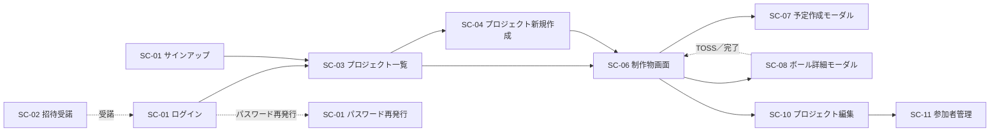

# 第4章 画面・コンポーネント設計

| 項目 | 内容 |
|---|---|
| 章番号 | 04 |
| ステータス | **v1.0 確定** |
| 確定日 | 2026-05-09 |
| 上位ドキュメント | [TRAKON PRD v1.2](../prd/trakon-prd.md) ／ [01-architecture.md](01-architecture.md) ／ [03-api.md](03-api.md) |
| 主参照 PRD 節 | §7（SC-01〜SC-16）／§4.4（UXR）／§13.1（画面遷移図）／§2.6（3層構造）／NFR-UX-01〜03、NFR-A11Y-01、NFR-MOBILE-01 |

---

## 4.1. 本章の範囲

Phase 0 必須の画面・FE コンポーネント設計を行う。スコープ：

- ルーティングとレイアウト
- 画面別仕様（SC-01, 02, 03, 04, 06, 07, 08, 10, 11）
- 共通コンポーネント（モーダル・フォーム・空状態など）
- **縦型カレンダーの描画モデル**（SC-06 の中核）
- **Ball Holder ヘッダー更新の責務配置**
- 状態管理（Zustand ストア境界、TanStack Query キー設計）
- デザインシステム（最低限のトークン）

本章で**扱わない**もの：
- ピクセルカンプ・コンポーネントカタログ（実装フェーズで Storybook 等を整備）
- アニメーションの細部（PRD NFR-UX「装飾で強さを演出しない」に従い、原則として最小）
- Phase 1 の SC-05 / 09 / 12 / 13 / 14 / 16（一部 §4.3.5 で URL のみ予約）

---

## 4.2. 設計方針

### 4.2.1. SPA ルーティング戦略

| 観点 | 方針 |
|---|---|
| **ライブラリ** | React Router v6（章1 §1.2） |
| **モード** | **Data Router**（`createBrowserRouter`）+ `loader` / `action` は使わず、TanStack Query に集約 |
| **コード分割** | ルートごとに `lazy()` で遅延ロード（NFR-PERF-01「2秒以内」素地） |
| **URL 設計** | **API のリソース階層に揃える**（章3 §3.2.1 と同方針）。例：`/projects/:projectId/items/:itemId` |
| **404** | 未マッチ・存在しないリソースは共通 404 ページ（NotFoundPage）に集約 |
| **認証ガード** | ルートレベルで `<RequireAuth>` でラップ。未認証は `/login?next=<元URL>` へリダイレクト |

### 4.2.2. レイアウト構造

```
┌────────────────────────────────────────────┐
│ ① グローバルヘッダー（全ページ共通）         │
│   - ロゴ／プロジェクト名（コンテキスト時）   │
│   - ユーザーメニュー（ログアウト等）         │
├────────────────────────────────────────────┤
│ ② コンテンツヘッダー（ページ固有）          │
│   - パンくず／タイトル                       │
│   - Ball Holder バッジ（SC-06 等）          │
│   - アクション（編集／新規作成 等）         │
├────────────────────────────────────────────┤
│ ③ メインコンテンツ                          │
│   - 縦型カレンダー／リスト／フォーム         │
└────────────────────────────────────────────┘
④ モーダル／トースト（オーバーレイ）
```

| 層 | 役割 | 実装 |
|---|---|---|
| ① グローバルヘッダー | 認証状態・ユーザー情報・グローバルナビ | `RootLayout` 配下 |
| ② コンテンツヘッダー | コンテキスト固有（プロジェクト名・Ball Holder 等） | 各ページコンポーネント先頭 |
| ③ メインコンテンツ | 画面の中身 | 各ページ |
| ④ オーバーレイ | モーダル・トースト | Portal で `<body>` 直下 |

### 4.2.3. 状態管理レイヤの責務分離

| 状態の種類 | 担い手 | 例 |
|---|---|---|
| **サーバ状態** | TanStack Query | プロジェクト一覧、参加者一覧、プラン一覧、ボール詳細 |
| **クライアント UI 状態（永続性なし）** | Zustand | モーダル開閉、選択中ボール ID、サイドバー開閉 |
| **URL 状態** | React Router | 現在のプロジェクト ID、フィルタ、ページング |
| **フォーム入力中の状態** | React Hook Form | 個別フォームの入力値・タッチ・エラー |
| **ユーザー設定（永続性あり）** | localStorage 経由 Zustand | 表示設定（Phase 1〜） |

> **大原則**：サーバから取れるものを Zustand に置かない。Zustand は「画面表示するためにブラウザ内で完結する状態」のみ。

### 4.2.4. モーダル制御（URL 同期方式）

| 観点 | 方針 |
|---|---|
| **管理方法** | **URL クエリパラメータで状態管理**。React Router の `useSearchParams` で読み書き |
| **URL 規約** | `?modal=<name>&<key>=<value>` の形式。例：`?modal=create-plan&date=2026-05-15`、`?modal=ball-detail&planId=01J...` |
| **モーダル名（Phase 0）** | `create-plan` / `ball-detail` / `confirm-delete-plan` / `confirm-delete-item` / `confirm-discard-form` |
| **カスタムフック** | `useModal()` を提供：`openModal(name, params)` → `setSearchParams`、`closeModal()` → modal 系 params を削除、`currentModal` で現状取得 |
| **コンポーネント** | shadcn/ui の `<Dialog>`（Radix UI ベース）で A11Y 確保 |
| **重ね表示** | 原則1モーダルのみ。確認系（`confirm-*`）は `<AlertDialog>` で別管理し、メインモーダルの上にオーバーレイ可 |
| **ブラウザ戻る** | URL に同期しているため、戻るボタンで自動的にモーダルが閉じる |
| **ディープリンク** | `?modal=ball-detail&planId=xxx` で直接該当ボールを開ける（Phase 1 のメール通知から直リンク等の素地） |
| **閉じる** | ESC キー／オーバーレイクリック／明示的な「閉じる」ボタン → 全て `closeModal()`（URL から modal 系 params を削除）。データ未保存時は確認ダイアログ（PRD FR-SCH-09 と整合：Draft 状態を持たない） |
| **history 戦略** | モーダル open は `replace: true`（URL 履歴を増やさない）／close は同様に replace。連続的にモーダルを開閉しても戻るボタン履歴を汚染しない |

### 4.2.5. データ取得とキャッシュ無効化

| 観点 | 方針 |
|---|---|
| **取得** | TanStack Query の `useQuery` で各画面のデータ取得 |
| **クエリキー** | API パスと一致させる（§4.8.2）。例：`['projects', projectId, 'items', itemId, 'plans']` |
| **キャッシュ無効化** | mutation 後に `queryClient.invalidateQueries` で関連キーを無効化 |
| **楽観更新** | TOSS / 完了 などの状態遷移は `setQueryData` で即時 UI 反映 → API 完了後に `invalidate` で確定（§4.7） |
| **再取得タイミング** | フォーカス復帰時（`refetchOnWindowFocus: true`、デフォルト）／ボール操作後の即時無効化 |

### 4.2.6. エラー・ローディング・空状態

PRD §4.4 UXR-05「煽らず・濁さず・逃げない言葉遣い」を全画面に適用。

| 状態 | 表示方針 | 文言例 |
|---|---|---|
| **ローディング** | スケルトン（コンテンツ形状を保持）。Spinner は最小限 | — |
| **エラー** | エラーカード（エラー種別ごとに簡潔な日本語）。リトライボタン | 「読み込みに失敗しました。もう一度お試しください。」 |
| **空状態** | アイコン＋簡潔な説明＋次の一手の CTA | SC-06 空：「日付セルをクリックして予定を作成」 |
| **未認可（403）** | 専用ページ（リダイレクトしない） | 「この操作の権限がありません。」 |
| **見つからない（404）** | 専用ページ＋「プロジェクト一覧に戻る」 | 「指定されたページが見つかりませんでした。」 |
| **トースト** | 成功・警告のみ。エラーは画面内表示を優先 | 「TOSSしました」「保存しました」 |

文言は `packages/shared/i18n/messages.ja.ts` に集約（Phase 0 から国際化レイヤを噛ませる：将来の英語化負担を最小化）。

### 4.2.7. フォーム

| 観点 | 方針 |
|---|---|
| **ライブラリ** | **React Hook Form + Zod（zodResolver）** |
| **スキーマ共有** | API リクエストの Zod スキーマ（`packages/shared/schemas`）を **そのままフォーム検証に流用** |
| **エラー表示** | フィールド直下にインライン表示。フォーム全体エラーは上部にバナー |
| **送信中** | submit ボタンを disabled、ローディング表記 |
| **二重送信防止** | mutation の `isPending` で抑止 |

### 4.2.8. アクセシビリティ（NFR-A11Y-01：WCAG 2.1 AA 目標）

| 項目 | 方針 |
|---|---|
| キーボード操作 | shadcn/ui（Radix UI ベース）の標準対応に乗る。フォーカストラップ・矢印キー操作・Tab 順序を維持 |
| コントラスト | デザイントークンの段階で 4.5:1 以上を確保（§4.9） |
| ラベル | フォーム要素は必ず `<label>` 紐付け。アイコンボタンは `aria-label` |
| ライブリージョン | TOSS 実行成功などは `aria-live="polite"` で読み上げ |
| 言語属性 | `<html lang="ja">` |

### 4.2.9. レスポンシブ（NFR-MOBILE-01）

| 画面幅 | 方針 |
|---|---|
| **デスクトップ ≥1024px** | フル機能（縦型カレンダー含む） |
| **タブレット 768〜1023px** | フル機能だがカラム数を縮小、フォントサイズ調整 |
| **モバイル <768px** | **Phase 0 では一覧系（SC-03）と SC-08 ボール詳細のみ最適化**。SC-06 縦型カレンダーは横スクロール許容 |
| Phase 1 | ダッシュボード（SC-09）のモバイル最適化を優先（NFR-MOBILE-01） |

---

## 4.3. ルーティングと画面ツリー

### 4.3.1. URL 構造（Phase 0）

| URL | 画面 | 認証 | コンポーネント |
|---|---|:---:|---|
| `/login` | SC-01 ログイン | ❌ | `LoginPage` |
| `/signup` | SC-01 サインアップ | ❌ | `SignupPage` |
| `/forgot-password` | SC-01 パスワード再発行（要求） | ❌ | `ForgotPasswordPage` |
| `/invitations/:token` | SC-02 招待受諾 | ❌ | `InvitationAcceptPage` |
| `/` | ルート（→ `/projects` にリダイレクト） | ✅ | — |
| `/projects` | SC-03 プロジェクト一覧 | ✅ | `ProjectListPage` |
| `/projects/new` | SC-04 プロジェクト新規作成 | ✅ | `ProjectNewPage` |
| `/projects/:projectId` | SC-06 各制作物画面（プロジェクト直下、最初の制作物にリダイレクト） | ✅ | `ProjectShellPage` |
| `/projects/:projectId/items/:itemId` | SC-06 各制作物画面（縦型スケジュール） | ✅ | `ItemSchedulePage` |
| `/projects/:projectId/edit` | SC-10 プロジェクト編集 | ✅ | `ProjectEditPage` |
| `/projects/:projectId/members` | SC-11 参加者管理 | ✅ | `ProjectMembersPage` |
| `/account` | アカウント基本情報 | ✅ | `AccountPage`（最小） |
| `*` | 404 | — | `NotFoundPage` |

> Phase 1 で予約（URL は確保するが Phase 0 では空 or リダイレクト）：`/dashboard`（SC-09）、`/projects/:projectId/share-links`（SC-16）。

### 4.3.2. ルートツリー

```
RootLayout（グローバルヘッダー）
├── 公開ルート
│   ├── /login → LoginPage
│   ├── /signup → SignupPage
│   ├── /forgot-password → ForgotPasswordPage
│   └── /invitations/:token → InvitationAcceptPage
├── 認証必須ルート（<RequireAuth>）
│   ├── / → Navigate to /projects
│   ├── /projects → ProjectListPage
│   ├── /projects/new → ProjectNewPage
│   ├── /projects/:projectId
│   │   ├── ProjectLayout（プロジェクトヘッダー＋ナビ）
│   │   ├── index → ProjectShellPage（最初の item へ Navigate）
│   │   ├── /items/:itemId → ItemSchedulePage（SC-06）
│   │   ├── /edit → ProjectEditPage（SC-10）
│   │   └── /members → ProjectMembersPage（SC-11）
│   └── /account → AccountPage
└── * → NotFoundPage
```

### 4.3.3. 画面遷移図（Phase 0、PRD §13.1 の Phase 0 抜粋版）



---

## 4.4. 画面別仕様

> 各画面は次の節構成：**目的／URL／表示項目／状態（ローディング・エラー・空・成功）／API 呼び出し／インタラクション／エッジケース**。

### 4.4.1. SC-01 ログイン（`/login`）

**目的**：既存ユーザーのログイン（FR-AUTH-01）。

**表示項目**（PRD §7 SC-01）：
- メールアドレス（Email、必須）
- パスワード（Password、必須）
- 「ログイン」ボタン
- 「アカウントを作成」リンク → `/signup`
- 「パスワードを忘れた」リンク → `/forgot-password`

**処理**：
1. submit → Supabase Auth `signInWithPassword`
2. 成功時：
   - `POST /api/v1/auth/me/sync`（章3 §3.6.2）
   - `next` クエリパラメータがあればそこへ、なければ `/projects` にリダイレクト
3. 失敗時：エラーカード表示（メール／パスワード違いは同一文言「メールアドレスまたはパスワードが正しくありません」でユーザー存在を漏らさない）

**エッジケース**：
- メール未認証：「メール認証が完了していません。」+ 再送ボタン
- ロックアウト（PRD SR-AUTH-04）：詳細は章5

**サインアップ画面（`/signup`）**：
- 表示項目：メール／パスワード／パスワード再入力／表示名／利用規約同意
- 処理：Supabase Auth `signUp` → 仮登録完了画面（メール認証案内）

---

### 4.4.2. SC-02 招待受諾（`/invitations/:token`）

**目的**：招待リンク経由でプロジェクトに参加（FR-AUTH-02、UC-03）。

**表示項目**：
- 招待内容：プロジェクト名、招待者（メンバー名・所属名）、自分のロール（Phase 1〜）
- 状態に応じた CTA：
  - **未認証**：「サインインして受諾」「アカウント作成して受諾」
  - **認証済み**：「受諾」ボタン
  - **期限切れ／受諾済／失効済**：エラー表示（404 と区別なし、§4.2.6）

**API**：
- 初期表示：`GET /api/v1/invitations/:token`
- 受諾：`POST /api/v1/invitations/:token/accept`（要 JWT）

**処理フロー**：
1. ページロード → トークン検証
2. 認証済み → 「受諾」ボタンで `POST /api/v1/invitations/:token/accept` → 成功時 `/projects/:projectId/items/:firstItemId` へ
3. 未認証 → サインアップ／サインインに `?next=/invitations/:token` を付けて遷移、ログイン後に戻ってきて受諾

---

### 4.4.3. SC-03 プロジェクト一覧（`/projects`）

**目的**：自分が参加するプロジェクトの俯瞰（FR-PRJ-02）。

**表示項目**：
- ヘッダー：「プロジェクト」、右上に「+ 新規作成」ボタン（全ユーザー、Phase 0）
- カードまたはテーブル形式で：
  - プロジェクト名／期間（YYYY/MM/DD〜YYYY/MM/DD）／自分のロール／最終更新
  - クリックで `/projects/:projectId` へ
- 並び順：`updated_at:desc`（既定）
- フィルタ（Phase 0 はなし、Phase 1 でアーカイブタブ追加）

**API**：`GET /api/v1/projects?limit=50&sort=updated_at:desc`

**空状態**：
- 「まだプロジェクトがありません」+「最初のプロジェクトを作成」ボタン

**ページング**：50件超で「もっと見る」ボタン（Phase 0）。

---

### 4.4.4. SC-04 プロジェクト新規作成（`/projects/new`）

**目的**：プロジェクト・制作物・参加者の一括登録（UC-02、FR-PRJ-01）。

**表示項目（PRD §7 SC-04）**：

| セクション | 項目 |
|---|---|
| プロジェクト基本情報 | 名称（1〜255）／開始日／終了日（startDate 以降） |
| 制作物 | 繰返（最低1件、最大不問）。各：名称、並び順 |
| 参加者 | 繰返（最大10名、初期3行）。各：名前／所属名／メール／種別（client / production） |

**フォーム実装**：
- React Hook Form + Zod（`useFieldArray` で繰返セクション管理）
- 「+ 制作物を追加」「+ 参加者を追加」ボタン
- 行削除ボタン（最後の1行は削除不可）
- 「未入力行は無効扱い」（PRD UC-02）：参加者の name/email 両方空の行は送信時に除外

**バリデーション**：
- name: 1〜255 文字
- endDate >= startDate
- items 1件以上必須
- members の email 重複チェック（フォーム内）
- 参加者の所属名未入力（無効扱い）→ name もしくは email が入っている行は organizationName 必須

**API**：`POST /api/v1/projects`

**送信中・成功・失敗**：
- 送信中：「保存中…」（disabled）
- 成功：作成された projectId / firstItemId を取得 → `/projects/:projectId/items/:firstItemId` へ遷移、トースト「プロジェクトを作成しました。招待メールを送信しました。」
- 失敗：エラーカード（メール送信失敗時はメッセージで言及）

**画面遷移**：
- キャンセル → 確認ダイアログ → `/projects`

---

### 4.4.5. SC-06 各制作物画面（縦型スケジュール）（`/projects/:projectId/items/:itemId`）

**目的**：単一制作物での予定・ボール操作（UC-05, UC-08, UC-12, UC-15）。**Phase 0 の中核画面**。

#### 4.4.5.1 画面構造

```
┌──────────────────────────────────────────────────┐
│ プロジェクトヘッダー（パンくず＋プロジェクト名＋期間） │
│ Ball Holder バッジ：「<所属名> <表示名>」← 常時表示     │
├────────────┬─────────────────────────────────────┤
│ 制作物リスト │ 制作物ヘッダー（名前＋編集／削除）       │
│ サイドバー  │ Ball Holder バッジ（制作物単位）         │
│ ・Item A    ├─────────────────────────────────────┤
│ ・Item B ◀│ 縦型スケジュール（§4.6）                │
│ ・Item C    │ ┌──┬──┬──┬──┐                        │
│             │ │日付│PA│PB│PC│ ← 横軸：参加者列        │
│             │ ├──┼──┼──┼──┤                        │
│             │ │5/1│  │● │  │ ← ボールチップ          │
│             │ │5/2│  │  │  │                        │
│             │ │…  │  │  │  │                        │
│             │ └──┴──┴──┴──┘                        │
└────────────┴─────────────────────────────────────┘
```

#### 4.4.5.2 主要コンポーネント

| コンポーネント | 責務 | 主な props |
|---|---|---|
| `ProjectLayout` | プロジェクト全体のヘッダー＋サイドバーレイアウト | projectId |
| `ItemListSidebar` | 同一プロジェクト内の制作物一覧、現在表示中をハイライト | projectId, currentItemId |
| `ItemHeader` | 制作物名・期間・編集アクション・**Ball Holder バッジ** | item, ballHolder |
| `ScheduleGrid` | 縦型カレンダー本体（§4.6） | items[], members[], plans[], dateRange |
| `BallChip` | ボールチップ（FROM列〜TO列を跨ぐ視覚表現） | plan, ballHolder, onClick |
| `BallHolderBadge` | 「<所属名> <表示名>」バッジ。Ball Holder 表示の統一コンポーネント | member |
| `MemberColumnHeader` | 横軸ヘッダー（所属名グルーピング表示） | member |

#### 4.4.5.3 表示項目

- **プロジェクトヘッダー**：プロジェクト名、期間、編集ボタン（ディレクターのみ）
- **Ball Holder バッジ**（制作物単位、PRD FR-BALL-03）：
  - 形式：「<所属名> <表示名>」
  - **代表ボールの選定はアプリ側ロジック**（Phase 1 で正規化、Phase 0 は当該制作物の最新 active プラン）
- **縦軸**：プロジェクト期間内の日付（FR-SCH-01）
  - 月切替に区切り線（FR-SCH-11）
  - 本日を強調表示（FR-SCH-05）
  - 土日・祝日に背景色（FR-SCH-03、FR-SCH-04）
- **横軸**：参加者列（FR-SCH-02）
  - クライアント／制作チームでグルーピング
  - 各列に所属名＋表示名
- **ボールチップ**：
  - **FROM列とTO列を跨ぐ表現**で TOSS 方向を可視化（PRD SC-06「構造で意味を伝える」）
  - 現在の Ball Holder 側にバッジ装飾
  - クリックで SC-08（ボール詳細モーダル）

#### 4.4.5.4 データ取得

```typescript
useQuery(['projects', projectId], fetchProject)
useQuery(['projects', projectId, 'items'], fetchItems)
useQuery(['projects', projectId, 'items', itemId], fetchItem)
useQuery(['projects', projectId, 'members'], fetchMembers)
useQuery(['projects', projectId, 'items', itemId, 'plans'], fetchPlans)
```

> 4 クエリ並列取得。詳細は §4.8.2 のクエリキー設計で。

#### 4.4.5.5 インタラクション

| 操作 | 結果 |
|---|---|
| 日付セルクリック | SC-07 予定作成モーダルを開く（`useModalStore`） |
| ボールチップクリック | SC-08 ボール詳細モーダルを開く |
| 制作物リストクリック | `navigate('/projects/:projectId/items/:itemId')` |
| プロジェクト編集ボタン | `navigate('/projects/:projectId/edit')` |

#### 4.4.5.6 空状態

予定0件時：縦型カレンダー上に「日付セルをクリックして予定を作成」のオーバーレイガイド（PRD SC-06）。

---

### 4.4.6. SC-07 予定作成モーダル

**目的**：TOSS予定の作成（Phase 0、UC-05、FR-SCH-06〜09）。

**起動**：SC-06 の日付セルクリックで開く。`openModal('create-plan', { date: 'YYYY-MM-DD' })` → URL が `?modal=create-plan&date=2026-05-15` に更新される。

**表示項目（Phase 0、TOSS のみ）**：

| 項目 | 型 | 必須 | 補足 |
|---|---|:---:|---|
| 予定種別 | Radio | × | Phase 0 は「TOSS予定」固定表示・選択不要（Phase 1 で3種選択） |
| 予定名 | Text | ✅ | 1〜255 文字 |
| FROM | Select | ✅ | プロジェクト参加メンバーから |
| TO | Select | ✅ | FROM と異なる必須 |
| 予定日 | Date | ✅ | 起動時の日付がプリセット |
| 期日 | Date | × | 任意 |
| メモ | Textarea | × | 任意 |

**フォーム実装**：
- React Hook Form + Zod（`packages/shared/schemas/plans.ts` を流用）
- FROM = TO の場合、TO 側にエラー表示

**API**：`POST /api/v1/projects/:projectId/items/:itemId/plans`

**送信成功**：
- モーダルを閉じる
- TanStack Query `['projects', projectId, 'items', itemId, 'plans']` を invalidate
- トースト「予定を作成しました」

**送信失敗**：モーダル内にエラーバナー。

**閉じる**：
- 入力途中（dirty）の場合、確認ダイアログ「変更を破棄しますか？」
- そうでなければ即座に閉じる

---

### 4.4.7. SC-08 ボール詳細モーダル

**目的**：ボールの内容確認・TOSS 実行・完了（Phase 0、UC-08, UC-12）。

**起動**：SC-06 のボールチップクリック。`openModal('ball-detail', { planId })` → URL が `?modal=ball-detail&planId=01J...` に更新される。**この URL を共有すれば直接該当ボールが開く**（Phase 1 でメール通知からの直リンクに活用）。

**表示項目**：

| セクション | 内容 |
|---|---|
| ヘッダー | 予定名／予定日／期日 |
| Ball Holder | `BallHolderBadge`：現在のホルダー |
| 関係者 | FROM、TO（所属名＋表示名） |
| メモ | 予定のメモ |
| 履歴 | `ball_events` の時系列表示（TOSS 済か、完了済か） |

**状態別ボタン出し分け**（PRD SC-08 表）：

| 状態 | 表示ボタン |
|---|---|
| Ready（TOSS 未実行） | 閉じる / 編集 / **TOSS する** |
| Tossed（TOSS 済） | 閉じる / 履歴を見る / **完了する**（Ball Holder = 自分の場合）|
| Completed | 閉じる / 履歴を見る |

> Phase 0 は「TOSS する」「完了する」のみ。「TOSS を取り消す」「差し戻し」は Phase 1。

**TOSS 実行フロー**（PRD SC-08「TOSS実行：確認ダイアログ挟まず、モーダル内で TOSSする→TOSS中…→相手にTOSSしました→自動クローズ」）：

1. 「TOSS する」ボタン押下
2. ボタン → ローディング表示「TOSS 中…」
3. `POST /api/v1/projects/:projectId/items/:itemId/plans/:planId/toss`
4. **楽観更新**：ローカル `setQueryData` で plan の ballHolder を to_member に切替（§4.7）
5. 成功時：「相手に TOSS しました」表示 → 1〜2 秒後に自動クローズ
6. ヘッダー Ball Holder バッジが即時切り替わる（楽観更新の効果）
7. 失敗時：楽観更新ロールバック、エラーバナー

**完了フロー**：
1. 「完了する」ボタン押下 → 確認ダイアログ「この予定を完了しますか？」
2. `POST /api/v1/projects/:projectId/items/:itemId/plans/:planId/complete`
3. 成功時：「完了しました」トースト、モーダル自動クローズ

**API**：
- 詳細：`GET /api/v1/projects/:projectId/items/:itemId/plans/:planId`
- TOSS：`POST .../toss`
- 完了：`POST .../complete`
- 編集：`PATCH .../`（編集モード時、別フォーム）
- 削除：`DELETE .../`（編集モードの「削除」ボタン、Phase 0 物理削除＋確認モーダル必須・FE 側）

**A11Y**：
- TOSS 成功時に `aria-live="polite"` でメッセージ読み上げ
- ボタン状態変化時に focus を維持

---

### 4.4.8. SC-10 プロジェクト編集（`/projects/:projectId/edit`）

**目的**：プロジェクト基本情報の編集（PRD FR-PRJ-03）。

**表示項目**：
- 名称／開始日／終了日（PATCH）
- 制作物の追加・編集・削除（リンク or インライン管理）
- 参加者管理は別タブ／別画面（→ `/projects/:projectId/members`）への動線

**API**：
- 取得：`GET /api/v1/projects/:projectId`
- 更新：`PATCH /api/v1/projects/:projectId`（warnings 対応）
- 制作物追加：`POST /api/v1/projects/:projectId/items`
- 制作物編集：`PATCH /api/v1/projects/:projectId/items/:itemId`
- 制作物削除：`DELETE /api/v1/projects/:projectId/items/:itemId`（409 時は `?force=true` で再送）

**警告表示**：
- 期間変更で warnings に `PLANS_OUT_OF_RANGE` が含まれる場合、保存後にダイアログ表示「○件の予定が期間外になりました。確認してください。」+ 該当 plan へのリンク

---

### 4.4.9. SC-11 参加者管理（`/projects/:projectId/members`）

**目的**：参加者の追加／編集／削除（FR-AUTH-07〜09）。

**表示項目（PRD SC-11）**：
- テーブル：名前／所属名／メール／種別／sortOrder／受諾状態（accepted/pending/expired）／操作
- ソートハンドルで `sortOrder` 変更（ドラッグ＆ドロップ、Phase 0）
- 「+ 参加者を追加」ボタン → モーダル

**API**：
- 一覧：`GET /api/v1/projects/:projectId/members`
- 追加：`POST /api/v1/projects/:projectId/members`
- 編集：`PATCH /api/v1/projects/:projectId/members/:memberId`
- 削除：`DELETE /api/v1/projects/:projectId/members/:memberId`（409 = アクティブボールあり時はエラー表示）

---

## 4.5. 共通コンポーネント

| コンポーネント | 用途 | ベース |
|---|---|---|
| `BallHolderBadge` | Ball Holder 表示の統一 | shadcn/ui Badge |
| `MemberAvatar` | 参加者アバター（ニックネーム頭文字） | shadcn/ui Avatar |
| `DateCell` | 縦型カレンダーの日付セル | div + Tailwind |
| `ConfirmDialog` | 削除・破棄など重要操作の確認 | shadcn/ui AlertDialog |
| `EmptyState` | 空状態の統一表示 | div + アイコン |
| `ErrorBoundary` | エラー画面化（リトライボタン付き） | React |
| `LoadingSkeleton` | スケルトンローディング | shadcn/ui Skeleton |
| `Toast` | 成功・警告通知 | shadcn/ui Sonner |
| `FormField` | React Hook Form + ラベル + エラー一体化 | shadcn/ui Form |
| `RequireAuth` | 認証ガード | カスタム |

---

## 4.6. 縦型カレンダーの描画モデル（SC-06 の中核）

PRD §7 SC-06 と「カレンダー表示仕様 v1.0」「MVP仕様書 画面B」が示す縦型スケジュールを、SPA で素直に描画するための実装方針。

### 4.6.1. レイアウト方式

| 方式 | 採用 | 理由 |
|---|---|---|
| **CSS Grid（display: grid）** | ✅ 採用 | 縦軸（日付）×横軸（参加者）の二次元表現が素直、各セルに position 計算不要、ブラウザ最適化が効く |
| Table タグ | ❌ | 列固定スクロール・スティッキー要素の制御がしづらい |
| 絶対配置（calc + position: absolute） | ❌ | ボールチップの跨ぎ表現には便利だが、ハンドリングが複雑、A11Y も劣る |

### 4.6.2. 描画モデル

```
ScheduleGrid (display: grid; grid-template-columns: 60px repeat(N, 1fr))
├── ヘッダー行（sticky top）：日付カラム見出し + 参加者列見出し
├── 日付行 × プロジェクト期間日数
│   ├── 日付セル（左カラム、sticky left）
│   └── 参加者セル × N（クリック可能、空の場合 cursor: pointer）
└── ボールチップオーバーレイ層（grid-row-start/grid-column-start で配置）
```

- **行**：プロジェクト期間内の各日（DATE 型を順次生成）
- **列**：参加者（`project_members` を `sort_order` 順、所属名でグルーピング）
- **ボールチップ**：
  - `grid-row` = 予定日に対応する行
  - `grid-column-start/end` = FROM 列〜TO 列を span することで「FROM→TO」の方向視覚化（PRD SC-06「構造で意味を伝える」）
  - 重なり時はチップ高さを縮めるか z-index で前面化

### 4.6.3. パフォーマンス対策

| 観点 | 方針 |
|---|---|
| 想定上限 | NFR-PERF-02：100 予定／プロジェクトで遅延なし |
| 仮想スクロール | **Phase 0 では不要**（1プロジェクト最大数百日×参加者10列 + 数十ボール = 数千ノード、ブラウザで十分処理可能） |
| 必要時の対応 | Phase 1 で要件超過したら `react-virtuoso` 等で行仮想化を検討 |
| メモ化 | `<DateCell>` を `React.memo`、ボールチップも plan ID キーでメモ化 |
| 再レンダリング抑制 | TanStack Query のセレクタで「自分が表示する範囲のデータのみ」を購読 |

### 4.6.4. 日付計算

| 観点 | 方針 |
|---|---|
| ライブラリ | **date-fns**（軽量、tree-shaking 効く、日本語ロケール充実） |
| タイムゾーン | サーバ・クライアント両方で `Asia/Tokyo` 暦日（章2 §2.2.5） |
| 「本日」判定 | `isToday()`（クライアント時計、誤差は許容） |
| 土日判定 | `isWeekend()` |
| 祝日判定 | Google カレンダー JSON を 1日1回フェッチして localStorage キャッシュ（FR-SCH-04）。BE 経由 GET `/api/v1/holidays`（Phase 1）か、FE で直接フェッチ（Phase 0） |
| 月切替判定 | 前日と月が異なる行に区切り線（FR-SCH-11） |

> **議論ポイント §4.10-7**：祝日データを Phase 0 で BE 経由にするか FE 直接にするか。

---

## 4.7. Ball Holder 表示の更新責務（楽観更新）

### 4.7.1. なぜ楽観更新するか

PRD SC-08「TOSS実行：確認ダイアログ挟まず、モーダル内で TOSSする→TOSS中…→相手にTOSSしました→自動クローズ」。
体感速度を確保しつつ、ヘッダー Ball Holder バッジ・スケジュール上のチップ装飾を **API 完了を待たず即時に切り替える** 必要がある。

### 4.7.2. 実装方針（TanStack Query + `packages/shared` 共有関数）

```typescript
// apps/web/src/features/balls/use-toss-mutation.ts
const tossMutation = useMutation({
  mutationFn: () => api.toss({ projectId, itemId, planId }),
  onMutate: async () => {
    await queryClient.cancelQueries({ queryKey: planKey });
    const previous = queryClient.getQueryData(planKey);
    queryClient.setQueryData(planKey, (old) => {
      // 章3 §3.8 の deriveBallHolder を共通関数として呼び出す
      const optimisticEvent = { eventType: 'tossed', actorMemberId: currentMember.id };
      const newHolder = deriveBallHolder(old.plan, optimisticEvent);
      return { ...old, plan: { ...old.plan, ballHolder: newHolder, ballState: 'tossed' } };
    });
    // ヘッダー用クエリも同様に更新
    queryClient.setQueryData(plansKey, (old) => /* ... */);
    return { previous };
  },
  onError: (err, _, context) => {
    queryClient.setQueryData(planKey, context.previous);  // ロールバック
  },
  onSettled: () => {
    queryClient.invalidateQueries({ queryKey: planKey });
    queryClient.invalidateQueries({ queryKey: plansKey });
  },
});
```

**`deriveBallHolder` 関数の置き場所**：
- BE：`apps/web/server/services/plans.ts` から呼ぶ
- FE：`apps/web/src/features/balls/use-toss-mutation.ts` から呼ぶ
- 共通：`packages/shared/domain/ball-holder.ts`（章3 §3.8.1 で定義）

これにより、**FE と BE で同じロジックが Ball Holder を導出**するため、楽観更新の表示と API 確定後の表示が一致する。

### 4.7.3. 競合した場合（API が 409 等を返した場合）

- 楽観更新をロールバック（`onError`）
- トースト「他の操作と競合しました。最新の状態を取得します」
- `invalidateQueries` で再取得

---

## 4.8. 状態管理の詳細

### 4.8.1. Zustand ストアと URL 同期フック

| ストア／フック | 責務 | 実装 | サンプル |
|---|---|---|---|
| `useAuthStore` | 現在のユーザー情報（Supabase Auth + アプリ users 同期後） | Zustand | `currentUser`, `signOut()` |
| `useModal()` | **モーダル開閉（URL 同期）** | カスタムフック（`useSearchParams`） | `openModal(name, params)`, `closeModal()`, `currentModal` |
| `useToastStore` | トースト | Zustand（または shadcn/ui Sonner と直接連携） | `success(msg)`, `error(msg)` |

> **モーダルは URL に同期するため Zustand には置かない**（§4.2.4）。Zustand は「ブラウザ内で完結する非永続 UI 状態」のみに使う。Zustand は「ストア＝1ファイル＝1関数」を原則とし、巨大化を避ける。

#### `useModal()` の実装イメージ

```typescript
// apps/web/src/hooks/use-modal.ts
const MODAL_PARAM_KEYS = ['modal', 'date', 'planId', 'memberId', 'itemId'] as const;

export function useModal() {
  const [searchParams, setSearchParams] = useSearchParams();
  const currentModal = searchParams.get('modal');

  const openModal = (name: string, params: Record<string, string> = {}) => {
    const next = new URLSearchParams(searchParams);
    next.set('modal', name);
    Object.entries(params).forEach(([k, v]) => next.set(k, v));
    setSearchParams(next, { replace: true });
  };

  const closeModal = () => {
    const next = new URLSearchParams(searchParams);
    MODAL_PARAM_KEYS.forEach((k) => next.delete(k));
    setSearchParams(next, { replace: true });
  };

  return { currentModal, openModal, closeModal, params: searchParams };
}
```

### 4.8.2. TanStack Query キー設計

| クエリキー | データ | 無効化トリガ |
|---|---|---|
| `['auth', 'me']` | 現在のユーザー（GET /auth/me） | ログアウト・プロジェクト作成 |
| `['projects']` | プロジェクト一覧 | POST /projects |
| `['projects', projectId]` | プロジェクト詳細 | PATCH /projects/:projectId |
| `['projects', projectId, 'members']` | 参加者一覧 | POST/PATCH/DELETE /members |
| `['projects', projectId, 'items']` | 制作物一覧 | POST/PATCH/DELETE /items |
| `['projects', projectId, 'items', itemId]` | 制作物詳細 | 同上 |
| `['projects', projectId, 'items', itemId, 'plans']` | 予定一覧 | POST/PATCH/DELETE /plans, TOSS, 完了 |
| `['projects', projectId, 'items', itemId, 'plans', planId]` | 予定詳細 | 上記 + イベント追加 |

> クエリキーは API パスと厳密に揃える。`queryClient.invalidateQueries({ queryKey: ['projects', projectId] })` で配下の `members` / `items` / `plans` も全部無効化される（部分一致）。

### 4.8.3. クエリのデフォルト設定

```typescript
// apps/web/src/lib/query-client.ts
new QueryClient({
  defaultOptions: {
    queries: {
      staleTime: 30_000,         // 30秒は再取得しない
      gcTime: 5 * 60_000,        // 5分でキャッシュ削除
      retry: 1,                  // 失敗時1回リトライ
      refetchOnWindowFocus: true,
    },
    mutations: {
      retry: 0,
    },
  },
});
```

---

## 4.9. デザインシステム（最低限）

PRD §4.4 UXR-04「派手さ・色数・動きで強さを演出しない」、NFR-UX-01「静かな強さ」を尊重し、最小トークンで構成する。

### 4.9.1. カラー（Tailwind config）

```
tokens:
  colors:
    surface:        #FFFFFF / dark: #0A0A0A
    surface-muted:  #F8F8F8 / dark: #161616
    border:         #E5E5E5 / dark: #2A2A2A
    text:           #1A1A1A / dark: #F0F0F0
    text-muted:     #6B6B6B / dark: #9A9A9A
    accent:         #1F6FEB （TRAKON ブランドカラー：仮）
    success:        #2D8659（要確認3日以内バッジで使用）
    warning:        #B7791F（CAUTION 表示で使用）
    danger:         #C62828（遅延・エラーで使用）
    holiday-bg:     #FFF7F7（祝日背景、極淡）
    weekend-bg:     #F8FAFB（土日背景、極淡）
```

> ブランドカラー（accent）は仮置き。確定はブランド／デザイン側との合意後（章末議論ポイント §4.10-9）。

### 4.9.2. タイポグラフィ

| 用途 | サイズ | weight |
|---|---|---|
| 画面タイトル | 24px | 600 |
| セクション見出し | 18px | 600 |
| 本文 | 14px | 400 |
| 補助テキスト | 12px | 400 |
| データ密度高（カレンダー） | 12〜13px | 400 |

フォント：システムフォント（`Inter`、`-apple-system`、Hiragino Sans、Yu Gothic UI）。Web フォントは Phase 1 以降に検討（バンドル軽量化優先）。

### 4.9.3. スペーシング

Tailwind 標準（4px グリッド）。レイアウト padding は 16〜24px、コンポーネント内は 8〜16px。

### 4.9.4. ダークモード

Phase 0 では実装しない（CSS 変数化の素地は §4.9.1 で確保）。Phase 1 以降でユーザー設定に追加検討。

---

## 4.10. 議論ポイントの確定結果

| # | 論点 | 確定内容 | 判断理由 |
|---|---|---|---|
| 1 | React Router のモード | **Data Router（`createBrowserRouter`）+ loader/action は不採用、データ取得は TanStack Query に集約** | キャッシュ・楽観更新の責務を1箇所に統一 |
| 2 | モーダル管理 | **URL 同期方式**（`?modal=ball-detail&planId=xxx`、カスタムフック `useModal()`） | ブラウザ戻るで閉じる、ディープリンク対応、Phase 1 のメール通知直リンクの素地 |
| 3 | 縦型カレンダー描画方式 | **CSS Grid** | 二次元表現が素直、ボールチップの FROM→TO 跨ぎ表現を span で実現、A11Y 良好 |
| 4 | フォームライブラリ | **React Hook Form + zodResolver** | Zod スキーマを API と共有、useFieldArray で繰返セクションが楽 |
| 5 | 日付ライブラリ | **date-fns** | 軽量・tree-shaking 効く・日本語ロケール充実 |
| 6 | アイコンライブラリ | **Lucide React** | shadcn/ui ドキュメントとサンプルが Lucide 前提、tree-shakable |
| 7 | 祝日データ取得（FR-SCH-04） | **Phase 0 は FE 直接フェッチ + localStorage キャッシュ** | サーバ口不要・実装シンプル。Phase 1 で BE 経由に移行 |
| 8 | 楽観更新 | **Phase 0 から実装**（TOSS / 完了、`packages/shared/domain/ball-holder.ts` を共有） | PRD SC-08「TOSS中…→相手にTOSSしました→自動クローズ」体験の確保 |
| 9 | ブランドカラー（accent） | **仮確定 #1F6FEB（青系）** | 実装を止めない。デザイン確定後にトークン1点更新で全体反映 |
| 10 | 国際化（i18n） | **`packages/shared/i18n/messages.ja.ts` に集約、ライブラリは未導入** | Phase 0 は日本語固定、文字列定数化のみで将来 EN 化への下地 |

---

## 4.11. PRD 整合チェック

| 該当 PRD 項 | 本章での扱い |
|---|---|
| §7 SC-01〜04, 06〜08, 10, 11 | §4.4 で全画面定義 |
| §4.4 UXR-01〜05 | 各画面の表示方針・文言指針に反映（§4.2.6, §4.4） |
| §4.2 NFR-UX-01〜03 | §4.9 デザイントークン最小化、§4.6 構造で意味を伝える |
| §4.2 NFR-A11Y-01 | §4.2.8 に方針、shadcn/ui ベース |
| §4.2 NFR-MOBILE-01 | §4.2.9 に方針（Phase 0 は SC-03 / SC-08 を最適化） |
| §4.2 NFR-PERF-01, 02 | §4.6.3 縦型カレンダー、§4.3.1 コード分割 |
| FR-SCH-01〜11 | §4.4.5 SC-06、§4.6 縦型カレンダー描画モデル |
| FR-BALL-03 | §4.4.5 Ball Holder バッジ、§4.7 楽観更新 |
| FR-BALL-12 | §4.4.7 SC-08 削除は物理削除＋FE 確認モーダル |
| §13.1 画面遷移図 | §4.3.3 に Phase 0 抜粋版で記載 |

### Phase 1+ 持ち越し

- SC-05 プロジェクトTOP（代表ボール表示）
- SC-09 ダッシュボード（3カラム）
- SC-12 アーカイブ一覧
- SC-13 コメント／ファイル共有パネル
- SC-14 通知設定
- SC-16 非会員URL 発行・管理
- SC-07 の予定種別3種対応（共同予定／単独予定）
- SC-08 の TOSS 取消／差し戻し／再 TOSS
- ダッシュボードのモバイル最適化（NFR-MOBILE-01 本格対応）

### PRD 整合メモ（PRD 改訂提案）

- 特になし（章2 で起票した `invitations` テーブル提案は引き続き有効）

---

## 4.12. 章ステータス

| 日付 | 状態 | 備考 |
|---|---|---|
| 2026-05-09 | Draft（たたき台） | §4.10 議論ポイント10項目を未確定で起稿 |
| 2026-05-09 | **v1.0 確定** | §4.10 全10論点を AskUserQuestion で確定。モーダル管理は推奨案「Zustand ベース」から **「URL 同期方式」に変更**、他9項目は推奨案どおり。§4.2.4 / §4.4.6 SC-07 / §4.4.7 SC-08 / §4.8.1 を URL 同期方式に書き換え。 |
