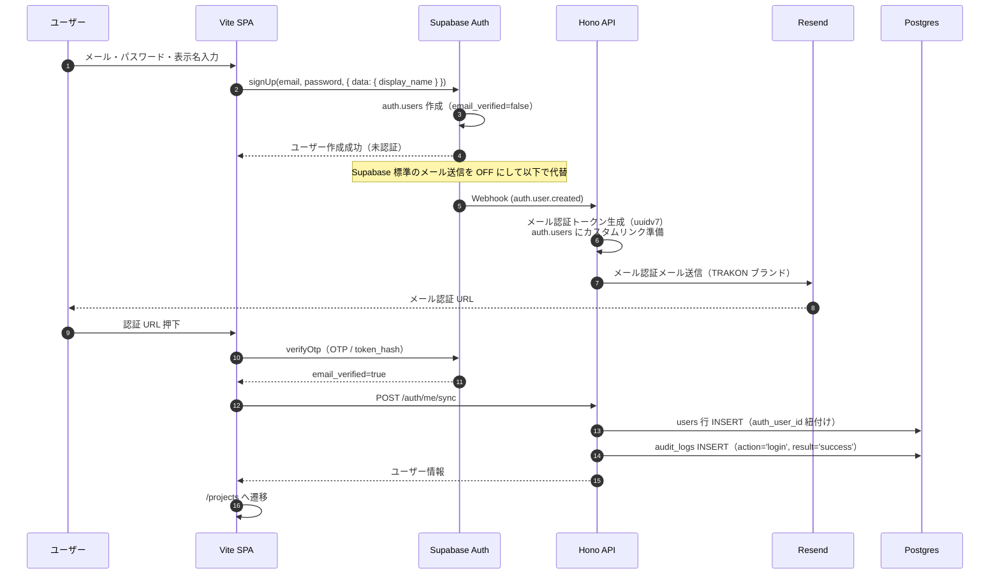
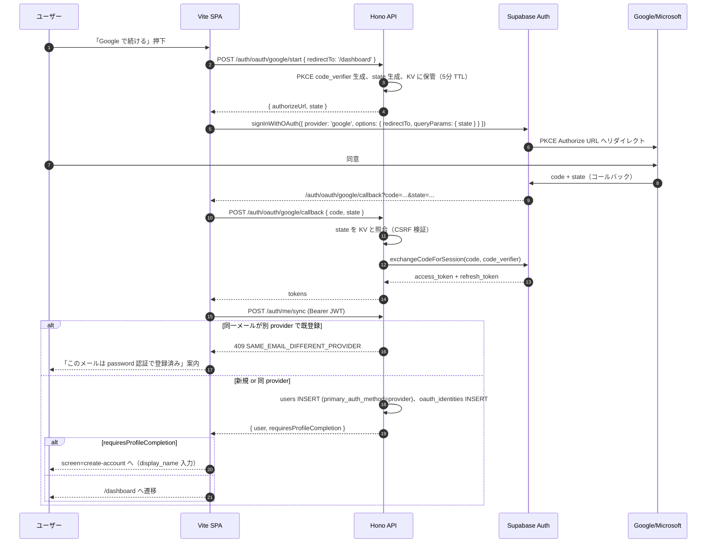

# 第5章 セキュリティ実装設計

| 項目 | 内容 |
|---|---|
| 章番号 | 05 |
| ステータス | **v1.2 確定**（v1.0: 2026-05-09 / v1.1: 2026-05-24 プロトタイプ反映） |
| 確定日 | 2026-05-24 |
| 上位ドキュメント | [TRAKON PRD v1.4](../prd/trakon-prd.md) ／ [01-architecture.md](01-architecture.md) ／ [02-database.md](02-database.md) ／ [03-api.md](03-api.md) ／ [04-frontend.md](04-frontend.md) |
| 主参照 PRD 節 | §9 全節（§9.1〜§9.11）／§4.3 SR要約（v1.3 で SR-AUTH-10 追加）／§4.1.1 FR-AUTH-10〜12／§10.2 Phase 0 セキュリティ成功基準 |

---

## 5.1. 本章の範囲

PRD §9 を Phase 0 実装レベルまで具体化する。スコープ：

- 認証実装（Supabase Auth との境界・招待トークン・FE 側トークン保持戦略・BE 側 JWT 検証）
- 認可実装（Hono ミドルウェア階層、IDOR 防止、状態遷移ガード）
- データ保護（TLS・保管時暗号化・シークレット管理）
- 監査ログ実装（Phase 0 範囲、append-only 強制の運用）
- Web セキュリティ対策（OWASP Top 10、CSP、セキュリティヘッダ）
- 依存パッケージ管理
- プライバシー（PII 最小収集、自己情報削除）

本章で**扱わない**もの：
- 組織レベル On/OFF 統制（FR-ORG-04, 05、FR-SHARE-07、SR-AUTH-09）：**Phase 2 で別章節**（`organizations` / `organization_settings` 導入と合わせて）
- MFA（SR-AUTH-06）：Phase 2
- 監査ログ閲覧 UI（SR-AUDIT-04）：Phase 2
- 透かし表示（SR-DATA-04）：Phase 2+
- ペネトレーションテスト（SR-OPS-06）：Phase 2+
- 添付ファイル詳細（SR-DATA-03, 05、Phase 1）

> v1.1 改訂：非会員URL共有（FR-SHARE-01〜06、SR-AUTH-08）は v1.0 まで「Phase 1 で別章節」としていたが、PRD v1.3 で Phase 0 へ前倒しされたため §5.4.5 / §5.6 / §5.7 で本章節として実装する。

---

## 5.2. 設計方針

PRD §9.1 の6方針を本章での実装ポリシーに落とす。

| PRD §9.1 方針 | 本章での実装ポリシー |
|---|---|
| **機密第一** | 機能追加・速度より機密保護を優先。トレードオフが出た場合の判断記録を本書に残す |
| **最小権限** | 全 API に認可ガードを必須付与。デフォルトは「拒否」、明示的な許可のみ通す |
| **デフォルト非公開** | 新規プロジェクト・予定・添付は全てプロジェクト参加者限定。公開（=非会員URL）は明示操作（Phase 0、§5.4.5） |
| **公開範囲は最小化・統制下で許可** | 認証なしアクセスは Phase 0 では `/healthz` `/login` `/signup` `/invitations/:token` `/share/:token` のみ。非会員URL共有は短時間有効期限・個別失効・全アクセスの監査ログを必須（FR-SHARE-01〜04、SR-AUTH-08） |
| **監査可能性** | 重要操作は `audit_logs` に記録。login/toss/complete に加え、**#131 の状態機械操作（request_review/approve/send_back 等）と共有操作（share_request_review/share_approve/share_send_back）を記録**（§5.6.1） |
| **失敗に備える** | エラー時もスタックトレース・機密情報を返さない。シークレット漏洩時の即時無効化手順を運用に組み込む |

### 5.2.1. 多層防御（Defense in Depth）

単一の防御層に依存せず、複数層で重ねる：

| 層 | 例 |
|---|---|
| L1: ネットワーク | TLS、Vercel Firewall（基本）、HSTS |
| L2: 認証 | Supabase Auth + JWT 検証（章3 §3.2.3） |
| L3: 認可 | Hono ミドルウェアチェーン + サービス層ガード（章3 §3.3.2） |
| L4: データアクセス | Prisma パラメタライズドクエリ + 論理削除フィルタ |
| L5: DB 権限 | アプリロールの最小権限、`audit_logs` `ball_events` の UPDATE/DELETE REVOKE（章2 §2.7） |
| L6: アプリ出力 | XSS 対策（React 自動エスケープ + CSP）、エラーレスポンスの機密マスキング |
| L7: 監査・検知 | audit_logs append-only、Sentry エラー集約 |

---

## 5.3. 認証実装

### 5.3.1. Supabase Auth の活用範囲と境界

| 機能 | 実装担当 | 補足 |
|---|---|---|
| サインアップ（メール+パスワード） | **Supabase Auth** | `signUp({ email, password, options: { data: { display_name } } })` |
| ログイン | **Supabase Auth** | `signInWithPassword({ email, password })` |
| パスワードハッシュ化 | **Supabase Auth** | bcrypt（自前実装しない） |
| メール認証（仮登録 → 本登録） | **Supabase Auth + Resend で送信上書き** | テンプレートはブランド統制のため Resend で自前送信（§5.3.2） |
| パスワード再発行 | **Supabase Auth + Resend** | 同上 |
| JWT 発行・署名 | **Supabase Auth**（RS256） | アプリは検証のみ |
| JWT 検証 | **アプリ BE**（章3 §3.2.3、§5.3.7） | Supabase 公開鍵で署名検証 |
| MFA | Phase 2 で Supabase Auth | SR-AUTH-06 |
| セッション管理 | **Supabase Auth クライアント SDK**（FE 側） | refresh_token の自動更新 |
| **招待トークン** | **アプリ BE 自前**（`invitations` テーブル） | プロジェクト固有メタを持たせるため Supabase Auth の招待機能は使わない（§5.3.5） |
| **アカウントロック** | アプリ BE で記録、Supabase Auth と組み合わせ | §5.3.4 |
| **監査ログ** | アプリ BE 自前（`audit_logs`） | Supabase Auth ログとは別管理 |

> **境界の引き方**：「ID とパスワードハッシュは Supabase に閉じる」「業務ロジック（プロジェクト紐付け・招待・監査）は全てアプリ DB」。これにより将来の IdP 切り替え（Auth0、Cognito、Cloud Identity 等）が現実的選択肢として残る。

### 5.3.2. サインアップ・ログイン・メール認証フロー

#### サインアップ（PRD UC-01、SC-01）



> **メールテンプレートの上書き**：Supabase Auth 標準メールはブランド統制が弱い（PRD UXR-05「煽らず濁さず逃げない」言葉づかいに合わない）ため、**Supabase Auth の標準メール送信を OFF にし、auth Webhook 経由で Resend 送信**する。テンプレート管理は `apps/web/server/lib/mail/` に集約、`packages/shared/i18n/messages.ja.ts` から文言取得。

#### ログイン（PRD UC-01）

```
1. FE: signInWithPassword(email, password)
2. Supabase Auth が認証 → JWT (access_token + refresh_token) を返す
3. FE: トークンをメモリ保持（§5.3.6）+ Supabase Auth SDK の管理に委譲
4. FE: POST /auth/me/sync を呼ぶ
5. BE: JWT 検証 → users 行存在確認・なければ作成 → audit_logs INSERT (action='login')
6. FE: 元の URL（next クエリ）または /projects へ
```

#### 失敗時の応答ポリシー

PRD §9.1 機密第一に従い、**「メールが存在しない」「パスワードが違う」を区別しない**：

| 状態 | レスポンス |
|---|---|
| メール未登録 | 「メールアドレスまたはパスワードが正しくありません」 |
| パスワード不一致 | 同上 |
| メール未認証 | 「メール認証が完了していません。認証メールを再送する」リンク |
| ロック中 | 「アカウントが一時的にロックされています。○分後に再試行してください」（§5.3.4） |

### 5.3.3. パスワード再発行

```
1. FE: ユーザーがメール入力 → Supabase Auth resetPasswordForEmail()
2. Supabase Auth → Webhook → BE → Resend で送信（リセット URL: token を含む）
3. ユーザー: メールリンク押下 → /reset-password?token=...
4. FE: 新パスワード入力 → Supabase Auth updateUser({ password })
5. BE: audit_logs INSERT (action='password_reset', Phase 1 拡張)
```

### 5.3.4. アカウントロックアウトとレート制限（PRD SR-AUTH-04）

| 観点 | 方針 |
|---|---|
| **Phase 0 の素地** | Supabase Auth の標準レート制限のみ（既定で IP/email ベースの制限あり） |
| **Phase 1 の強化** | アプリ側で `audit_logs` の `action='login_failed'` を集計、5回連続失敗で 15分ロック |
| **Phase 2 の強化** | Upstash Redis ベースの sliding window レート制限（§3.2.9） |
| **ログ記録** | 失敗・ロック発動を `audit_logs` に記録（Phase 1〜） |

### 5.3.5. 招待トークンの実装（自前管理）

PRD FR-AUTH-02、SR-AUTH-02／本書 章2 §2.4.8。

#### トークン仕様

| 項目 | 仕様 |
|---|---|
| 生成 | 32バイト（256bit）の cryptographically secure random（Node.js `crypto.randomBytes(32)`）→ base64url エンコード |
| URL 形式 | `https://app.trakon.example/invitations/<生token>` |
| 保存形式 | **生 token は保存しない。SHA-256 ハッシュ（`token_hash`）のみ DB に保存** |
| 有効期限 | 既定 **72時間**（PRD SR-AUTH-02、`invitations.expires_at`） |
| ワンタイム性 | `accepted_at` に値が入ったら使用済み |
| 個別失効 | `revoked_at` に値が入ったら無効 |

#### 検証フロー（GET /invitations/:token, POST /invitations/:token/accept）

```
1. URL から生 token 取得
2. SHA-256(token) → token_hash 算出
3. SELECT * FROM invitations
   WHERE token_hash = $1
     AND accepted_at IS NULL
     AND revoked_at IS NULL
     AND expires_at > now()
4. 該当なし → 404 (INVITATION_NOT_FOUND_OR_EXPIRED)
   存在 → 内容を返す or 受諾処理
```

#### 受諾時の処理（同一トランザクション）

```sql
BEGIN;
  -- 1. invitations を SELECT FOR UPDATE して二重受諾防止
  SELECT * FROM invitations WHERE token_hash = $1 FOR UPDATE;
  -- 2. 有効性確認
  -- 3. project_members.user_id = $current_user_id
  -- 4. invitations.accepted_at = now()
  -- 5. audit_logs INSERT
COMMIT;
```

#### 攻撃対策

| 攻撃 | 対策 |
|---|---|
| トークン総当り | 256bit ランダムで実質不可能。さらに失敗時の応答時間を一定化（タイミング攻撃対策） |
| トークン窃取（メール経由） | HTTPS 必須、メール本文に token を含めるが他箇所に漏れないよう Resend 配信時のログ保管設定を確認 |
| 受諾後の再利用 | `accepted_at` ロックで一度きり |
| 期限超過後の利用 | クエリ条件で除外、応答も 404 に集約 |
| プロジェクト ID 漏洩 | URL に projectId を含めない（章3 §3.6.3 の経緯） |

#### 招待トークン × OAuth の組み合わせ（v1.1 追記、FR-AUTH-10 / 12）

招待リンクから OAuth でログイン／サインアップする場合：

```
1. ユーザーが招待リンク（/invitations/:token）にアクセス
2. SC-02 招待受諾画面で「Google で続けて受諾」ボタン押下
3. FE は token を sessionStorage に保管 → OAuth フロー（§5.3.9）開始
4. OAuth callback → /auth/me/sync で users 行作成（同一メール検証）
5. FE は sessionStorage の token を取り出して POST /invitations/:token/accept
6. 受諾完了、プロジェクトへ遷移
```

**整合性**：
- **招待メールと OAuth プロバイダのメールが一致しない場合**：受諾を拒否（422 `INVITATION_EMAIL_MISMATCH`）。理由：他人のメールで作られた招待を別人の OAuth アカウントで横取りできないようにするため
- **同一メール 1 認証手段制約**（FR-AUTH-12）：招待メールアドレスで既存 users が `password` 認証で存在する場合、OAuth 受諾は 409。ユーザーは password ログインで受諾する必要がある

### 5.3.6. FE 側トークン保持戦略

**結論**：Supabase Auth クライアント SDK の標準（**localStorage 保持**）を採用する。

#### 選択肢比較

| 方式 | XSS 耐性 | UX | 実装複雑度 | 採否 |
|---|---|---|---|---|
| **localStorage**（Supabase 標準） | △（XSS で全奪取可） | ◎ タブ間共有・リロード保持 | ◎ 標準 | **採用** |
| **sessionStorage** | △（同上、タブ単位） | ○ タブ閉じで消える | ○ | 非採用（UX 劣化大） |
| **メモリ保持のみ** | ◎（XSS でもセッション中のみ） | × リロードで再ログイン | × Supabase SDK 改造必要 | 非採用 |
| **HttpOnly Cookie 中継**（BFF パターン） | ◎ | ○ | ××（BFF 構築・CSRF 対策追加） | 非採用（過剰） |

#### localStorage を選ぶリスクの受容と軽減

PRD §9.1「機密第一」原則に対して localStorage 採用のリスク評価：

| リスク | 軽減策 |
|---|---|
| XSS でトークン奪取 | **CSP 厳格化**（§5.7.6）、依存パッケージ脆弱性監査（§5.8）、React の自動エスケープ前提でユーザー入力の `dangerouslySetInnerHTML` 禁止 |
| トークン有効期間中の悪用 | Supabase Auth の access_token は **既定 1時間**で短命、refresh_token は HttpOnly 化を Supabase 設定で検討（Phase 1） |
| 永続セッションの濫用 | サインアウト時に `signOut()` で localStorage クリア、`audit_logs` に `action='logout'` を記録（Phase 1〜） |

> **将来の見直しポイント**：Phase 2 で SOC2／ISMS 取得を視野に入れる場合、HttpOnly Cookie 中継方式（BFF パターン）への移行を再評価する。Phase 0 では「攻撃面を最小化する CSP の徹底」と「依存監査」で守る。

### 5.3.7. BE 側 JWT 検証（章3 §3.2.3 の詳細化）

#### 検証ロジック（Hono ミドルウェア）

```typescript
// apps/web/server/middleware/auth.ts
const SUPABASE_JWT_SECRET = process.env.SUPABASE_JWT_SECRET; // または公開鍵 (RS256)

export const auth = createMiddleware(async (c, next) => {
  const header = c.req.header('Authorization');
  if (!header?.startsWith('Bearer ')) {
    return c.json({ error: { code: 'AUTH_INVALID', message: 'Missing token', requestId } }, 401);
  }
  const token = header.slice(7);

  try {
    // jose で JWT 検証（署名・iss・aud・exp）
    const { payload } = await jwtVerify(token, secret, {
      issuer: `${SUPABASE_URL}/auth/v1`,
      audience: 'authenticated',
    });

    const authUserId = payload.sub as string;
    const user = await db.users.findUnique({ where: { auth_user_id: authUserId } });

    if (!user) {
      // /auth/me/sync 系エンドポイントは users 未存在を許容
      if (c.req.path === '/api/v1/auth/me/sync') {
        c.set('authUserId', authUserId);
        await next();
        return;
      }
      return c.json({ error: { code: 'USER_NOT_FOUND', requestId } }, 401);
    }

    if (user.deleted_at !== null) {
      return c.json({ error: { code: 'USER_DELETED', requestId } }, 401);
    }

    c.set('currentUser', user);
    await next();
  } catch (err) {
    return c.json({ error: { code: 'AUTH_INVALID', requestId } }, 401);
  }
});
```

#### 検証項目

| 項目 | 検証内容 |
|---|---|
| 署名 | RS256 で Supabase 公開鍵により検証 |
| `iss` | `https://<project-ref>.supabase.co/auth/v1` |
| `aud` | `authenticated` |
| `exp` | 期限切れチェック |
| `sub`（auth_user_id） | アプリ DB の `users.auth_user_id` で検索、存在＋有効性確認 |

> **キャッシュ**：`users` 検索を毎リクエスト DB ヒットさせると遅いため、Phase 1 で 30秒程度のメモリキャッシュ（プロセス内 LRU）を検討。Phase 0 はそのまま DB 引きで OK（Vercel Functions のコールドスタートとも兼ね合い）。

### 5.3.8. ログアウト

```
1. FE: useAuthStore.signOut() → Supabase Auth signOut() → localStorage クリア
2. FE: BE に POST /auth/logout（Phase 1〜、audit_logs 記録のため）
3. FE: /login へリダイレクト
```

> Phase 0 はクライアント側のみで完結（監査ログのログアウト記録は Phase 1）。

---

### 5.3.9. OAuth 認証（Google / Microsoft）（v1.1 新規、✅ Phase 0、FR-AUTH-10, 12 / SR-AUTH-10）

PRD §9.3 SR-AUTH-10 を実装する OAuth セクション。Supabase Auth Provider 設定 + PKCE フロー + state 検証 + 同一メール 1 認証手段制約を本節で確定。

#### 5.3.9.1 採用方針

| 観点 | 方針 |
|---|---|
| プロバイダ | **Google** + **Microsoft（Entra ID / Personal account 両対応）** を Phase 0 から提供 |
| フロー | **PKCE Authorization Code Flow**（OAuth 2.0 + PKCE、Implicit Flow は不採用） |
| **state 検証** | BE が `state` を uuidv7 で生成して短期 KV/メモリに保管（5分 TTL）、callback で必ず検証（CSRF 対策） |
| 同一メール 1 認証制約 | FR-AUTH-12：1 メール = 1 `primary_auth_method`。別 provider での再ログイン試行は 409 で拒否し、本来の認証手段を案内 |
| ID トークン保持 | localStorage（章5 §5.3.6 と同じ、CSP 厳格化で軽減） |
| **Supabase Auth Provider 設定** | Google Cloud Console / Microsoft Entra ID で OAuth App 作成 → Supabase ダッシュボードで Client ID / Secret 登録（章6 §6.6.1） |

#### 5.3.9.2 OAuth フロー（シーケンス）



#### 5.3.9.3 同一メール 1 認証手段制約の実装（FR-AUTH-12）

`POST /auth/me/sync` で users 検索時に以下のロジックを実行：

```typescript
// apps/web/server/services/auth.ts
async function syncUser(jwt: SupabaseJWT): Promise<UserSyncResult> {
  const authUserId = jwt.sub;
  const email = jwt.email;
  const provider = jwt.app_metadata?.provider ?? 'email';  // Supabase Auth が提供
  const newAuthMethod = providerToAuthMethod(provider);    // 'password' | 'google' | 'microsoft'

  // 1) auth_user_id 一致の users を検索
  let user = await prisma.users.findUnique({ where: { auth_user_id: authUserId } });
  if (user) return { user, requiresProfileCompletion: !user.full_name || !user.display_name };

  // 2) 同一メールの既存 users を検索（auth_user_id 不一致の場合）
  const existingByEmail = await prisma.users.findUnique({ where: { email } });
  if (existingByEmail && existingByEmail.primary_auth_method !== newAuthMethod) {
    throw new HttpError(409, 'SAME_EMAIL_DIFFERENT_PROVIDER', {
      message: `このメールアドレスは ${labelForAuthMethod(existingByEmail.primary_auth_method)} で登録済みです。`,
      registeredMethod: existingByEmail.primary_auth_method,
    });
  }

  // 3) 新規ユーザー作成
  user = await prisma.users.create({
    data: {
      auth_user_id: authUserId,
      email,
      full_name: jwt.user_metadata?.full_name ?? jwt.user_metadata?.name ?? '',
      display_name: jwt.user_metadata?.display_name ?? jwt.user_metadata?.name ?? '',
      primary_auth_method: newAuthMethod,
    },
  });

  // 4) OAuth の場合は oauth_identities INSERT
  if (newAuthMethod !== 'password') {
    await prisma.oauth_identities.create({
      data: {
        user_id: user.id,
        provider: newAuthMethod,
        provider_user_id: jwt.sub,  // Supabase Auth の sub と同等扱い（厳密には provider_id を別取得）
        email,
      },
    });
  }

  return { user, requiresProfileCompletion: !user.full_name || !user.display_name };
}
```

#### 5.3.9.4 PKCE / state の保管

| 観点 | 方針 |
|---|---|
| code_verifier | BE で生成、URL のクエリではなく BE 側 KV に保管（state とペア）。callback 時に取り出して Supabase Auth に渡す |
| state | BE で uuidv7 生成、5 分 TTL の KV（Phase 0 は Vercel KV / Upstash 未導入のため **メモリ Map（短命）** で代替、商用リリース前に KV 化） |
| state 検証失敗時 | 400 `INVALID_STATE` を返し、`audit_logs` に `oauth_state_failure`（Phase 1） |

> **議論ポイント §5.11-11**：Phase 0 でメモリ Map（Vercel Functions のサーバレス前提でステートレス）使用 vs Upstash KV を Phase 0 から導入。

#### 5.3.9.5 OAuth プロバイダのメール変更時のハンドリング

| 観点 | 方針 |
|---|---|
| 検知 | Supabase Auth の `auth.users.email` 更新を Webhook で受ける（章2 §2.5.3） |
| 同期 | Webhook ハンドラで `users.email` と `oauth_identities.email` を片方向更新 |
| ユーザー通知 | Phase 1 で「メールアドレスが変更されました」通知メール（Resend） |

#### 5.3.9.6 セキュリティ上の留意

| 項目 | 方針 |
|---|---|
| OAuth Client Secret 漏洩対策 | Vercel Env + Supabase Vault、SR-OPS-03 と同じ。漏洩時の再生成手順を Runbook 化（章6 §6.7） |
| Authorize URL のドメイン検証 | Supabase Auth が標準で正規プロバイダドメインのみ許可 |
| open redirect 対策 | `redirectTo` パラメータは同一オリジン以外を 400 で拒否（章3 §3.6.2） |
| プロバイダから取得する PII | メール・名前のみ。プロフィール画像（picture）は Phase 0 では取得しても表示せず、`users.avatar_url` への保存も Phase 1+ で検討（PRD SR-PRIVACY-01 最小収集） |

---

## 5.4. 認可実装

### 5.4.1. 認可ガード階層（章3 §3.3.2 の詳細化）

URL 階層に沿ったミドルウェアチェーン：

```
auth                                         (5.3.7、JWT 検証 → currentUser)
└── requireProjectMember(:projectId)         (projectId / organizationId / memberId / role を context に)
    ├── requireProjectWritable()             (v1.2：契約の利用権限レベルと凍結状態を検証)
    ├── requireProjectAction(action)         (v1.2：ロール別操作マトリクスを検証)
    └── requireItemInProject(:itemId)        (currentItem を context に)
        └── requirePlanInItem(:planId)       (currentPlan を context に)
            └── ハンドラ
```

> **v1.2：順序を「参加確認 → 書き込み可否（課金・凍結）→ ロール」に固定する。** これにより、課金・凍結のエラーはプロジェクト参加者にしか見えない（非参加者には先に 404 が返る）。

各ミドルウェアの責務：

| ガード | 検証内容 | 失敗時 |
|---|---|---|
| `requireProjectMember` | `currentUser.id` が `project_members WHERE project_id=:projectId AND deleted_at IS NULL` に存在 | **404**（PRD §9.1 機密第一、参加していないプロジェクトの存在を漏らさない） |
| ~~`requireProjectDirector`~~ | **v1.2 で廃止**。`requireProjectAction()` に置換 | — |
| **`requireProjectAction(action)`** | `packages/shared` のロール別操作マトリクス（§5.4.2）でロールが操作を許可しているか | **404**（既存の集約方針を維持。参加していることは判明済みだが、認可失敗は 404 に寄せる） |
| **`requireProjectWritable()`** | 契約の利用権限レベルが「利用可能」であり、対象プロジェクトが凍結されていないか | **403** `SUBSCRIPTION_READ_ONLY` / `PROJECT_FROZEN`（**404 に混ぜない**。章3 §3.2.4b） |
| **`requireOrgMember()` / `requireOrgRole(...)`** | 既定の所属組織を解決し、組織ロール（owner / admin / member）を検証 | 404 / 403 |
| `requireItemInProject` | `:itemId` が `project_items WHERE project_id=:projectId AND deleted_at IS NULL` に存在 | 404 |
| `requirePlanInItem` | `:planId` が `plans WHERE item_id=:itemId AND deleted_at IS NULL` に存在 | 404 |

### 5.4.2. ロールの解決と操作マトリクス（v1.2 全面改訂）

> **v1.1 までの記述を撤回する。** Phase 0 では `role_type` を実装せず「`member_type='production'` かつ `users.id = projects.created_by` を director とみなす」簡易導出を定めていたが、v1.2 で `project_members.role_type` を実体化したため、この導出は使わない。

**ロールの解決（唯一の根拠）**

```
role = (プロジェクト作成者である場合) → 'admin'      // FR-ROLE-04：ロックアウト防止の最終防衛線
     : project_members.role_type                     // 'admin' | 'editor' | 'viewer'
```

`member_type`（production / client / partner）と `job_title`（職種 18 値）は**表示専用であり、権限の判定に使ってはならない**（PRD SR-AUTHZ-05）。

**ロール別操作マトリクス**

定義は `packages/shared/src/domain/projectRole.ts` の**単一テーブル**に置き、ミドルウェア・サービス層・フロントエンドがすべてここを参照する。詳細な対応表は章7 §7.12.2、API レベルの物理化は章3 §3.4 を参照。

要点：

| 操作の分類 | admin | editor | viewer |
|---|:---:|:---:|:---:|
| 閲覧 | ○ | ○ | ○ |
| 予定の作成・編集・削除 | ○ | ○ | × |
| 制作物・プロジェクト設定・参加者管理・共有リンク | ○ | × | × |
| 完了フロー（確認依頼・承認・差し戻し・各取り消し） | ○ | ○※ | ○※ |
| **TOSS ／ TOSS 取り消し** | **○** | **×** | **×** |

※ **Ball Holder 本人であること**が条件。管理者は Ball Holder でなくても実行できる（上位権限）。

**ボール操作の 2 段判定**

```
1. ロールがその操作を許可しているか（マトリクス）
2. 管理者なら通す
3. それ以外は Ball Holder 本人であること
```

> **設計判断の記録**：TOSS を管理者限定にすると担当者が自分でボールを次工程へ渡せなくなり、管理者が進行のボトルネックになりうる。この副作用を認識した上で権限メモに忠実な運用を選択した（章7 §7.12.4、PRD 基本原則 第十六条「例外は記録される」）。方針を見直す場合はマトリクスの 1 テーブルを変更すれば足りる。

**組織ロール（別系統）**

課金操作（プラン契約・変更・解約・支払方法変更・組織メンバー管理）は `organization_members.org_role` が `owner` または `admin` であることを条件とする（PRD SR-AUTHZ-06）。**プロジェクトロールとは独立**であり、同一の判定関数に混ぜない。

### 5.4.3. リソースガード（IDOR 防止）

| パターン | 対策 |
|---|---|
| URL の :projectId 改ざん | `requireProjectMember` で参加判定 → 未参加は 404 |
| URL の :itemId 改ざん | `requireItemInProject` で「指定 projectId の配下に存在するか」を必ず確認（**親子関係の検証**） |
| URL の :planId 改ざん | `requirePlanInItem` で同上 |
| リクエストボディの id 参照（**#131：`executorMemberId` / `approverMemberId` / `progressManagerMemberId`**） | サービス層で「対象 member が currentProject の参加者であること」を検証（**兼任があるため重複を除いてから検証**） |
| **`successor_plan_id` の指定（v1.1）** | サービス層で「対象後続 plan が **同一 project 内** に存在すること」を検証（Phase 0 制約）。`UNIQUE` 制約 + アプリ層の循環参照検出 |
| **`oauth_identities` の参照（v1.1）** | アカウント設定画面（Phase 1+）で OAuth 連携を表示する際、`user_id == currentUser.id` を必ず WHERE 句に含める |
| **カンバン DnD の `toMemberId`（v1.1、SC-17）** | TOSS API のサービス層で「対象 member が currentProject の参加者で、is_active=true であること」を検証 |

> **原則**：URL パラメータと、リクエストボディに含まれる ID は **すべて currentProject に属することを必ず検証**する。これを Repository に「`findXxxInProject(id, projectId)`」のシグネチャで強制（projectId を引数に必須化）。

### 5.4.4. 状態遷移ガード（サービス層）

ミドルウェアではなく、サービス層で実施（**#131 で状態機械へ刷新**。実装の正は `apps/web/server/services/ballActions.ts`。現状態・保持者は `deriveBallHolder` で判定）：

| 操作 | チェック内容（事前条件・認可） |
|---|---|
| 確認依頼 request-review | `status='active'`、現状態 `in_progress`/`sent_back`、実施者・承認者設定済み、現 Ball Holder（実施者）or director |
| 確認依頼取消 | `status='active'`、現状態 `review_pending`、実施者/承認者/director |
| 承認 approve | 承認者ありは現状態 `review_pending`／なしは `in_progress`/`sent_back`（実施者設定済み）、現 Ball Holder or director。後続なしは承認で `status='completed'` |
| 承認取消 | 現状態 `approved`（または承認=完了で completed）、承認者/進行責任者/director |
| 差し戻し send-back | `status='active'`、現状態 `review_pending`、現 Ball Holder（承認者）or director |
| TOSS | `status='active'`、現状態 `approved`、**後続予定必須**（後続に実施者あり）、進行責任者設定済み、現 Ball Holder（進行責任者）or director。FROM=進行責任者/TO=後続実施者を履歴記録 |
| TOSS取消 | 現状態 `tossed`、後続が完了済みでないこと、プロジェクトメンバー（誤TOSS救済 #50）。`approved` を再追記して戻す |
| 削除 | `ball_events` が付いた予定は物理削除拒否（409）、director のみ |

> 失敗時は `ApiException`（`lib/errors.ts`）を throw、`errorBoundary` ミドルウェアで所定のステータス（409 `INVALID_STATE`/`NOT_APPROVED` 等、422 `INCOMPLETE_PLAN`/`NO_APPROVER` 等、403 `FORBIDDEN`）にマッピングする。

### 5.4.5. 非会員URL共有のセキュリティ実装（FR-SHARE-01〜06、SR-AUTH-08／Phase 0）

PRD §9.2 統制ポリシーのうち、Phase 0 で必須となる **URL 単位の安全装置** を実装する。組織レベル On/OFF（FR-ORG-04, 05、FR-SHARE-07、SR-AUTH-09）は Phase 2 で `organizations` / `organization_settings` 導入と合わせて追加する。

#### トークン生成と保管

| 観点 | 方針 |
|---|---|
| 生成方法 | Web Crypto API の `crypto.getRandomValues(new Uint8Array(32))`（256bit、暗号学的乱数）。サーバ側のみで生成 |
| エンコード | URL-safe Base64（`+ → -`、`/ → _`、パディング除去）。長さは 43 文字程度 |
| 保管 | **SHA-256 ハッシュで保管**（`share_links.token_hash`）。生トークンは DB に保存しない（招待トークンと同方針） |
| 配布 | 発行 API レスポンスでのみ平文を返す（章3 §3.6.9 POST レスポンス。再表示・再取得は不可） |

#### トークン検証ミドルウェア（`requireShareToken`）

`/api/v1/share/:token/*` 配下のすべてのリクエストに適用：

```ts
// 概略
app.use('/share/:token/*', async (c, next) => {
  const token = c.req.param('token');
  const tokenHash = sha256Hex(token);

  // 部分インデックス idx_sl_token_hash_active で高速検索
  const link = await prisma.shareLinks.findFirst({
    where: {
      tokenHash,
      revokedAt: null,
      organizationOffRevoked: false,  // Phase 0 は常に false
      expiresAt: { gt: new Date() },
    },
  });

  if (!link) {
    // 期限切れ・失効・存在せず・組織OFF はすべて 404 に集約（PRD §9.1）
    return c.json({ error: { code: 'NOT_FOUND', requestId } }, 404);
  }

  // last_accessed_at 更新と監査ログ記録は同一トランザクション
  await prisma.$transaction(async (tx) => {
    await tx.shareLinks.update({
      where: { id: link.id },
      data: { lastAccessedAt: new Date() },
    });
    await tx.auditLogs.create({
      data: {
        action: 'share_access',
        actorUserId: null,
        shareLinkId: link.id,
        resourceType: link.scopeType,
        resourceId: link.scopeTargetId ?? link.projectId,
        result: 'success',
        ip: getClientIp(c),
        userAgent: c.req.header('user-agent'),
      },
    });
  });

  c.set('currentShareLink', link);
  await next();
});
```

#### スコープ判定（IDOR 防止）

`requireShareToken` 後段の認可チェーン：

| ガード | 検証内容 | 失敗時 |
|---|---|---|
| `assertPlanInShareScope(shareLink, planId)` | `shareLink.scopeType` に応じて、リクエストパスの `:planId` が share_link.scope の範囲内に存在することを確認（`project` なら同 project_id 配下、`item` なら同 item_id 配下、`plan` なら同一 plan_id） | 404 |

> **#131 改訂**：かつての `assertCallerIsBallHolderViaShare`（共有操作を「現 Ball Holder のみ」に制限）は**撤廃**した。非会員（クライアント）の操作は **scope 内かつ状態機械が許す限り、保持者の種別を問わず可**（確認依頼 / 承認 / 差し戻し）。ただし **TOSS（進行責任者の次工程操作）は共有リンクからは提供しない**（会員のみ）。
> **原則**：トークンが取れたからといって全リソースに触れられるわけではない。share_link.scope 外のリソースへのアクセスは「見えない」（404）。

#### レート制限（FR-SHARE 関連）

| Phase | 方針 |
|---|---|
| Phase 0 | Vercel 標準のレート制限のみ（特別実装なし）。発行 API は director 認可済みのため濫用リスク低 |
| Phase 1〜 | Upstash Redis + sliding window で `/share/:token` 系を IP/トークン単位で制限（総当り検知）。閾値は 60 req/min（IP 単位）／300 req/min（トークン単位）から開始 |

#### クローラ防止（PRD §9.2.3）

| 対策 | 実装 |
|---|---|
| HTTP ヘッダ | `/share/:token/*` の全レスポンスに `X-Robots-Tag: noindex, nofollow, noarchive, nosnippet` を付与（Hono ミドルウェア） |
| HTML メタ | `GuestSharePage`（章4 §4.4.11）の `<head>` に `<meta name="robots" content="noindex, nofollow">` |
| robots.txt | ルートの `robots.txt` で `Disallow: /share/` を明示（短縮URL等の保存も諦めさせる方針表明） |
| Open Graph | `/share/:token/*` では OG タグを出さない（プレビューでの内容露出防止） |

#### 期限・失効・組織OFF 判定の優先順位

1. トークン存在せず（`token_hash` ヒットなし）→ 404
2. `revoked_at IS NOT NULL`（個別失効）→ 404
3. `organization_off_revoked = true`（Phase 2 以降）→ 404
4. `expires_at <= now()`（期限切れ）→ 404

> 全ケースで同じ 404 を返し、原因をクライアントには漏らさない（PRD §9.1）。発行者側は SC-16 のステータス表示で原因を確認できる。

#### Phase 0 留意事項

- **生トークンを Sentry / アクセスログ / Vercel Logs に記録しない**（SR-DATA-06）。リクエスト URL の `:token` 部分はマスキングする
- 監査ログの `extra` に生トークンを書かない（`share_link_id` で参照する）
- `last_accessed_at` 更新は監査ログ記録と同一トランザクション（章2 §2.4.9 留意）

---

## 5.5. データ保護

### 5.5.1. 通信暗号化（SR-DATA-01）

| 観点 | 方針 |
|---|---|
| TLS バージョン | **TLS 1.2 以上**（Vercel・Supabase ともに既定で対応） |
| HSTS | `Strict-Transport-Security: max-age=31536000; includeSubDomains; preload` |
| HTTP → HTTPS | Vercel 既定でリダイレクト |
| 内部通信（FE → BE） | 同一オリジン HTTPS |
| 内部通信（BE → Supabase） | TLS 必須（Supabase 既定） |

### 5.5.2. 保管時暗号化（SR-DATA-02）

| 対象 | 方法 |
|---|---|
| Postgres ディスク | Supabase が AES-256 で暗号化（プラットフォーム既定） |
| 添付ファイル（Phase 1） | Supabase Storage が AES-256 で暗号化 |
| バックアップ | Supabase 既定の暗号化 |
| 列レベル暗号化 | **Phase 0 では実施しない**（PII は最小収集で対応、§5.5.4） |

### 5.5.3. シークレット管理（SR-OPS-03）

| 種類 | 保管場所 |
|---|---|
| Supabase 接続文字列 | Vercel Environment Variables（暗号化） |
| Supabase service_role key | Vercel Environment Variables（**FE には絶対露出しない**、BE プロセス内のみ） |
| Resend API キー | Vercel Environment Variables |
| Sentry DSN（公開可だが） | Vercel Environment Variables、FE は VITE_ プレフィックスで露出 |
| Supabase JWT 検証用公開鍵 / secret | Vercel Environment Variables |
| **Stripe Secret Key**（v1.2） | Vercel Environment Variables（**FE には絶対露出しない**） |
| **Stripe Webhook Secret**（v1.2） | Vercel Environment Variables |
| **Stripe Price ID / Tax Rate ID / Portal Configuration ID**（v1.2） | Vercel Environment Variables（秘匿情報ではないが、**本番とテストで値が異なるため env で分離する**） |

**v1.2：決済シークレットの取り扱い（PRD SR-BILL-04）**

- Secret Key・Webhook Secret を、**仕様書・チャット・メール・ソースコード・スクリーンショットに一切記載しない**。値の受け渡しは環境変数またはシークレットマネージャへの直接登録に限定する
- **テスト環境と本番環境の値を完全に分離**する。テスト用に本番の ID を流用しない
- Stripe ダッシュボードの API キー・Webhook Secret が写り込むスクリーンショットを共有しない
- **クライアント公開鍵（Publishable Key）は使用しない**。ホスト型 Checkout へのサーバーサイドリダイレクトのみで完結し、ブラウザ側で Stripe SDK を動かさないため

#### 命名規則と公開境界

| プレフィックス | 用途 | 公開先 |
|---|---|---|
| `VITE_*` | FE バンドルに埋め込まれる | ブラウザ可視（公開可な値のみ） |
| (プレフィックスなし) | BE 専用 | サーバ側のみ |

> `VITE_SUPABASE_URL` `VITE_SUPABASE_ANON_KEY` はブラウザに出すが、`SUPABASE_SERVICE_ROLE_KEY` は絶対に `VITE_` プレフィックスを付けない。

### 5.5.4. PII（個人情報）の最小収集（SR-PRIVACY-01）

| 収集する項目 | 用途 | 必要性 |
|---|---|---|
| メールアドレス | ログイン ID、招待・通知配信 | 必須 |
| 表示名 | 画面表示・参加者識別 | 必須 |
| 所属名 | カレンダー横軸グルーピング | 必須 |
| パスワード（ハッシュのみ） | 認証 | 必須 |
| IP アドレス | 監査ログ | 必須（SR-AUDIT-01） |
| User Agent | 同上 | 必須 |

> 収集しないもの：氏名（漢字）、住所、電話番号、誕生日、職位、給与情報など。

---

## 5.6. 監査ログ実装

### 5.6.1. 記録対象（#131 で状態機械操作を追加）

PRD SR-AUDIT-01 の全項目のうち、**以下を記録**：

| action | トリガ | 記録元 | 備考 |
|---|---|---|---|
| `login` | サインアップ・ログイン成功（password / OAuth 両方） | `POST /auth/me/sync` | actor_user_id = currentUser.id |
| `request_review` / `undo_request_review` **(#131)** | 確認依頼／取消 | `POST .../request-review(-undo)` | source='human' |
| `approve` / `undo_approve` **(#131)** | 承認／取消（`complete(-undo)` エイリアス含む） | `POST .../approve(-undo)`、`.../complete(-undo)` | source='human' |
| `send_back` **(#131)** | 差し戻し | `POST .../send-back` | source='human'、extra/note に理由 |
| `toss` | TOSS 実行成功（進行責任者、認証経路） | `POST .../toss` | source='human' |
| `untoss` | TOSS 取消（誤TOSS救済 #50） | `POST .../toss-undo` | source='human' |
| ~~`auto_toss`~~ | ~~後続自動 TOSS 連鎖~~ | **#117 で廃止（新規記録なし）** | 許可値としては残す |
| ~~`complete`~~ | 予定完了 | **#131：`approve` のエイリアス**（`complete` action は後方互換で残るが新規は `approve` を記録） | actor_user_id = currentUser.id |
| `share_create` **(v1.1 非会員URL前倒し)** | 非会員URL 発行成功 | `POST /projects/:projectId/share-links` | actor_user_id = currentUser.id |
| `share_revoke` **(v1.1)** | 非会員URL 個別失効 | `DELETE /projects/:projectId/share-links/:shareLinkId` | actor_user_id = currentUser.id |
| `share_access` **(v1.1)** | 非会員URL 経由のアクセス（GET/POST すべて） | `requireShareToken` ミドルウェア | actor_user_id = NULL、share_link_id 設定、IP/UA 記録（FR-SHARE-04） |
| `checkout_started` **(v1.2)** | Checkout Session 作成 | `POST /billing/checkout-session` | extra に plan_code・checkout_attempt_id |
| `trial_started` / `trial_blocked` / `trial_released` **(v1.2)** | トライアル付与／重複判定による拒否／手動解除 | Webhook・運用手順 | `trial_released` は運用者が手動で 1 行記録する |
| `subscription_created` / `subscription_updated` / `subscription_canceled` **(v1.2)** | 契約の作成・更新・解約 | Stripe Webhook | **actor_user_id = NULL**、extra.source='stripe_webhook' |
| `plan_changed` **(v1.2)** | プラン変更の確定 | Webhook（`invoice.paid` 等） | extra に変更前後の plan_code |
| `payment_failed` / `payment_recovered` **(v1.2)** | 支払い失敗／復旧 | Stripe Webhook | actor_user_id = NULL |
| `org_member_added` / `org_member_removed` / `org_role_changed` **(v1.2)** | 会員アカウントの追加・除外・組織ロール変更 | 招待受諾／組織メンバー API | 座席の増減を追跡できる |
| `invitation_created` / `invitation_revoked` **(v1.2)** | 招待の作成・取り消し | `POST/DELETE /projects/:projectId/invitations` | extra に role_type |
| `project_role_changed` **(v1.2)** | プロジェクトロールの変更 | `PATCH /projects/:projectId/members/:memberId` | PRD SR-AUTHZ-04（ロール変更は監査必須） |
| `retained_projects_changed` **(v1.2)** | 上限超過時の維持プロジェクト選択 | `POST /organizations/me/retained-projects` | — |

> **v1.2 の実装上の注意**
>
> - `audit_logs.resource_id` は uuid 型。Stripe の顧客 ID・契約 ID は入らないため、課金系は `resource_type='subscription'` / `resource_id=organization_id` とし、Stripe 側の ID は `extra` に入れる
> - **許可 action は CHECK 制約で列挙されている。値の追加を忘れると INSERT が失敗し、同一トランザクション内の業務処理ごと巻き戻る**（章2 §2.4.7）
| `share_request_review` / `share_approve` / `share_send_back` **(#131)** | 非会員URL 経由の確認依頼／承認／差し戻し | `POST /share/:token/plans/:planId/{request-review,approve,send-back}` | actor_user_id = NULL、share_link_id 設定。~~`share_toss` / `share_complete` は廃止~~（許可値は残す） |

> **#131 改訂**：会員の状態機械操作 5 種と共有の 3 種を Phase 0 記録対象に追加。旧 `share_toss` / `share_complete` は対応ルート廃止に伴い新規記録なし（CHECK には残す）。`auto_toss` は #117 廃止で新規記録なし。

> Phase 1 で追加：`logout`、`login_failed`、**`oauth_login` / `oauth_state_failure` / `complete_signup` / `email_changed`（v1.1 想定）**、`member_added`、`member_removed`、`item_deleted`、`project_closed`、`project_archived`、`project_deleted`、`pdf_export`、`file_download`、`invitation_accepted`、`invitation_email_mismatch`。

> **重要（#131）**：共有リンク経由の操作（`share_*`）では、`ball_events` を `source='auto_chain'`（`actor_member_id` / `actor_user_id` 両方 NULL、章2 §2.4.6 `ck_be_actor_consistency`）で記録し、`audit_logs` 側は `actor_user_id = NULL` + `share_link_id` を設定して非会員 URL 経路の匿名操作を明示する。**human actor と system/匿名 actor を DB CHECK レベルで明確に区別**する。

### 5.6.2. ログ書き込みの実装方式（AuditLogger 抽象）

```typescript
// apps/web/server/lib/audit-logger.ts
export interface AuditLogger {
  log(args: {
    action: AuditAction;
    actorUserId: string | null;
    resourceType: string;
    resourceId: string | null;
    result: 'success' | 'failure';
    extra?: Record<string, unknown>;
  }): Promise<void>;
}

export const auditLogger: AuditLogger = {
  async log(args) {
    const requestContext = getRequestContext(); // requestId, ip, user_agent
    await prisma.audit_logs.create({
      data: {
        action: args.action,
        actor_user_id: args.actorUserId,
        resource_type: args.resourceType,
        resource_id: args.resourceId,
        result: args.result,
        ip: requestContext.ip,
        user_agent: requestContext.userAgent,
        extra: args.extra ?? {},
      },
    });
  },
};
```

#### 呼び出し場所

| 操作 | 呼び出し位置 |
|---|---|
| login | `POST /auth/me/sync` ハンドラ末尾（成功時） |
| request_review / approve / send_back / toss / untoss ほか（#131） | `services/ballActions.ts` の各アクション内（状態遷移と同一トランザクション） |
| share_request_review / share_approve / share_send_back（#131） | `services/shareAccess.ts` の共有アクション内（同一トランザクション、`share_link_id` セット） |

#### 記録の同期 / 非同期

| 観点 | 方針 |
|---|---|
| **トランザクション境界** | ドメイン操作と同一トランザクションで INSERT（**監査ログ書き込み失敗 = 操作失敗**として扱う） |
| 理由 | 監査ログ欠落のリスクを回避（PRD SR-AUDIT-01 の信頼性確保） |
| Phase 1 拡張 | ログ量が増えたら別テーブル（パーティション）化、ログ書き込み専用接続プールも検討 |

### 5.6.3. append-only 強制（章2 §2.7 の運用補足）

章2 §2.7 で REVOKE + Trigger の二層防御を確定。本章では運用上の補足：

| 観点 | 運用 |
|---|---|
| **Migration 時の注意** | Prisma migrate で `audit_logs` `ball_events` のカラム変更時は、Trigger を一時無効化する DDL を自動付与しない（手動運用） |
| **緊急時のメンテ** | データ修正が必要になった場合は、運用ロール（`app_archiver`）で接続し、操作を別途 `audit_logs_admin_actions` テーブル（Phase 2 新設候補）に記録 |
| **Phase 0 はパージなし** | データ量が少ないため、保管期間管理は Phase 1〜（SR-AUDIT-03：最低13ヶ月） |

### 5.6.4. 個人特定情報の取り扱い（SR-DATA-06）

| 観点 | 方針 |
|---|---|
| 監査ログに含めない | パスワード、メール本文、添付ファイル中身、**決済情報（カード番号・カード識別子・API シークレット・Webhook シークレット）** |
| **決済まわりで保持してよいもの**（v1.2） | 内部 ID（組織 ID）、Stripe 側の顧客 ID・契約 ID・請求書 ID、**表示用のカードブランド名と下 4 桁のみ**。カード識別子（fingerprint）は**保存しない**（章7 §7.9.2） |
| **Webhook の受信内容**（v1.2） | 受信台帳（`stripe_events.payload`）に保存するのは処理に必要な範囲のみ。シークレットは含まれないが、保存前に想定外のフィールドが混ざらないよう検証する |
| 監査ログに含める | actor_user_id、resource_type/id、IP、UA、操作結果 |
| `extra` カラム（jsonb）| 業務上必要な補助情報のみ。例：差し戻し理由（Phase 1）、出力範囲。**自由入力は載せない方針** |

---

## 5.7. Web セキュリティ対策（OWASP Top 10）

### 5.7.1. XSS（Cross-Site Scripting）対策

| 対策 | 実装 |
|---|---|
| **React の自動エスケープを前提** | JSX 出力は React が自動エスケープ。**`dangerouslySetInnerHTML` の使用は禁止**（lint ルール `react/no-danger` を error に） |
| **CSP 設定** | §5.7.6 |
| **ユーザー入力のサニタイズ** | サーバ側でも Zod スキーマで型・長さを検証、HTML/SQL 特殊文字はそのまま保存（Prisma 経由で安全） |
| **Markdown / リッチテキスト** | Phase 0 では使わない。Phase 1 でコメント機能導入時は `react-markdown` + DOMPurify を必須に |
| **添付ファイル** | Phase 1：MIME チェック、`X-Content-Type-Options: nosniff` |

### 5.7.2. CSRF 対策

| 観点 | 方針 |
|---|---|
| **Bearer JWT のため CSRF は原則不要** | Cookie ベース認証ではないため、ブラウザの自動送信が起きない |
| **追加防御** | `Origin` / `Referer` ヘッダ検証（同一オリジン以外を 403）— BE ミドルウェアで実施 |
| **公開フォーム** | Phase 0 にはない。将来公開フォームを設ける場合は CSRF トークンを別途検討 |

### 5.7.3. SQL Injection 対策

| 対策 | 実装 |
|---|---|
| **Prisma パラメタライズドクエリのみ使用** | 文字列結合での SQL 構築禁止 |
| **raw SQL** | やむを得ず使う場合は `Prisma.sql` テンプレートタグで安全化、レビュー必須 |
| **動的 ORDER BY** | カラム名を allowlist でチェック（API §3.2.7） |

### 5.7.4. IDOR（Insecure Direct Object Reference）対策

§5.4.3 で詳述。**URL パスとリクエストボディの全 ID を currentProject に属することを検証**することで防御。

### 5.7.5. SSRF（Server-Side Request Forgery）対策

| 観点 | 方針 |
|---|---|
| Phase 0 の外部リクエスト | Resend、Supabase のみ（固定先） |
| ユーザー入力 URL からのフェッチ | **Phase 0 では存在しない**（Phase 1 添付・Phase 1 webhook 受信時に対策必要） |

### 5.7.6. CSP（Content Security Policy）

#### Phase 0 の CSP

```
Content-Security-Policy:
  default-src 'self';
  script-src 'self';
  style-src 'self' 'unsafe-inline';   ← Tailwind 等で必要
  img-src 'self' data: https:;
  font-src 'self';
  connect-src 'self' https://*.supabase.co https://*.sentry.io;
  frame-ancestors 'none';
  base-uri 'self';
  form-action 'self';
  upgrade-insecure-requests;
```

| 指令 | 趣旨 |
|---|---|
| `default-src 'self'` | 既定で同一オリジンのみ許可 |
| `script-src 'self'` | インラインスクリプト・eval 禁止（XSS 大幅軽減） |
| `style-src 'self' 'unsafe-inline'` | shadcn/ui や CSS-in-JS のため inline 許容（Phase 1 で nonce 化検討） |
| `connect-src` | API（同一オリジン）、Supabase Auth、Sentry のみ |
| `frame-ancestors 'none'` | クリックジャッキング対策 |
| `upgrade-insecure-requests` | HTTPS 強制 |

#### Phase 1 強化案

- script-src を `'self' 'nonce-{nonce}'` に変更（インラインスクリプト nonce 化）
- Trusted Types を有効化（`require-trusted-types-for 'script'`）

### 5.7.7. その他セキュリティヘッダ

| ヘッダ | 値 |
|---|---|
| `Strict-Transport-Security` | `max-age=31536000; includeSubDomains; preload` |
| `X-Content-Type-Options` | `nosniff` |
| `X-Frame-Options` | `DENY`（CSP の frame-ancestors と二重防御） |
| `Referrer-Policy` | `strict-origin-when-cross-origin` |
| `Permissions-Policy` | `camera=(), microphone=(), geolocation=()` |
| `Cross-Origin-Opener-Policy` | `same-origin` |
| `Cross-Origin-Resource-Policy` | `same-origin` |

実装場所：
- 静的配信（FE）：`vercel.json` の `headers` 設定
- API（BE）：Hono ミドルウェアで全レスポンスに付与

### 5.7.8. その他

| 項目 | 方針 |
|---|---|
| **Open Redirect 対策** | `?next=` パラメータは「同一オリジンへの相対パス」のみ許容（FE 側ホワイトリスト） |
| **エラーレスポンスの情報漏洩** | スタックトレースを出力しない、内部例外は `INTERNAL_ERROR` に集約（章3 §3.2.6） |
| **clickjacking 対策** | CSP `frame-ancestors 'none'` + `X-Frame-Options: DENY` |

---

## 5.8. 依存パッケージ管理（SR-OPS-02）

| 観点 | 方針 |
|---|---|
| **Dependabot** | GitHub 標準を有効化、weekly で `npm` ecosystem を監視 |
| **重大度ポリシー** | high 以上は 7日以内、critical は 24h 以内に対応 |
| **CI 組み込み** | `pnpm audit --prod` を CI（`.github/workflows/ci.yml`）に追加、失敗時はマージブロック |
| **ロックファイル** | `pnpm-lock.yaml` を必ずコミット、`--frozen-lockfile` でインストール |
| **Phase 1 強化** | Snyk または Socket.dev の導入検討 |

---

## 5.9. プライバシー

### 5.9.1. 利用規約・プライバシーポリシー（SR-PRIVACY-02）

| 項目 | Phase 0 |
|---|---|
| 文書整備 | サインアップ画面に同意チェックボックスを設置（PRD SC-01）。文書本体は別途リーガル監修で整備 |
| URL | `/terms`、`/privacy` の静的ページ（最小実装） |
| 同意ログ | `users.terms_accepted_at` カラム追加（Phase 1 で記録、Phase 0 は同意日時 = サインアップ日時で代用） |

### 5.9.2. 自己情報の閲覧・削除要求（SR-PRIVACY-03）

| 観点 | Phase 0 / 1 |
|---|---|
| Phase 0 | アカウント設定画面（最小）からメール・表示名の閲覧。削除はサポート問い合わせ経由で運用対応 |
| Phase 1 | `DELETE /users/me` エンドポイント実装、Supabase Auth + アプリ DB の論理削除 + 監査ログ記録 |
| Phase 2 | GDPR 対応視野でフルセルフサービス化 |

### 5.9.3. Cookie / 同意（SR-PRIVACY-04）

| Phase 0 | Phase 1 |
|---|---|
| 必要最小限の Cookie のみ（Supabase Auth セッション、サイト動作必須） | アクセス解析導入時に同意バナー設置 |

---

## 5.10. インシデント対応の素地（Phase 0 では最低限）

| 項目 | Phase 0 | Phase 1+ |
|---|---|---|
| **エラー検知** | Sentry（Free プラン） | Team プランへ昇格、アラート閾値設定 |
| **インシデント連絡先** | 開発者本人のメール（Sentry 通知） | 組織管理者・対象ユーザー通知フロー（SR-INCIDENT-02） |
| **緊急セッション無効化** | Supabase Auth ダッシュボードから手動 | API 経由で全セッション一括無効化（SR-INCIDENT-04） |
| **影響範囲特定** | audit_logs を SQL で抽出 | 監査ログ閲覧 UI（SR-INCIDENT-03、SR-AUDIT-04） |
| **復旧手順書** | 未整備 | Phase 2 で運用 Runbook 整備 |

---

## 5.11. 議論ポイントの確定結果

| # | 論点 | 確定内容 | 判断理由 |
|---|---|---|---|
| 1 | FE トークン保持戦略 | **localStorage（Supabase 標準）+ CSP 厳格化で軽減** | UX/実装シンプル。XSS リスクは CSP（§5.7.6）と依存監査で抑制、Phase 2 で BFF 移行も視野 |
| 2 | メールテンプレート | **Supabase 標準を OFF + Resend 自前送信** | PRD UXR-05 言葉づかい統制、React Email で TS テンプレ管理 |
| 3 | パスワードポリシー | **最低8文字・英数記号混在のみ、HIBP 照合は Phase 1** | PRD SR-AUTH-03 の最低要件は満たし、Phase 0 を肥大させない |
| 4 | アカウントロックアウト | **Phase 0 は Supabase 標準のみ、Phase 1 で 5回失敗・15分ロック** | 社内検証段階のリスク低、Phase 1 で audit_logs 集計で正規化 |
| 5 | レート制限 | **Phase 0 は Vercel + Supabase 標準のみ、Phase 1 で Upstash 追加** | 追加サービスコストと実装コストを Phase 1 までに繰り延べ |
| 6 | CSP 緩和許容 | **Phase 0 は `style-src 'unsafe-inline'` 許容、Phase 1 で nonce 化** | shadcn/ui・Tailwind との親和性。script-src は厳格で XSS 主要リスクは軽減 |
| 7 | 監査ログ書き込み | **ドメイン操作と同一トランザクション（ログ失敗 = 操作失敗）** | PRD SR-AUDIT-01 の信頼性最大化、Phase 0 のデータ量で同期コスト許容 |
| 8 | サインイン失敗表示 | **区別しない（同一文言）** | PRD §9.1 機密第一、ユーザー列挙攻撃の素地を作らない |
| 9 | 利用規約・プライバシー | **同意チェックのみ、文書整備は別途（リーガル監修）** | 法務観点の本文整備は専門領域、設計でブロックしない |
| 10 | Sentry 送信データ | **スタックトレース・URL・user.id のみ、ボディ・クエリ・PII は scrub** | PRD SR-DATA-06 に準拠、デバッグ便利性は二次 |
| 11 | OAuth state の保管先（v1.1） | **Phase 0 はメモリ Map で代替、商用リリース前に Upstash KV / Vercel KV へ移行** | Vercel Functions のサーバレス性質でメモリ持続性は弱いが、5分 TTL かつ取り扱いトラフィックが Phase 0 では小規模なため許容。Phase 1 で KV 化 |
| 12 | OAuth プロバイダのメール変更同期（v1.1） | **Webhook 経由で users.email / oauth_identities.email を片方向同期**（Supabase Auth が真） | Phase 1 でユーザー通知メール追加 |
| 13 | 招待リンク × OAuth のメール不一致（v1.1） | **422 INVITATION_EMAIL_MISMATCH で拒否**（招待先メール ≠ OAuth プロバイダのメール） | 他人の招待を別アカウントで横取り防止 |
| 14 | system/匿名 actor（auto_chain）の監査記録（v1.1 / **#131 更新**） | **`audit_logs.actor_user_id = NULL`、ball_events も同様**、`source='auto_chain'` で識別。**#131：自動連鎖 TOSS は #117 で廃止したが、`auto_chain` source は共有リンク（非会員）の匿名操作記録に再利用** | 「人間の操作」と「system/匿名 actor」を改ざんログレベルで分離（DB CHECK で強制） |

---

## 5.12. PRD 整合チェック

| 該当 PRD 項 | 本章での扱い |
|---|---|
| §9.1 基本方針 | §5.2 で6方針を実装ポリシーに |
| §9.3 SR-AUTH-01〜05 | §5.3 全節 |
| §9.3 SR-AUTH-02（招待リンク有効期限） | §5.3.5（72時間） |
| §9.3 SR-AUTH-03（パスワードポリシー） | §5.11-3 議論ポイント |
| §9.3 SR-AUTH-04（ロックアウト） | §5.3.4 |
| §9.4 SR-AUTHZ-01〜02 | §5.4 全節（章3 §3.4 と二層） |
| §9.5 SR-DATA-01, 02 | §5.5.1、§5.5.2 |
| §9.5 SR-DATA-06 | §5.6.4 |
| §9.6 SR-AUDIT-01〜02 | §5.6 全節 |
| §9.10 SR-OPS-01（OWASP Top 10） | §5.7 全節 |
| §9.10 SR-OPS-03（シークレット） | §5.5.3 |
| §9.11 SR-PRIVACY-01〜04 | §5.9 全節 |
| §10.2 Phase 0 成功基準 7., 8., 9., 10. | §5.5.1（TLS）、§5.5.2（暗号化）、§5.6（監査ログ）、§5.4.5（非会員URL共有） |
| §9.2 非会員URL共有 / FR-SHARE-01〜06 / SR-AUTH-08 | §5.4.5 で実装（v1.1 改訂で Phase 0 化）。トークン生成・保管・検証・スコープ判定・クローラ防止・監査ログを統合 |
| §9.4 SR-AUTHZ-03, 05（v1.4） | §5.4.2 でロールの解決を `role_type` 一本に正規化（v1.2） |
| §9.4 SR-AUTHZ-04, 06（v1.4） | §5.6.1 に `project_role_changed` / `org_role_changed` を追加、課金操作を組織ロールに限定（v1.2） |
| §9.12 SR-BILL-01, 06 | 章3 §3.2.4c（Webhook の認可例外）／章7 §7.5（署名検証・冪等性・順序逆転） |
| §9.12 SR-BILL-02, 05 | §5.6.4（カード情報・シークレットを保持しない／ログに残さない）（v1.2） |
| §9.12 SR-BILL-03 | 章7 §7.4.2（success URL のみを根拠に権限付与しない） |
| §9.12 SR-BILL-04 | §5.5.3（決済シークレットの取り扱い）（v1.2） |
| §9.12 SR-BILL-07 | 章7 §7.8（Portal Session URL を保存せず都度生成） |

### Phase 1+ 持ち越し

- 組織レベル On/OFF 統制（FR-ORG-04, 05、FR-SHARE-07、SR-AUTH-09／Phase 2）
- MFA（SR-AUTH-06）
- 監査ログ閲覧 UI（SR-AUDIT-04、Phase 2）
- 添付ファイル詳細（SR-DATA-03, 05）
- インシデント対応 Runbook（SR-INCIDENT-01〜04）
- ペネトレーションテスト（SR-OPS-06）

### PRD 整合メモ（PRD 改訂提案）

- 特になし（章2 で起票した `invitations` テーブル提案は引き続き有効）

---

## 5.13. 章ステータス

| 日付 | 状態 | 備考 |
|---|---|---|
| 2026-05-09 | Draft（たたき台） | §5.11 議論ポイント10項目を未確定で起稿 |
| 2026-05-09 | **v1.0 確定** | §5.11 全10論点を AskUserQuestion で確定（全て推奨案＝たたき台どおり） |
| 2026-05-09 | **v1.1 確定**（非会員URL前倒し） | PRD v1.3 改訂（非会員URL共有 Phase 0 化）に追従。§5.1 で非会員URL共有を本章節（Phase 0）扱いに変更、§5.2 公開範囲・デフォルト非公開の Phase 区切りを更新、§5.4.5 非会員URL共有のセキュリティ実装を新設（トークン生成・保管・検証・スコープ判定・クローラ防止・期限失効優先順位）、§5.6.1 監査ログ Phase 0 必須に `share_*` 5アクションを追加、§5.12 Phase 1+ 持ち越しを組織レベル統制（Phase 2）のみに整理。 |
| 2026-05-24 | **v1.1 確定**（プロトタイプ反映） | §5.3.5 招待トークン × OAuth 組合せルール追記／§5.3.9 OAuth 認証セクション新規（フロー・PKCE/state・同一メール1認証制約・メール変更同期）／§5.4.3 IDOR にカンバン DnD toMemberId 検証 / successor_plan_id 検証 / oauth_identities 検証を追加／§5.6.1 監査ログに `auto_toss` を追加（system actor 識別）／§5.11 論点 11〜14 追加。 |
| 2026-07-24 | **#131 反映**（確認者付き予定・進行責任者） | §5.4.3 IDOR の役割 ID 検証を 3 役割へ更新／§5.4.4 状態遷移ガードを状態機械（request-review/approve/send-back/toss ほか）へ刷新／§5.4.5 共有スコープガードから「現 Ball Holder のみ」制限を撤廃（scope 内かつ状態機械が許す限り可、TOSS は共有不可）／§5.6.1 監査ログに会員 5 種・共有 3 種を追加、`auto_toss`・`share_toss`・`share_complete` を廃止扱いに／§5.6.2 呼び出し場所を ballActions/shareAccess へ更新／§5.11 論点 14 を #131 反映（auto_chain を共有匿名記録へ再利用）。共有画面の閲覧専用（#59）撤回。 |
| 2026-08-30 | **v1.2 確定**（課金・組織・ロール） | §5.4.1 ガード階層に `requireProjectWritable` / `requireProjectAction` / `requireOrgMember` / `requireOrgRole` を追加し `requireProjectDirector` を廃止／**§5.4.2 の Phase 0 簡易ロール導出（member_type + created_by）を撤回**し `role_type` による正規化へ全面改訂（TOSS は管理者のみ）／§5.5.3 に Stripe シークレットの取り扱いを追加／§5.6.1 監査ログ記録対象に課金系 10 値・組織/ロール系 7 値を追加／§5.6.4 に決済情報の保持方針（カード識別子を保存しない）を明記／§5.12 に SR-BILL-01〜07 の整合を追加。 |
