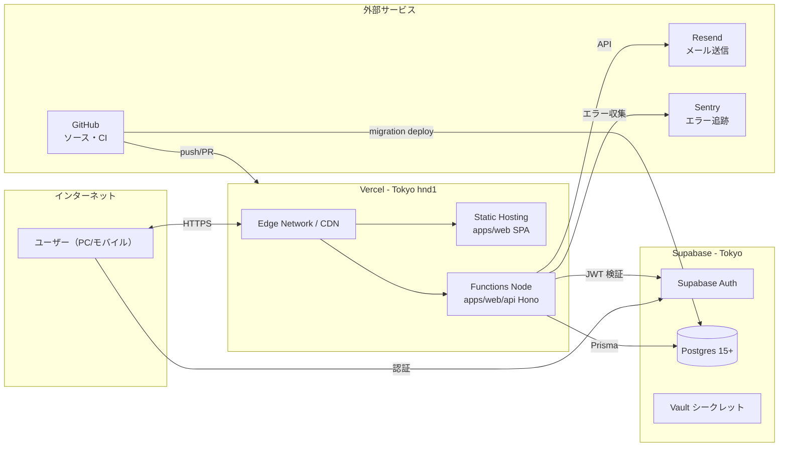
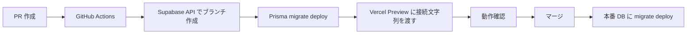

# 第6章 インフラ・デプロイ・運用

| 項目 | 内容 |
|---|---|
| 章番号 | 06 |
| ステータス | **v1.0 確定** |
| 確定日 | 2026-05-09 |
| 上位ドキュメント | [TRAKON PRD v1.2](../prd/trakon-prd.md) ／ [01-architecture.md](01-architecture.md) ／ [05-security.md](05-security.md) |
| 主参照 PRD 節 | §4.2（NFR）／§9.5（データ保護）／§9.6（監査ログ）／§9.10（脆弱性・運用）／§10（フェーズ） |

---

## 6.1. 本章の範囲

Phase 0 で必要なインフラ構成・環境分離・CI/CD・バックアップ・監視・運用準備を扱う。スコープ：

- インフラ全体像と環境分離
- ドメイン・DNS
- Vercel / Supabase の構成詳細
- シークレット管理（章5 §5.5.3 の補足）
- CI/CD パイプライン
- DB マイグレーション運用
- バックアップ・DR
- 監視・アラート・ロギング
- コスト見積（月額）
- 運用 Runbook（最小）

本章で**扱わない**もの：
- IaC（Terraform）の本格導入：Phase 1〜
- Inngest 詳細設定：Phase 1（章1 §1.6.2 で抽象のみ確定）
- 組織レベルのセキュリティ統制（VPN、SSO 等）：Phase 2+
- 災害復旧の定期訓練：Phase 2+
- ペネトレーションテスト：Phase 2+

---

## 6.2. インフラ全体像（Phase 0）



### 6.2.1. リージョン

| サービス | リージョン | 理由 |
|---|---|---|
| Vercel Functions | **hnd1（東京）** | レイテンシ・データレジデンシー（PRD §9.1 機密第一） |
| Vercel Static Hosting | グローバル CDN（東京エッジ含む） | CDN 配信の特性で問題なし |
| Supabase | **Northeast Asia (Tokyo)** | 同上、Vercel と同一リージョンで RTT 最小化 |
| Resend | グローバル（送信元はオレゴン） | メール SMTP の性質上、リージョン要件少 |
| Sentry | EU / US 選択（**EU 推奨**） | データレジデンシーの観点で、PII を含まない前提なら EU でも US でも可。EU の方がプライバシー法制との親和性高 |

### 6.2.2. ベンダー一覧と契約形態（Phase 0）

| ベンダー | プラン | 月額 | 契約者 |
|---|---|---|---|
| Vercel | Hobby（個人）→ Pro（商用前に昇格） | $0 → $20 | 株式会社おさまるカンパニー |
| Supabase | Free → Pro（商用前に昇格） | $0 → $25 | 同上 |
| Resend | Free（月3,000通まで） | $0 → $20（10万通） | 同上 |
| Sentry | Developer Free | $0 → Team $26 | 同上 |
| GitHub | Free（個人 / 小規模） | $0 | 同上 |
| ドメイン | レジストラ（お名前.com / Cloudflare 等） | 〜2,000円/年 | 同上 |

**Phase 0 想定月額：0 〜 4,000円**（社内検証中、全 Free プラン運用）
**商用リリース時：約 11,000円〜（$71/月、当時の為替で約11,000円）**

---

## 6.3. 環境分離

### 6.3.1. 環境構成

| 環境 | 用途 | Vercel | Supabase | 接続元 |
|---|---|---|---|---|
| **local** | 開発者ローカル | `pnpm dev`（Vite + Vercel CLI 経由 Functions） | Supabase CLI でローカル Postgres + Auth コンテナ | localhost のみ |
| **dev** | 共有開発環境（クラウド） | Vercel プロジェクト1（Preview） | Supabase プロジェクト1（dev） | 開発者 + 招待検証用 |
| **prod** | 本番 | 同 Vercel プロジェクト（Production） | Supabase プロジェクト2（prod） | 全ユーザー |

### 6.3.2. Vercel 環境

Vercel は1プロジェクトで以下の環境を持つ：

| Vercel 環境 | 紐付くブランチ | 紐付く Supabase | URL 例 |
|---|---|---|---|
| Production | `main` | Supabase prod | `https://app.trakon.{tld}` |
| Preview | `main` 以外の全ブランチ・PR | Supabase dev | `https://trakon-pr-{n}-{org}.vercel.app` |
| Development | （ローカル `vercel dev` のみ） | Supabase ローカル | `http://localhost:5173` |

> **判断**：Phase 0 は **dev + prod の2環境構成**で十分。staging（Production と同等の検証用）は Phase 1 でコメント機能・通知・PDF 出力など複雑度が上がる時点で導入を再検討（**§6.16-1 議論ポイント**）。

### 6.3.3. Supabase プロジェクト分離

| プロジェクト | 用途 | 接続文字列 |
|---|---|---|
| `trakon-dev` | dev 環境 + Phase 1 以降の Supabase Branching の base | Vercel Preview の DATABASE_URL |
| `trakon-prod` | 本番 | Vercel Production の DATABASE_URL |

> **dev と prod を同一プロジェクトのスキーマ分離で済ませる案は採用しない**。理由：① RLS 設定変更が片方だけで実施しにくい、② バックアップ・PITR が共有される、③ 本番事故が dev に波及するリスク。

### 6.3.4. ローカル開発環境

| 構成 | 内容 |
|---|---|
| **Postgres** | Supabase CLI（`supabase start` で Docker コンテナ起動）→ ローカル Postgres + Auth + Studio |
| **マイグレーション** | `pnpm db:migrate dev`（Prisma migrate dev）でローカル DB に適用 |
| **シード** | `pnpm db:seed`（最小サンプル：プロジェクト1件・参加者3名・予定2件） |
| **API** | `vercel dev` で `apps/web/api/` 配下の Functions を起動 |
| **FE** | `pnpm dev`（Vite）で 5173 ポート、API は同一オリジン経由 |

> **議論ポイント §6.16-2**：ローカルを Supabase CLI で完結させるか、リモート dev DB に接続するか。

---

## 6.4. ドメイン・DNS

### 6.4.1. ドメイン構成（Phase 0 想定）

| ドメイン | 用途 | 方針 |
|---|---|---|
| `app.trakon.{tld}` | 本番アプリ | Vercel Production にカスタムドメイン |
| `dev.trakon.{tld}` | dev 環境（オプション） | Vercel Preview に固定エイリアス（または `vercel.app` 既定 URL のまま） |
| `trakon.{tld}` | コーポレート / LP | 別途（本書スコープ外） |

> ドメイン本体（`trakon.{tld}`）は別途ブランド・登記・会社方針で確定（**§6.16-3 議論ポイント**）。基本設計上は `app.trakon.{tld}` を仮値として進める。

### 6.4.2. DNS

| プロバイダ | 推奨 | 理由 |
|---|---|---|
| **Cloudflare** | ◎ | DNSSEC 標準、無料 SSL、グローバル CDN、DDoS 保護、移管容易 |
| お名前.com 等 | ○ | 国内法人で扱いやすいが、Cloudflare に CNAME すれば実質同等 |

> **HSTS preload 登録**は商用リリース後（撤回不能のため Phase 1 末で慎重に）。

---

## 6.5. Vercel 構成

### 6.5.1. プロジェクト設定

| 項目 | 値 |
|---|---|
| Framework Preset | Other（Vite） |
| Root Directory | `apps/web` |
| Build Command | `pnpm --filter @trakon/web build` |
| Install Command | `pnpm install --frozen-lockfile` |
| Output Directory | `dist`（Vite 既定） |
| Node Version | `20.x` |
| Functions Region | `hnd1` |
| Functions Memory | 1024 MB（既定） |
| Functions Timeout | 10s（Hobby）／60s（Pro）／300s（Pro 拡張） |

### 6.5.2. `vercel.json`

```json
{
  "functions": {
    "api/[[...slug]].ts": {
      "memory": 1024,
      "maxDuration": 30
    }
  },
  "regions": ["hnd1"],
  "headers": [
    {
      "source": "/(.*)",
      "headers": [
        { "key": "Strict-Transport-Security", "value": "max-age=31536000; includeSubDomains; preload" },
        { "key": "X-Content-Type-Options", "value": "nosniff" },
        { "key": "X-Frame-Options", "value": "DENY" },
        { "key": "Referrer-Policy", "value": "strict-origin-when-cross-origin" },
        { "key": "Permissions-Policy", "value": "camera=(), microphone=(), geolocation=()" },
        { "key": "Content-Security-Policy", "value": "default-src 'self'; script-src 'self'; style-src 'self' 'unsafe-inline'; img-src 'self' data: https:; font-src 'self'; connect-src 'self' https://*.supabase.co https://*.sentry.io; frame-ancestors 'none'; base-uri 'self'; form-action 'self'; upgrade-insecure-requests" }
      ]
    }
  ],
  "rewrites": [
    { "source": "/api/v1/(.*)", "destination": "/api/[[...slug]].ts" },
    { "source": "/((?!api).*)", "destination": "/index.html" }
  ]
}
```

> CSP は章5 §5.7.6 と一致。`rewrites` の最後の行は SPA フォールバック（任意のクライアント側ルートを `index.html` に流す）。

### 6.5.3. Vercel Environment Variables

| キー | 環境 | 値の出所 | プレフィックス |
|---|---|---|---|
| `VITE_SUPABASE_URL` | All | Supabase ダッシュボード | `VITE_`（FE 公開可） |
| `VITE_SUPABASE_ANON_KEY` | All | 同上 | `VITE_`（FE 公開可） |
| `VITE_SENTRY_DSN_FE` | All | Sentry FE プロジェクト | `VITE_`（FE 公開可） |
| `DATABASE_URL` | All（環境別の値） | Supabase 接続文字列（pooled） | BE 専用 |
| `DIRECT_DATABASE_URL` | All（環境別の値） | Supabase 接続文字列（direct、migrate 用） | BE 専用 |
| `SUPABASE_SERVICE_ROLE_KEY` | All | Supabase ダッシュボード | BE 専用、絶対漏洩禁止 |
| `SUPABASE_JWT_SECRET` | All | 同上 | BE 専用 |
| `RESEND_API_KEY` | All | Resend ダッシュボード | BE 専用 |
| `SENTRY_DSN_BE` | All | Sentry BE プロジェクト | BE 専用 |
| `APP_URL` | Production / Preview | 自身の URL | BE 専用（招待リンクの組み立て用） |

> **環境別値**：Vercel の各環境（Production / Preview / Development）で別の値を設定。Preview は dev Supabase を指す。

### 6.5.4. デプロイ戦略（GitHub Release ベース）

**確定方針**：Production デプロイは **GitHub Release の公開タイミング**でのみ走らせる。`main` ブランチへのマージは Preview のみ。リリース版を明示的にタグ＋Release Notes で切る運用とし、誤った変更が即座に本番に流れるのを防ぐ。

| アクション | 結果 |
|---|---|
| 任意の PR 作成 / 更新 | **Preview デプロイ**（個別 URL 付与、Vercel Git Integration 標準） |
| PR クローズ | Preview デプロイは Vercel が一定期間後に削除 |
| `main` ブランチへの merge | **Preview のみ**（Vercel の Production Branch 設定を main 以外に変更、または Ignored Build Step で main からの Production を抑止） |
| **GitHub Release 公開**（タグ作成） | **GitHub Actions が Vercel CLI 経由で Production デプロイを実行**＋**DB マイグレーションを `prisma migrate deploy` で適用** |

#### Vercel 側の設定

| 項目 | 値 | 理由 |
|---|---|---|
| Production Branch | `production`（ダミー、未使用） | main の auto-deploy を Production 扱いから外す |
| Git Integration の自動デプロイ | Preview のみ有効 | main マージは検証 URL が出るだけで本番に流れない |

#### GitHub Actions（Production デプロイ）

`.github/workflows/release-deploy.yml`：

```yaml
name: Release Deploy
on:
  release:
    types: [published]

jobs:
  deploy:
    runs-on: ubuntu-latest
    permissions:
      contents: read
    steps:
      - uses: actions/checkout@v4
        with:
          ref: ${{ github.event.release.tag_name }}

      - uses: pnpm/action-setup@v3
        with: { version: 9 }
      - uses: actions/setup-node@v4
        with:
          node-version: 20
          cache: pnpm

      - run: pnpm install --frozen-lockfile

      # 1) DB マイグレーションを先に流す
      - name: Apply DB migrations to Production
        run: pnpm --filter @trakon/db migrate deploy
        env:
          DATABASE_URL: ${{ secrets.PROD_DIRECT_DATABASE_URL }}

      # 2) Vercel Production デプロイ
      - run: pnpm dlx vercel pull --yes --environment=production --token=${{ secrets.VERCEL_TOKEN }}
      - run: pnpm dlx vercel build --prod --token=${{ secrets.VERCEL_TOKEN }}
      - run: pnpm dlx vercel deploy --prebuilt --prod --token=${{ secrets.VERCEL_TOKEN }}
```

#### リリースの作り方（運用）

```
1. main ブランチが安定状態（CI 緑・Preview で動作確認済）
2. GitHub Releases → 「Draft a new release」
3. タグ名：v0.1.0、v0.2.0、… （セマンティックバージョン）
4. Release Notes：当該バージョンの変更点（自動生成 + 手動補足）
5. 「Publish release」→ release-deploy.yml が自動起動
6. Actions のログでマイグレーション + デプロイ完了を確認
7. Production URL で動作確認
```

#### ロールバック

| 手段 | 用途 |
|---|---|
| **過去 Release の再公開** | コードのみ戻す。マイグレーションは別途検討（前方互換に書く前提） |
| **Vercel ダッシュボード「Promote」** | コードのみ即時戻し。マイグレーションは戻らない |
| **修正リリース（v0.x.1）を切る** | バグフィックスを順方向で適用する基本パターン |

> マイグレーションは「順方向のみ」運用（章2 §2.9）。スキーマ変更を含むリリース失敗時は、新たな修正マイグレーションを切って前進的に解消する。

#### 必要な GitHub Actions Secrets

| Secret | 取得元 |
|---|---|
| `VERCEL_TOKEN` | Vercel Account Settings → Tokens |
| `VERCEL_ORG_ID` | `.vercel/project.json` または Vercel CLI |
| `VERCEL_PROJECT_ID` | 同上 |
| `PROD_DIRECT_DATABASE_URL` | Supabase ダッシュボード（direct 接続文字列） |

---

## 6.6. Supabase 構成

### 6.6.1. プロジェクト設定

| 項目 | 設定 |
|---|---|
| リージョン | Northeast Asia (Tokyo) |
| プラン | Free（Phase 0 dev/prod 両方） → 商用リリース前に prod を Pro へ昇格 |
| Postgres バージョン | 15.x（Phase 0 開始時の Supabase 既定） |
| 認証プロバイダ | Email（メール+パスワード）のみ Phase 0 で有効 |
| 認証メール送信 | **無効化**（章5 §5.3.2、Resend で自前送信） |
| API スキーマ | `public`（自動生成 PostgREST API は使用しない、Hono BE 経由） |
| Storage | 無効（Phase 1 で有効化） |
| Realtime | 無効（Phase 0 不要） |

### 6.6.2. データベース設定

| 項目 | 設定 |
|---|---|
| Connection Pooler | **有効**（Vercel Functions のサーバレス特性で必須） |
| Pool mode | `transaction`（Prisma との相性◎） |
| 接続上限 | Free: 60接続、Pro: 200接続（Pooler 経由） |
| 直接接続 | マイグレーション専用（`DIRECT_DATABASE_URL`） |

### 6.6.3. アプリ DB ロール（章2 §2.7、章5 §5.5.3）

| ロール | 権限 |
|---|---|
| `app_user` | 全テーブル SELECT/INSERT/UPDATE/DELETE。**`audit_logs` `ball_events` は SELECT/INSERT のみ**（UPDATE/DELETE は REVOKE） |
| `app_migrator` | DDL（CREATE/ALTER/DROP）含む全権限。Prisma migrate deploy 時のみ使用 |
| `app_archiver`（Phase 1〜） | `audit_logs` の保管期間超過レコード削除専用 |

### 6.6.4. Supabase Branching（Phase 1 導入）

PR ごとにブランチ DB を作成し、Prisma migrate を流す：



> Phase 0 は dev/prod の2環境のみ、PR ごとのブランチDB は **Phase 1 で導入**。

---

## 6.7. シークレット管理（章5 §5.5.3 の補足）

### 6.7.1. 保管場所と運用

| シークレット | 保管 | ローテーション |
|---|---|---|
| Supabase service_role key | Vercel Env + Supabase Vault | 漏洩疑い時に即時、Phase 1 で四半期定期 |
| Resend API キー | Vercel Env | 同上 |
| Supabase DB パスワード | Vercel Env | 同上 |
| GitHub Actions シークレット | GitHub Settings → Secrets | リポジトリ管理者のみ閲覧 |

### 6.7.2. ローカル開発（`.env.local`）

```bash
# .env.example （リポジトリにコミット、実値は空）
VITE_SUPABASE_URL=
VITE_SUPABASE_ANON_KEY=
DATABASE_URL=
DIRECT_DATABASE_URL=
SUPABASE_SERVICE_ROLE_KEY=
SUPABASE_JWT_SECRET=
RESEND_API_KEY=
APP_URL=http://localhost:5173
```

`.env.local` は **gitignore 必須**。実値は開発者個別に Supabase CLI から取得 or Vercel CLI で `vercel env pull .env.local` で同期。

### 6.7.3. シークレット漏洩時の対応

| ステップ | 対応 |
|---|---|
| 1. 即時無効化 | Supabase ダッシュボードからキー再生成、Vercel Env を新キーに更新、Vercel 再デプロイ |
| 2. 影響範囲調査 | audit_logs から異常アクセス検出（IP・UA・操作種別） |
| 3. 監査ログ保全 | 該当期間の audit_logs を別ストレージにエクスポート（証跡化） |
| 4. ユーザー通知 | 必要に応じて影響ユーザーに通知（PRD SR-INCIDENT-02、Phase 1+） |
| 5. 事後 | Runbook 更新、再発防止策（§6.15） |

---

## 6.8. CI/CD パイプライン

### 6.8.1. ワークフロー一覧（Phase 0）

| ファイル | トリガ | 内容 |
|---|---|---|
| `.github/workflows/ci.yml` | PR 作成・更新、main push | lint + type-check + unit test + audit |
| `.github/workflows/openapi-check.yml` | 同上 | OpenAPI スキーマ生成 → コミット済みファイルとの差分検知 |
| `.github/workflows/release-deploy.yml` | **GitHub Release 公開** | **Production への DB migrate + Vercel デプロイ**（§6.5.4） |
| Vercel Git Integration（GHA 不要） | PR 作成・更新、main push | **Preview デプロイのみ**（Production は上記 release-deploy.yml に集約） |

### 6.8.2. `ci.yml` の構成

```yaml
name: CI
on:
  pull_request:
    branches: [main]
  push:
    branches: [main]

jobs:
  ci:
    runs-on: ubuntu-latest
    steps:
      - uses: actions/checkout@v4
      - uses: pnpm/action-setup@v3
        with: { version: 9 }
      - uses: actions/setup-node@v4
        with:
          node-version: 20
          cache: pnpm
      - run: pnpm install --frozen-lockfile
      - run: pnpm lint
      - run: pnpm type-check
      - run: pnpm test       # vitest
      - run: pnpm audit --prod --audit-level=high
```

### 6.8.3. ブランチ保護ルール（main）

| ルール | 設定 |
|---|---|
| Require pull request before merging | ✅ |
| Require status checks to pass | ✅（ci ジョブ必須） |
| Require branches to be up to date | ✅ |
| Require linear history | ✅（squash merge 推奨） |
| Allow force pushes | ❌ |
| Require approving reviews | ⚠️ Phase 0 は本人のみのためスキップ可（**§6.16-5 議論ポイント**） |

### 6.8.4. デプロイ承認

| Phase 0 | Phase 1+ |
|---|---|
| **GitHub Release 公開 = 承認**（§6.5.4） | 同上＋ release-deploy.yml に Environments の `required reviewers` を設定し、Release publish 後にも明示承認を入れる |

> Phase 0 はリリース作成自体が承認行為になる（Draft 段階で内容を吟味、Publish で確定）。Phase 1 で複数人体制になったら GitHub Environments の Protection Rules（`production` 環境への required reviewers）を追加し、Release 公開後の Actions 実行直前にもう1段の承認を挟む。

---

## 6.9. マイグレーション運用

### 6.9.1. ローカル → dev → prod のフロー

```
1. ローカル: prisma migrate dev → 新マイグレーションファイル生成
2. PR 作成 → CI で Prisma スキーマ整合性チェック（migrate diff）
3. PR マージ → Preview 環境（dev DB）に手動 or 自動で migrate deploy
4. Preview で動作確認
5. GitHub Release 公開 → release-deploy.yml が prod DB に migrate deploy → Vercel Production デプロイ
```

### 6.9.2. マイグレーション戦略

| 観点 | 方針 |
|---|---|
| **後方互換性** | 各マイグレーションは「旧コード + 新スキーマ」で動くこと（Phase 1 以降にカラム削除する場合は2段階リリース） |
| **大規模変更** | データ移行を伴う ALTER は別マイグレーションに分割、検証用 SQL を PR 説明に添付 |
| **ロールバック** | Prisma にロールバック機能はない。問題発生時は **新たな修正マイグレーション** を切る方針 |
| **DB スナップショット** | 重大マイグレーション前は手動で Supabase バックアップ取得（Pro 以上で PITR、Free は manual snapshot） |

### 6.9.3. ロールバック手順（緊急時）

1. Vercel: 旧 Production デプロイへ Promote（数秒）
2. DB: もしマイグレーションを巻き戻す必要があれば、PITR（Pro）で取得時点に復旧 — **慎重に**、データ損失あり
3. 関係者通知

---

## 6.10. バックアップ・DR

### 6.10.1. バックアップ戦略

| 対象 | Phase 0 | Phase 1（Pro 昇格後） |
|---|---|---|
| **Postgres** | Supabase Free の自動バックアップ（1日1回、保管7日） | Pro: 7日 / Team以上: 14〜28日、PITR（Point-in-Time Recovery） |
| **アプリ コード** | GitHub（リポジトリ） | 同上 |
| **環境変数** | Vercel Env を export（手動・四半期） | 自動エクスポート（IaC 化） |
| **添付ファイル**（Phase 1） | — | Supabase Storage バックアップ |
| **監査ログ長期保管** | DB に保持 | DB + 13ヶ月超過分は別ストレージへエクスポート（SR-AUDIT-03） |

### 6.10.2. 復元テスト

| Phase 0 | Phase 1+ |
|---|---|
| **未実施**（Free プランで PITR 不可、データ量も少ないためリスク小） | 四半期に1回、別 Supabase プロジェクトに復元して検証（SR-OPS-04） |

> **議論ポイント §6.16-7**：Phase 0 でも商用リリース直前に1度は復元テストを実施するか。

### 6.10.3. RPO / RTO（目標）

| 観点 | Phase 0 | Phase 1+ |
|---|---|---|
| RPO（許容データ損失） | 24時間 | 5分（PITR） |
| RTO（復旧目標時間） | 4時間 | 1時間 |

---

## 6.11. 監視・アラート

### 6.11.1. 監視対象

| カテゴリ | ツール | 監視内容 | アラート先（Phase 0） |
|---|---|---|---|
| **アプリエラー** | Sentry | 例外、HTTP 5xx | 開発者本人メール |
| **Vercel** | Vercel ダッシュボード（Insights） | デプロイ失敗、Function 実行エラー | Vercel 通知 |
| **Supabase** | Supabase ダッシュボード（Reports） | DB CPU・接続数・ストレージ | 手動チェック（Phase 1 で Webhook 化） |
| **Uptime** | Better Stack（旧 Better Uptime）Free / Cron‑style | `/healthz` を 5分間隔で監視 | メール通知 |
| **依存パッケージ脆弱性** | GitHub Dependabot | high 以上の脆弱性 | GitHub 通知 → 開発者本人 |

> Phase 0 は通知先が個人メールに集約。Phase 1 でチーム拡大時に Slack 等への送信を追加。

### 6.11.2. 重要メトリクス

| メトリクス | 閾値（目安） | アクション |
|---|---|---|
| API 5xx エラー率 | > 1%（5分平均） | Sentry で原因調査 |
| `/healthz` 応答時間 | > 3秒 | Vercel / Supabase 状態確認 |
| Supabase 接続数 | > 50（Free 60上限） | Pooler 設定見直し / Pro 昇格検討 |
| Supabase ストレージ | > 400MB（Free 500MB上限） | Pro 昇格 |
| Sentry イベント数 | > 4,000/月（Free 5,000上限） | Team 昇格 |

### 6.11.3. Sentry 設定

| 設定 | 値 |
|---|---|
| Environment タグ | `production` / `preview` / `development` で分離 |
| Release | Vercel デプロイ ID をリリース ID に紐付け（`SENTRY_RELEASE` 環境変数） |
| Source Map アップロード | Vite ビルド時に sentry-vite-plugin で自動 |
| **Performance Monitoring** | Phase 0 は無効（Free 枠を errors に集中）、Phase 1 で有効化 |
| **PII Scrubbing** | `beforeSend` フックで request body / query params / cookies を全 scrub（章5 §5.11-10 確定） |

### 6.11.4. ログ保管

| ログ種類 | 保管場所 | 保管期間 |
|---|---|---|
| Vercel Function ログ | Vercel ダッシュボード | 1日（Hobby）→ 1日（Pro）→ Enterprise でカスタム |
| Sentry エラー | Sentry | 30日（Free）→ 90日（Team） |
| Supabase ログ | Supabase ダッシュボード | 1日（Free）→ 7日（Pro） |
| 監査ログ（`audit_logs` テーブル）| 自前 DB | 無期限（Phase 0）→ 13ヶ月+α（Phase 1、SR-AUDIT-03） |

> **議論ポイント §6.16-9**：Vercel/Supabase ログを Logflare 等の外部基盤に流すか（Phase 1+）。

---

## 6.12. ロギング（アプリ側）

### 6.12.1. ロガー（章3 §3.3.3 と整合）

| 観点 | 方針 |
|---|---|
| **ライブラリ** | **pino**（軽量・JSON 構造化） |
| **出力形式** | JSON（Vercel の `console.log` 経由で stdout、ダッシュボードで集約） |
| **必須フィールド** | `requestId`, `actorUserId`, `path`, `method`, `status`, `durationMs` |
| **レベル** | `debug`（local のみ） / `info` / `warn` / `error` |
| **PII 除外** | request body / query params / response body は出力しない（章5 SR-DATA-06）。出力するのは meta のみ |

### 6.12.2. アクセスログとエラーログの責務分担

| ログ種別 | 出力先 | 出力タイミング |
|---|---|---|
| アクセスログ（HTTP） | Vercel Logs（pino → stdout） | リクエスト処理完了時に1行 |
| エラーログ | Sentry + Vercel Logs | 例外発生時 |
| 監査ログ（業務） | `audit_logs` テーブル | ドメイン操作成功時（章5 §5.6） |

---

## 6.13. コスト見積（月額）

### 6.13.1. Phase 0（社内検証期間、Free プランフル活用）

| サービス | プラン | 月額 |
|---|---|---|
| Vercel | Hobby | $0 |
| Supabase | Free × 2（dev + prod） | $0 |
| Resend | Free | $0 |
| Sentry | Developer Free | $0 |
| GitHub | Free | $0 |
| ドメイン | レジストラ年額 | 〜170円/月相当 |
| Better Stack（uptime） | Free | $0 |
| **合計** | — | **〜200円/月** |

### 6.13.2. 商用リリース時（Phase 1 着手前）

| サービス | プラン | 月額 |
|---|---|---|
| Vercel | Pro | $20 |
| Supabase | Pro（prod のみ昇格、dev は Free 維持） | $25 |
| Resend | Pro（10万通） | $20 |
| Sentry | Team | $26 |
| GitHub | Free 継続 | $0 |
| ドメイン | 年額 | 〜170円/月相当 |
| Better Stack | Free 継続 | $0 |
| **合計** | — | **約 $91/月（約 14,000円）** |

### 6.13.3. Phase 1 末想定

- Inngest（Free → Pro $20）
- Upstash Redis（Free → Pay-as-you-go、〜$10）
- Sentry Performance 監視追加 → 同 Team 内
- 合計：**約 $121/月（約 19,000円）**

---

## 6.14. Phase 1+ 拡張計画

| 項目 | 導入時期 | 補足 |
|---|---|---|
| Inngest（長尺ジョブ） | Phase 1 開始 | 章1 §1.7-7 で確定 |
| Upstash Redis（レート制限） | Phase 1 中盤 | 章3 §3.2.9、章5 §5.11-5 |
| Supabase Branching（PR ごと DB） | Phase 1 開始 | §6.6.4 |
| Supabase Pro 昇格 | 商用リリース前 | バックアップ・PITR・サポート |
| Sentry Team 昇格 | チーム拡大時 | 複数人監視、データ保持90日 |
| Logflare（ログ集約） | Phase 1 末 | Vercel/Supabase ログを統合検索 |
| IaC（Terraform） | Phase 1 末 | Vercel + Supabase + GitHub の構成コード化 |
| Staging 環境 | Phase 1 末 | 複雑化に応じて検討（§6.16-1） |
| 復元テストの定期化 | Phase 1 開始 | 四半期に1回（SR-OPS-04） |
| MFA / SSO | Phase 2 | PRD SR-AUTH-06 |
| 監査ログ閲覧 UI | Phase 2 | PRD SR-AUDIT-04 |

---

## 6.15. 運用 Runbook（最小・Phase 0）

> README.md の `## Operations` セクションとして以下を記載。Phase 1 で別 Runbook ファイルに分離。

### 6.15.1. リリース・デプロイ手順

```
1. PR 作成 → CI 緑 → レビュー（Phase 1〜）→ マージ
2. main マージで Vercel Preview が更新される → Preview URL で動作確認
3. リリース可と判断したら GitHub Releases → Draft a new release
4. タグ（vX.Y.Z）と Release Notes を記載 → Publish release
5. release-deploy.yml が起動：DB migrate deploy → Vercel Production デプロイ
6. Actions ログでマイグレーション + デプロイ完了を確認
7. Production URL で動作確認（ログイン → プロジェクト一覧）
```

### 6.15.2. ロールバック手順

```
1. Vercel ダッシュボード → Deployments → 戻したい過去デプロイを選択
2. 「Promote to Production」（コードのみ即時戻し）
3. マイグレーション含むなら：
   - 順方向で修正リリース（vX.Y.Z+1）を切る基本パターン
   - DB の状態が壊れている場合は PITR（Pro 以上）で取得時点に復旧
```

### 6.15.3. ホットフィックス手順

```
1. main から hotfix/* ブランチを切る
2. 修正コミット → PR 作成 → CI 通過 → レビュー（緊急時は省略可）→ main にマージ
3. Preview で動作確認
4. パッチバージョン（vX.Y.Z+1）で GitHub Release を即時 Publish → 通常のリリースフローで本番反映
```

### 6.15.4. 監視アラート受領時

```
1. Sentry: イベント詳細確認、再現性チェック
2. Vercel: Function ログでリクエスト追跡
3. Supabase: ダッシュボードで CPU・接続数・ストレージ状態確認
4. /healthz の応答確認
5. 再発防止策を Issue 化
```

### 6.15.5. シークレット漏洩疑い時

§6.7.3 の手順に従う。

### 6.15.6. ドメイン更新失念防止

ドメインの自動更新を有効化、レジストラに支払い情報登録。年1回の手動確認をカレンダーに登録。

---

## 6.16. 議論ポイントの確定結果

| # | 論点 | 確定内容 | 判断理由 |
|---|---|---|---|
| 1 | 環境分離数 | **dev + prod の2環境（Phase 0）** | Phase 0 検証スコープに見合った軽量構成。staging は Phase 1 の複雑化時に再検討 |
| 2 | ローカル開発 DB | **Supabase CLI でフルローカル** | オフライン作業可・データ汚染ゼロ・スキーマ変更を安全に試せる |
| 3 | ドメイン | **Phase 0 中は仮ドメイン (.vercel.app)、本ドメインは商用リリース前に確定** | ブランド・登記・会社方針確定を待つ。Cloudflare 経由で容易に切替 |
| 4 | Sentry 環境分離 | **1プロジェクト + environment タグ** | Free 枠を prod に集中、設定一元化 |
| 5 | main ブランチ保護レビュー | **Phase 0 はスキップ可、Phase 1 で必須化** | 1人体制のうちはレビュアー不在問題を回避、CI グリーンは必須継続 |
| 6 | バックアップ復元テスト | **Phase 0 未実施、Phase 1 から四半期定期化** | Free で PITR 不可・データ量少。Pro 昇格後に SR-OPS-04 として運用化 |
| 7 | アクセスログ集約 | **Vercel/Supabase 既定のまま、audit_logs のみ DB 長期保管** | Phase 0 で外部基盤を増やさない。トラブルシュートは各ダッシュボードで |
| 8 | Uptime 監視 | **Better Stack Free で 5分間隔 /healthz 監視** | Vercel から独立した外部監視、無料枠で要件充足 |
| 9 | DB ロール分離 | **Phase 0 から `app_user` / `app_migrator` の2ロール分離** | 章2 §2.7 の append-only 強制（REVOKE）を Phase 0 から有効化、多層防御を初日から確保 |
| 10 | Production デプロイ承認 | **GitHub Release 公開タイミングで Production デプロイ**（§6.5.4） | main マージは Preview のみ、Release が承認行為。誤マージで本番に流れない安全装置。Phase 1 で GitHub Environments の Protection Rules で2段階化 |

---

## 6.17. PRD 整合チェック

| 該当 PRD 項 | 本章での扱い |
|---|---|
| §4.2 NFR-PERF-01（2秒以内） | §6.5（Vercel Tokyo + CDN）、§6.11.2（応答時間監視） |
| §4.2 NFR-AVAIL-01（99.5%） | §6.10 RPO/RTO、§6.11 監視、Phase 1 で 99.9% 視野 |
| §9.5 SR-DATA-01〜02 | §6.5.2（HSTS）、§6.6.1（保管時暗号化は Supabase 既定） |
| §9.6 SR-AUDIT-03（13ヶ月保管） | §6.10.1、§6.11.4（Phase 1 で長期保管整備） |
| §9.10 SR-OPS-02（脆弱性監査） | §6.8.2（pnpm audit）、Dependabot |
| §9.10 SR-OPS-03（シークレット） | §6.7 全節 |
| §9.10 SR-OPS-04（バックアップ・復元テスト） | §6.10、Phase 1 で復元テスト定期化 |
| §10.2 Phase 0 成功基準 8.（TLS・暗号化・監査ログ） | §6.5（HSTS・CSP）、§6.6（暗号化）、章5 §5.6（監査ログ） |
| §10 フェーズ計画 | §6.14 Phase 1+ 拡張計画 |

### Phase 1+ 持ち越し

- IaC（Terraform）化（§6.14）
- Inngest 詳細設定（§6.14）
- Logflare ログ集約（§6.16-7 議論ポイント）
- 監査ログ長期保管エクスポート（SR-AUDIT-03）
- 復元テスト定期化（SR-OPS-04）
- ペネトレーションテスト（SR-OPS-06）
- インシデント対応 Runbook 拡充

### PRD 整合メモ（PRD 改訂提案）

- 特になし（章2 で起票した `invitations` テーブル提案は引き続き有効）

---

## 6.18. 章ステータス

| 日付 | 状態 | 備考 |
|---|---|---|
| 2026-05-09 | Draft（たたき台） | §6.16 議論ポイント10項目を未確定で起稿 |
| 2026-05-09 | **v1.0 確定** | §6.16 全10論点を AskUserQuestion で確定。Production デプロイは推奨案「Phase 0 は自動」から **「GitHub Release ベース」に変更**、他9項目は推奨案どおり。§6.5.4 / §6.8 / §6.9 / §6.15 を Release ベースに書き換え。 |
