# TRAKON PRD / 要件定義書

**Keep the ball moving.**

| 項目 | 内容 |
|---|---|
| プロダクト名 | TRAKON |
| 発行元 | 株式会社おさまるカンパニー |
| ドキュメント版 | v1.2 |
| 発行日 | 2026-04-25 |
| ステータス | Draft |
| 本書の位置づけ | 基本原則 > **本PRD** > 個別仕様書 |

## 改訂履歴

| 版 | 日付 | 変更概要 | 記載者 |
|---|---|---|---|
| v1.0 | 2026-04-19 | 初版（基本原則・正規仕様書・MVP仕様書・ピッチ資料を統合） | — |
| v1.1 | 2026-04-25 | 非会員URL共有を Phase 1 で正式採用。組織管理者による機能 On/OFF トグルを Phase 2 で提供。§3／§4.1／§4.3／§9.1〜9.4／§10.3〜10.4／§11／§12 を該当箇所書き換え。 | — |
| v1.2 | 2026-04-25 | データモデルの命名整合：`schedules` テーブル → `plans` に改名（概念「予定」と整合）。関連カラム `schedule_type / schedule_id` → `plan_type / plan_id`。`organization_settings`、`share_links` テーブルを追加。§8.1〜8.5 を全面書き換え。各テーブルに「司る機能・情報」コメントを付与。改名対応表を §8.2 末尾に追加。 | — |

## 参照元ドキュメント

| 種別 | 名称 | 版 | 位置づけ |
|---|---|---|---|
| 思想 | TRAKON 基本原則 | v1.0 | 本PRDの上位規範 |
| 正規仕様 | TRAKON 予定種別仕様書 | v1.1 | 本PRDが参照する正規仕様 |
| 正規仕様 | TRAKON ボール状態遷移仕様書 | v1.1.1 | 本PRDが参照する正規仕様 |
| 正規仕様 | TRAKON プロジェクト仕様書 | v1.2 | 本PRDが参照する正規仕様 |
| 正規仕様 | TRAKON カレンダー／スケジュール表示仕様 | v1.0 | 本PRDが参照する正規仕様 |
| 正規仕様 | TRAKON ダッシュボード／進行判定仕様書 | v1.0 | 本PRDが参照する正規仕様 |
| 実装スコープ | TOSS MVP 開発仕様書 | v1.0 | **Phase 0 の着手スコープの原典** |
| ビジネス | TRAKON サービス紹介 / コンセプトブック | 2026 | ロードマップの原典 |

---

## 目次

1. [はじめに](#1-はじめに)
2. [プロダクト概要](#2-プロダクト概要)
3. [ターゲットユーザー・ペルソナ](#3-ターゲットユーザーペルソナ)
4. [要件リスト](#4-要件リスト)
5. [機能リスト & ユースケース図](#5-機能リスト--ユースケース図)
6. [ユースケース／シーケンス図](#6-ユースケースシーケンス図)
7. [画面ごとの機能要件・項目要件](#7-画面ごとの機能要件画面項目要件)
8. [データモデル概要](#8-データモデル概要)
9. [セキュリティ要件](#9-セキュリティ要件)
10. [フェーズごとの開発スコープ](#10-フェーズごとの開発スコープ)
11. [基本原則との整合](#11-基本原則との整合)
12. [対象外・今後の検討事項](#12-対象外今後の検討事項)
13. [付録](#13-付録)

---

## 1. はじめに

### 1.1. 本書の位置づけ

本書は、TRAKONというプロダクトを開発するうえでの**要件定義（PRD）**である。個別の画面仕様・実装仕様の手前にあり、以下の階層で運用する。

```
┌──────────────────────────────────────────┐
│  TRAKON 基本原則 v1.0（思想・判断基準の最上位）│
├──────────────────────────────────────────┤
│  TRAKON PRD / 要件定義書（本書）            │
│   - プロダクトとしての合意範囲              │
│   - 何を・誰に・いつ作るかの全体像           │
├──────────────────────────────────────────┤
│  個別仕様書（予定種別／ボール状態／…）       │
│   - 個別機能の詳細ルール                   │
├──────────────────────────────────────────┤
│  実装仕様書（DB設計・API設計・UI仕様書）     │
└──────────────────────────────────────────┘
```

**判断が仕様書レベルで分かれた場合、個別判断より先に基本原則へ立ち返る。本書は常に基本原則の下位にある。**

### 1.2. 適用範囲と対象読者

本書は以下を対象とする。

- **プロダクトオーナー／事業責任者**：投資判断・優先度決定の根拠
- **制作ディレクター／デザイナー／エンジニア（開発ベンダー）**：仕様合意・実装の起点
- **QA／カスタマーサポート**：受け入れ条件・想定ユースケースの共通理解

### 1.3. 用語集

| 用語 | 定義 |
|---|---|
| **ボール** | プロジェクト進行上の依頼／提出／確認／戻し／承認などの単位。誰が持っているか、誰に渡すか、今どういう状態かを持つ |
| **Ball Holder** | 現在そのボールに対して次の行動責任を持っている人物 |
| **TOSS** | ボールを相手へ渡し、Ball Holder を更新する操作 |
| **Next** | 次にボールを受け取る（受け取るべき）人物 |
| **予定** | 制作物に紐づく未完了の進行対象。予定名・監視基準日・Ball Holder を持つ |
| **予定種別** | TOSS予定／共同予定／単独予定 の3種 |
| **監視基準日** | ダッシュボードの進行判定に用いる基準日（種別ごとに決定ルールが異なる） |
| **進行判定** | 予定の現状を「平常／要確認／遅延」の3区分で示す、監視上の概念 |
| **WAIT** | 現在の Ball Holder に行動責任が存在し、待機・滞留している内部判定概念（ユーザーが直接目にする語ではない） |
| **差し戻し（Returned）** | 相手が受領した内容をそのまま進められず、正式に返す操作。履歴に残る |
| **TOSS取消（Canceled）** | 誤って実行した TOSS を無効化し、直前状態に戻す操作 |
| **制作物** | プロジェクトに紐づく成果物単位（Webページ／ドキュメント／バナー 等） |
| **プロジェクト** | 参加者・制作物・ボール・予定を束ねる親単位 |

### 1.4. 関連仕様書との対応表

本PRD各章と、参照している個別仕様書との対応を以下に示す。

| 本PRD章 | 主に参照する個別仕様書 |
|---|---|
| 第2章 プロダクト概要 | 基本原則 第一〜七条、サービス紹介 |
| 第3章 ペルソナ | 基本原則 第三条、サービス紹介 TARGET |
| 第5〜7章 機能／画面 | プロジェクト仕様書、予定種別仕様書、ボール状態遷移仕様書、カレンダー表示仕様 |
| 第6章 UC-13〜14 | ダッシュボード／進行判定仕様書 |
| 第8章 データモデル | プロジェクト仕様書、予定種別仕様書、ボール状態遷移仕様書 |
| 第9章 セキュリティ | 基本原則 第四条・第十三条、本PRDで新規定義 |
| 第10章 フェーズ | MVP仕様書、コンセプトブック ROADMAP |

---

## 2. プロダクト概要

### 2.1. ビジョン／ミッション

> **Keep the ball moving.**

TRAKON は、**進行を整え、前に進めるためのプロダクト**である。情報を並べるための器ではなく、記録を蓄積するためだけの道具でもない。**進行の停滞を可視化し、責任の所在を明確にし、次の一手を判断できる状態をつくる**ために存在する。

TRAKON の本質は、職種名ではなく **進行責任という役割** にある。当面の主対象は制作ディレクターだが、将来的には進行責任を担う人すべてに広げていく。

### 2.2. 解決する課題

制作プロジェクトの現場は、次の問題で停滞している。

1. **ステータスが分からない** — 「今どこまで進んでる？」のたびに確認作業が必要
2. **情報が散らばる** — チャット／メール／Excel／タスクツールに分散
3. **次の一手が見えない** — 「誰が今動くべきか」がどこにも書かれていない
4. **責任の所在が曖昧** — 全員が「相手待ち」になり、静かに停滞する

また、制作現場は以下の構造的プレッシャーに直面している。

- 1人のディレクターが抱える案件数の増加
- クライアント／外注／社内の関係者増加による複雑化
- リモートワーク定着により、対面で補っていた「空気感」の喪失

**既存ツール（Backlog／Asana／Trello／ClickUp／Excel）は「タスク管理」までしか届いていない。現場は「進行管理」を求めている。**

### 2.3. 既存ツールとの差別化

| 観点 | 既存ツール | TRAKON |
|---|---|---|
| 中心概念 | タスク／チケット | ボール（責任の所在） |
| 時間軸 | 開始〜終了の工数 | 誰が／次は誰か／なぜ止まっているか |
| 停滞の表現 | ステータス名（保留・待機 等） | 責任者＋予定日＋期限超過で表現 |
| 管理の目的 | 入力・整備・可視化 | 前進・判断・次の一手 |

**TRAKON は管理を目的化しない。管理は前進のための手段である。**

### 2.4. コアコンセプト

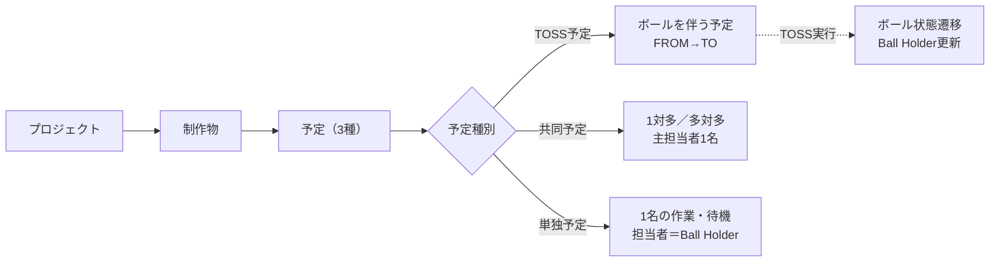

**ボールは、いずれかの予定の文脈の中で動く。予定はスケジュールに置かれる工程であり、ボールの責任移動は TOSS 操作によってのみ発生する。**

### 2.5. プロダクト価値仮説

| 価値 | 仮説 | 検証指標（Phase別に詳細化） |
|---|---|---|
| V-01: 責任の所在が一目で分かる | Ball Holder 表示により、確認コストが激減する | 確認目的のチャット頻度の減少 |
| V-02: 止まっているボールを可視化 | ダッシュボードで遅延・要確認が抽出され、気づきが早まる | 遅延件数／対応リードタイムの短縮 |
| V-03: 3年後も秩序を保つ構造 | 状態を増やさず種別×監視基準日で現実を表現するため、機能追加で崩れない | 長期利用継続率／ユーザー離脱率 |

### 2.6. プロダクト設計の3層構造

TRAKON の画面は、役割を分けた3層で構成する。

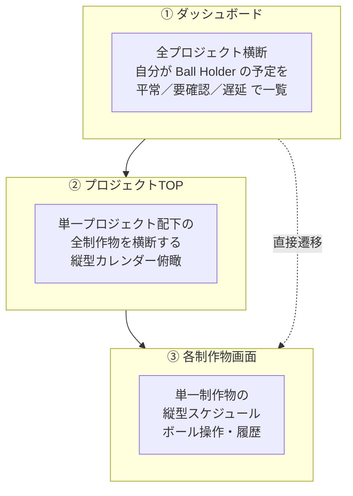

| 層 | 役割 | Phase |
|---|---|---|
| ダッシュボード | 「いま自分は何を見るべきか」を判断する監視画面 | 1 |
| プロジェクトTOP | 「この案件全体は今どうか」を俯瞰する画面 | 1 |
| 各制作物画面 | 「この制作物でボールをどう動かすか」を操作する画面 | **0** |

Phase 0 では、まず ③ 各制作物画面 で「ボールの受け渡しが可視化できる」ことを検証する。

---

## 3. ターゲットユーザー・ペルソナ

本プロダクトには、ロール特性の異なる3種のユーザーが存在する。**標準はログイン会員での参加**であるが、**Phase 1 以降はクライアント向けに「非会員URL共有」（招待を介さず短時間有効期限付きURLでプロジェクトを閲覧できる動線）を併用できる**。非会員URL共有は組織管理者が一括 On/OFF できる統制下に置かれる（運用ルールは第9章）。

### 3.1. 制作ディレクター（Primary）

| 項目 | 内容 |
|---|---|
| 代表職種 | Webディレクター／制作進行／PM |
| 抱える状況 | 複数案件を同時進行、複数クライアント担当、外注と社内の間に立つ |
| 主要ニーズ | 責任の所在整理・次の一手判断・停滞検知・リカバリープラン更新 |
| 典型的な利用時間 | 業務時間中の断続的チェック、朝夕の確認ルーチン |
| 典型的なデバイス | PC（主）／スマートフォン（確認用） |
| ロール内での権限 | プロジェクトの作成・編集・参加者管理・終了／アーカイブ、全予定の閲覧／編集（上位権限者） |

### 3.2. 制作メンバー（デザイナー／エンジニア等）

| 項目 | 内容 |
|---|---|
| 代表職種 | デザイナー／エンジニア／ライター／フォトグラファー |
| 抱える状況 | 自分のタスクに集中したい。今は自分のターンか、次に何を返すかを最小コストで知りたい |
| 主要ニーズ | 自分が持っているボール・受け取るボールを把握、作業中の予定を置ける |
| 典型的なデバイス | PC（主） |
| ロール内での権限 | 自分が Ball Holder／担当者／主担当者の予定を操作、他者の予定は閲覧 |

### 3.3. クライアント

| 項目 | 内容 |
|---|---|
| 代表職種 | 事業会社 Web担当者／発注者／承認者 |
| 抱える状況 | 本業を持ちながら制作案件を確認している。専門ツールを学びたくない。資料はなるべく社外に出したくない |
| 主要ニーズ | 今の状況を見られる・確認／承認／差し戻しが1画面で完結する・通知で取りこぼしがない |
| 典型的なデバイス | PC（主）／メール |
| ロール内での権限 | 自分が Ball Holder の予定に対する確認／差し戻し／TOSS返却、プロジェクト閲覧（編集不可） |
| **重要な方針** | **クライアントはログイン会員での参加を基本とし、Phase 1 以降は非会員URL共有による閲覧も併用できる。非会員URL共有は組織管理者が組織レベルで On/OFF を制御する**（Phase 2、根拠は第9章） |

### 3.4. ペルソナ×主要ニーズ×関連画面マッピング

| ニーズ | ディレクター | メンバー | クライアント | 主な画面 |
|---|---|---|---|---|
| 今の自分のターン把握 | ● | ● | ● | ダッシュボード |
| 案件全体の俯瞰 | ● | ◎ | ◎ | プロジェクトTOP |
| ボール操作 | ● | ● | ◎（承認・差し戻し中心） | 制作物画面 |
| 停滞検知・遅延可視化 | ● | ◎ | △ | ダッシュボード |
| 参加者・制作物の管理 | ● | − | − | プロジェクト編集 |
| プロジェクト終了・アーカイブ | ● | − | − | プロジェクト編集 |

凡例：● = 主要ユーザー、◎ = 頻繁に利用、△ = 稀に利用、− = 想定外

---

## 4. 要件リスト

### 4.1. 機能要件（FR）

> 優先度：**P0 = Phase 0（MVP）対象**、**P1 = Phase 1 対象**、**P2 = Phase 2 対象**、**P3 = Phase 3 対象**。
> 「対応Phase」列はその要件が正式に提供されるフェーズを示す。

#### 4.1.1. 認証・参加者管理系（FR-AUTH）

| ID | 概要 | 対応Phase | 参照仕様 |
|---|---|---|---|
| FR-AUTH-01 | ユーザーはメールアドレスとパスワードでサインアップ／ログインできる | **0** | 新規定義 |
| FR-AUTH-02 | ユーザーは招待リンク経由で受諾・アカウント作成できる（有効期限・ワンタイム） | **0** | 新規定義（SR連携） |
| FR-AUTH-03 | ユーザーはメール認証を経て有効化される | **0** | 新規定義（SR連携） |
| FR-AUTH-04 | ユーザーはログアウトできる | **0** | 新規定義 |
| FR-AUTH-05 | ユーザーはパスワード再発行できる | **0** | 新規定義 |
| FR-AUTH-06 | 多要素認証（MFA）を設定できる | 2 | 新規定義（SR連携） |
| FR-AUTH-07 | プロジェクトの参加者追加時、未登録メールには招待メールを送る（招待＝FR-AUTH-02） | **0** | プロジェクト仕様書 v1.2 §6 |
| FR-AUTH-08 | 参加者は所属名・表示名・種別（client / production）・役割（role_type）を持つ | **0** | プロジェクト仕様書 v1.2 §6 |
| FR-AUTH-09 | 参加者は一時非表示（is_active=false）／論理削除（deleted_at）ができる | 1 | プロジェクト仕様書 v1.2 §6 |

#### 4.1.2. プロジェクト系（FR-PRJ）

| ID | 概要 | 対応Phase | 参照仕様 |
|---|---|---|---|
| FR-PRJ-01 | ユーザーはプロジェクトを新規作成できる（名称／開始日／終了日／参加者／制作物 最低1件） | **0** | プロジェクト仕様書 v1.2 §4, §9 |
| FR-PRJ-02 | プロジェクトは一覧表示できる（自分が参加するもののみ） | **0** | プロジェクト仕様書 v1.2 §2 |
| FR-PRJ-03 | プロジェクトは編集できる（名称／期間／参加者／制作物） | **0** | プロジェクト仕様書 v1.2 §10 |
| FR-PRJ-04 | 終了日変更で範囲外にボールが存在する場合、警告を表示する | 1 | プロジェクト仕様書 v1.2 §4, §10 |
| FR-PRJ-05 | プロジェクトは業務状態 status（active/closed）と表示状態 archived_at を分離管理する | 1 | プロジェクト仕様書 v1.2 §5, §15 |
| FR-PRJ-06 | Active のプロジェクトに対し「プロジェクト終了」操作ができる（未完了ボール警告付き） | 1 | プロジェクト仕様書 v1.2 §15-3, §15-4 |
| FR-PRJ-07 | Closed または不要になったプロジェクトはアーカイブできる | 1 | プロジェクト仕様書 v1.2 §15-6 |
| FR-PRJ-08 | Archived のプロジェクトは削除できる（配下の制作物／ボールの有無に関わらず、確認必須） | 1 | プロジェクト仕様書 v1.2 §12 |
| FR-PRJ-09 | プロジェクトに Draft 状態は持たない（作成するかキャンセルのみ） | **0** | プロジェクト仕様書 v1.2 §5 |

#### 4.1.3. 制作物系（FR-ITEM）

| ID | 概要 | 対応Phase | 参照仕様 |
|---|---|---|---|
| FR-ITEM-01 | プロジェクトに制作物を最低1件登録する | **0** | プロジェクト仕様書 v1.2 §7, §9 |
| FR-ITEM-02 | 制作物は item_type（page / document / banner / other）を持つ | 1 | プロジェクト仕様書 v1.2 §7 |
| FR-ITEM-03 | 制作物は作成後も追加／編集／削除できる | **0** | プロジェクト仕様書 v1.2 §7 |
| FR-ITEM-04 | 制作物配下にボールがある場合でも削除可能だが、確認必須・論理削除・履歴保持 | 1 | プロジェクト仕様書 v1.2 §7 |
| FR-ITEM-05 | 制作物自体に status は持たず、状態は配下ボールの集計で表現する | **0** | プロジェクト仕様書 v1.2 §7 |

#### 4.1.4. 予定／スケジュール系（FR-SCH）

| ID | 概要 | 対応Phase | 参照仕様 |
|---|---|---|---|
| FR-SCH-01 | 各制作物画面は、プロジェクト期間内の日付を縦軸に表示する | **0** | カレンダー表示仕様 v1.0 §4, §5 |
| FR-SCH-02 | 横軸は参加者列（クライアント／制作チーム、所属名付き） | **0** | MVP仕様書 画面B／プロジェクト仕様書 §6 |
| FR-SCH-03 | 土日・祝祭日は視覚的に区別する（予定配置は制限しない） | **0** | カレンダー表示仕様 v1.0 §7, §8 |
| FR-SCH-04 | 日本の祝祭日は Google カレンダーの祝日データを参照し、1日1回更新 | **0** | カレンダー表示仕様 v1.0 §9 |
| FR-SCH-05 | 本日は他の日付と明確に区別して表示する | **0** | カレンダー表示仕様 v1.0 §6 |
| FR-SCH-06 | 日付セルクリックで予定作成モーダルが開く | **0** | 予定種別仕様書 v1.1 §6-1 |
| FR-SCH-07 | 予定種別（TOSS／共同／単独）をモーダル冒頭で選択する | 1 | 予定種別仕様書 v1.1 §6-2 |
| FR-SCH-08 | Phase 0 は TOSS予定相当（MVPでは「ボール」）のみ対応する | **0** | MVP仕様書 §5 |
| FR-SCH-09 | 予定に Draft 状態は持たない（保存した時点で有効） | **0** | 予定種別仕様書 v1.1 §2 |
| FR-SCH-10 | 同一日に複数の予定は3件まで表示し、4件目以降は「+N」で集約 | 1 | カレンダー表示仕様 v1.0 §10 |
| FR-SCH-11 | 月の切り替わりに区切り線を表示する | **0** | カレンダー表示仕様 v1.0 §4 |

#### 4.1.5. ボール状態遷移系（FR-BALL）

| ID | 概要 | 対応Phase | 参照仕様 |
|---|---|---|---|
| FR-BALL-01 | ボール（TOSS予定）は、FROM／TO／予定日／タイトルを持つ | **0** | 予定種別仕様書 v1.1 §4-1 |
| FR-BALL-02 | Ball Holder は TOSS 実行前は FROM、実行後は TO に移る | **0** | 予定種別仕様書 v1.1 §7 |
| FR-BALL-03 | 画面ヘッダーに現在の Ball Holder と Next を表示する | **0** | MVP仕様書 画面B／サービス紹介 SOLUTION |
| FR-BALL-04 | ボール状態は Draft / Ready / Tossed / Returned / Canceled / Completed を持つ | 1 | ボール状態遷移仕様書 v1.1.1 §4 |
| FR-BALL-05 | TOSS 取消は最新かつ未処理の TOSS に対してのみ可能、論理無効化・履歴残存 | 1 | ボール状態遷移仕様書 v1.1.1 §7-2 |
| FR-BALL-06 | 差し戻し（Returned）はTOSS取消と明確に別機能として扱い、履歴に残す | 1 | ボール状態遷移仕様書 v1.1.1 §7-3, §8 |
| FR-BALL-07 | Returned 後、再TOSS で相手に戻せる | 1 | ボール状態遷移仕様書 v1.1.1 §7-4 |
| FR-BALL-08 | ボール完了（Completed）操作ができる | **0** | ボール状態遷移仕様書 v1.1.1 §7-6 |
| FR-BALL-09 | 「On Hold（保留）」状態は持たない。保留は「予定付きの待機」として表現 | 1 | ボール状態遷移仕様書 v1.1.1 §4-8, §7-5 |
| FR-BALL-10 | ボール履歴は削除せず保持する | 1 | ボール状態遷移仕様書 v1.1.1 §5 |
| FR-BALL-11 | Ball Holder は常に1名に定まり、「空」にならない | 1 | 予定種別仕様書 v1.1 §7 |
| FR-BALL-12 | MVP ではボール削除は即時物理削除・確認モーダルなし（簡易実装） | **0** | MVP仕様書 §6.3 |

#### 4.1.6. 共同予定／単独予定系（Phase 1 以降）

| ID | 概要 | 対応Phase | 参照仕様 |
|---|---|---|---|
| FR-SCH-12 | 共同予定は主担当者1名必須（＝Ball Holder）、参加者は任意 | 1 | 予定種別仕様書 v1.1 §4-2 |
| FR-SCH-13 | 共同予定は予定日必須、終了予定日・場所／URL・メモは任意 | 1 | 予定種別仕様書 v1.1 §4-2 |
| FR-SCH-14 | 単独予定は担当者1名必須（＝Ball Holder）、開始予定日必須 | 1 | 予定種別仕様書 v1.1 §4-3 |
| FR-SCH-15 | 単独予定は終了予定日が任意、未設定時は遅延検知対象外・ダッシュボード初期監視対象外 | 1 | 予定種別仕様書 v1.1 §4-3, §9 |
| FR-SCH-16 | 予定の完了は履歴保持・物理削除しない | 1 | 予定種別仕様書 v1.1 §8-3 |

#### 4.1.7. ダッシュボード／進行判定系（FR-DASH）

| ID | 概要 | 対応Phase | 参照仕様 |
|---|---|---|---|
| FR-DASH-01 | ダッシュボードは全プロジェクト横断、ログインユーザーが Ball Holder である未完了予定を対象 | 1 | ダッシュボード仕様 v1.0 §5 |
| FR-DASH-02 | 初期表示対象は「未完了」かつ「Ball Holder = 自分」かつ「監視基準日を持つ」予定 | 1 | ダッシュボード仕様 v1.0 §5 |
| FR-DASH-03 | 画面上部にサマリー文言を動的表示する | 1 | ダッシュボード仕様 v1.0 §7-2 |
| FR-DASH-04 | 3カラム（平常／要確認／遅延）で予定カードを表示する | 1 | ダッシュボード仕様 v1.0 §7-3 |
| FR-DASH-05 | 進行判定：要確認＝基準日から前日・当日・翌日、遅延＝2日以上前かつ未完了 | 1 | ダッシュボード仕様 v1.0 §6-5, §6-6 |
| FR-DASH-06 | 進行判定区分の並び順と、各カラム内の並び順を定義する | 1 | ダッシュボード仕様 v1.0 §9 |
| FR-DASH-07 | 予定カードは プロジェクト名／予定名／期日／Ball Holder を表示 | 1 | ダッシュボード仕様 v1.0 §8 |
| FR-DASH-08 | 予定カード押下で各制作物画面へ遷移、該当位置までスクロール＋ハイライト | 1 | ダッシュボード仕様 v1.0 §10 |
| FR-DASH-09 | ダッシュボードは監視・確認の起点であり、個別ボール操作は行わない | 1 | ダッシュボード仕様 v1.0 §10 |
| FR-DASH-10 | チーム全体ビュー（他者のターン横断）は将来拡張 | 2 | ダッシュボード仕様 v1.0 §11 |

#### 4.1.8. プロジェクト代表ボール系（FR-PRJ-SUM）

| ID | 概要 | 対応Phase | 参照仕様 |
|---|---|---|---|
| FR-PRJ-SUM-01 | プロジェクトTOPヘッダーに Ball Holder／Next／代表 CAUTION を1件だけ表示する | 1 | プロジェクト仕様書 v1.2 §8 |
| FR-PRJ-SUM-02 | 代表ボール選定：遅延＞期限接近3日以内＞最滞留、タイブレークは due_date 古い／last_action_at 古い／id昇順 | 1 | プロジェクト仕様書 v1.2 §8 |
| FR-PRJ-SUM-03 | 同一優先カテゴリに複数ある場合、「ほか○件」と補助表示し、サイドバーで一覧化 | 1 | プロジェクト仕様書 v1.2 §8 |

#### 4.1.9. コメント／添付ファイル系（FR-COMM）

| ID | 概要 | 対応Phase | 参照仕様 |
|---|---|---|---|
| FR-COMM-01 | 予定（ボール）にコメントを投稿できる | 1 | コンセプトブック FEATURES |
| FR-COMM-02 | 予定（ボール）にファイルを添付できる（署名付きURL・短時間有効期限） | 1 | 新規定義（SR連携） |
| FR-COMM-03 | コメントはプロジェクト参加者のみ閲覧可能 | 1 | 新規定義（SR連携） |

#### 4.1.10. 通知系（FR-NOTIF）

| ID | 概要 | 対応Phase | 参照仕様 |
|---|---|---|---|
| FR-NOTIF-01 | TOSS受領／差し戻し／期日接近／遅延発生をメール通知する | 1 | コンセプトブック FEATURES |
| FR-NOTIF-02 | ユーザーは通知の種類ごとに受信設定を切り替えできる | 1 | 新規定義 |
| FR-NOTIF-03 | チーム通知・組織通知 | 2 | コンセプトブック ROADMAP |
| FR-NOTIF-04 | Slack／Chatwork／Teams 連携 | 2+ | MVP仕様書 対象外 |

#### 4.1.11. 出力系（FR-EXPORT）

| ID | 概要 | 対応Phase | 参照仕様 |
|---|---|---|---|
| FR-EXPORT-01 | プロジェクトTOPの縦型カレンダーを PDF 出力できる | 1〜2 | プロジェクト仕様書 v1.2 §15-5、MVP仕様書 対象外 |
| FR-EXPORT-02 | PDF出力はプロジェクト参加者のみ実行可、監査ログ記録 | 1〜2 | 新規定義（SR連携） |

#### 4.1.12. 組織・権限系（Phase 2+）

| ID | 概要 | 対応Phase | 参照仕様 |
|---|---|---|---|
| FR-ORG-01 | 組織（テナント）単位でプロジェクト・ユーザーを束ねる | 2 | コンセプトブック ROADMAP |
| FR-ORG-02 | 組織管理者／ディレクター／メンバー／クライアントのロールを明示権限制御 | 2 | 新規定義（SR連携） |
| FR-ORG-03 | 組織単位の料金プラン管理（Free / Personal / Team S / Team Std / Team Pro） | 2 | コンセプトブック PRICING |
| FR-ORG-04 | 組織管理者は「非会員URL共有」機能の利用可否を組織レベルで一括 On/OFF できる | 2 | 新規定義（§9.2／FR-SHARE 連携） |
| FR-ORG-05 | 「非会員URL共有」が組織で OFF の場合、配下プロジェクトのリンク発行・既存リンク参照を全て無効化する | 2 | 新規定義（§9.2／FR-SHARE 連携） |

#### 4.1.13b. 共有・アクセス制御系（FR-SHARE）

| ID | 概要 | 対応Phase | 参照仕様 |
|---|---|---|---|
| FR-SHARE-01 | プロジェクトのディレクターは、クライアント向けに「非会員URL共有」を発行できる（プロジェクト閲覧／自分が Ball Holder のボール操作の動線を含む） | 1 | 新規定義（§9.2） |
| FR-SHARE-02 | 非会員URLは短時間有効期限を持つ（既定値はシステム規定、発行者は範囲内で延長可） | 1 | 新規定義（§9.2、SR-DATA-03 の思想に準拠） |
| FR-SHARE-03 | 非会員URLは個別に失効（手動revoke）できる | 1 | 新規定義 |
| FR-SHARE-04 | 非会員URL経由のアクセスは、アクセス事実・IP・UA・参照リソースを監査ログに記録する | 1 | 新規定義（SR-AUDIT-01 連携） |
| FR-SHARE-05 | 非会員URLでアクセス中のユーザーの操作可能範囲は、対応するクライアントロールに準拠する（§9.4） | 1 | 新規定義（SR-AUTHZ-02） |
| FR-SHARE-06 | 非会員URLからの操作で個人を特定する必要がある場合、表示名（ハンドル）または受領メールアドレスを確認入力させる（任意） | 1 | 新規定義 |
| FR-SHARE-07 | 組織で非会員URL共有が OFF（FR-ORG-04）の場合、UI上に発行ボタンを表示せず、既発行URLは即時失効する | 2 | 新規定義 |

#### 4.1.13. テンプレート・分析（Phase 3）

| ID | 概要 | 対応Phase | 参照仕様 |
|---|---|---|---|
| FR-TMPL-01 | プロジェクト／予定テンプレート | 3 | コンセプトブック ROADMAP |
| FR-ANALYTICS-01 | KPI／レポート機能 | 3 | コンセプトブック ROADMAP |
| FR-API-01 | API連携 | 3 | コンセプトブック ROADMAP |

### 4.2. 非機能要件（NFR）

| ID | 分類 | 要件 | 備考 |
|---|---|---|---|
| NFR-PERF-01 | 性能 | 主要画面の初期表示は 2 秒以内（通常ネットワーク・PC） | Phase 1 以降に測定 |
| NFR-PERF-02 | 性能 | 縦型スケジュールの表示は、100 予定／プロジェクトで遅延なく操作可能 | TBD: 実測で確定 |
| NFR-AVAIL-01 | 可用性 | サービス稼働率 99.5% 以上（Phase 2 以降は 99.9%） | |
| NFR-MAINT-01 | 保守性 | 仕様変更は基本原則・本PRD・個別仕様書の階層順で検討 | 基本原則 第十一条 |
| NFR-UX-01 | UX | 毎日触れても疲れない静かな強さ（色数・情報密度・動きの抑制） | 基本原則 第七条 |
| NFR-UX-02 | UX | 責任の所在が一文で言える画面設計 | 基本原則 第四条 |
| NFR-UX-03 | UX | 説明文やラベル追加で構造の欠陥を隠さない | 基本原則 第六条 |
| NFR-A11Y-01 | アクセシビリティ | WCAG 2.1 AA を目標、最低限キーボード操作・十分なコントラスト | Phase 1 以降詳細化 |
| NFR-BROWSER-01 | 対応ブラウザ | 最新2バージョンの Chrome / Safari / Edge / Firefox | TBD |
| NFR-MOBILE-01 | モバイル | スマートフォンでダッシュボード「自分のターン」が確認できる | 基本原則との整合／Phase 1 |
| NFR-DATA-01 | データ | 履歴・論理削除前提（プロジェクト／制作物／予定／参加者） | プロジェクト仕様書 v1.2 §12 |
| NFR-LOG-01 | ロギング | アクセスログ／操作ログを保持し、一定期間保管（第9章参照） | SR-AUDIT-* と連携 |

### 4.3. セキュリティ要件（SR）— 要約

> **詳細は第9章。本節は他の要件との相互参照のためのID定義。**

| ID | 要件 |
|---|---|
| SR-AUTH-01 | プロジェクトの永続参加（編集権限を伴う行動）は全ロールに対してアカウント認証を必須とする。Phase 1 以降、クライアントの閲覧・確認動線に限り、短時間有効期限付きの非会員URL共有を併用できる（§9.2） |
| SR-AUTH-08 | 非会員URLは短時間有効期限・個別失効・監査ログ記録を必須とする（FR-SHARE-02, 03, 04） |
| SR-AUTH-09 | 組織管理者は組織レベルで非会員URL共有機能を On/OFF できる（FR-ORG-04, 05） |
| SR-AUTH-02 | 招待リンクは有効期限付き・ワンタイム利用とする |
| SR-AUTH-03 | パスワードポリシーを強制する（長さ・複雑性・既知流出照合） |
| SR-AUTHZ-01 | プロジェクト単位の参加認可、ロール別の操作権限を最小権限原則で設計 |
| SR-AUTHZ-02 | クライアントおよび非会員URL閲覧者は、自分が Ball Holder の予定への操作と、発行者が指定した範囲のプロジェクト閲覧のみ可 |
| SR-DATA-01 | 転送時 TLS1.2 以上必須 |
| SR-DATA-02 | 保管時暗号化（DB／添付ファイル） |
| SR-DATA-03 | 添付ファイルは署名付き短時間URLで配信、直リンク禁止 |
| SR-AUDIT-01 | 重要操作（TOSS／取消／差し戻し／参加者追加・削除／エクスポート／ログイン）を監査ログに記録 |
| SR-AUDIT-02 | 監査ログは追記専用・改ざん防止とする |
| SR-PRIVACY-01 | 個人情報は必要最小限のみ収集、利用目的を明示 |
| SR-INCIDENT-01 | 漏えい検知・通知フローを定義する |
| SR-EXT-01 | 外部連携（Slack 等）は組織承認を前提とする |

### 4.4. UX原則要件

| ID | 要件 | 原則出典 |
|---|---|---|
| UXR-01 | 画面を見て、責任の所在を一文で言える | 基本原則 第四条 |
| UXR-02 | 情報量ではなく意味の強度で伝える | 基本原則 第五条 |
| UXR-03 | 説明文・注釈・ラベルに依存せず、構造で意味を伝える | 基本原則 第六条 |
| UXR-04 | 派手さ・色数・動きで強さを演出しない | 基本原則 第七条 |
| UXR-05 | 煽らず・濁さず・逃げない言葉遣い | 基本原則 第十条 |

---

## 5. 機能リスト & ユースケース図

### 5.1. 機能ツリー

```
TRAKON
├─ 認証／参加者管理
│   ├─ [0] サインアップ・ログイン・ログアウト
│   ├─ [0] 招待・招待受諾（メール／ワンタイム）
│   ├─ [0] パスワード再発行
│   ├─ [2] MFA
│   └─ [0] 参加者（所属名・表示名・種別・役割）管理
├─ プロジェクト
│   ├─ [0] プロジェクト作成／編集／一覧
│   ├─ [1] プロジェクト終了（Closed）／アーカイブ／削除
│   └─ [1] 代表ボール／CAUTION 表示
├─ 制作物
│   ├─ [0] 登録／編集／削除（論理削除）
│   └─ [1] item_type 分類
├─ 予定／スケジュール
│   ├─ [0] 縦型カレンダー表示（土日・祝日・本日）
│   ├─ [0] TOSS予定（ボール）作成／編集／削除
│   ├─ [1] 共同予定／単独予定
│   └─ [1] 同日複数予定の集約表示
├─ ボール状態遷移
│   ├─ [0] TOSS実行
│   ├─ [0] 完了
│   ├─ [1] TOSS取消
│   ├─ [1] 差し戻し
│   └─ [1] 再TOSS
├─ ダッシュボード
│   ├─ [1] 3カラム（平常／要確認／遅延）
│   ├─ [1] サマリー文言
│   ├─ [1] カード→制作物画面遷移
│   └─ [2] チーム全体ビュー
├─ コメント／ファイル
│   ├─ [1] コメント投稿
│   └─ [1] 添付ファイル（署名付きURL）
├─ 通知
│   ├─ [1] メール通知
│   ├─ [1] 受信設定
│   └─ [2+] Slack 等連携
├─ 出力
│   └─ [1〜2] PDF 出力
└─ 組織・権限・分析（Phase 2〜3）
    ├─ 組織・テナント
    ├─ 権限管理
    ├─ 料金プラン
    ├─ テンプレート
    ├─ KPI／レポート
    └─ API 連携
```

### 5.2. ユースケース図

#### 5.2.1. ロール別ユースケース（統合図）

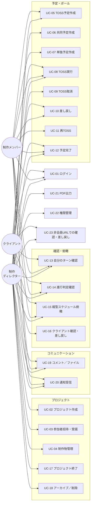

---

## 6. ユースケース／シーケンス図

> 各ユースケースは次の統一フォーマットで記述する。
> **フェーズ列**は要件ID と連動。Phase 0 の UC は見出しに `✅ Phase 0` を付す。

### UC-01: アカウント作成・ログイン（✅ Phase 0）

| 項目 | 内容 |
|---|---|
| アクター | 全ロール |
| 事前条件 | なし（招待経由または自主登録） |
| トリガ | サインアップ／ログインURLにアクセス |
| メインフロー | ①メール・パスワード入力 ②メール認証 ③ログイン成功 |
| 例外 | ③-a 認証失敗、③-b 未認証メール、③-c パスワード再発行 |
| 事後条件 | セッション確立、ダッシュボード／プロジェクト一覧へ遷移 |
| 関連要件 | FR-AUTH-01, 03, 04, 05、SR-AUTH-01, 03 |

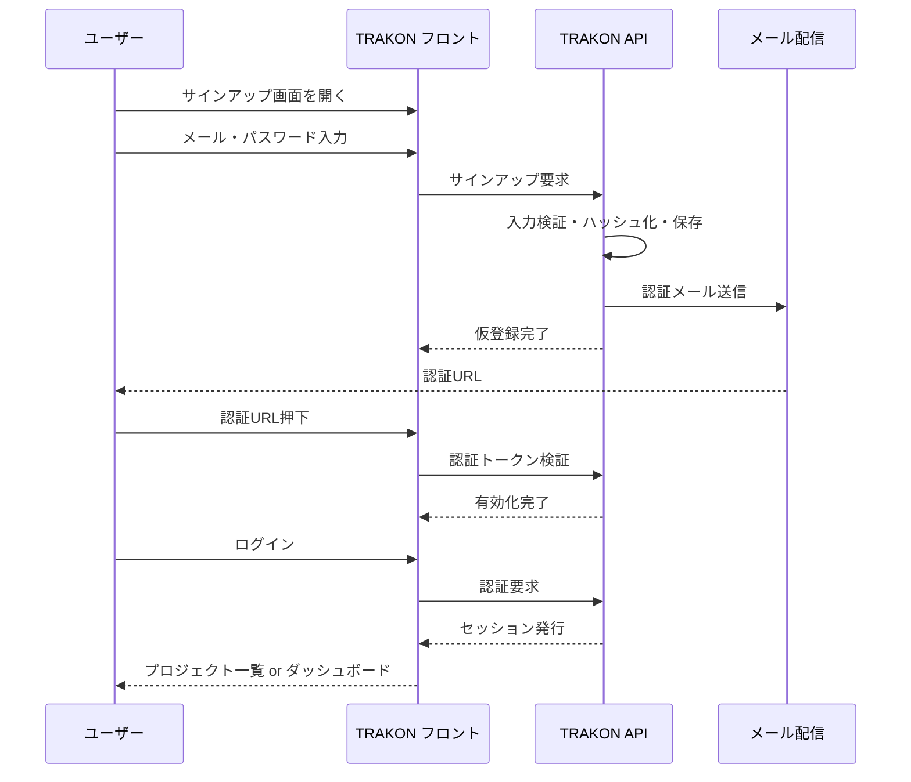

### UC-02: プロジェクト作成（✅ Phase 0）

| 項目 | 内容 |
|---|---|
| アクター | 制作ディレクター |
| 事前条件 | ログイン済み |
| トリガ | プロジェクト一覧で「新規作成」押下 |
| メインフロー | ①名称・開始日・終了日入力 ②制作物を1件以上入力 ③参加者を最大10名まで入力 ④保存 |
| 例外 | 必須未入力、終了日 < 開始日、参加者の所属名未入力（無効扱い） |
| 事後条件 | プロジェクト作成・縦型スケジュール画面へ遷移、未登録メールの参加者には招待メール送付 |
| 関連要件 | FR-PRJ-01, 09、FR-ITEM-01、FR-AUTH-07 |

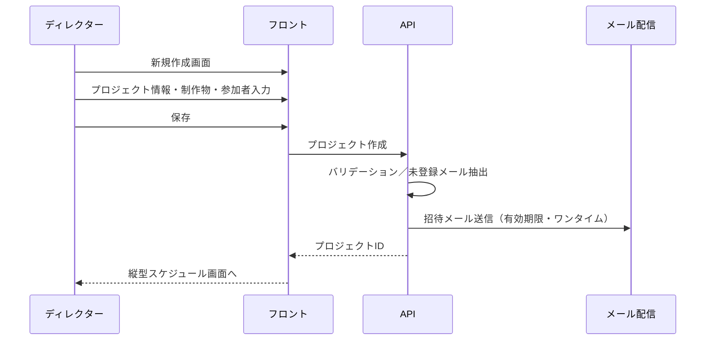

### UC-03: 参加者招待・受諾（✅ Phase 0）

| 項目 | 内容 |
|---|---|
| アクター | ディレクター（招待者）／招待されたユーザー |
| トリガ | プロジェクト作成／編集で参加者追加 |
| メインフロー | ①招待メール受信 ②リンク押下 ③アカウント未作成なら作成、既存なら受諾 ④プロジェクトに参加反映 |
| 例外 | リンク期限切れ、既に受諾済み、メール別ユーザー使用 |
| 事後条件 | プロジェクトの project_members に参加登録 |
| 関連要件 | FR-AUTH-02, 03, 07、SR-AUTH-02 |

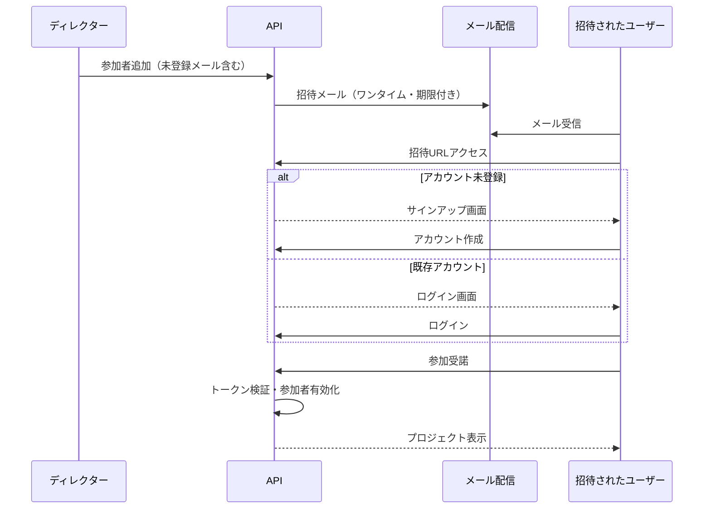

### UC-04: 制作物の登録・編集・削除（✅ Phase 0：登録／編集、Phase 1：削除）

| 項目 | 内容 |
|---|---|
| アクター | ディレクター |
| トリガ | プロジェクト編集画面または作成時 |
| メインフロー | 制作物名入力（＋Phase 1 で item_type 選択）→保存、または編集／削除（確認必須） |
| 事後条件 | project_items 更新。削除は論理削除・ボール履歴は保持 |
| 関連要件 | FR-ITEM-01, 02, 03, 04, 05 |

### UC-05: TOSS予定の作成（✅ Phase 0）

| 項目 | 内容 |
|---|---|
| アクター | ディレクター／制作メンバー |
| トリガ | 各制作物画面の日付セルをクリック |
| メインフロー | ①予定作成モーダル起動 ②（Phase 1）予定種別「TOSS予定」を選択 ③予定名・FROM・TO・予定日・期日・メモ入力 ④保存 |
| 例外 | 必須未入力／FROM と TO が同一 |
| 事後条件 | 予定が保存され、スケジュール上に即時反映。Ball Holder は FROM のまま（TOSS前） |
| 関連要件 | FR-SCH-06, 07, 08, 09、FR-BALL-01, 02 |

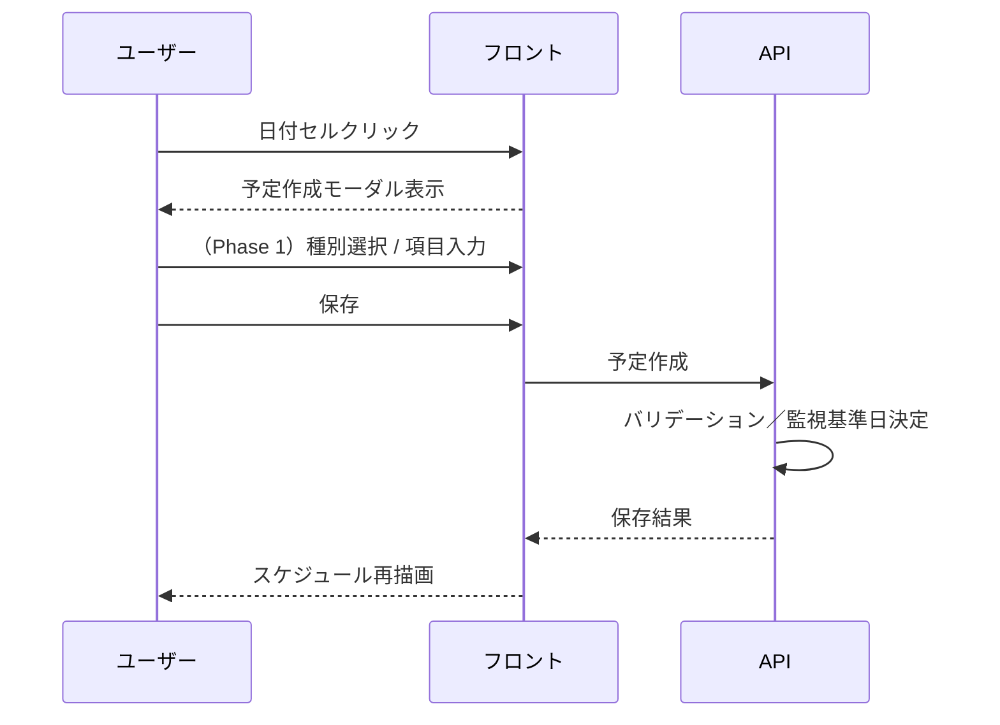

### UC-06: 共同予定の作成（Phase 1）

| 項目 | 内容 |
|---|---|
| アクター | ディレクター |
| トリガ | 日付セルクリック→予定種別「共同予定」を選択 |
| メインフロー | 予定名・主担当者（必須1名）・参加者（任意複数）・予定日・終了予定日・場所／URL・メモ入力→保存 |
| 事後条件 | 主担当者が Ball Holder に設定。主担当者列にチップ表示 |
| 関連要件 | FR-SCH-07, 12, 13、FR-BALL-11 |

### UC-07: 単独予定の作成（Phase 1）

| 項目 | 内容 |
|---|---|
| アクター | 制作メンバー／ディレクター |
| トリガ | 日付セルクリック→予定種別「単独予定」を選択 |
| メインフロー | 予定名・担当者（必須1名）・開始予定日・終了予定日（任意だが強く推奨）・メモ入力→保存 |
| 備考 | 終了予定日未設定の場合、ダッシュボードの初期監視対象外・遅延検知不可。UX上で入力を促す |
| 関連要件 | FR-SCH-07, 14, 15、FR-DASH-02 |

### UC-08: TOSS実行（責任移動）（✅ Phase 0）

| 項目 | 内容 |
|---|---|
| アクター | 現在の Ball Holder／上位権限者（ディレクター） |
| 事前条件 | 対象ボールが Tossed 前、FROM／TO／必須情報が揃っている |
| トリガ | ボール詳細モーダルの「TOSSする」押下 |
| メインフロー | ①モーダル内容確認 ②「TOSSする」押下 ③ローディング ④成功表示 ⑤モーダル自動クローズ |
| 事後条件 | 状態＝Tossed、Ball Holder＝TO、履歴にTOSS実行ログ追加、通知発火（Phase 1） |
| 例外 | 必須未入力、TOSS済みの二重押下 |
| 関連要件 | FR-BALL-02, 03, 10、UI：ボール状態遷移仕様 §9-2 |

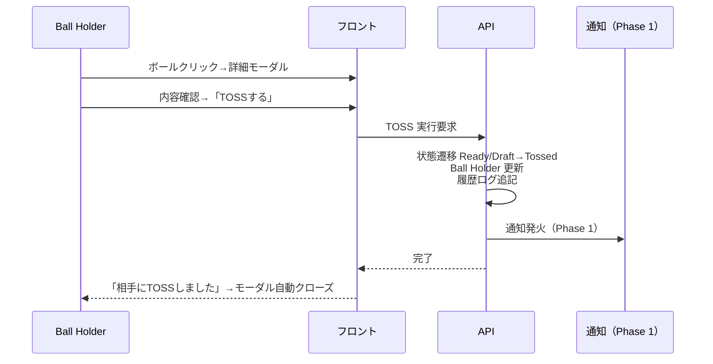

### UC-09: TOSS取消（Phase 1）

| 項目 | 内容 |
|---|---|
| アクター | TOSS実行者本人／上位権限者 |
| 事前条件 | 該当TOSSが最新・相手が未確認／未操作・差し戻しやコメントが発生していない |
| トリガ | ボール詳細モーダルの「TOSSを取り消す」押下（確認モーダルあり） |
| メインフロー | ①確認モーダル ②実行 ③Canceled扱い（物理削除しない） ④Ball Holder再計算 ⑤成功表示 |
| 関連要件 | FR-BALL-05、ボール状態遷移仕様 §7-2 |

### UC-10: 差し戻し（Phase 1）

| 項目 | 内容 |
|---|---|
| アクター | 相手側 Ball Holder（TOSSを受けた側） |
| 事前条件 | 該当ボールが Tossed または Received |
| トリガ | ボール詳細モーダルから差し戻し操作 |
| メインフロー | ①理由入力（任意／必須はプロジェクト設定に準拠） ②実行 ③状態＝Returned・Ball Holder＝FROM側へ戻す ④履歴・通知 |
| 備考 | 取消とは異なり、履歴に正式な往復として残す |
| 関連要件 | FR-BALL-06、ボール状態遷移仕様 §7-3 |

### UC-11: 再TOSS（Phase 1）

| 項目 | 内容 |
|---|---|
| アクター | 差し戻しを受けた元の担当者 |
| 事前条件 | Returned 状態 |
| メインフロー | 修正→「再TOSSする」→状態＝Tossed、Ball Holder＝相手側へ |
| 関連要件 | FR-BALL-07 |

### UC-12: 予定の完了（✅ Phase 0：基本形、Phase 1：種別対応）

| 項目 | 内容 |
|---|---|
| アクター | 担当者／上位権限者 |
| 事前条件 | 対象予定が終結可能な状態 |
| メインフロー | 完了操作→状態＝Completed・履歴ログ追加 |
| 備考 | 予定の完了と制作物の完了は別。次工程は新規予定として別途作成 |
| 関連要件 | FR-BALL-08、予定種別仕様 §8 |

### UC-13: ダッシュボードで自分のターンを確認（Phase 1）

| 項目 | 内容 |
|---|---|
| アクター | 全ロール |
| 事前条件 | ログイン済み、Ball Holder の予定が存在 |
| メインフロー | ①ダッシュボードを開く ②サマリー文言確認 ③3カラム（平常／要確認／遅延）を横断確認 ④気になるカード押下→各制作物画面へ遷移＋該当位置までスクロール＋ハイライト |
| 関連要件 | FR-DASH-01〜09 |

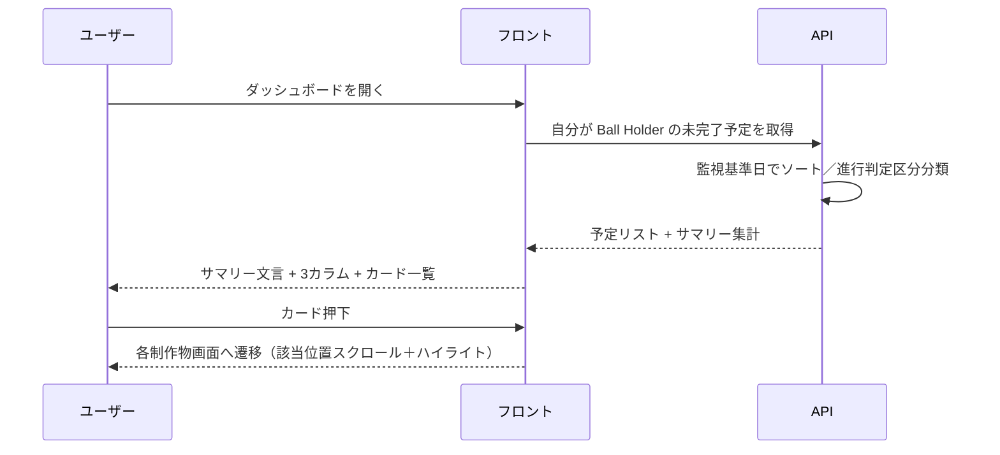

### UC-14: 進行判定（平常／要確認／遅延）の確認（Phase 1）

| 項目 | 内容 |
|---|---|
| アクター | 全ロール |
| 備考 | UC-13 の一部。進行判定のルール：要確認＝基準日から前日・当日・翌日、遅延＝2日以上前かつ未完了 |
| 関連要件 | FR-DASH-05 |

### UC-15: 縦型スケジュールで案件全体を俯瞰（✅ Phase 0：制作物画面のみ、Phase 1：プロジェクトTOP）

| 項目 | 内容 |
|---|---|
| アクター | 全ロール |
| メインフロー | ①各制作物画面または プロジェクトTOP を開く ②日付軸・参加者列・本日・休日・月区切りを確認 ③ボール配置・Ball Holder を視認 |
| 関連要件 | FR-SCH-01〜11、FR-BALL-03 |

### UC-16: クライアントの確認・差し戻し動線（✅ Phase 0：確認、Phase 1：差し戻し）

| 項目 | 内容 |
|---|---|
| アクター | クライアント |
| 事前条件 | プロジェクトへログイン・受諾済み、自分が Ball Holder の予定（例：「確認戻し」）が存在 |
| メインフロー | ①通知メールまたはダッシュボードで自分のターンを認知 ②対象ボール押下→詳細モーダル ③内容確認 ④完了／差し戻し／TOSS返却のいずれかを実行 |
| 備考 | クライアントに対してもログインを必須とする理由：機密情報をインターネット上の公開URLに乗せないため（第9章） |
| 関連要件 | FR-BALL-02, 06, 08、SR-AUTH-01, SR-AUTHZ-02 |

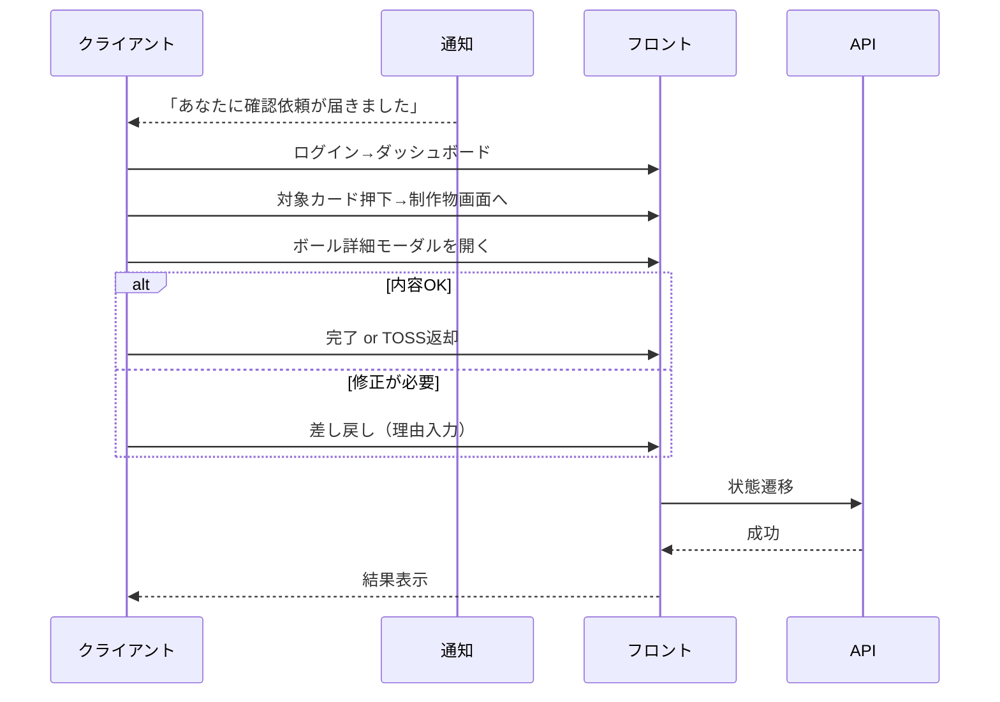

### UC-17: プロジェクト終了（Closed化）（Phase 1）

| 項目 | 内容 |
|---|---|
| アクター | ディレクター |
| 事前条件 | Active のプロジェクト |
| メインフロー | ヘッダー「プロジェクト終了」→確認モーダル（未完了ボール件数警告あり）→status＝closed に更新 |
| 事後条件 | 進行操作不可（ボール追加／TOSS／編集 禁止）、閲覧は可能 |
| 関連要件 | FR-PRJ-05, 06、プロジェクト仕様書 §15 |

### UC-18: プロジェクトのアーカイブ／削除（Phase 1）

| 項目 | 内容 |
|---|---|
| アクター | ディレクター |
| メインフロー | ①アーカイブ→通常一覧から除外 ②アーカイブ一覧から削除（確認必須・論理削除） |
| 関連要件 | FR-PRJ-07, 08 |

### UC-19: コメント投稿／ファイル添付（Phase 1）

| 項目 | 内容 |
|---|---|
| アクター | プロジェクト参加者 |
| メインフロー | ボール詳細モーダル内でコメント投稿、ファイル添付（署名付きURL） |
| 関連要件 | FR-COMM-01, 02, 03、SR-DATA-03 |

### UC-20: 通知受信（Phase 1）

| 項目 | 内容 |
|---|---|
| アクター | 全ロール |
| トリガ | TOSS実行・差し戻し・期日接近・遅延発生 |
| メインフロー | メール通知を受信→対象予定へリンク遷移 |
| 関連要件 | FR-NOTIF-01, 02 |

### UC-21: PDF出力（Phase 1〜2）

| 項目 | 内容 |
|---|---|
| アクター | ディレクター |
| メインフロー | プロジェクトTOP→PDF出力→ダウンロード |
| 備考 | 出力は監査ログ対象（SR-AUDIT-01） |
| 関連要件 | FR-EXPORT-01, 02 |

### UC-22: 権限管理（Phase 2）

| 項目 | 内容 |
|---|---|
| アクター | 組織管理者 |
| メインフロー | ユーザーに組織内ロールを付与／解除 |
| 関連要件 | FR-ORG-02、SR-AUTHZ-01 |

### UC-23: 非会員URLでの確認・差し戻し（Phase 1）

| 項目 | 内容 |
|---|---|
| アクター | クライアント（非会員URL閲覧者） |
| 事前条件 | ディレクターが SC-16 で発行した有効な非会員URLを保有。組織で機能 ON（Phase 2 以降） |
| トリガ | クライアントが受領した非会員URLにアクセス |
| メインフロー | ①URL アクセス（認証不要） ②有効性検証（期限・失効・組織OFF） ③閲覧スコープ表示 ④対象ボールの内容確認 ⑤完了／差し戻し／TOSS返却を実行（必要に応じて表示名・受領メールの確認入力） |
| 例外 | URL期限切れ／個別失効済み／組織OFFで強制失効／総当り検出によるレート制限 |
| 事後条件 | 操作内容が ball_events と監査ログに記録される（IP・UA を含む） |
| 関連要件 | FR-SHARE-01〜06、SR-AUTH-08, 09、SR-AUTHZ-02、SR-AUDIT-01 |

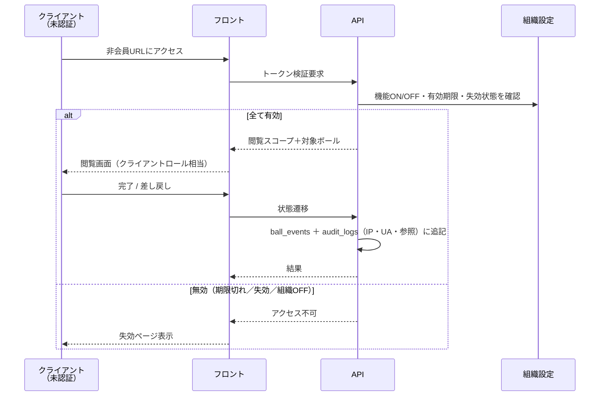

---

## 7. 画面ごとの機能要件・画面項目要件

各画面について、アクター／目的／機能要件（FR-ID紐付け）／画面項目／状態・例外／権限制御を定義する。

### SC-01: サインアップ／ログイン（✅ Phase 0）

- **アクター**：全ロール（未認証状態）
- **目的**：アカウント作成・ログイン・パスワード再発行
- **主機能**：FR-AUTH-01, 03, 04, 05
- **画面項目**：

| 項目 | 型 | 必須 | バリデーション |
|---|---|---|---|
| メールアドレス | Email | ○ | 形式検証、重複登録不可 |
| パスワード | Password | ○ | 長さ8以上／英数記号／既知流出照合（Phase 1） |
| パスワード再入力（サインアップ時） | Password | ○ | 上記と一致 |
| 利用規約・プライバシー同意 | Check | ○ | — |

- **状態**：未入力／入力中／送信中／成功／エラー（認証失敗・ロック）
- **権限**：未認証のみアクセス可能
- **例外／エラー表示**：認証失敗回数制限、メール未認証時の再送導線

### SC-02: 招待受諾（✅ Phase 0）

- **アクター**：招待されたユーザー
- **目的**：招待リンク経由でプロジェクトに参加
- **主機能**：FR-AUTH-02、SR-AUTH-02
- **画面項目**：
  - 招待内容（プロジェクト名・招待者・役割）
  - アカウント未作成なら SC-01 の簡易版、既存ならログインフォーム
- **状態**：有効／期限切れ／既に受諾済み／無効トークン
- **権限**：招待トークンの所有者のみ

### SC-03: プロジェクト一覧（✅ Phase 0）

- **アクター**：全ロール（ログイン済み）
- **目的**：自分が参加するプロジェクトの俯瞰
- **主機能**：FR-PRJ-02
- **画面項目**：
  - プロジェクト名／期間／自分の未完了予定件数（Phase 1）／最終更新
  - 「新規作成」ボタン（ディレクターのみ）
  - タブ：通常一覧／アーカイブ一覧（Phase 1）
- **並び順**：最終更新日時の降順（既定）
- **権限**：自分が参加している project_members.deleted_at IS NULL のもののみ

### SC-04: プロジェクト新規作成（✅ Phase 0）

- **アクター**：ディレクター
- **主機能**：FR-PRJ-01, 09、FR-ITEM-01, 02、FR-AUTH-07
- **画面項目**：

| 項目 | 型 | 必須 | バリデーション／備考 |
|---|---|---|---|
| プロジェクト名 | Text | ○ | 1〜255文字 |
| 開始日 | Date | ○ | |
| 終了日 | Date | ○ | start_date 以降 |
| 制作物 | 繰返（1件以上） | ○ | 名称必須。Phase 1 で item_type |
| 参加者 | 繰返（最大10名） | 初期3行 | 名前／所属名／メール／種別（client/production）／役割（Phase 1）。未入力行は無効 |

- **保存後挙動**：該当プロジェクトの縦型スケジュール画面へ遷移。未登録メールへ招待メール発送。
- **エラー表示**：終了日 < 開始日、参加者の部分入力、制作物0件

### SC-05: プロジェクトTOP（Phase 1）

- **アクター**：全ロール
- **目的**：単一プロジェクト内の制作物を横断する縦型カレンダーで俯瞰
- **主機能**：FR-PRJ-SUM-01, 02, 03、FR-SCH-01〜11
- **ヘッダー**：
  - プロジェクト名（＋Closed時「終了」ラベル）／期間
  - Ball Holder・Next（代表ボール1件）
  - 代表 CAUTION（1件＋「ほか○件」）→サイドバー一覧（同カテゴリ対象ボール）
  - 操作：Active＝PDF／編集／プロジェクト終了、Closed＝PDF／アーカイブ、Archived＝PDF／削除
- **本体**：横軸＝制作物／縦軸＝日付、各セルに主要マイルストーン（＝代表ボール表示）

### SC-06: 各制作物画面（縦型スケジュール）（✅ Phase 0）

- **アクター**：全ロール
- **目的**：単一制作物での予定・ボール操作
- **主機能**：FR-SCH-01〜11、FR-BALL-03、UXR-01〜04
- **ヘッダーエリア**：
  - 制作物名（＋プロジェクト名）／期間
  - Ball Holder（表示形式：所属名＋表示名）・Next
- **本体**：
  - 縦軸＝日付（開始日〜終了日）／横軸＝参加者列（クライアント／制作チーム、所属名グルーピング）
  - 日付セルクリック→予定作成モーダル（SC-07）
  - ボールチップ押下→ボール詳細モーダル（SC-08）
  - 月区切り線、本日強調、土日・祝祭日背景
- **表示の基準**（基本原則第六条「構造で意味を伝える」）：
  - FROM列と TO列を跨ぐチップで TOSS方向を可視化
  - Ball Holder バッジは常に現在責任を持つ側にのみ紐づく
- **空状態**：予定0件時は「日付セルをクリックして予定を作成」ガイド

### SC-07: 予定作成モーダル（種別選択〜入力）（Phase 0：TOSS相当のみ／Phase 1：3種）

- **アクター**：予定を作成する人（通常ディレクター・メンバー）
- **主機能**：FR-SCH-06〜09、FR-SCH-12〜15
- **構成（Phase 1）**：
  1. 種別選択：TOSS予定／共同予定／単独予定（Phase 0 はTOSSのみ）
  2. 種別別フィールドの出し分け：

| 種別 | 項目 | 必須 |
|---|---|---|
| TOSS予定 | 予定名 | ○ |
| TOSS予定 | FROM（プロジェクト参加メンバーから選択） | ○ |
| TOSS予定 | TO（同上） | ○ |
| TOSS予定 | 予定日 | ○ |
| TOSS予定 | 期日 | 任 |
| TOSS予定 | メモ | 任 |
| 共同予定 | 予定名 | ○ |
| 共同予定 | 主担当者（1名） | ○ |
| 共同予定 | 参加者（複数） | 任 |
| 共同予定 | 予定日 | ○ |
| 共同予定 | 終了予定日 | 任 |
| 共同予定 | 場所／URL | 任 |
| 共同予定 | メモ | 任 |
| 単独予定 | 予定名 | ○ |
| 単独予定 | 担当者（1名） | ○ |
| 単独予定 | 開始予定日 | ○ |
| 単独予定 | 終了予定日 | 任（遅延検知のため強く推奨） |
| 単独予定 | メモ | 任 |

- **例外**：FROM=TO、必須未入力
- **保存挙動**：即時反映（Draftなし）。TOSS予定は Ball Holder=FROM のまま（TOSS実行は別ステップ）

### SC-08: ボール詳細モーダル（TOSS／取消／差し戻し）（Phase 0：TOSS・完了／Phase 1：取消・差し戻し）

- **アクター**：予定関係者
- **主機能**：FR-BALL-02〜09、ボール状態遷移仕様 §9
- **状態別ボタン出し分け**：

| 状態 | 表示ボタン |
|---|---|
| Draft / Ready | 閉じる／編集／TOSSする |
| Tossed | 閉じる／履歴を見る／TOSSを取り消す |
| Returned | 閉じる／編集／再TOSSする |
| Completed | 閉じる／履歴を見る |

- **TOSS実行**：確認ダイアログ挟まず、モーダル内で「TOSSする→TOSS中…→相手にTOSSしました→自動クローズ」
- **TOSS取消**：確認ダイアログあり、「このTOSSを取り消して、ボールを元の状態に戻しますか？」
- **差し戻し**：理由入力（任意または必須：プロジェクト設定）、「差し戻しました」
- **履歴表示**：TOSS／取消／差し戻し／再TOSS／完了の時系列ログ
- **コメント／添付**（Phase 1）：同モーダル内タブで表示

### SC-09: ダッシュボード（3カラム）（Phase 1）

- **アクター**：全ロール
- **主機能**：FR-DASH-01〜09
- **画面構成**：

```
┌──────────────────────────────────────────┐
│ ▼ サマリー文言（例：「いくつかの予定が遅延しています」）  │
├────────────┬────────────┬────────────┤
│ 平常        │ 要確認      │ 遅延        │
│ ─────────  │ ─────────  │ ─────────  │
│ [カード]    │ [カード]    │ [カード]    │
│  PRJ名     │  PRJ名     │  PRJ名     │
│  予定名     │  予定名     │  予定名     │
│  期日      │  期日      │  期日      │
│  Ball Holder│  Ball Holder│  Ball Holder│
│ ...        │ ...        │ ...        │
└────────────┴────────────┴────────────┘
```

- **カード項目**：プロジェクト名／予定名／期日／Ball Holder（所属名＋表示名）
- **並び順**：カラム内は監視基準日が古い順→last_action_at が古い順→id 昇順
- **遷移**：カード押下→各制作物画面（該当位置スクロール・ハイライト）
- **空状態**：「すべての予定は平常で進行しています。」

### SC-10: プロジェクト編集（✅ Phase 0：基本、Phase 1：終了・アーカイブ）

- **アクター**：ディレクター
- **主機能**：FR-PRJ-03, 04, 05, 06, 07、FR-ITEM-03, 04
- **画面項目**：SC-04 と同項目＋制作物の追加／編集／削除、参加者の追加／is_active 切替／削除
- **操作**：
  - 「プロジェクト終了」（Active時のみ、Phase 1）
  - 「アーカイブ」（Closed時、Phase 1）
  - 「削除」（Archived時、Phase 1、確認必須）
- **警告**：終了日変更で範囲外ボール、終了操作時の未完了ボール件数

### SC-11: 参加者管理（✅ Phase 0：基本、Phase 1：詳細）

- **アクター**：ディレクター
- **主機能**：FR-AUTH-07, 08, 09
- **画面項目**：名前／所属名／メール／種別／役割（Phase 1）／sort_order（カレンダー列順）／is_active／削除（論理）

### SC-12: アーカイブ一覧（Phase 1）

- **アクター**：ディレクター
- **主機能**：FR-PRJ-07, 08
- **画面項目**：プロジェクト名／アーカイブ日時／ステータス（Closed）／操作（復元／削除）

### SC-13: コメント／ファイル共有パネル（Phase 1）

- **アクター**：プロジェクト参加者
- **主機能**：FR-COMM-01, 02, 03、SR-DATA-02, 03
- **画面項目**：コメント入力／投稿履歴／添付ファイルリスト（プレビュー・ダウンロードは署名付きURL）
- **権限**：プロジェクト参加者のみ。退出済み（deleted_at）は閲覧不可

### SC-14: 通知設定（Phase 1）

- **アクター**：全ロール
- **主機能**：FR-NOTIF-02
- **画面項目**：通知種別ごとの ON/OFF（TOSS受領／差し戻し／期日接近／遅延発生）

### SC-15: アカウント／組織設定（Phase 1〜2）

- **アクター**：全ロール／組織管理者
- **主機能**：FR-AUTH-05, 06、FR-ORG-01, 02, 03、FR-ORG-04（Phase 2）
- **画面項目**：プロフィール／パスワード変更／MFA／組織ロール／プラン／請求（Phase 2）／**非会員URL共有 機能 On/OFF（Phase 2、組織管理者のみ）**

### SC-16: 非会員URL 発行・管理（Phase 1）

- **アクター**：ディレクター
- **目的**：クライアント向けの非会員URLを発行・管理する
- **主機能**：FR-SHARE-01, 02, 03, 04
- **画面項目**：

| 項目 | 型 | 必須 | 備考 |
|---|---|---|---|
| 発行ボタン | Button | ○ | 組織で機能 OFF の場合は非表示（FR-SHARE-07） |
| 共有スコープ | Select | ○ | プロジェクト全体／特定の制作物／特定のボール |
| 有効期限 | Date / Duration | ○ | 既定値はシステム規定。発行者は範囲内で延長可（FR-SHARE-02） |
| 発行済URL一覧 | List | — | URL／発行者／発行日時／有効期限／状態（有効／失効）／個別失効ボタン |
| アクセスログ | List | — | 時刻／IP／UA／参照リソース（FR-SHARE-04） |

- **状態**：未発行／発行済（有効）／失効済／組織OFFによる強制失効
- **権限**：ディレクターのみ。組織で機能OFFの場合は本画面そのものへのアクセスを禁止
- **例外／エラー表示**：トークン生成失敗、組織方針違反、有効期限超過

---

## 8. データモデル概要

### 8.1. ER図（主要エンティティ）

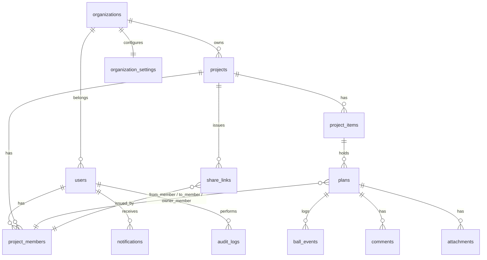

> 詳細なカラム定義はDB設計仕様書で別途定義。ここでは主要カラムと、各テーブルが司る機能・情報の概要を整理する。
>
> **命名方針（v1.2 改訂）**：概念用語の「スケジュール（縦型カレンダーの "箱"）」は派生ビュー（projects＋project_members＋project_items から組み立てる）であり、独立した物理テーブルを持たない。**「予定」を格納する物理テーブルは `plans`** とする（v1.1 までの `schedules` を改名）。本書末尾の旧名対応表も参照。

### 8.2. 主要テーブル（要点のみ）

各テーブル冒頭の **コメント** に、そのテーブルが司る機能・情報・関連ユースケースを記す。詳細なカラム定義（型・制約・インデックス）は DB設計仕様書で別途定義する。

#### users（認証ユーザー）

> **コメント**：システムに永続参加するアカウントの認証情報を管理する。プロジェクトの永続参加・編集を行う全ロール（ディレクター／メンバー／クライアント）が必ず1行を持つ。非会員URL閲覧者（FR-SHARE）は本テーブルに行を持たない。
> **司る機能**：UC-01 アカウント作成・ログイン／FR-AUTH-01〜06／SR-AUTH-01〜07
> **関連**：`project_members.user_id`, `audit_logs.actor_user_id`, `notifications.user_id`

| カラム | 説明 |
|---|---|
| id | PK |
| email | ログインID／一意 |
| password_hash | パスワード（ハッシュ化） |
| display_name | 表示名 |
| email_verified_at | メール認証完了日時 |
| mfa_enabled / mfa_secret | 多要素認証（Phase 2、SR-AUTH-06） |
| organization_id | FK（Phase 2、組織所属） |
| created_at / updated_at / deleted_at | 監査・論理削除 |

#### organizations（組織・テナント／Phase 2）

> **コメント**：複数プロジェクトと所属ユーザーを束ねる組織単位。料金プラン・組織レベル統制（非会員URL共有のOn/OFF など）の付与点。
> **司る機能**：FR-ORG-01〜05／FR-NOTIF-03／UC-22
> **関連**：`users.organization_id`, `projects.organization_id`, `organization_settings.organization_id`

| カラム | 説明 |
|---|---|
| id | PK |
| name | 組織名 |
| plan_type | Free / Personal / Team S / Team Std / Team Pro（FR-ORG-03） |
| created_at / updated_at / deleted_at | 監査・論理削除 |

#### organization_settings（組織レベル統制設定／Phase 2）

> **コメント**：組織管理者が一括 On/OFF できる機能フラグを格納する。`organizations` と 1:1。フラグの変更は監査ログ必須（SR-AUDIT-01）。
> **司る機能**：FR-ORG-04, 05／FR-SHARE-07／SR-AUTH-09
> **関連**：`organizations.id`

| カラム | 説明 |
|---|---|
| id | PK |
| organization_id | FK／一意 |
| share_links_enabled | 非会員URL共有の On/OFF（既定：false 推奨／FR-ORG-04） |
| share_links_default_ttl | 非会員URL の既定有効期限（秒） |
| share_links_max_ttl | 発行者が指定可能な上限有効期限（秒） |
| updated_by | 最終更新者ユーザーID |
| updated_at | 監査 |

#### projects（プロジェクト本体／プロジェクト仕様書 v1.2 §13）

> **コメント**：参加者・制作物・予定・非会員URL を束ねる親エンティティ。期間（start_date〜end_date）はスケジュール（縦型カレンダー）の縦軸の根拠となる。状態は業務状態 `status`（active/closed）と表示状態 `archived_at` を分離管理。
> **司る機能**：FR-PRJ-01〜09／UC-02 プロジェクト作成／UC-17 終了／UC-18 アーカイブ・削除
> **関連**：`project_members.project_id`, `project_items.project_id`, `share_links.project_id`

| カラム | 説明 |
|---|---|
| id | PK |
| organization_id | FK（Phase 2） |
| name | プロジェクト名（必須） |
| start_date / end_date | 期間（必須）／縦型カレンダーの縦軸 |
| status | active / closed |
| created_by | 認証ユーザーID |
| closed_at / archived_at / deleted_at | 状態管理（論理削除前提） |
| created_at / updated_at | 監査 |

#### project_members（プロジェクト参加者／§13）

> **コメント**：プロジェクトに参加する個人。ログインユーザーと紐づく行（`user_id` 設定）と、招待中・名刺記載のみの行（user_id NULL）が併存しうる。所属名グルーピングと表示順は、各制作物画面（SC-06）の横軸（参加者列）の根拠となる。
> **司る機能**：FR-AUTH-07〜09／FR-SCH-02／UC-03 参加者招待・受諾／SC-11 参加者管理
> **関連**：`plans.from_member_id / to_member_id / owner_member_id`, `ball_events.actor_member_id`, `share_links.issued_by_member_id`

| カラム | 説明 |
|---|---|
| id | PK |
| project_id | FK |
| user_id | FK（招待受諾後にセット／未受諾は NULL） |
| name / email / organization_name | 個人属性 |
| member_type | client / production |
| role_type | director / designer / engineer / client 等（Phase 1） |
| sort_order | カレンダー横軸の表示順 |
| is_active | 一時非表示（Phase 1、FR-AUTH-09） |
| deleted_at | 論理削除（Phase 1） |

#### project_items（制作物／§13）

> **コメント**：プロジェクトに紐づく成果物単位（Webページ／ドキュメント／バナー など）。各制作物が独立した縦型スケジュール画面（SC-06）を持ち、配下の予定（plans）はこの単位で管理される。制作物自体は status を持たず、状態は配下 plans の集計で表現する。
> **司る機能**：FR-ITEM-01〜05／UC-04 制作物の登録・編集・削除
> **関連**：`plans.item_id`

| カラム | 説明 |
|---|---|
| id | PK |
| project_id | FK |
| name | 必須 |
| item_type | page / document / banner / other（Phase 1） |
| sort_order / start_date / end_date | 補助 |
| deleted_at | 論理削除 |

#### plans（予定／予定種別仕様書 v1.1 §10）

> **コメント**：制作物に紐づく **「予定」**（工程の単位）を格納する物理テーブル。**v1.1 まで `schedules` と命名されていたが、概念用語「予定」と整合させるため v1.2 で `plans` に改名**。3種別（TOSS予定／共同予定／単独予定）を `plan_type` で判別する単一テーブル方式。「Ball Holder」は本テーブルから導出する（TOSS：最新の to_member、TOSS前は from_member／共同・単独：owner_member）。
> **司る機能**：FR-SCH-01〜16／FR-BALL-01, 02, 03, 08, 11／UC-05〜08, 12／SC-06 各制作物画面／SC-07 予定作成モーダル／SC-08 ボール詳細モーダル
> **関連**：`ball_events.plan_id`, `comments.plan_id`, `attachments.plan_id`

| カラム | 説明 |
|---|---|
| id | PK |
| item_id | FK（制作物／project_items） |
| plan_type | toss / shared / solo（旧 `schedule_type`／Phase 0 は toss のみ） |
| title | 予定名 |
| scheduled_date | 予定日（TOSS／共同）／開始予定日（単独） |
| due_date | 期日（任意・TOSS用） |
| end_date | 終了予定日（任意・共同／単独用） |
| from_member_id / to_member_id | TOSS予定の FROM／TO（FK：project_members） |
| owner_member_id | 主担当者（共同）または担当者（単独）／＝Ball Holder（FK：project_members） |
| participants | 参加者リスト（共同・将来用、JSON または別テーブル） |
| location_or_url | 場所／URL（共同予定用） |
| status | active / completed / canceled |
| memo / started_at / completed_at | 補助 |
| deleted_at | 論理削除（Phase 1 以降。Phase 0 MVP は物理削除：FR-BALL-12） |

#### ball_events（ボール責任移動履歴）

> **コメント**：「ボール」（責任の所在）の移動・操作を時系列で **追記専用** に記録する履歴テーブル。物理削除しない。差し戻し（Returned）／TOSS取消（Canceled）／再TOSS／完了などの遷移を全て記録し、現在の Ball Holder は `plans` ＋本テーブルから導出する。
> **司る機能**：FR-BALL-04〜10／UC-08 TOSS実行／UC-09 TOSS取消／UC-10 差し戻し／UC-11 再TOSS／UC-12 予定完了
> **関連**：`plans.id`, `project_members.id`

| カラム | 説明 |
|---|---|
| id | PK |
| plan_id | FK（旧 `schedule_id`） |
| event_type | tossed / canceled / returned / retossed / completed |
| actor_member_id | 実行者（FK：project_members） |
| occurred_at | 実行日時 |
| note | メモ（差し戻し理由など） |

#### share_links（非会員URL／Phase 1）

> **コメント**：v1.1 で正式採用した「非会員URL共有」のトークンと統制属性を格納する。1行＝1発行URL。短時間有効期限・個別失効・組織OFFによる強制失効を行う。アクセス事実そのものは `audit_logs` に記録（FR-SHARE-04）。組織で機能 OFF（`organization_settings.share_links_enabled = false`）の場合、本テーブルの行は強制 `revoked` 扱いとなる。
> **司る機能**：FR-SHARE-01〜07／SR-AUTH-08, 09／UC-23 非会員URLでの確認・差し戻し／SC-16 非会員URL 発行・管理
> **関連**：`projects.id`, `project_items.id`（任意）, `plans.id`（任意）, `project_members.id`（発行者）

| カラム | 説明 |
|---|---|
| id | PK |
| project_id | FK |
| scope_type | project / item / plan（共有スコープ） |
| scope_target_id | scope_type に応じた対象ID（item_id または plan_id、project_type なら NULL） |
| token | 推測不能なランダム文字列（≥256bit）／一意 |
| issued_by_member_id | 発行者（FK：project_members） |
| issued_at | 発行日時 |
| expires_at | 有効期限（FR-SHARE-02） |
| revoked_at | 個別失効日時（FR-SHARE-03、未失効は NULL） |
| organization_off_revoked | 組織OFFによる強制失効フラグ（FR-SHARE-07） |
| last_accessed_at | 最終アクセス日時（運用情報） |

#### comments（コメント／Phase 1）

> **コメント**：予定（plan）に対する投稿コメント。プロジェクト参加者および非会員URL閲覧者（権限スコープ内）が投稿可能。
> **司る機能**：FR-COMM-01, 03／UC-19 コメント投稿
> **関連**：`plans.id`, `project_members.id`（または非会員URL閲覧者の表示名）

| カラム | 説明 |
|---|---|
| id | PK |
| plan_id | FK（旧 `schedule_id`） |
| author_member_id | 投稿者（FK：project_members、非会員URL経由は NULL＋display_name） |
| display_name | 非会員URL経由投稿時の表示名（任意） |
| body | 本文 |
| created_at / updated_at / deleted_at | 監査・論理削除 |

#### attachments（添付ファイル／Phase 1）

> **コメント**：予定（plan）に紐づく添付ファイルのメタデータ。実体は外部ストレージに置き、配信は署名付きURL＋短時間有効期限とする（直リンク禁止）。
> **司る機能**：FR-COMM-02, 03／SR-DATA-02, 03, 05
> **関連**：`plans.id`, `project_members.id`

| カラム | 説明 |
|---|---|
| id | PK |
| plan_id | FK（旧 `schedule_id`） |
| uploader_member_id | アップロード者（FK：project_members） |
| storage_key | ストレージのオブジェクトキー |
| filename / mime_type / size_bytes | メタデータ |
| created_at / deleted_at | 監査・論理削除 |

#### notifications（通知／Phase 1）

> **コメント**：メール通知の送信履歴と受信者ごとの設定（種別ごと ON/OFF）を管理する。Phase 2 でチーム通知・Slack/Chatwork/Teams 連携を追加。
> **司る機能**：FR-NOTIF-01〜04／UC-20 通知受信／SC-14 通知設定
> **関連**：`users.id`, `plans.id`（通知対象）

| カラム | 説明 |
|---|---|
| id | PK |
| user_id | FK |
| plan_id | FK（通知対象の予定／NULL もあり） |
| notif_type | toss_received / returned / due_approaching / overdue 等 |
| sent_at | 送信日時 |
| read_at | 既読日時（任意） |
| settings_json | 受信者の通知種別設定キャッシュ |

#### audit_logs（監査ログ）

> **コメント**：重要操作を **追記専用・改ざん防止** で記録する。SR-AUDIT-01〜04 の要件を満たす。記録対象は §9.6 を参照（ログイン／TOSS／TOSS取消／差し戻し／再TOSS／予定完了／参加者追加・削除・ロール変更／制作物削除／プロジェクト終了・アーカイブ・削除／PDF出力／ファイルダウンロード／**非会員URL アクセス**）。
> **司る機能**：SR-AUDIT-01〜04／FR-SHARE-04（非会員URLアクセス記録）／SR-INCIDENT-03（影響範囲特定）
> **関連**：`users.id`（actor）, 各リソースの id（resource_id）

| カラム | 説明 |
|---|---|
| id | PK |
| occurred_at | 発生日時（タイムスタンプ） |
| actor_user_id | 実行者ユーザーID（非会員URL経由は NULL） |
| share_link_id | FK：share_links（非会員URL経由のアクセス時のみ） |
| ip / user_agent | ネットワーク主体（FR-SHARE-04） |
| resource_type / resource_id | 対象リソース種別・ID |
| action | 操作種別（login / toss / cancel / return / retoss / complete / share_access 等） |
| result | success / failure |
| extra_json | 補助メタデータ（差し戻し理由・PDF出力範囲 等） |

#### v1.2 改名対応表（過去版互換）

| 旧名（v1.0／v1.1） | 新名（v1.2 以降） | 備考 |
|---|---|---|
| `schedules` テーブル | `plans` | 概念用語「予定」と整合 |
| `schedules.schedule_type` | `plans.plan_type` | toss / shared / solo |
| `ball_events.schedule_id` | `ball_events.plan_id` | FK 改名 |
| `comments.schedule_id` | `comments.plan_id` | FK 改名 |
| `attachments.schedule_id` | `attachments.plan_id` | FK 改名 |

### 8.3. ボール状態遷移図

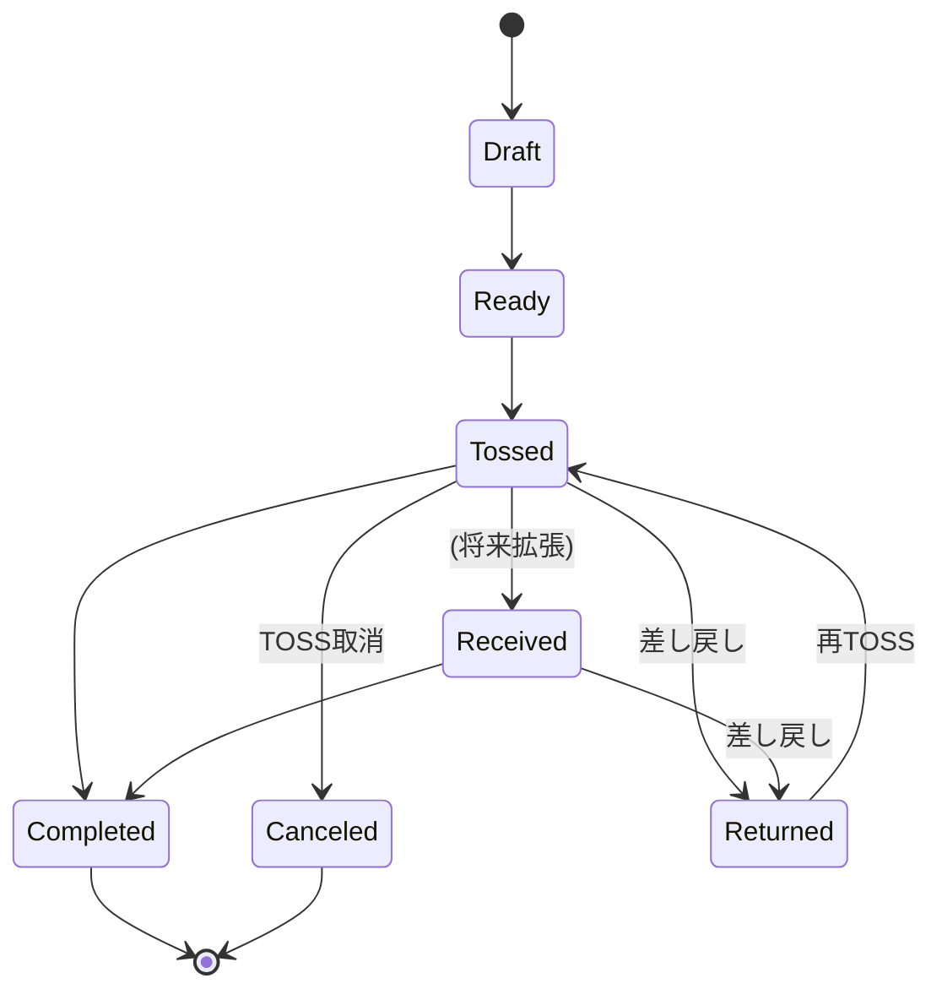

> **Phase 0 実装**：Ready / Tossed / Completed を最小実装。Draft / Received は持たない。Canceled / Returned は Phase 1。

### 8.4. プロジェクト状態遷移

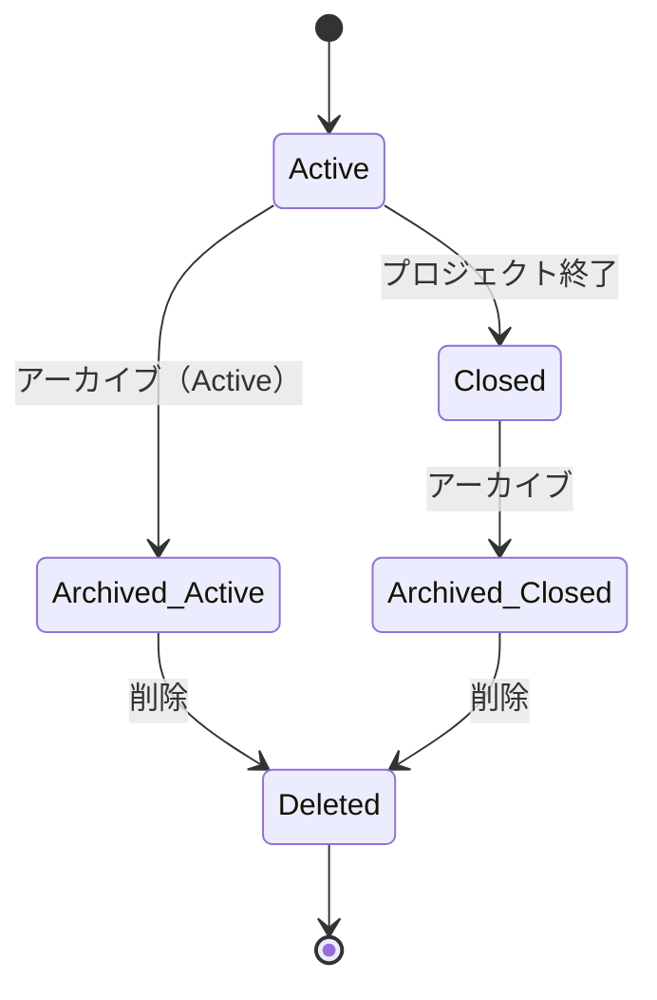

### 8.5. 論理削除・履歴保持の方針

- **projects / project_members / project_items / plans** はすべて論理削除（deleted_at）を基本とする
- **ball_events** は追記のみ。物理削除しない
- **MVP（Phase 0）例外**：ボール削除は即時物理削除（MVP仕様書 §6.3）。Phase 1 以降で論理削除へ移行
- **audit_logs** は追記専用・改ざん防止
- **share_links** は失効後も履歴として保持（`revoked_at` セット）。物理削除はしない（監査用）

---

## 9. セキュリティ要件

> **第一原則：クライアントの機密は、設計段階から守る。**
> TRAKON は制作案件の進行を扱う。案件情報には未公開ロゴ、未発表キャンペーン、価格、人事情報、契約条件が含まれうる。
> **機密の公開失敗は、ユーザー1社の信用を超えて TRAKON 全体の信用を毀損する**。
> 本章は、一般的 PRD の「非機能要件の一節」ではなく、プロダクト設計上の独立した中核章として位置づける。

### 9.1. 基本方針

| 方針 | 内容 |
|---|---|
| **機密第一** | クライアント機密の保護を、使いやすさや機能追加に優先する |
| **最小権限** | 各ユーザーは、自分の責務遂行に必要な最小限の情報のみアクセスできる |
| **デフォルト非公開** | 新規作成物はすべてプロジェクト参加者限定。公開は明示操作を必要とする |
| **公開範囲は最小化・統制下で許可** | 認証なしでの機密アクセスは原則排除する。例外として「非会員URL共有」を Phase 1 以降の機能として認めるが、短時間有効期限・個別失効・組織管理者による一括 On/OFF・全アクセスの監査ログ化を必須とする（§9.2） |
| **監査可能性** | 重要操作は漏れなく記録し、事後検証できる状態を常に保つ |
| **失敗に備える** | 漏えい・誤操作・退職・アカウント乗っ取りへの備えを事前に設計する |

### 9.2. 非会員URL共有の採用方針（設計判断の明文化）

クライアント体験向上の観点から、**Phase 1 で「非会員URL共有」を正式機能として採用する**。一方、本機能には次節に列挙する固有のリスクがあるため、**組織管理者による一括 On/OFF（Phase 2）**と、**URL自体の安全装置**を必須前提として設計する。本節はその採用根拠と統制ポリシーを明文化する。

#### 9.2.1. 認識しているリスク

| リスク | 内容 |
|---|---|
| **意図せぬ拡散** | URLはスクリーンショット・転送・ブックマーク同期・チャット履歴・スマホの QR 読み取りなどで容易に拡散する |
| **検索エンジンインデックス** | robots.txt・`noindex` は万能ではなく、CDN キャッシュや短縮URL サービスが保存する可能性がある |
| **総当り** | トークン空間が小さい／生成規則が弱いと、URL 総当りで到達される |
| **監査困難** | 誰が見たかの本人特定ができず、SR-AUDIT-01 の監査ログが事実上機能しない |
| **取消しの不確実性** | 一度漏えいした URL は、ページ側を無効化してもコピー・スクリーンショットが残る |
| **大企業セキュリティ方針との衝突** | 認証不要 URL を社内で開くこと自体が禁止される組織が存在する |

#### 9.2.2. 採用判断の根拠

| 観点 | 内容 |
|---|---|
| **クライアント体験** | クライアントは本業を持ちながら制作案件を確認している層が多い。アカウント作成・ログインの摩擦を回避できることで、確認・差し戻しの即時性が大きく向上する |
| **採用しない場合の運用劣化** | ログイン強制下では、ディレクター側がメールやチャットでのスクリーンショット送付・PDF送付に逃げる運用劣化が発生し、結果として情報統制がむしろ弱まる |
| **統制装置の存在** | 組織管理者が機能利用を一括 On/OFF できる枠組み（Phase 2）と、URL 単位の安全装置（短時間有効期限・個別失効・監査ログ）を組み合わせれば、リスクは管理可能な範囲に抑えられる |

#### 9.2.3. 統制ポリシー（必須要件）

| 統制 | 内容 | 関連要件 |
|---|---|---|
| **組織レベル On/OFF** | 組織管理者が組織全体に対して機能利用を許可／禁止する。OFF時は発行ボタン非表示・既存URL即時失効 | FR-ORG-04, 05、FR-SHARE-07、SR-AUTH-09 |
| **短時間有効期限** | 既定値はシステム規定。発行者は範囲内で延長可。期限経過後は自動失効 | FR-SHARE-02、SR-AUTH-08 |
| **個別失効** | 発行者は発行済みURLを個別に手動失効できる | FR-SHARE-03 |
| **監査ログ** | 全アクセス（成功／失敗）について時刻・IP・UA・参照リソースを記録 | FR-SHARE-04、SR-AUDIT-01 |
| **権限スコープ** | 非会員URLでの操作権限はクライアントロール相当に限定（§9.4） | FR-SHARE-05、SR-AUTHZ-02 |
| **クローラ防止** | `noindex`・`nofollow`・`X-Robots-Tag`、URL構造はトークン空間 ≥ 256bit、推測不能 | 本節で定義 |
| **既定値はOFF（推奨）** | 組織新規作成時、機能の既定値は OFF とし、明示的に有効化操作を要する | FR-ORG-04（運用既定値） |

#### 9.2.4. 採用しない選択肢として残すもの

非会員URLが組織方針として禁止されているクライアントに対しては、従来通り**ログイン会員（招待→ワンタイムリンク→アカウント作成 or ログイン）**による参加経路を提供し続ける。両方式は併存し、案件ごと・クライアントごとに使い分け可能とする。

（基本原則 第十二条：短期最適より長期一貫を優先する／第十三条：足し算よりも、選別に責任を持つ — 採用に伴う統制装置を一体で定義することで、選別責任を果たす。）

### 9.3. 認証

| ID | 要件 |
|---|---|
| SR-AUTH-01 | 全ロール（ディレクター／メンバー／クライアント）の永続参加（編集権限を伴う行動）はアカウント認証を必須とする。Phase 1 以降、クライアントの閲覧・確認動線に限り、§9.2 の統制下で非会員URL共有による未認証アクセスを許容する |
| SR-AUTH-02 | 招待リンクはワンタイム・短時間有効期限（既定72時間以内、TBD）とする |
| SR-AUTH-03 | パスワードは最低8文字・英数記号混在。Have I Been Pwned 等と照合（Phase 1） |
| SR-AUTH-04 | 認証失敗回数に応じたロックアウトとレート制限 |
| SR-AUTH-05 | メールアドレス変更は旧メール・新メール双方への通知と再認証 |
| SR-AUTH-06 | 多要素認証（MFA、TOTP）を提供する（Phase 2） |
| SR-AUTH-07 | セッション有効期限／デバイス一覧／強制ログアウト機能（Phase 2） |
| SR-AUTH-08 | 非会員URLは短時間有効期限・個別失効・全アクセスの監査ログ記録を必須とする（FR-SHARE-02, 03, 04） |
| SR-AUTH-09 | 組織管理者は組織レベルで非会員URL共有機能を On/OFF できる。OFF時は発行UI非表示・既発行URLは即時失効（FR-ORG-04, 05、FR-SHARE-07） |

### 9.4. 認可

| ID | 要件 |
|---|---|
| SR-AUTHZ-01 | データアクセスは常にプロジェクト参加認可を確認してから行う（API・DB行レベル） |
| SR-AUTHZ-02 | ロール別操作権限（下表） |
| SR-AUTHZ-03 | 退出・退会したユーザーは、退出時点以前の閲覧も含めアクセス不可（閲覧履歴は audit_logs に保持） |
| SR-AUTHZ-04 | 参加者追加・削除・ロール変更は確認必須・監査記録 |

#### ロール別操作マトリクス

| 操作 | ディレクター | 制作メンバー | クライアント | 非会員URL閲覧者 | 未参加ユーザー |
|---|:---:|:---:|:---:|:---:|:---:|
| プロジェクト作成 | ○ | ○※1 | × | × | × |
| プロジェクト編集・終了・アーカイブ・削除 | ○ | × | × | × | × |
| 参加者の追加・削除 | ○ | × | × | × | × |
| 制作物の登録／編集／削除 | ○ | × | × | × | × |
| 予定作成（全種別） | ○ | ○ | × | × | × |
| 自分が Ball Holder の予定に TOSS／完了 | ○ | ○ | ○ | ○※2 | × |
| 他者の予定を編集 | ○（上位権限） | × | × | × | × |
| TOSS取消（自分の TOSS） | ○ | ○ | ○ | ○※2 | × |
| TOSS取消（他者の TOSS） | ○（上位権限） | × | × | × | × |
| 差し戻し | ○ | ○ | ○ | ○※2 | × |
| プロジェクト閲覧 | ○ | ○ | ○ | ○※3 | × |
| コメント投稿／ファイル添付 | ○ | ○ | ○ | △※2 | × |
| PDF出力 | ○ | × | × | × | × |
| 非会員URLの発行・失効（FR-SHARE-01,03） | ○ | × | × | × | × |
| 組織設定／プラン変更（Phase 2） | 組織管理者のみ | × | × | × | × |
| 非会員URL共有機能の On/OFF（FR-ORG-04） | 組織管理者のみ | × | × | × | × |

※1：Phase 2 以降で組織権限により制御
※2：Phase 1 以降。非会員URL閲覧者の操作可能範囲はクライアントロール相当。各操作時に表示名（ハンドル）または受領メールの確認入力を求めることがある（FR-SHARE-06）
※3：非会員URLが「自分が Ball Holder のボール」を含むよう発行された場合に限り表示。プロジェクト全体の閲覧スコープは発行者の指定範囲に従う

### 9.5. データ保護

| ID | 要件 |
|---|---|
| SR-DATA-01 | 通信は TLS 1.2 以上を必須。HSTS を有効化 |
| SR-DATA-02 | 保管時暗号化：DB（ディスク暗号化）、添付ファイル（オブジェクトストレージの暗号化） |
| SR-DATA-03 | 添付ファイルは署名付きURL＋短時間有効期限（既定15分、TBD）。直リンクURLを発行しない |
| SR-DATA-04 | プレビュー時の透かし表示（Phase 2+、機密性の高い案件向けオプション） |
| SR-DATA-05 | アップロードファイルのサイズ・MIME・拡張子制限、ウイルススキャン（Phase 2） |
| SR-DATA-06 | PII／機密ワードを含むログ出力を禁止（スタックトレース／監査ログの取り扱いを含む） |

### 9.6. 監査ログ

| ID | 要件 |
|---|---|
| SR-AUDIT-01 | 以下の操作を監査ログに記録する：ログイン／ログアウト／TOSS／TOSS取消／差し戻し／再TOSS／予定完了／参加者追加・削除・ロール変更／制作物削除／プロジェクト終了・アーカイブ・削除／PDF出力／ファイルダウンロード |
| SR-AUDIT-02 | 監査ログは追記専用、改ざん防止。タイムスタンプ・主体（ユーザーID・IP・UA）・対象リソース・結果を記録 |
| SR-AUDIT-03 | 保管期間：最低13ヶ月（Phase 2 で延長検討） |
| SR-AUDIT-04 | 監査ログの閲覧は組織管理者のみ（Phase 2） |

### 9.7. プロジェクト終了／退会時のデータ取り扱い

| 状況 | データ取り扱い |
|---|---|
| プロジェクトを Closed | 進行操作不可。閲覧・履歴保持。archived_at 未設定 |
| プロジェクトを Archived | 通常一覧から非表示。閲覧可能。進行集計対象外 |
| プロジェクト削除 | 論理削除（deleted_at）。物理削除は契約終了・規約第15条等に基づく一定期間後 |
| ユーザーがプロジェクトから退出 | project_members.deleted_at 設定。退出後の閲覧不可 |
| ユーザーが退会 | 本人の PII を匿名化／削除。監査ログは別法令・規約に従い一定期間保持 |
| 契約終了 | 利用規約に基づくデータ削除手順を実行 |

### 9.8. 機密の共有を安全に行う原則

| 原則 | 内容 |
|---|---|
| クローズ原則 | プロジェクト内でしか情報が流通しないように設計 |
| 明示操作原則 | 参加者追加・ロール変更・外部共有は必ず明示操作。UI で誤操作を防ぐ |
| 外部連携の制御 | Slack／Chatwork／Teams 等の連携（Phase 2+）は組織管理者の承認制 |
| URL 秘匿 | 画面内の共有URL・ダウンロードURL はすべて認証下・署名付き・短時間有効 |

### 9.9. 情報漏えい・インシデント対応

| ID | 要件 |
|---|---|
| SR-INCIDENT-01 | 漏えい検知の監視（異常なログイン・大量ダウンロード・権限昇格の検知） |
| SR-INCIDENT-02 | インシデント発生時、組織管理者・対象ユーザー・当社への通知手順を定義 |
| SR-INCIDENT-03 | 影響範囲を特定するため、audit_logs から当該期間の閲覧・操作を抽出できる |
| SR-INCIDENT-04 | 緊急強制ログアウト／全セッション無効化ができる |

### 9.10. 脆弱性・運用セキュリティ

| ID | 要件 |
|---|---|
| SR-OPS-01 | OWASP Top 10 対策：CSRF／XSS／SQLi／SSRF／IDOR／認可不備／機微情報の漏えい対策 |
| SR-OPS-02 | 依存パッケージの脆弱性監査を CI に組み込む |
| SR-OPS-03 | シークレットは環境変数または KMS で管理。リポジトリ混入を禁止 |
| SR-OPS-04 | バックアップを定期取得、復元テストを年1回以上実施 |
| SR-OPS-05 | 重要デプロイの前に変更管理レビューを行う（Phase 2+） |
| SR-OPS-06 | 定期的な脆弱性診断・ペネトレーションテスト（Phase 2+） |

### 9.11. プライバシー

| ID | 要件 |
|---|---|
| SR-PRIVACY-01 | 個人情報の収集は必要最小限（メール・名前・所属名・表示名・役割） |
| SR-PRIVACY-02 | 利用目的・保管期間を利用規約／プライバシーポリシーに明示 |
| SR-PRIVACY-03 | ユーザーは自己情報の閲覧・訂正・削除要求ができる |
| SR-PRIVACY-04 | Cookie・アクセス解析は同意取得・オプトアウト提供 |

---

## 10. フェーズごとの開発スコープ

### 10.1. 全体ロードマップ

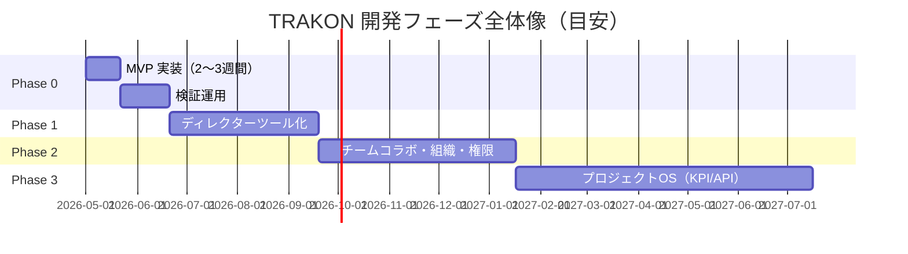

> 目安スケジュール。実際の着手日・期間は TBD。

### 10.2. Phase 0：MVP ✅ **本PRDの着手スコープ**

- **目的**：「縦型スケジュール上でボールの受け渡しを可視化できる」ことの最速検証
- **予算・期間**：50万円（税込）／2〜3週間（MVP仕様書 v1.0 §10）
- **対象ユーザー**：制作ディレクター（メインテスター）、付随してクライアント・制作メンバー
- **提供機能（要件ID）**：
  - 認証：FR-AUTH-01, 02, 03, 04, 05, 07, 08（基本型のみ）
  - プロジェクト：FR-PRJ-01, 02, 03, 09
  - 制作物：FR-ITEM-01, 03, 05
  - スケジュール：FR-SCH-01, 02, 03, 04, 05, 06, 08, 09, 11
  - ボール：FR-BALL-01, 02, 03, 08, 12
  - セキュリティ：SR-AUTH-01, 02, 03, 04、SR-AUTHZ-01, 02、SR-DATA-01, 02、SR-AUDIT-01（最低限）、SR-PRIVACY-01〜03
- **対象画面**：SC-01, 02, 03, 04, 06, 07（TOSS相当のみ）, 08（TOSS実行・完了のみ）, 10（基本編集）, 11（基本）
- **対象ユースケース**：UC-01, 02, 03, 04（登録・編集）, 05（TOSS相当）, 08（TOSS実行）, 12（予定完了）, 15（制作物画面での俯瞰）, 16（クライアント確認の基本動線）
- **除外事項（Phase 1 以降）**：
  - 予定種別（共同予定・単独予定）
  - 差し戻し／TOSS取消／再TOSS
  - ダッシュボード3カラム
  - プロジェクトTOP・代表ボール表示
  - 通知（メール）
  - コメント／ファイル添付
  - PDF出力
  - プロジェクト終了・アーカイブ・削除
  - MFA・組織・権限・プラン
- **成功基準**（MVP仕様書 §8 受け入れ条件に本PRDのセキュリティ条件を追加）：
  1. ディレクターがプロジェクトを1件作成できる
  2. 期間に応じた縦の日付一覧が表示される
  3. 参加者が所属名とともに横に並んで表示される
  4. 任意の日付にボールを追加できる／FROM・TO を設定できる
  5. ボールが該当担当者列に表示される
  6. 最新のボールから Ball Holder がヘッダー表示される
  7. **Phase 0 では全ユーザーは認証を必須とし、未認証での案件情報アクセスが一切発生しない**（SR-AUTH-01／非会員URL共有は Phase 1 で導入）
  8. **通信は TLS、保管は暗号化、主要操作は監査ログに記録される**（SR-DATA-01, 02、SR-AUDIT-01）
- **重要な設計判断**：
  - MVP版のボール削除は即時物理削除（§6.3）
  - Ball Holder 判定は「最新ボールの to_member」で簡易実装（MVP §6 後フェーズで正規化）
  - 共同予定・単独予定・予定種別選択は未実装。Phase 0 の UI は「TOSS相当」のみに簡素化
  - **セキュリティは短期実装でも妥協しない**（上記 7., 8.）

### 10.3. Phase 1：ディレクターツール（正規仕様 v1.x 本格適用）

- **目的**：正規仕様への移行。ダッシュボード・予定種別・差し戻し・通知・コメント・プロジェクト終了／アーカイブの実装
- **対象ユーザー**：制作ディレクター／制作メンバー／クライアント 全員
- **主機能（追加）**：
  - 予定種別：FR-SCH-07, 10, 12〜16
  - ボール状態遷移：FR-BALL-04〜11
  - ダッシュボード：FR-DASH-01〜09
  - プロジェクト代表ボール：FR-PRJ-SUM-01〜03
  - プロジェクト終了・アーカイブ・削除：FR-PRJ-04〜08
  - 制作物：FR-ITEM-02, 04
  - コメント・添付：FR-COMM-01〜03
  - 通知：FR-NOTIF-01, 02
  - PDF出力：FR-EXPORT-01, 02
  - 参加者運用：FR-AUTH-09
  - 非会員URL共有（クライアント向け）：FR-SHARE-01〜06、SR-AUTH-08（§9.2 統制ポリシー一式の必須実装を含む）
- **対象画面（追加）**：SC-05, 09, 12, 13, 14、SC-07 の種別対応、SC-08 の取消・差し戻し対応、SC-16（非会員URL発行・管理：新規）
- **対象ユースケース**：UC-06, 07, 09, 10, 11, 13, 14, 17, 18, 19, 20, 21、UC-23（非会員URLでの確認・差し戻し：新規）
- **セキュリティ強化**：SR-DATA-03（署名付きURL）、SR-AUDIT-01, 02, 03、SR-INCIDENT-01, 03、SR-AUTH-08（非会員URLの安全装置）
- **成功基準**：
  - 3種の予定種別を用いて、TRAKONの進行管理思想が違和感なく運用できる
  - ダッシュボードでディレクターが「自分のターン」と「遅延」を1画面で判断できる
  - クライアントが通知とダッシュボード経由で、確認・差し戻しを完結できる
  - クライアントは、招待ログイン経路と非会員URL経路のいずれでも確認・差し戻しを完結できる
  - 全ての非会員URLアクセスが監査ログから時系列で再現できる

### 10.4. Phase 2：チームコラボ／組織・権限（PMF達成）

- **目的**：1000チーム規模への展開。組織・権限・MFA・チーム通知の整備
- **主機能（追加）**：
  - 組織・テナント：FR-ORG-01, 02, 03
  - MFA：FR-AUTH-06
  - チーム通知・Slack連携：FR-NOTIF-03, 04
  - ダッシュボードのチーム全体ビュー：FR-DASH-10
  - 権限管理 UI：UC-22
  - 非会員URL共有の組織レベル On/OFF 統制：FR-ORG-04, 05、FR-SHARE-07、SR-AUTH-09
- **セキュリティ強化**：SR-AUTH-06, 07, 09、SR-AUDIT-04、SR-OPS-05, 06、SR-DATA-04, 05
- **成功基準**：
  - 組織管理者が組織レベルで非会員URL共有機能を On/OFF でき、OFF時は配下の発行UI非表示・既発行URL即時失効が確認できる

### 10.5. Phase 3：プロジェクトOS（5000チーム以上）

- **目的**：ロードマップ最終段。テンプレート・KPI・レポート・API 連携
- **主機能**：FR-TMPL-01、FR-ANALYTICS-01、FR-API-01、組織管理の強化

---

## 11. 基本原則との整合

基本原則 v1.0（18条）を本PRDのどこで具体化したかの対応表。**PRDで扱えていない原則条文がないこと**を常時確認する。

| 条 | タイトル | 本PRDでの具体化 |
|---|---|---|
| 第一条 | TRAKON は進行を前に進めるために存在する | §2.1, §2.5, §2.6 |
| 第二条 | TRAKON は管理を目的化しない | §2.2, §2.3、UXR-03, UXR-04 |
| 第三条 | TRAKON は進行責任者のための道具である | §3（ペルソナ） |
| 第四条 | TRAKON は責任を曖昧にしない | FR-BALL-03, 11、UXR-01、SC-06, SC-08、SR-AUTHZ-01〜03 |
| 第五条 | TRAKON は意味を弱めない | UXR-02、§4.4、SC-08 のボタン出し分け |
| 第六条 | TRAKON は構造で理解させる | §2.6（3層構造）、UXR-03、SC-06 の縦型スケジュール |
| 第七条 | TRAKON は装飾で強さを演出しない | NFR-UX-01、UXR-04 |
| 第八条 | TRAKON は静かに強くある | NFR-UX-01、§4.4 |
| 第九条 | TRAKON は流行に迎合しない | 本PRD執筆方針、§9.2（非会員URL共有を採用するが統制装置を一体定義） |
| 第十条 | TRAKON の言葉は、煽らず、濁さず、逃げない | UXR-05、サマリー文言・エラー文言の設計指針 |
| 第十一条 | TRAKON は更新されても別物にならない | §10（フェーズ切りを正規仕様 v1.x と整合）、NFR-MAINT-01 |
| 第十二条 | TRAKON は短期最適より長期一貫を優先する | §10.2（MVPでもセキュリティは妥協しない）、§9.2（採用と同時に統制装置を一体定義） |
| 第十三条 | TRAKON は足し算よりも、選別に責任を持つ | §9.2（採用にあたり統制ポリシーを明文化）、§12（対象外事項） |
| 第十四条 | 本原則は、個人の好みより上位に置かれる | 本章の存在そのもの |
| 第十五条 | 提案は自由である。ただし、原則への整合が必要 | §11（本対応表の運用） |
| 第十六条 | 例外は認める。ただし、例外は記録される | §10.2（Phase 0 のボール物理削除など、例外は根拠と共に記録） |
| 第十七条 | TRAKON は以下に支配されない | §9.2（採用判断に際し統制装置を一体で定義）、§12（機能追加の誘惑を拒む選別） |
| 第十八条 | TRAKON は以下を守る | §4.4、§9.1〜9.11 |
| 最終条 | 優先順位 | §4.4（UX原則要件の配列順）、本PRDの章順（責任 → 判断 → 前進 → 意味 → 構造 → 静けさ → 一貫 → 見た目） |

---

## 12. 対象外・今後の検討事項

本PRDでは**扱わない**ものを明示する。将来検討時は本節から分岐する。

- **非会員URL共有でのワンタイムパスワード／PIN認証の追加**（採用しない／既定の安全装置は短時間有効期限・個別失効・監査ログのみ。将来再検討時の参照用）
- **非会員URLでの透かし表示**（Phase 2+ で SR-DATA-04 と統合検討）
- **非会員URLの利用統計（閲覧元IP分布等）の管理者向け可視化**（将来検討）
- 時間単位のカレンダー表示（カレンダー表示仕様 §3）
- 営業日カレンダー計算による特殊な日付判定
- 地域別祝祭日・多言語
- 外部カレンダー連携（Google/Apple/Outlook）
- Slack／Chatwork／Teams 連携（Phase 2 以降で組織承認制を条件に検討）
- API 公開（Phase 3）
- チーム全体の予定を横断監視するビュー（Phase 2、ダッシュボード仕様書でも将来拡張）
- 予定テンプレート・依存関係・繰り返し予定（Phase 3）
- 予定間の進捗率入力（Phase 3）

---

## 13. 付録

### 13.1. 画面遷移図（Phase 1 完成時点）

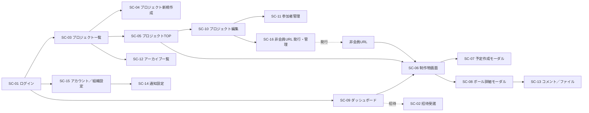

### 13.2. ロール別操作マトリクス（再掲・整形版）

§9.4 参照。

### 13.3. 用語集（拡張）

§1.3 の用語集に加えて以下。

| 用語 | 定義 |
|---|---|
| 代表ボール | プロジェクト全体の Ball Holder / Next / CAUTION を決めるために優先順位ルールで1件に絞り込まれたボール（プロジェクト仕様書 v1.2 §8） |
| archived_at | 表示状態の退避フラグ（プロジェクト仕様書 v1.2 §5） |
| 論理削除 | deleted_at にタイムスタンプを入れることでレコードを無効化する方式。物理削除しない |
| 監査ログ | SR-AUDIT-01〜04 で定義する追記専用のログ |
| 招待トークン | SR-AUTH-02 で定義するワンタイム・短時間有効のリンクトークン |
| 署名付きURL | SR-DATA-03 で定義する、短時間有効の認証済みファイル配信URL |
| 非会員URL共有 | §9.2／FR-SHARE で定義する、ログイン不要・短時間有効期限・個別失効可能なクライアント向け閲覧URL |
| 非会員URL閲覧者 | 非会員URLからアクセス中の未認証ユーザー。操作可能範囲はクライアントロール相当（SR-AUTHZ-02） |
| 非会員URLトークン | 非会員URLに含まれる推測不能なランダム文字列（≥256bit）。短時間有効・個別失効可能 |

### 13.4. 参照元仕様書とのトレーサビリティ表

本PRDの記述と参照元仕様書（03_仕様書）の対応を抜粋。

| 本PRD記載 | 参照元 |
|---|---|
| §2.4 コアコンセプト | 予定種別仕様書 v1.1 §1〜§5 |
| §4.1.4〜4.1.6 予定／ボール要件 | 予定種別仕様書 v1.1 全体、ボール状態遷移仕様書 v1.1.1 全体 |
| §4.1.7 ダッシュボード要件 | ダッシュボード／進行判定仕様書 v1.0 全体 |
| §6 UC | MVP仕様書（Phase 0 UC）＋ 03_仕様書 v1.x（Phase 1 UC） |
| §7 SC-06 各制作物画面 | MVP仕様書 §4（画面B）＋ カレンダー表示仕様 v1.0 |
| §7 SC-07 予定作成モーダル | 予定種別仕様書 v1.1 §6 |
| §7 SC-08 ボール詳細モーダル | ボール状態遷移仕様書 v1.1.1 §9 |
| §7 SC-09 ダッシュボード | ダッシュボード／進行判定仕様書 v1.0 §7〜§10 |
| §8 データモデル | プロジェクト仕様書 v1.2 §13、予定種別仕様書 v1.1 §10 |
| §9 セキュリティ | 本PRDで新規定義（基本原則 第四・十三条、プロジェクト仕様書 §12 準拠） |
| §10 フェーズ | MVP仕様書 §5, §10、コンセプトブック ROADMAP |

---

## 付記：本PRDで TBD として残した項目

以降のレビュー・運用で順次確定する：

- NFR-PERF：想定同時利用者数・データ量規模
- NFR-BROWSER：対応ブラウザの明確化
- SR-AUTH-02：招待リンク有効期限の具体値（既定72時間で仮置き）
- SR-DATA-03：署名付きURLの有効期限（既定15分で仮置き）
- §10.1 Gantt：実着手日・各フェーズ所要期間
- §10.4 Phase 2 時点の料金プラン詳細（ピッチ資料 PRICING と連動）
- モバイル対応範囲（ダッシュボード閲覧は Phase 1、作成・編集は Phase 2+ で仮置き）

---

**Keep the ball moving.**

TRAKON  |  株式会社おさまるカンパニー  |  Confidential
